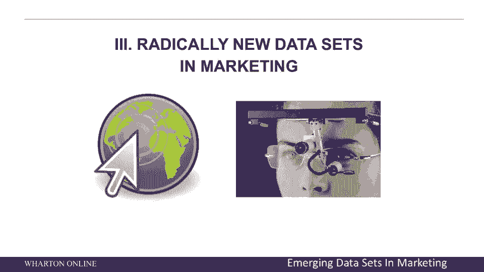
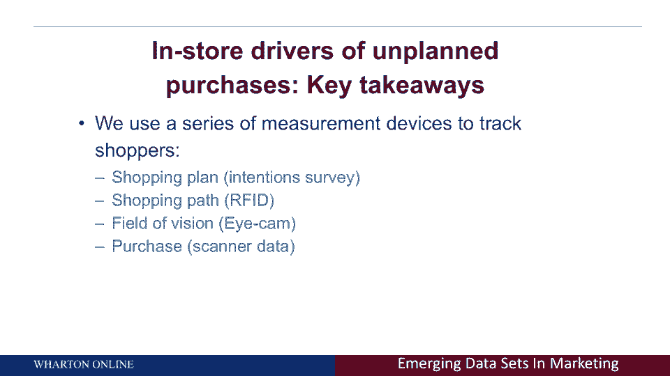
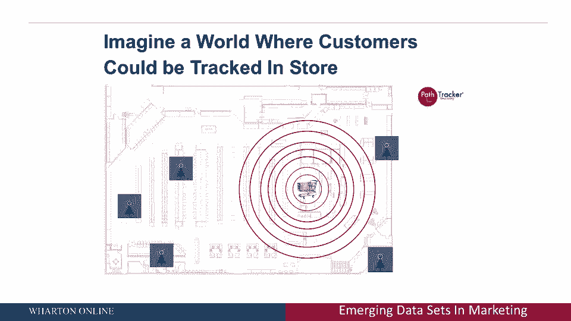
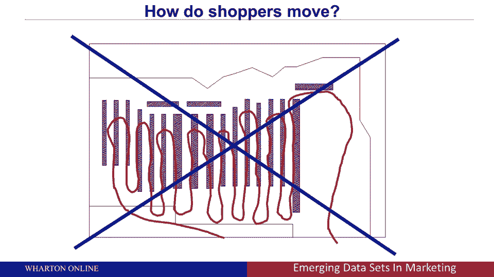
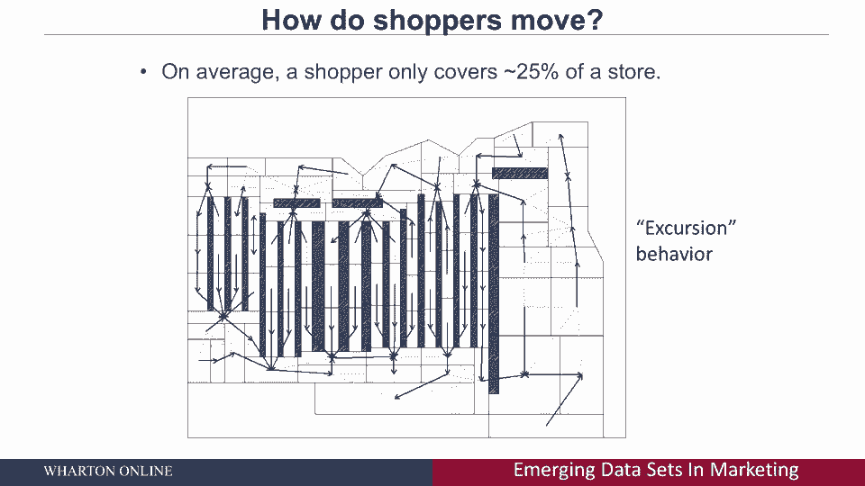

# 【沃顿商学院】商业分析 全套课程 - P31：营销中的全新数据集 📊

在本节课中，我们将要学习营销领域中一些全新的、非传统的数据集。这些数据能够以前所未有的方式揭示客户行为，从而帮助企业做出更优的商业决策。

上一节我们介绍了传统的电视和在线数据，本节中我们来看看几种创新的数据收集方式及其应用价值。

## 全新的营销数据集

想象一下，你可以获取并分析以下类型的数据：

*   **购物意图数据**：在顾客进入商店之前，他们计划购买什么。通过比较其**计划购买清单**与**实际购买记录**，可以量化计划外购买的发生率。
*   **顾客动线数据**：利用射频识别（RFID）等技术，实时跟踪顾客在商店内的移动路径。
*   **眼球追踪数据**：精确测量顾客在浏览货架时目光的落点，了解哪些商品吸引了他们的注意力。
*   **个体层级购买数据**：将上述所有数据在单个顾客层级进行关联和分析。

这些数据之所以强大，是因为它们能揭示问题的根本原因。例如，一款儿童麦片销量不佳，可能并非因为产品不受欢迎，而是因为顾客根本不去摆放该产品的货架区域。

## 技术演进：从推车到手机 📱

五年前，研究人员通过在超市手推车底部安装设备来收集顾客动线数据。这是当时最先进的技术。

如今，技术已经发生了巨变。我们口袋里的智能手机，其内置的GPS等功能，使得实时、精确地获取用户的地理空间位置数据成为可能。这不仅适用于实体店，也完全适用于线上行为分析——我们不仅能知道用户访问了哪些网站，还能知道他们在每个页面上停留了多长时间。

## 顾客在商店中如何移动？

以下是关于顾客店内移动模式的关键发现，这些发现颠覆了传统认知：

*   **“导线”模式**：从过道一端进入，从另一端离开。
*   **“锯齿形”模式**：进入过道，从同一侧折返离开。
*   **“之字形”模式**：在相邻过道间穿梭。

通过数据分析，我们发现绝大多数顾客（约75%）在任何一次购物中，只覆盖了商店约25%的区域。他们通常采用“锯齿形”模式，只走到过道约三分之一的位置便折返，很少在过道间来回穿梭或走到过道深处。

## 商店热图与商业洞察 🔥

基于顾客动线数据，我们可以生成“商店热图”。图中红色代表顾客高频到访的“热区”，蓝色代表很少光顾的“冷区”。

分析显示，商店的外环通道（即“赛马场”区域）和端架通常是热区，而过道中间区域往往是冷区。这解释了为什么品牌方愿意为这些黄金位置支付高昂的货架费。

传统的观察法（如人工记录或摄像头）难以规模化且存在误差。而现代的客户层级分析技术，能够匿名、精准地追踪每一位顾客的路径，并将其与最终的购买数据关联，从而提供可量化、可执行的洞察。

本节课中我们一起学习了营销中几种全新的数据集，包括购物意图、顾客动线和眼球追踪数据。我们看到了技术如何从推车设备演进到利用智能手机，并深入分析了顾客在店内的真实移动模式，以及如何通过“热图”将这些洞察转化为优化商品陈列和货架管理的商业决策。理解并利用这些数据，是当今企业获取竞争优势的关键。