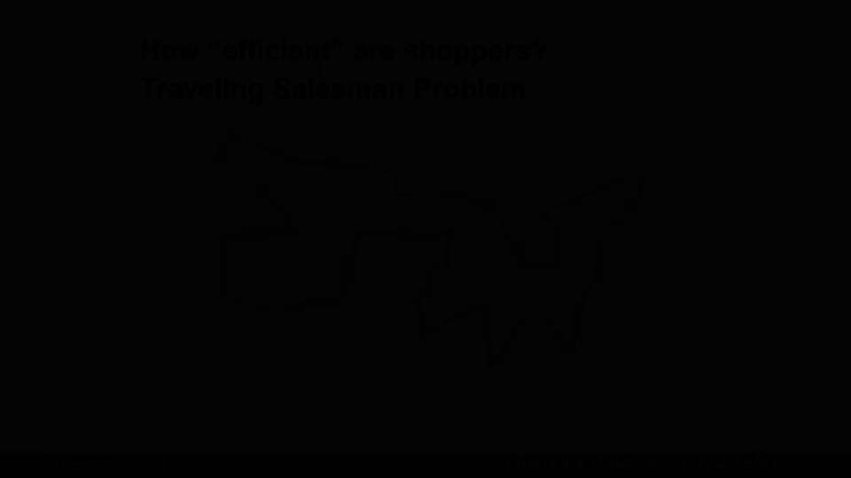
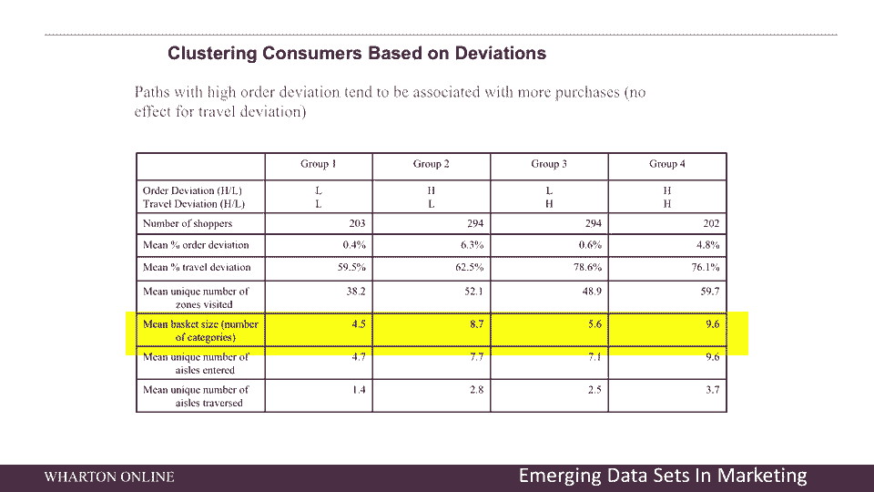
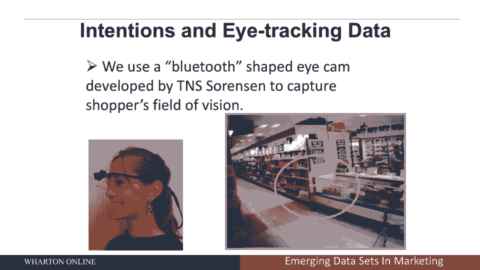
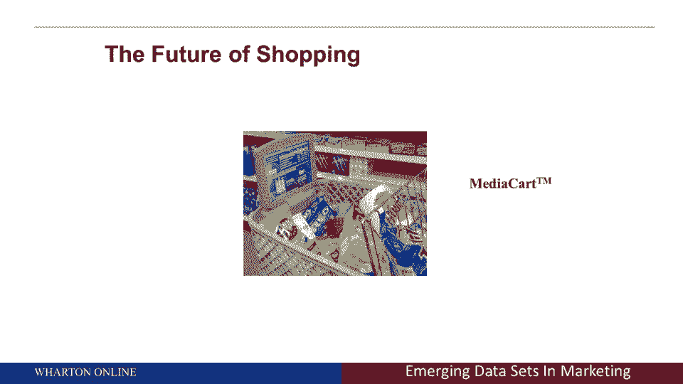

# 【沃顿商学院】商业分析 全套课程（客户、运营、人力资源、会计） - P32：[P032]06_the-perils-of-efficiency - 知识旅行家 - BV1o54y1N7pm

我认为很有趣的另一部分，我们在这里做的一些工作是所谓的旅行推销员问题，这可能是一个你们很多人都不熟悉的问题，但这是一个自20世纪50年代以来就存在的老问题，一个推销员必须访问一堆不同的城市。

所以在美国地图上，我在给你看，每一个红色，每个红点代表一个不同的城市，一个覆盖美国的推销员必须访问，旅行推销员的问题说，销售员游览所有这些城市的最短路线是什么？因为销售人员显然不想把时间花在旅行上。

他们想花时间拜访客户，现在你可能会说这和分析有什么关系，它和零售业有什么关系，嗯，和它有很大关系，所以我们感兴趣的是在商店里移动更有效率的人，他们是买多了还是买少了，换句话说，你想要高效的购物者吗。

还是你想让人们一次又一次地游荡，原因回到我的五点框架，想想这个，这是我们以前从未有过的数据，这是第一阶段，二号，我们现在能够创建像热图这样的东西，让我们可以探索数据，看看商店的哪一部分被覆盖了，第三步。

现在我们要分析数据，在旅行商问题的框架下，我们要看看，是某些类型的购物者，进出购物者更有效率的人，都是，他们对公司更有价值，或对公司价值较低，第四步，然后我要和你谈谈你应该瞄准谁，第五步。

我将向你展示公司的决策，所以这是一个很好的例子，它有所有的五个点，我又在说这个了，嗯，你可以在这张照片上看到，让我们想象一下绿色的圆圈代表这个人购买的产品，图中的红线表示最短的可能路径。

那个人本可以拿起他们的手推车，购买那些产品，现在就结账，让我们说清楚，这不是任何人走过的路，这是他们能走的最短的路，我们有兴趣了解，是走更短道路的人还是对公司没有更多价值的人，例如，A上的路径。

如果你喜欢图片左手边的人，这是一个比B更有效率的购物者，如果你喜欢B，变得摇摆不定，B不只是参观他或她买东西的商店，但在商店里闲逛了很多，现在的问题是你更喜欢哪个顾客，很明显之前，我转向真相。

在下一张幻灯片上，接下来的几张幻灯片，你们每个人都应该思考，你想让客户的事情变得高效吗，还是你想让人们在某种程度上游荡，这就是所谓的三角形图，嗯，真正有趣的是什么，你可以在这张幻灯片上看到。

它说平均茶匙最佳现在是2 8，这个数字是什么意思，这意味着商店里大约75%的活动是不需要的，这意味着人们可能会花四分之一的钱，基本上是在商店里的时间，仍然购买他们购买的商品，现在，问题是好是坏。

所以这个三角形图的巧妙之处在于，每一个点都代表了我们分析的大约一百万客户中的一个，你可以看到在上面我们有TSP最优，所以如果人们真的在尽可能短的路径上移动，你会看到这个三角形顶部的所有这些点，你没有。

如果正确的行程偏差，那是什么意思那是什么意思，比如说，在商店里，想象一下你应该先拿起牛奶，然后奶酪和面包，但你去面包，牛奶奶酪，这叫做旅行偏差，这意味着你用了一种有效的方式，但你走错了顺序。

所以好好想想，正如你所知，你必须购买产品，a b和c，你应该去abc，但你去了c a b，那是行程偏差，然后顺序偏差，对不起，那是顺序偏差，那么行程偏差与抖动的多少有关，所以我从牛奶区走到面包区。

我摇晃了多少，我偏离了我的最佳路径多少，你在这里可以看到，大多数人都不是最佳购物者，最后一块现在是第四步和第五步，我给你的关键数字的框架，这是我用黄色告诉你的，第四组是走错顺序或走错顺序的人。

它们有最多的抖动，注意到这些人平均购买大约十件商品，每次他们去商店，效率最高的人，也就是第一组，只差大约一半，所以请注意，注意到我是如何将新数据，人们在商店里去的地方，我研究过那些数据。

商店的哪些部分最值钱，我现在已经把数据，我通过旅行销售人员模型进行了分析，我现在看的地方，我可以给每个人分类，它们的效率也很高，它们在A点和B点之间摇摆的程度，它们的顺序对吗。

现在我已经把它带到了行动步骤，在那里我可以看到哪些客户更有价值，事实证明，你不想让人们匆匆忙忙地穿过商店，你不希望他们那么有效率，现在的挑战是你必须能够识别出哪些类型的人，越摇晃的类型，哪些人不是。

不幸的是，这显示了我们数据集中的一个限制，我们没有人口统计数据，所以我们没有年龄，种族，收入，性别，都市化，你知道，他们住在城市社区还是农村社区，如果你这么做了，你可以，然后开始说现在，我看看该针对谁。

现在，我知道该针对哪些类型的客户，不幸的是，在这种情况下，我们有很好的数据，我们有关于地点的数据，我们有后来的购买，但我们没有人口统计数据，有一个很好的例子说明如果没有这些信息，我做出了一个商业决定。

我需要找到在商店里闲逛更多的顾客，那太好了，很高兴知道，下一步就是，当然知道那些顾客是谁，他们是什么类型的，我能认出他们吗？我能用不同的方式营销他们吗。

因为我宁愿有更多这样的客户类型而不是其他类型的客户。

我想告诉你的下一种数据，这又是，营销科学的未来是眼睛摄像头数据，现在，你可能会说眼睛相机数据，你的意思是，人们戴着眼睛摄像头在商店里走来走去，你们中的许多人可能还记得，你可以称之为失败或不失败。

在谷歌眼镜上，这是谷歌对…领域的进军，让我们让人们戴眼镜，他们所看到的一切现在都被跟踪了，如果你戴着眼镜，你实际上可以跟踪，人们在商店里寻找的地方，嗯，我们实际上对一千多人做了一项研究。

我们有他们的地方，戴上这些类型的眼镜，所以这是一个实验，这是一个田间实验，我们把这些眼镜戴在人们身上，我们跟踪他们看什么，所以你可以用这个眼睛相机看到左边一个人的照片，你可以在右边看到。

从眼睛相机上看是什么样子。

然后我们想注意的第一件事，我一直想知道这个问题，但同样没有正确的分析和数据，你永远无法回答，你知道，如果我给你看，比如说一杯橙汁，呃，所谓的橙汁平面图，商店里橙汁的地方，你宁愿在商店的什么地方。

你宁愿高高在上，你宁愿在最下面的架子上，通过眼球追踪数据和分析，我们现在可以回答这个问题，你可以看到或者把它想象成一张热图，红热蓝冷是许多产品类别的最佳高度，大约五英尺六英寸，你可能会说嗯。

为什么那口井，女性的平均身高约为五英尺，在许多超市里有六个等等，百分之八十到九十的购物者是女性，你想把它放在眼睛的高度，人们不喜欢往下看，人们不喜欢抬头看，人们喜欢看眼睛的高度。

你可能也会在这张照片中注意到，线形图的左侧，好像比右边热一点，你可能会说我想知道为什么这是真的，嗯，我们从左到右读，所以我们从左到右扫描，所以如果你可以选择在货架的右手边，架子的左手边。

你想在架子的左手边，因为当人们走向一个物体时，我们从左到右扫描，因为我们从左到右读，我们在眼睛的水平上扫描，然后有时我们上升或下降，如果我们找不到产品，我们想要这么高的水平，在左手边是商店里最好的位置。

你们中的许多人可能在你必须为货架空间付费的行业工作，或者你想知道理想的货架空间是什么，这是通过一次测量一个客户，观察他们的眼睛数据，我们可以注意到女性，男人大约五英尺六英寸，大约五英尺九英寸。

它的左边比右边好，正是通过分析，我们才能够回答这个问题，所以另一件有趣的事情是，现在是第四步和第五步，这样做有什么商业含义，我现在给你们看的是x轴，因为我们可以测量你在架子上看到的是什么。

不仅仅是你在x轴上买的东西，你看，你看到的三个不同的变量，有人盯着，不要看产品，他们从来没有看过它，或两次以上，我们感兴趣的是商店营销工作，你宁愿我们的产品看更多，买了更多，你可以在这里看到的是绿线。

我们所做的是通过他们的眼球追踪设备来测量人们的专注力，那是在他们头上，我们知道你看了多少次给定的品牌，零一次或两次或多次，然后当你离开商店的时候，我们调查了你，说，2。你记不记得现在看到过那个牌子。

让我从绿线上说个好消息，更多向上倾斜的视图，你看得越多，你记得看到的越多，我不知道，也许我不会因此获得诺贝尔奖，但以前从来没有人看过这些数据，所以回忆起意思，你记得看过这个产品吗，记住那是有价值的数据。

因为你不打算买，你今天没有买，并不代表你以后不会买，更多的浏览量更高的召回率，考虑一下怎么样，我们还问了人们，您考虑购买的品牌再次通知，向上倾斜的曲线，你看到的产品越多，你就越想买。

只是一遍又一遍地把你的名字放在人们面前，不仅提高了召回率，但它引起了人们的考虑，最后，你可能最关心的是购买，有一条向上倾斜的曲线，稍微平一点，这并不奇怪，一些查看产品的人，或者很多很多不一定买，因此。

回忆和考虑受到更多观点的巨大影响，选择少这样，但又一次，这就是分析的力量，因为现在你又可以开始说嘿了，我看到不同形式的广告有潜在的长期价值，这不仅仅是选择，和事实，选择可能是最后一件事。

回忆和考虑会很快到来，现在人们已经看到了你的广告，高级广告现在，他们更有可能召回它并考虑你的产品，希望如果你的产品有很好的好处，人们真的会再次购买它，这是一项伟大的研究，我们使用了单个客户级别的数据。

在存储中测量，所以从这里得到的另一件事，因为我们也有关于人们计划购买和计划外购买的数据，因为你还记得第一张幻灯片，我给你看了仓库里的数据，我们在人们进商店之前问过他们，你打算买什么？原来。

这是你可以在这里看到的部分，十分之四十分之四，这个数字对我来说很震惊，人们在商店里买的60%的东西，他们进去了，当他们，当他们再次进入商店时，我们是怎么回答的，让我回到我的五点框架，我们有数据。

我们知道我们想测量这个，所以我们在他们进入商店之前测量了意图，我们知道他们在商店里买了什么，原来，也反过来，他们计划购买的东西的40%，他们现在实际上并没有买，这是对营销工作的一种强化，换句话说。

你并不总是买你想买的东西，这是分析如何影响商店营销的一个很好的例子，嗯，购物的未来，嗯，你们中的许多人可能已经在当地的商店展出过这个，超市商店，等，但如果你不知道这件事，让我告诉你接下来会发生什么，嗯。

这是一种叫做媒体车的东西，所以想象一下在你的商店里走来走去，你把你的东西放进篮子里的地方，想象一下你面前的屏幕现在给你产品推荐，就像你把意大利面放进手推车一样，上面写着酱汁在右边两个过道上。

或者想象你买了薯条，你说，好的，我现在去哪里买啤酒，所以想象一下，就像亚马逊在网上做产品推荐一样，实时想象产品推荐，根据你的物理位置和你在车里放的东西，那现在来了，我的研究表明。

我想知道这是不是一件好事，因为这可能会让人们更有效率，购物者，他们可能不会买更多，但另一方面，这可能会让他们更经常地回到商店，因为他们可以更有效率，购物者，我认为未来是广阔的。

但你应该期待在未来看到像媒体车这样的东西，帮助你。

