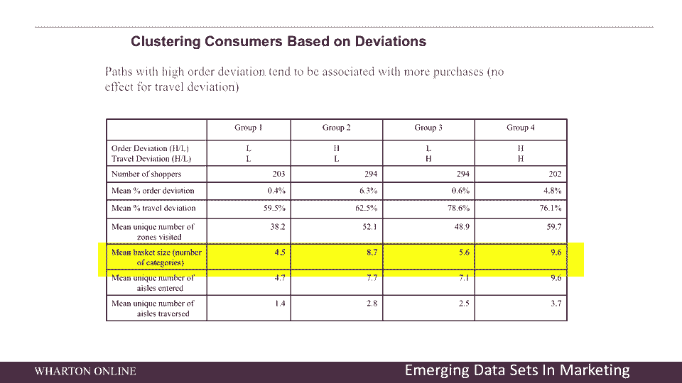

# 课程名称：商业分析 - 第32课：效率的隐患 🧭

## 概述

在本节课中，我们将要学习如何利用数据分析来理解客户在零售环境中的行为。我们将探讨一个经典的“旅行推销员问题”模型如何应用于购物者路径分析，并介绍眼球追踪数据如何揭示产品摆放的奥秘。通过分析这些数据，我们可以评估购物效率与商业价值之间的关系，并思考未来的零售技术。

---

## 旅行推销员问题与购物者路径分析

上一节我们介绍了数据分析在商业中的广泛应用，本节中我们来看看一个具体的应用案例：将“旅行推销员问题”模型用于分析购物者在商店内的移动路径。

旅行推销员问题是一个自20世纪50年代就存在的经典问题：一个推销员必须访问一系列不同的城市，目标是找到访问所有城市的最短路线。在零售分析中，我们可以将“城市”类比为商店内需要购买商品所在的“位置”，将“推销员”类比为“购物者”。核心问题是：购物者游览所有目标商品位置的最短路线是什么？购物者显然希望减少在途时间，以增加与客户互动或完成购物目标的时间。

以下是分析购物者路径的核心步骤：

1.  **数据收集（第一阶段）**：获取购物者在商店内的移动轨迹数据。这是以前从未有过的数据类型。
2.  **数据探索（第二阶段）**：利用热图等工具可视化数据，探索商店的哪些区域被顾客覆盖。
3.  **数据分析（第三阶段）**：在旅行推销员问题的框架下，分析哪些类型的购物者（如高效进出型或闲逛型）对公司更有价值。
4.  **目标制定（第四阶段）**：基于分析结果，确定应该针对哪类顾客进行营销。
5.  **商业决策（第五阶段）**：将分析洞察转化为公司的具体决策。

在这个例子中，绿色圆圈代表顾客购买的商品，图中的红线代表理论上购买这些商品的最短可能路径。请注意，这并非顾客实际行走的路线，而是理论上最高效的路线。我们需要分析的是：走更短（更高效）路径的顾客是否对公司更有价值？

例如，下图中左侧路径A的购物者比右侧路径B的购物者更高效。路径B的购物者不仅访问了购买商品的区域，还在商店里有很多闲逛。现在的问题是：你更喜欢哪个顾客？

## 效率与价值的权衡：三角形图分析

通过分析大约一百万顾客的数据，我们得到了一个“三角形图”。图中每个点代表一位顾客。

*   **TSP最优（三角形顶部）**：如果顾客严格按照最短路径移动，点应聚集在顶部。但实际数据并非如此。
*   **顺序偏差**：指顾客以非最优顺序访问商品区域。例如，应按顺序购买商品A、B、C，但顾客却按C、A、B的顺序购买。
*   **行程偏差（抖动）**：指顾客在移动过程中偏离最短路径的程度，即“摇晃”了多少。

从图中可以看出，大多数顾客都不是最优购物者。关键发现如下：

*   **第四组顾客（顺序错误、抖动最多）**：平均每次购物购买约10件商品。
*   **第一组顾客（效率最高）**：平均每次购物购买的商品数量仅为第四组的一半左右。

这个分析将顾客的移动数据、购买数据与效率模型结合，让我们能够对顾客进行分类。分析得出的行动启示是：**你并不希望顾客匆匆忙忙地高效穿过商店**。更具探索性（更多“抖动”）的顾客可能更有价值。

目前的挑战在于，我们需要识别出哪些顾客属于这种“高价值闲逛型”。我们数据集的一个限制是缺乏人口统计信息（如年龄、收入、性别等）。如果拥有这些信息，我们就可以更精确地定位目标客户群，并制定相应的营销策略。

---

## 眼球追踪数据与货架营销

上一节我们通过路径分析了顾客的宏观移动效率，本节中我们来看看更微观的数据：眼球追踪如何优化产品摆放。

眼球追踪数据是营销科学的未来方向之一。通过让顾客佩戴眼动仪眼镜，我们可以精确追踪他们在商店中注视的位置。

我们进行了一项涉及一千多人的实地实验。下图左侧是佩戴眼动仪的人，右侧是从眼动仪视角看到的画面。

通过分析眼球追踪数据，我们可以回答一些关键问题。例如，对于货架上的产品，最佳摆放高度和位置是哪里？

分析显示，对于许多产品类别，最佳高度大约是**5英尺6英寸（约1.68米）**。这是因为大约80%-90%的超市购物者是女性，而女性的平均身高约为5英尺4英寸，将产品放在与眼睛平齐的高度最符合人体工程学。

此外，热图显示货架**左侧区域比右侧更“热”（被注视更多）**。这是因为在从左向右阅读的文化中，人们的视觉扫描习惯也是从左向右。因此，在货架的左手边是最佳位置。

以下是基于眼球追踪数据的商业洞察分析。我们测量了顾客对某个品牌产品的三种注视程度：零次、一次、两次或以上。然后，在顾客离开商店后，我们进行了调查。

1.  **回忆率（绿线）**：询问顾客是否记得看到过该品牌。结果显示，注视次数越多，回忆率越高。
2.  **购买考虑度**：询问顾客是否会考虑购买该品牌。结果显示，注视次数越多，购买考虑度越高。
3.  **实际购买**：虽然曲线也向上倾斜，但相对平缓。这表明看了产品不一定就会购买。

因此，增加产品曝光（被看到的次数）能显著提升品牌回忆度和购买考虑度，这对长期品牌建设非常有价值。实际购买可能是最后一步，而回忆和考虑是重要的前置步骤。

这项研究还结合了购物计划数据。我们在顾客进店前询问其购买意向，离店时核对实际购买。结果发现：
*   顾客实际购买的商品中，**60%** 是进店前未计划购买的（即冲动消费）。
*   顾客计划购买的商品中，**40%** 实际上并没有购买。

这强化了店内营销工作的重要性：你并不总是购买你计划要买的东西。

---

## 未来展望：媒体购物车

最后，我们来展望一下购物的未来。一种名为“媒体购物车”的技术正在兴起。

想象一下，当你在商店里推着购物车时，面前的屏幕会根据你的实时位置和已放入车内的商品，向你推荐相关产品。例如，当你放入意大利面时，屏幕会提示“酱汁在右边两个通道”；当你放入薯片时，可能会推荐啤酒。

这类似于亚马逊在线的实时产品推荐，但应用于实体环境。我的研究思考是：这会让购物者更高效，但他们是否会因此买得更少？还是说，更高的效率会让他们更愿意经常回到这家商店？未来是广阔的，你应该期待看到像媒体购物车这样的技术来帮助你购物。

---

## 总结

本节课中我们一起学习了：
1.  如何将**旅行推销员问题**模型应用于分析顾客在店内的移动路径，并发现**高效率购物者并不总是最具商业价值的顾客**，鼓励一定程度的“闲逛”可能更有利。
2.  如何利用**眼球追踪数据**科学地确定产品的最佳摆放高度（约1.68米）和位置（货架左侧），并证明增加产品曝光能有效提升品牌**回忆度**和**购买考虑度**。
3.  了解了**购物计划与实际行动**之间的差距（60%的商品属计划外购买，40%的计划商品未购买），强调了店内营销的重要性。
4.  展望了以**媒体购物车**为代表的未来零售技术，它通过实时位置和购物车内容进行产品推荐，可能重塑购物效率与体验的平衡。

通过将数据分析与经典的优化模型、新兴的传感技术结合，我们可以更深入地理解消费者行为，并做出更明智的商业决策。