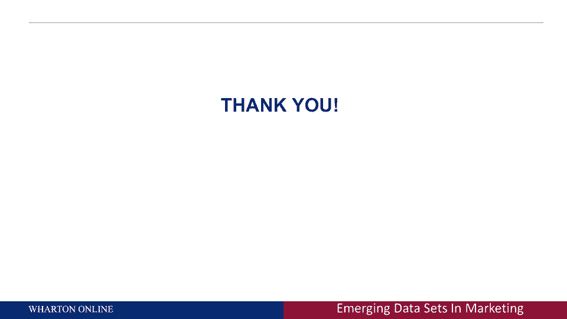

# 【沃顿商学院】商业分析 全套课程（客户、运营、人力资源、会计） - P33：[P033]07_analytics-applied-kohls-netflix-amex-and-more - 知识旅行家 - BV1o54y1N7pm

所以这节课的最后一部分我想谈谈，今天是一些领先公司对先进管理和营销科学的非常酷的应用，这些公司将所有五个方面结合在一起，他们使用了更好的数据，更好的探索性方法，更好的预测方法，他们使用了更好的优化。

实际做出影响他们销售的产品和服务的商业决策，所以让我从第一个开始，你们很多人可能都知道，科尔百货公司，嗯，那是一家很大的百货公司，全国连锁百货公司，有点像中低端百货公司，他们在做所谓的，顺便说一句。

还记得我之前的幻灯片吗，这不是谷歌、亚马逊或脸书，这是一家实体零售商，Coles执行以下操作，他们在做所谓的智能手机瞄准，所以说，比如说，当你走进商店时，他们有关于你地理空间位置的数据，你可能会说嗯。

他们怎么会有那么好的，如果你有，你的WiFi接入了你的手机，打开你的手机，你走进商店的那一刻，你拿起商店里的WiFi网络，它知道你的地理空间位置，所以他们用他们的WiFi网络来知道你的地理空间位置。

每个人的手机都有所谓的固定IP地址，这样他们就能知道是你，他们现在可以把它和你的所作所为联系起来，如果你去了他们的网站Coles。com，让我们说，他们知道埃里克·布拉德劳站在鞋子过道前。

他们现在可以给我实时的鞋子折扣，无论是通过短信还是通过电话，他们实际上可以给我实时折扣，因为我站在鞋子的过道前面，现在让我们用我的五种力来回顾一下，如果你愿意，科尔斯为什么能这么做，他们有数据表明。

是我通过我的手机和WiFi网络，他们可能希望这与我在网上的行为有关，可能通过他们的数据，网络在商店的线上和线下，他们知道我站在哪里，现在他们采取的行动是给我一个有针对性的，或上下文折扣。

考虑到我的物理位置，这是极有价值的数据，你知道营销中有句古老的格言，不仅仅是出卖人，合适的产品，这是正确的产品，在正确的地方，在正确的时间，嗯，科尔斯在利用并说，什么时候派埃里克布拉德利去，男鞋折扣。

当他站在男鞋过道前面的时候，它不值钱，我到商店前三十分钟，它没有那么值钱，三十分钟后它就值钱了，就在我站在那里的时候，所以这是一个公司认识到，他们可以收集更好的数据，他们可以利用这些数据进行决策。

他们会对它采取行动，这里还有一个，网飞，我想我们中的许多人已经成为这些内容的超级粉丝，事实上，Netflix正在创造，对于那些不知道的人来说，二十二十。

Netflix上消耗的视频内容将比任何其他提供商都多，包括YouTube，包括任何广播，就像NBC，www。icj-cij。com，好好想想，网飞，你将是，的，美国人将在网飞观看更多内容。

比世界上任何其他地方都神奇，大多数人都想得很好，Netflix在创造内容方面很幸运，别那么快，那不是真的，所以让我告诉你Netflix在做什么，Netflix正在做所谓的元标记数据，这意味着，当然啦。

当你登录网飞，他们知道你看什么，这是客户分析的极致，他们可以一个客户一个客户地衡量客户，你在看什么，但这是他们也在做的，你看的每个节目都有所谓的元标签，或者如果您喜欢属性或描述符。

所以他们知道埃里克·布拉德劳看了一个节目，一个发生在20世纪70年代一个温暖天气城市的警察表演，所以想象一下，拥有数百万客户的数据语料库，好吧，现在，而不是说嗯，我们能创造什么节目，现在。

想象一下导演坐在那里说，我看到数据告诉我什么了，人们真的很喜欢发生在温暖天气城市的警察节目，你知道在二十世纪七十年代嘿，让我们为二十世纪七十年代温暖的天气制作一个警察节目。

所以像Netflix这样的公司正在做的是，他们使用数据挖掘和客户分析方法来创建内容，实际上这让我想起了十年前我做的一个项目，是如何优化设计广告，使用广告成功的属性，我记得突然惊醒。

这可能是一个在它的时代之前的想法，我记得我去了所有不同的广告公司说，你知道吗，我知道你用艺术来创作广告，我有一个科学的方法让你做这件事，我知道广告里应该放多少音乐，我知道你是否应该在广告中养狗。

我知道你是否应该在广告里生孩子，我以为他们会拥抱我，像埃里克布拉德利，你是救世主，嗯，他们还没有为科学和艺术做好准备，他们只为艺术做好了准备，我希望Netflix正在做的事情。

可以给内容创作问题带来更多的科学性，另一个例子，显然最大的问题之一，为什么好，你在其他关于营销内容的讲座中听到的驱动因素之一，是客户终身价值的理念，我想我不需要重复，但我会简单地重复一遍。

在他们翻腾之后，所以你说，嗯，他们没有，你知道，你填写了很多数据，有什么问题？嗯，你的社交网络数据是一个非常强的预测，不管你是否要搅动，这就是今天许多公司正在做的，他们在刮，这都是合法的。

他们合法地从万维网上获取数据，让我们说埃里克布拉德劳夫，就像，我在Facebook上说了什么，我有多少朋友，我发的是什么照片，Flickr和所有其他类型的东西，他们正在获取数据，他们把它作为额外的变量。

预测我是否会翻腾，就像，比如说，如果我今天把它发布在Facebook上，哦伙计，我破产了，我刚丢了工作，这可能很好地预测了我是否会翻腾，要知道，所以这带来了很多问题，更好的数据。

公司可以管理和收集这些数据，他们可以量化这些数据，这意味着他们正在使用所谓的自然语言处理技术，从我在网上发布的东西中获取文本数据，他们把它变成了数字数据，它们可以融入数值流失模型，那对我来说很了不起。

这已经走了多远，一次又一次，不仅公司在这样做，但作为顾客你应该知道这一点，当你在网上发布东西时，你应该知道公司正在刮这个，事实上。下一个想雇用你的人就会从你那里搜刮信息，关于你的社交媒体使用情况。

他们在决定你是否知道你符合他们的标准，基于此，所以这是非常有价值的数据，这现在是分析领域的一部分，下一个例子是在医疗保健方面，虽然我不是医疗保健专家，我是分析专家，当今医疗保健的头号问题。

当今医疗保健的两大问题是第一位的，右边写的，患者依从性，所以说，你如何让病人服用处方给他们的药物，这是一个很大的挑战，第二种是所谓的预测分析，这就是我之前在底部给你看的，如果你想想今天医学的运作方式。

为什么政府和地球要花这么多钱，是因为我们等到你生病，然后我们以最佳的方式对待你，但想象一下我可以从你的医疗记录中预测到什么，这就是我给你看的左边的照片，想象一下我可以预测疾病，在你现在得到它们之前。

你将得到20年的时间，而不是试图通过最优地对待你来解决问题，我尽量不让你得这种病，所以想象一下我知道埃里克·布拉德利，二十年后我会得高血压的，嗯，为什么我现在不开始服药呢？防止我得高血压。

现在我把一个被动的问题变成了一个主动的问题，这就是当今医疗保健分析的未来，它试图预测人们在遥远未来的疾病，但如果你想想我们一直在谈论的，你看我说的，我的同事们谈论，这是分析，这是营销分析。

我的目标是个人客户，根据他们的病人记录，根据他们服用的药物，根据他们的，可能是家族史，基于他们对商品和服务的消费，我要瞄准他们的最佳位置，为了让他们坚持药物的正确方法，并有正确的协议来预防未来的疾病。

这不是向后看，这是前瞻性的，这可能是我最喜欢的一个，哪个是谷歌免费出租车，如果你没有听说，谷歌在过去的五年里一直致力于无人驾驶汽车，现在，你可能会说哇哦，这有点有趣，那一定很酷，是啊，是啊。

但现在有一个机会，他们正在考虑将其货币化，所以你在左边看到的只是一个购买历史数据的例子，你在右边看到的是一个计算客户终身价值的公式，想象一下谷歌在做以下事情，我只是拿布鲁明戴尔斯作为例子。

想象一下我去布鲁明戴尔斯网站，我开始说嗯，我喜欢这个，我喜欢这个，我喜欢这个，我开始想我现在想买的各种各样的东西，布卢明代尔可以测量这个，现在他们说嘿，等一下，布拉德洛回来了，他是个很有价值的顾客。

想象一下谷歌和布鲁明戴尔合作，说等一下，我知道布拉德洛采购线很有价值，但想象一下，我们派了一辆无人驾驶汽车给埃里克，布拉德劳夫家，去接他，免费开车送他去布鲁明代尔，所以想象一下谷歌与零售商合作。

实际上提供免费的商店，基于您的客户终身价值，如果你喜欢所有分析中的拉什莫尔山，这可能是，谷歌知道你在做什么，与实体或在线零售商合作，根据客户终身价值将一辆实际的汽车送到你家，它具有数据捕获的所有方面。

和行动，也就是把车送到你家，顺便说一句，如果你认为这是幻想，这永远不会到来，我向你保证不仅路上会有无人驾驶汽车，但路上会有无人驾驶汽车与分析联系在一起，星巴克，星巴克实际上是一家在分析方面更出色的公司。

比人们认为的要多，如果你看到这里，我给你这两张照片，这似乎是一个矛盾的说法，好像他们不在一起，就像客户忠诚等于没有交易，你什么意思，客户忠诚度等于没有交易，我会给我的顾客最好的交易，我更好的顾客，对呀。

否，那是不对的，你应该给最好的交易的人，给他们交易的人，改变他们的行为，所以让我们想象一下，埃里克布雷德洛停在早上8点8分，在星巴克，每一天，你觉得，如果他们给我一个交易，我要去星巴克，我是说。

我怎么能每天都停在那里，嗯，也许他们可以给我一个交易，让我在这里得到更大的钱包，也许与其在工作时给我松饼在星巴克给我咖啡，我在星巴克都买到了，但你不给你最好的客户交易，你给你的客户交易。

投资回报率最高的，星巴克通过他们的忠诚度计划认识到了这一点，他们想给那些处于忠诚边缘的人交易，他们想把不忠诚或不经常光顾的顾客变成常客，他们不是想把常客变成常客，因为常客已经是常客了。

所以他们把分析提升到了一个新的水平，他们认识到你不仅仅对待收入最高的客户，你对你的顾客最好，该支出的投资回报率最高的最佳，顺便说一句，从你这里购买最多的通常不是顾客，人们总是搞错，高价值客户已经忠诚度。

他们已经买了很多，你可能会得到他们很多美元钱包，或者已经是内部客户了，你想把小费给一个大买家的是那个中等客户，而不是对一个轻买家，这些是你应该瞄准的目标，星巴克知道这一点，下一个呼叫中心。

你们中有多少人可能不想承认，不幸的是，你知道你看不到我，我看不见你，但你们中的很多人可能不想承认这一点，但是你们中有多少人给一家公司打过电话，因为你有一个糟糕的产品体验，开始对着电话尖叫。

或者开始对另一条线上的人尖叫，我想我们每个人都必须诚实，说我们现在已经做到了，你可能会说这和分析有什么关系，嗯，这一切都与分析有关，以及今天的营销和销售是如何进行的。

想象一下Eric Bradlow打电话，让我们想象一下我打电话给康卡斯特，我的本地供应商，我什么也不说，我的意思是我喜欢康卡斯特或一个好的有线电视提供商，但是很多人打电话来说他们对康卡斯特感到不安。

我不是在找康卡斯特的茬，嗯，他们知道他们有一个，如果你想在康卡斯特解决客户满意度问题，让我们想象一下我打电话给康卡斯特，我开始对着电话尖叫，我的有线电视又停了，画面模糊了，废话废话，我开始对他尖叫，嗯。

两件事，第一个对你来说并不奇怪，首先康卡斯特知道是我，那是呼唤，因为我是从我家打来的，他们可以看到我家里有十台电视，顺便说一句，我没有夸张，我是一个电视家庭，我喜欢电视，我有很多康卡斯特盒子。

这意味着我是康卡斯特非常有价值的客户，这样他们就可以看到那个通知，已经，看看数据，我的手机现在链接到我的帐户，他们能看到是我，他们不问我，是我，他们知道是我，当我打电话的时候，上面的人在回答，电话。

知道我一生的价值，他们可以看到我花了多少钱，我平均每月购买，他们可以看到我已经做了15年的顾客了，第二件事是他们可以听语调软件，现在可以倾听我声音中的愤怒然后决定把剧本放上去，对于人，嘿，布拉德洛。

愤怒，搅拌器，搅拌器，不好，得做点什么，这里有一个例子，一家公司采用了真正自然的语言和语调软件，并将其与CRM系统和数据库管理合并，他们把这些合并在一起，他们可以做两件事中的一件。

一个是剧本可能是为人准备的，等一下，等一下，冷静点，布拉德利先生，我们知道你很生气，等，或者他们可以给我接通另一个人，谁更善于处理愤怒的人，这甚至是使用分析的更大可能性，这里有一个公司做得更好的例子。

客户关系管理，呼叫中心路由，如果你愿意，通过使用分析，嗯，亚马逊船，在你买之前，这又是一种，我最喜欢的一个，嗯，你又在这里看到一张照片，某人的购买历史，你可以看到一张无人机的照片，否，我不认为。

亚马逊真的要让无人机在我家上空飞行了，准备送包裹，但亚马逊能做的，我在导言中简要提到了这一点，在总结中的一点是，亚马逊能做的是，他们可以在我之前预测埃里克·布拉德洛要买什么，买它。

他们可以把它运到我家附近的当地零售商那里，所以如果我点了，那天我要去拿，想象可能性和客户终身价值，你可以通过说，如果你中午前订购，产品会在今天5点前送到你家，再想想你现在愿意为此付出什么。

是什么让亚马逊做到了这一点，他们有很好的数据，因为他们在跟踪个人客户二级的数据，他们有一个推荐引擎，以及进行预测建模的能力，这样他们就可以预测埃里克·布拉德利将来会买什么，埃里克·布拉德洛过去买的东西。

埃里克·布拉德利未来会买什么，它们分布广泛，这样他们就可以运送东西，不是去我家，但对我家附近的当地零售商来说，第四名，他们有能力为此采取行动和收费，那么他们会免费为埃里克·布拉德洛做吗，否。

那将是亚马逊Prime，亚马逊Prime不会免费送货，可能是免费送货，但如果你那天想要它，你要付出额外的代价，所以想象一下分析给这类公司带来的力量，所以总结一下，和你谈谈这里的终极外卖。

我想和你说的是技术与管理和营销科学的结合，所以你应该关注的是，如果你坐在这里，听这个讲座，你首先应该想到的是技术是美妙的，很酷，但这不是你个人家庭使用和设备的问题，我如何使用技术，不管是眼球追踪数据。

GPS数据，Web数据购买数据调查数据，我如何使用这些数据来更好地了解我的客户，第二，它从来都不是数据的黄金时代，所以如果你今天还在做决定，使用存储级数据或聚合数据，你可能会放弃很多钱。

因为有更细粒度的数据，这将允许你做出同样的决定，但在单个客户的层面上，如果你觉得知道这些东西很好，我不干见多识广的行当，如果我每做一项研究就有一美元，很高兴知道这很好，但我遇到了麻烦。

我认为分析的方式是走向行动，这是真正的货币化，你觉得科尔斯·亚马逊会这么做吗，因为很高兴知道他们在做这件事，因为他们看到了赚钱的真正机会，所以我想感谢你的关注，嗯再次，去我的网站，继续访问客户分析网站。

永远不要停止学习分析。

