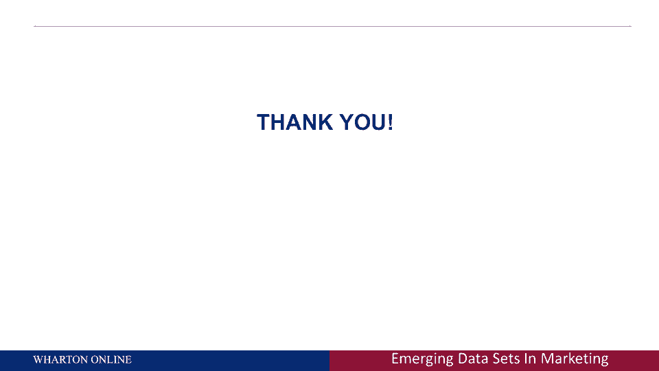

# 🏢 沃顿商学院商业分析课程 P33：领先企业的分析应用案例

在本节课中，我们将探讨多家领先企业如何将数据分析的五个核心方面（数据、探索、预测、优化、决策）结合起来，应用于实际商业场景。这些案例展示了如何利用先进的分析技术来驱动销售、优化运营并提升客户体验。

---

## 📱 科尔百货的智能手机定位营销

上一节我们讨论了分析框架，本节首先来看科尔百货如何应用该框架。科尔百货是一家大型连锁百货公司，它通过“智能手机瞄准”技术，在顾客进店时利用其手机Wi-Fi连接获取地理空间位置数据。

以下是其运作流程：

*   **数据收集**：当顾客手机连接商店Wi-Fi时，系统能获取其精确位置与唯一设备标识（固定IP地址）。
*   **行为关联**：将此位置数据与顾客的线上行为（如在科尔官网的浏览记录）相关联。
*   **实时决策与行动**：当系统识别到顾客站在特定商品区（如鞋类区）时，可通过短信或App推送实时定向折扣。

**核心逻辑**：`实时位置数据 + 线上行为数据 -> 触发上下文相关的个性化优惠`。

这种方法实现了“在正确的地点、正确的时间，提供正确的产品”，极大提升了营销效率。

---

## 🎬 Netflix的元数据驱动内容创作

Netflix不仅是流媒体平台，更是数据分析的高手。它通过分析海量用户观看数据来指导原创内容的制作。

其核心方法是“元标记数据”：

*   **数据基础**：记录每位用户观看的每一个节目。
*   **内容标签化**：为每个节目打上丰富的元数据标签（如“20世纪70年代”、“温暖天气城市”、“警匪剧”）。
*   **洞察与创作**：通过数据挖掘，发现用户偏好的内容模式组合。制作团队依据这些数据洞察，而非仅凭直觉，来策划和制作新内容（例如，制作一部符合“70年代暖城警匪剧”模式的新剧）。

这代表了内容创作从纯艺术向“艺术与科学结合”的转变。

---

## 💳 美国运通与社交媒体数据预测客户流失

客户流失预测是客户关系管理的核心。美国运通等公司通过整合传统交易数据与新兴的社交媒体数据，来更精准地预测客户流失风险。

*   **数据扩展**：合法地采集用户在社交媒体（如Facebook）上公开的文本、社交关系等数据。
*   **数据量化**：运用**自然语言处理（NLP）** 技术，将文本数据转化为可用于预测模型的数值特征。
*   **模型优化**：将这些新特征加入传统的数值流失预测模型，提升预测准确性。例如，用户发布“失业了”的状态可能成为其财务紧张、进而可能销卡的重要预测信号。

这提醒我们，在数字时代，个人在网上的公开言行已成为企业评估我们的重要数据来源。

---

## 🏥 医疗保健领域的预测分析与患者依从性

医疗保健分析主要攻克两大难题：患者依从性（是否按时服药）和疾病预测。

*   **被动治疗转向主动预防**：传统模式是在患者生病后进行治疗（被动）。分析的目标是，通过患者的医疗记录、基因、生活方式等数据，**预测**其在未来数年可能罹患的疾病（如高血压），从而提前干预，防止疾病发生。
*   **个性化管理**：基于患者个人数据，制定个性化的用药提醒和健康协议，以提高依从性并预防疾病。

其分析路径是：`个人健康数据 -> 预测未来健康风险 -> 制定个性化预防/干预方案`。

---

## 🚗 谷歌的无人驾驶汽车与客户终身价值变现

这是一个前瞻性的案例，展示了分析如何与前沿技术结合，创造新的商业模式。谷歌正在探索利用无人驾驶汽车技术，基于客户终身价值（CLV）进行变现。

**设想场景**：
1.  零售商（如布鲁明戴尔）监测到高价值客户Eric在其网站上有强烈的购买意向。
2.  零售商与谷歌合作。
3.  谷歌派出一辆无人驾驶汽车到Eric家，**免费**接他去商场购物。

**核心逻辑**：`CLV计算识别高价值客户 -> 无人驾驶技术作为服务载体 -> 提升客户体验与销售转化`。这体现了数据分析驱动下的极致个性化服务。

---

## ☕ 星巴克的忠诚度计划与投资回报率优化

星巴克通过其忠诚度计划深入应用分析，纠正了一个常见误区：并非简单地给消费最多的客户最好优惠。

*   **核心洞察**：应将优惠给那些能带来**最高投资回报率（ROI）** 的客户，即那些通过优惠能最大程度改变其消费行为的客户。
*   **策略应用**：重度忠诚客户（每天光顾）可能已形成习惯，额外优惠带来的增量消费有限。因此，星巴克更倾向于将优惠瞄准“中等价值客户”或“偶尔光顾的客户”，激励他们增加消费频率或金额。

其分析模型可简化为：`最大化 [优惠带来的行为改变 * 客户价值]`。

---

## 📞 呼叫中心的智能路由与情感分析

当客户因不满致电客服时，分析能帮助公司更好地处理。现代呼叫中心系统整合了多项技术：

*   **客户识别与价值判断**：来电时，系统自动识别来电号码，并立即从CRM中调取该客户的资料和历史价值数据。
*   **情感分析**：通过**语调分析软件**实时分析客户语音中的情绪（如愤怒程度）。
*   **智能路由与脚本提示**：结合客户价值与实时情绪，系统可自动将电话转接给更擅长处理投诉的客服，或在客服屏幕上显示针对“高价值愤怒客户”的应对脚本。

这实现了：`来电识别 + CLV数据 + 实时情感分析 -> 个性化客服策略`。

---

## 📦 亚马逊的预测性物流与“预发货”

亚马逊正在探索“预测性物流”，旨在顾客下单前就将商品运送到其附近。

*   **数据与预测**：基于用户的历史购买、浏览、搜索行为，利用**推荐引擎和预测模型**，预测其未来可能购买的商品。
*   **前置仓储**：将预测可能被购买的商品，提前配送至离用户最近的仓储中心或本地合作零售商处。
*   **极速交付**：当用户实际下单时，商品可以从极近的地点发出，实现“当日达”甚至“小时达”，当然，这可能作为一项增值服务收费。

其流程是：`预测个体购买需求 -> 前置库存 -> 实现极速履约`。

---

## 🎯 课程总结

本节课我们一起学习了多个行业领先企业如何将数据分析技术与管理、营销科学深度融合，并应用于真实商业决策中。关键要点如下：

1.  **技术是工具，洞察是目的**：关注如何利用各类数据（位置、浏览、社交、交易等）来更深入地理解客户。
2.  **数据粒度至关重要**：放弃聚合数据，转向个体层面的细粒度数据，能释放更大的决策价值。
3.  **分析必须导向行动**：分析的终极目标是驱动可货币化的商业行动，如个性化营销、预防性干预、服务优化等，而不仅仅是生成报告。

这些案例表明，在数据驱动的时代，将分析洞察转化为实际行动的能力，是企业构建核心竞争力的关键。