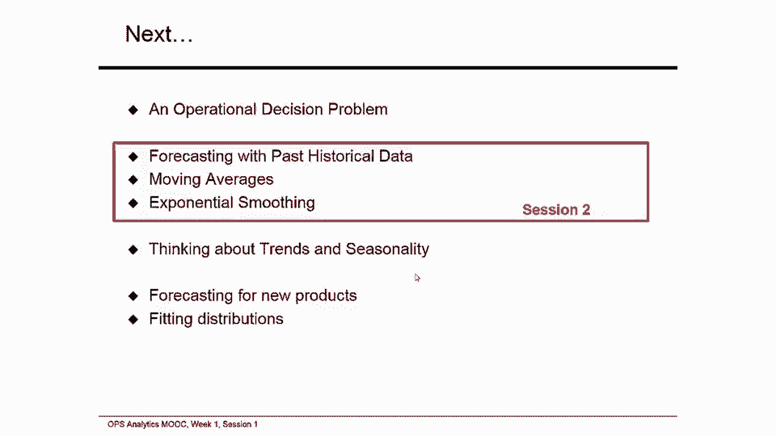

# 📊 沃顿商学院商业分析课程 P36：报童问题与不确定性下的决策

在本节课中，我们将学习运营分析中的一个核心问题：如何在需求不确定的情况下做出最优决策。我们将通过经典的“报童问题”来理解不确定性，并学习如何利用历史数据描述和预测未来需求，为后续的预测性和规范性分析打下基础。

---

## 🧩 什么是报童问题？

上一节我们介绍了运营分析课程的整体框架。本节中，我们来看看运营决策中一个根本性的挑战：需求与供给的匹配问题。这个问题在不确定的环境中尤为突出，被称为“报童问题”。

报童问题的特点是：你必须在观察到实际需求之前，决定订购或生产多少产品。订购过多会导致剩余库存无法售出而蒙受损失；订购过少则会错失销售机会，损失潜在利润。这类似于报童每天决定进多少份报纸，必须在看到当天实际销量前做出决定。

以下是报童问题的一个具体例子：
*   **角色**：你是一名零售商。
*   **决策**：你只有一次机会向供应商下单订购产品。
*   **成本**：每件产品的进货成本是 **3** 个货币单位。
*   **售价**：每件产品的销售价格是 **12** 个货币单位。
*   **残值**：季末所有未售出产品的残值为 **0**。
*   **需求**：顾客需求是不确定的，你必须在看到需求前下单。

事件的时间线如下：
1.  你向供应商提交订单。
2.  你立即收到所有订购的产品。
3.  你将产品上架。
4.  不确定的需求产生：顾客到店购买。
5.  季末，所有未售出产品被处理（残值为0）。

**核心挑战**：你不知道确切的需求是多少。例如，如果你订购了10件：
*   若实际需求为100，你只能卖出10件，利润为 `10 * (12 - 3) = 90`。
*   若实际需求为0，你一件也卖不出去，损失为 `10 * 3 = 30`。

那么，如何决定最优的订购数量呢？过去的需求数据可以提供关键线索。

---

## 📈 从历史数据中理解需求

面对不确定的需求，过去的数据是我们最重要的工具。假设我们有过去100个销售期的需求数据。

以下是关于这些数据的一些观察：
*   观察到的最高需求：**81**
*   观察到的最低需求：**15**
*   100次观测的算术平均值：**52.8**

现在，请你基于这些信息做一个练习：**如果你是经理，你会订购多少件产品？** 请将你的答案记录下来。这个练习的目的是建立思考基线，我们将在课程后续揭晓如何找到最优解。

你刚才思考的问题就是经典的**报童问题**。它的应用非常广泛。

以下是报童问题的一些现实应用：
*   **疫苗采购**：各国政府在流感季开始前，需在未知病毒具体传播情况时决定订购多少疫苗。
*   **移动数据套餐**：用户在不知道自己未来实际数据使用量前，需选择合适的数据套餐计划。
*   **健康保险**：消费者在未知未来医疗开支前，需购买合适的保险计划。

在这些例子中，**预测未来需求**都至关重要。

---

## 🔮 预测的基本概念

既然预测如此重要，那么什么是预测？预测的主要功能是预估未来，从而指导今天的决策。

一个好的预测应具备以下特点：
*   **及时性**
*   **可靠性**
*   **准确性**
*   **有意义的单位**
*   **易于理解和使用**

但我们必须认识到预测的第一个规则：**预测通常是错误的**。这是因为需求本身是一个随机变量。因此，一个好的预测不应该只是一个单一的数字（点预测）。

一个更完善的预测应包含：
*   **均值（期望值）**：反映平均需求水平。
*   **标准差**：反映需求的波动程度。
*   或提供一个**概率分布**，描述不同需求场景出现的可能性。

---

## 🎲 用概率分布描述不确定性

我们可以通过构建未来需求的**概率分布**来更全面地描述不确定性。让我们从一个简单的离散分布开始。

假设我们预估下一个销售季的需求有三种可能场景：
*   **高需求**：80件，发生概率为 **20%**。
*   **中需求**：50件，发生概率为 **70%**。
*   **低需求**：20件，发生概率为 **10%**。

这就构成了一个离散概率分布。注意，所有概率之和为1：`0.2 + 0.7 + 0.1 = 1`。

对于任何概率分布，我们常用两个指标来描述它：
1.  **均值（期望值）**：所有可能场景值与其概率的加权平均。
    *   公式：`均值 = Σ(场景值 * 对应概率)`
    *   本例计算：`0.2*80 + 0.7*50 + 0.1*20 = 53`
2.  **标准差**：衡量随机变量值围绕均值的离散程度。
    *   公式：`标准差 = sqrt( Σ(概率 * (场景值 - 均值)^2 ) )`
    *   本例计算：`sqrt(0.2*(80-53)^2 + 0.7*(50-53)^2 + 0.1*(20-53)^2) ≈ 16.16`

当可能的场景非常多（例如股票价格、降雨量），且每个具体值出现的概率极低时，我们使用**连续概率分布**来描述，例如最常见的**正态分布**。正态分布完全由均值（μ）和标准差（σ）两个参数决定，形状呈钟形曲线。

---

## 🤔 预测方法概览

如何进行预测？预测方法主要分为两类：
1.  **主观预测方法**：依靠人的经验和判断进行汇总。
    *   **销售队伍汇总**：集合销售人员的估计。
    *   **民意调查合成**：汇总各类投票或调查数据。
    *   **客户调查**：直接收集客户意向。
    *   **高管意见评审团**：集合高管的判断。
    *   **德尔菲法**：匿名收集专家意见，多轮反馈直至达成共识。
2.  **客观预测方法**：基于历史数据的数学模型。
    *   **因果模型**：认为需求（结果）由其他多个变量（原因）驱动，建立函数关系 `D = f(变量1, 变量2, ...)`。这类模型通常较复杂。
    *   **时间序列模型**：这是我们本课程的重点。它假设未来的模式可以从过去的数据中推断出来。我们主要分析历史数据中的**趋势**、**季节性**和**随机性**，并以此进行预测。接下来我们将学习两种基本的时间序列预测方法：**移动平均法**和**指数平滑法**。

---

## 📝 本节总结

本节课中，我们一起学习了运营分析的核心——**报童问题**。我们看到了在需求不确定的情况下，决策者面临的挑战：必须在信息不完整时决定生产或订购量。

我们认识到，要做出更好的决策，必须能够**描述和量化数据中的不确定性**。为此，我们引入了**概率分布**的概念，学习了用**均值**和**标准差**来描述随机变量（如需求）。同时，我们明确了**预测**的重要性，并概述了主观和客观两大类预测方法。

在接下来的课程中，我们将深入探讨如何利用历史数据，通过时间序列模型进行更准确的预测，从而为解决报童问题等运营决策提供坚实的分析基础。

---