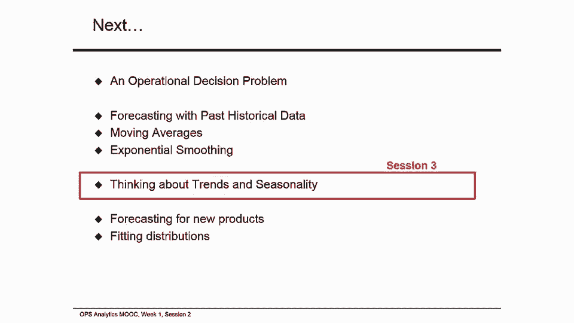

# 【沃顿商学院】商业分析 全套课程（客户、运营、人力资源、会计） - P37：[P037]03_moving-averages - 知识旅行家 - BV1o54y1N7pm

嗨，我是桑塔尔韦拉贡，我们开始了行动第一周的第二次会议，分析课程，在第一次会议上，我介绍了新的投降问题，并谈到了它令人兴奋的应用，我还谈到了不确定性和预测未来事件的必要性，我们讨论了两种主观预测工具。

在本届会议上，我们会继续专注于客观的预测方法，我将介绍一个简单但强大的工具，叫做移动平均线，我还要提到一种叫做指数平滑的方法。

我们将学习如何建立描述性统计，以及如何使统计数据用于预测。

这是第一周的会议，两个操作分析，我们专注于描述性分析，我们将利用过去的历史数据进行预测，高级幻灯片中的移动平均线和指数平滑，这也将是我们的会议，调用我们过去的需求数据，我们有一百次月经。

我们观察了他们在这一百个时期的数据，设dt表示在t期间观察到的需求，从过去的数据来看，我们有一个要求，D二，D三，以此类推，100以下，在本例中，1是29，现在让我们来看看描述性统计。

特别是平均值和标准差，让我们从样本均值的样本均值开始，样本平均值的样本平均值，只是算术平均数，在数据集中的所有数据点中，假设你有n个数据点，你把所有n个需求加起来，一、二、三、四。

除以你有n个数据点的总数，这给了你一个样本平均值，我们称样品均值为mu，样本均值大致告诉你预期会发生什么，下一个观察是，计算起来很简单，也可以用Excel平均函数计算，记住你的平均水平是多少。

未来的需求将偏离平均水平，现在我们将研究样本标准差，标准差，就像我们之前看到的，是衡量你的数据中有多少噪音或与平均值的变化，和，标准差的计算方法，就是看看你的需求和平均平方之间的差异。

差异并添加整个数据集的所有差异，为整个数据集添加所有差异的平方，除以n减一，其中您的数据有n个需求点，取给你标准差的平方根，但无论如何，标准差可以用Excel公式STD V计算，更简单明了。

我要向你展示如何，现在我们准备为我们的数据查看描述性统计，让我们看看我们的数据，整个数据集D-1-D-2到100，我们计算样本平均值，我们得到52。81，我们计算了样品标准差。

我们在Excel文件中得到了13。73，需求数据，xl as x i，向您展示如何从Excel工作表上的数据集计算这两个，这可能是暂停视频的好时机，看看Excel表，看看计算是如何完成的。

我向你们展示的是过去一百个时期的需求分布，你看，数据是在过去的一百个时期收集的，它显示在B栏中，右边是一个图表，我给你看了几张幻灯片，让我们计算整个数据的均值和标准差，计算平均值，我们用平均函数。

这只是这里所有数字的平均值，一个到一百个周期，你得到的平均数据是五，两点八一计算标准差，我们使用标准差函数，V再次从第一期需求到最后一期需求，标准差是137。73，如果你想减少我们要使用的小数。

我们只要点击这里，得到两个小数，我们得到了13。73，所以我们对数据的描述性统计，样本均值的样本均值，是五十二点八十一，标准差是13。73，均值和标准差是我们数据的两个描述性统计。

如果我们的数据是正态分布的，这两个统计数字足以描述需求预测统计数字，然而，如果我们需要用我们的数据来预测，我们需要调整我们的样本标准差来预测，我们以后再谈这个，让我们看看我们预测的符号，请记住。

我们将过去的要求表示为d一d二，D三到D T，哪些是需求的过去值，我们有兴趣对未来一段时间做一个t期的预测，我们有到T时期的数据，我们用字母F表示预测，在这种情况下，我们可以看到字母f有两个下标。

第一个脚本告诉你在哪个时期做预测，在第二个下标中告诉你在哪个时期做预测，例如，f逗号t加tau，意味着这是在T期做出的预测，t加tau，tau可以是一个、两个或三个，tau表示前面有多少个周期。

你看起来很FD逗号T加三，作为一个例子，是在t期对未来三个期间所作的预测吗，让我们把一些数字放进去，看一个例子，一百来一百加三，是对103年需求的预测吗？这叫做三步预测，为什么。

因为我们希望预测未来三个时期，我们要看一步预报，这是因为通常我们对下一个结果感兴趣，或者只是一步，我预测过，f逗号t加1是在t期间对t期间所作的预测，加一个，看看另一个例子，f t减1。

逗号T是用PDT做的预测，下一节减去一t来简化事情，我们用速记，f t加1等于，PDT加一的一步预测是什么，所以如果我想预测一段时间，t期加一的一步预测，我简单地称之为F T加一，换句话说。

f t加1代表在t期间对下一个t期间所作的预测，加上一个平稳序列的预测，静止数据显示无趋势行为，粗略地说，未来与过去相似，一个例子是我们的新闻供应商需求数据，如果您查看新闻供应商需求数据文件。

它没有显示出明显的趋势，因此，一个静止的时间序列在任何时期都有以下形式要求，在任何时间段内需求dt可以写成两个东西的和，μ是常数，有时是样本平均值，加上epsilon t，这是一个随机变量。

epsilon t是均值为零、标准差为零的随机变量，西格玛看到平均值和标准差不依赖于时间，因此，在这个数据中没有趋势，它是一个静止的时间序列，我们在分数的第一部分看到了随机变量。

这是重温那段视频的好地方，温习你对随机变量的知识，让我们继续思考如何利用过去的数据进行预测，两种常见的预测方法，平稳序列是移动平均线和指数平滑，我将在这节课中讨论移动平均线。

和指数平滑将涵盖在先进的材料幻灯片，移动平均线，方法，移动平均线预测是n的算术平均值，最近的观察，我们将表示使用n个数据点的移动平均线方法，简单地作为n中的一个想出一个步骤，我对PDT有预测。

使用移动平均法，我们要做的就是，提出PDT的预测，如果你从过去的周期中提取N个数据点，从t减1，t减去2到t减去n，然后除以n，过去数据点的平均值给你下一个时期的预测，如果你想预测未来几个时期。

那就是你想要移动平均线的多步预测，多步预报与单步预报相同，所以你可以用一步预测来进行多步预测，在移动平均法下，我们看到了如何提前一步做出预测，T期采用移动平均线法，你可能会想为什么它被称为移动平均线法。

这叫做移动平均线法，因为所选数据点移动，并且总是最近的结束数据点，比如说，如果你想预测一段时间，你取了N个数据点，从t减1，减去2到现在减去n，如果你想预测下一个时期，不加一。

发生的事情是你有一个新的需求数据，你把它加在这里，你放弃了你在前一阶段使用的最后一个观察，所以f t加1是数据点的和，dt减去1到dt减去n减去1除以n，我们基本上把我们使用的数据移动了一个周期。

我们加了一个dt，去掉了d-t-n，让我们用一个例子来更好地理解这一点，让我们计算一下过去十个周期的移动平均线，用我们的符号，我只是把这叫做十先，我们将查看描述性统计数据，然后我会向你展示预测统计数据。

你可以用来预测，你会在第四周看到更多关于如何进行预测分析的内容，移动平均线法的本课程，我将向你展示如何使用最后十个数据点，提出你的预测，我们数据集中的最后十个数据点用红色标记。

让我们看一个描述性统计的例子，我们把观察中最后十个点的数据取平均值，平均值是4。960。0，这是我们有限数据的样本平均值，我们的样本标准差也是类似地计算的，我们又得到s等于10。28。

我将向您展示如何使用模板计算描述性统计数据，你可以看看模板，第一周，模板XLS，和我们的数据，如果它是正态分布的，比如说钟形曲线，我们计算的统计数据，即平均值和标准差，足以描述需求分布。

在这个Excel视频中，我要用第一周的模板或移动平均线，模板文件，向您显示移动平均线，计算，B栏有一百个周期，C栏有一百个需求点，你看，这里有一些数据，因为我隐藏了一些行，我们可以解开这些行。

为了展示的目的，查看所有这些，我要再把那些排藏起来，从10岁开始一直到79岁或80岁，右键单击并隐藏，这实际上不会以任何方式影响我们的计算，先计算描述性统计数据，我将向你们展示如何计算均值和标准差。

使用最近十个数据点的移动平均法，这是十分，这又是直截了当的，平均值或平均值由平均函数给出，取平均函数，开始选择数据，你可以看到你上升，你可以看到计数的发生，这是你的十个数据点。

通常在Excel工作表的底部，还有一个计数表达式，您可以检查，所以一旦你有了这个，平均数是4。96。这就是我在Excel表上给你看的，这十个数据点给出了这十个数据点的平均值，给你4。96的平均值。

我们现在要计算标准差，标准差又是由STD给出的，E V函数并选择十个点，这就给出了你有的十个数据点的描述性标准差，它显示十点二十七，我们可以减少小数，我们这里得到10。28，同样地。

我们可以计算二十个数据点的移动平均线，二十个数据点的标准差和标准差，所以让我们先计算平均值，过去20个需求的平均值是这20个数字，我正在拿起，你得51分，九，五个，标准差将是，为了这二十分。

九点六一还是九点六一六，也就是9。62，这里我们有平均值，样本平均值，十个数据点和二十个数据点的标准差，同样，您可以对所有数据点执行此操作，对于您的所有数据点，我们应该得到之前得到的数字。

也就是从一到一百的时期，平均是五十，二点八一，所有这些数据的标准差，正如你所看到的，你拥有的数据越多，你计算这些数字的能力就越强，你对你的预测过程有更多的信心。

我们可以使用我们计算的统计数据来预测或预测，我们称之为预测统计，预测统计的平均值与描述性样本平均值相同，换句话说，描述性样本意味着您计算了，是真实需求分布均值的无偏估计器，因此。

样本意味着你计算的可以用于预测，然而，由于数据不足，预测的标准差需要调整，这就是我们下一步要做的，如果你知道数据是正态分布的，就像我们的情况一样，我们可以为预测目的调整标准差，我们就是这样做的。

预测的标准差将是，计算标准差，加上校正因子，校正因子为，计算的标准差除以n的平方根，其中n是您使用的数据点总数，当我们使用十个数据点时，让我们看看一些预测统计数据，当数据呈正态分布时。

预测的平均值与描述性样本平均值相同，所以我们用μ等于496。06，然而，因为我们注意到预测的标准差需要调整，调整得到西格玛，所以这里我们计算s等于十分二八，所以十二八加十二八除以十的平方根。

因为我们使用了十个数据点，得到了13。53，现在我们可以使用mu和sigma进行预测，让我们继续使用20个数据点进行描述性统计的示例，或者移动平均线20，我们计算样本均值。

从最后二十个点计算出的样本均值是5。119。5。这是我们的描述性样本，2。这个样品的标准差是9。62，让我们再做一个使用20个数据点的预测统计示例，当数据呈正态分布时。

我们在描述性样本均值之前得到的预测均值是足够的，预测的平均值是5。119。5。我们预计下一个时期的需求量将是5吨。一点九五，平均，然而，预测的标准差需要调整，根据我们对描述性统计的计算。

所以预测的标准差是西格玛，等于s，也就是描述性样本标准差，加上s对n平方根的校正因子，在这种情况下，我们得到9。62加9。60或20的平方根，因为我们用了二十个数据点，我们得到西格玛是11。7。

作预测用途，我们可以假设实际需求分布会偏离平均值，以上标准差为11。7，七，现在让我们考虑使用更多的数据，因为我们有更多的数据用于预测，当我们有更多的数据时，描述性统计方法是预测统计。

我们对预测有了更多的信心，也随着数据点数量的增加而节点，描述性标准差法，当n变得越来越大时，预测的标准差，更正项消失，西格玛几乎等于s，假设我们使用整个数据集来计算统计数据，也就是说。

我们使用了n等于100的所有可用数据，他们从L计算出的描述性统计数字如下，u等于五十二点八十一，标准差是13。73，如果我们的数据是正态分布的，统计数据如下，意味着穆还是一样，是52点81分，然而。

一共是137。73，因为我们使用了所有100个数据点，总共是十五点零，那么这到底意味着什么，这意味着我们对预测目的的需求，我们可以用均值为52。2 8。1的正态分布，和标准差十五点零，在未来几周。

我向您展示如何在Excel文件中计算所有这些数字，解决方案都记录在Excel文件中，第一周我是一个解决方案，点xls x，根据我们的预测分析。

我们现在可以生成一个正态分布图来可视化我们的需求是如何分布的，我们用五十二点八十一的平均数，和标准差十五点零，图中显示了你的需求分布是什么样子的，需求很可能很低，或者需求可能很高，但有可能。

根据我们到目前为止的分析，我们现在可以讨论移动平均线，在我们结束并查看其他数据集之前，移动平均线法的优点很容易理解，计算起来很简单，它确实提供了稳定的预测，有一些缺点，虽然先，如果您的数据集中有趋势。

移动平均线法会落后于趋势，我们将在第三场会议中看到，终于，这不是一个因果模型，移动平均线方法不能解释为什么你的需求，未来的实现以某种方式表现，可能对预测很有好处。

但这并不能解释为什么你的需求会以某种方式表现出来，最后请注意，移动平均线方法删除所有旧数据，所以如果你有如果你有10个数据点的移动平均法，它会删除所有超过十个时间段的数据。

现在这给我们留下了一个关于如何选择n的问题，如何决定有多少数据点，移动平均法应该使用移动平均线，移动平均线应该使用哪些数据，如果选择使用最近十个数据点的移动平均法，记住两件事，忽略所有旧数据。

12个周期的数据在移动平均线的计算中没有使用，第二点是最近的十个数据点都是平等权衡的，同样的，那是昨天的数据。与来自弱包的数据具有相同的权重，您可能希望对最近的数据给予更多的权重。

和较少的权重来排序数据，现在，我们怎么做，指数平滑是一种允许你这样做的方法，它是基于这个精确的想法，我们将在高级灯光下看到更多这样的东西，正如我之前提到的，你想出的任何预报都会有一些噪音，这将是错误的。

因为点预测不准确，那么你如何衡量我们的预测是好是坏，预测误差是衡量它的好方法，T期预测误差，假设用Epsilon表示，或E T，T期需求预测之间的差异，T中需求的实际值是你领先一步，预测。

你在时间段内的误差t是该时间段内预测的差值，ft减去在此期间t发生的需求，差异告诉你你在预测中的错误是什么，现在有三种方法来测量误差，我现在要给它们下定义，我们将通过一个例子，第一个是平均绝对偏差。

或m a d平均绝对偏差，计算以下内容，它计算出多少，你的预测绝对偏离了实际需求，取了平均数，均方误差，因为MSC计算如下，它计算你预测平方误差中的误差，并计算平均平方误差，为什么这有用。

我们以后会看到它在拟合趋势数据集时实际上很有用，在我们将要讨论的最后一种测量误差的方法上，称为m ape，或平均绝对百分比误差，a p如下所示，你计算的误差，除以实际需求作为百分比误差，然后计算。

把所有的百分比误差加起来，计算出平均值，这将给出平均绝对百分比误差或p，我们可以说的一件事是降低错误，改善预测过程，一个好的预测过程会有一个低，低MSC和低MA，我想说的最后一件事是偏差季节预测。

预测中出现偏差，当预测误差的平均值，往往在预报的一边，它往往要么太多，要么太少，正的或负的，这将有助于我们测量偏见，再次使用我们的数据集，我们将在预报中采用不同的计算误差的方法。

假设我们有多达80个周期的数据，我们将使用十个周期的移动平均线，计算我们的四只猫在81年以后的时间，一旦我们有了81年的预报，八十一期间的需求发生，一旦我们有了82年的预报，82期的需求发生，等等。

所以我们能够计算误差，用一个十，然后我们可以计算，通过比较这个预测的要求来确定误差，或者周期81到100在第一周的错误，模板，XLS文件，我给你举一个例子，运动，让我们使用我给你看的模板文件计算错误。

这是第一周的错误，模板文件，在我计算误差后，我有一个解决方案文件，我已经发布了解决方案文件，也在网站上，在模板文件中，我从你之前看到的同样的一百个需求点开始，一百个周期和一百个需求观察。

在这里面我藏了五到六十二支箭，让我更容易给你看，我要向你们展示的方法，但你可以随时打开它，一旦你准备好开始计算，就回去把它藏起来，所以在这种情况下，我要看看10的移动平均线。

所以从十个周期的移动平均线预测，只是最近十次观察的平均值，所以我就这么做了，这里我从81期开始，我要取所有需求的平均值，从七十一年到八十年，这给了我五个，五点八，预报是五十，五点八，实际需求是五二。

所以有一个误差，误差通常是通过预测来衡量的，减去需求，你变得积极，三点八，那是你在G栏中的错误，我要计算绝对误差，绝对误差是由一个函数计算的，取这个数，绝对误差是，当然是三点八，如果你的错误是负的。

三点八，你会得到一个绝对值，三点列g，h栏，我要计算误差的平方，就是3。8倍，三点八，然后在最后一栏，我要计算百分比误差的绝对值，有时你对百分比误差感兴趣，你有三点八的误差，但与实际需求相比，误差如何。

所以在这种情况下，误差是3。8，实际需求是五二，大约是百分之七，我们会看到，所以这是通过取误差的绝对值除以需求来计算的，正如你所看到的，现在是零点，七，我们有错误，绝对误差或绝对偏差，我们有误差的平方。

我们有百分比误差，让我们对81年以后的所有时期重复这样的计算，我这样做只是把值拖到周期100，正如你所看到的，误差可以相当显著地分布，你有一个高达21。8的误差，低至负2。7，你可以看到错误可以是负的。

十，负数，第九十四节气，在几个时期内，他们有一个积极的，这是积极的，十四点一，所以绝对偏差包括负误差和正误差，当误差计算平均绝对偏差时，我们可以做到这一点，这就是我们的均值绝对偏差，或绝对误差的平均值。

在这种情况下，我们得到的绝对误差的平均值是8。9，同样地，我们计算平均平方误差或平均平方误差，这将是所有这些平方误差的平均值，总共是一百一十三点一五分，最后我们计算一个p或平均值绝对百分比误差。

它大致告诉我们你的预测者与真实需求的百分比偏差，所以让我们取所有这些数字的平均值，我们得到1。97点，将其表示为百分比，我们有百分之二十，或者实际上是19。7点，百分之二，所以平均来说。

你们的预测与需求相差百分之十九点七。误差的平方大约是113%，2。你得到的误差的绝对值是八分，九个需求单位，所以你可能会想我们是否能做得更好，让我们看看我们是否能做得更好。

通过查看20个数据点的移动平均值，所以我要在这里做，所以我生成了20个周期的移动平均线，那么让我们从81年的天气预报开始吧，使用平均20个数据点，所以从61期到A期，那是二十个数据点，你得到五分，五个。

早些时候的预测是55点8分，当前的预测是55点5分。误差是五五五，减去需求，也就是三点五，绝对值，我在这里重复计算，只是为了说清楚，误差的绝对值是绝对误差，它作为一个正值来衡量。

不管错误是消极的还是积极的，三点五，误差的平方是三点五，三点五，十二点二五，最后百分比误差是，那是零点六七，所以我们再取这五个数字，我们在过去的二十节课里拖着他们，我们有预测，我们有错误。

我们有绝对误差，我们有平方误差，我们又有百分比误差了，让我们计算一下平均值，绝对误差，七点六，五五下来了，与八点九之前相比，平均平方误差或均平方误差，理学硕士，那下来了，那是九十二点。

六一一和百分比误差，让我们计算一下这种情况下的误差百分比，这归结为，事实上是十七点，两个，九，十七点，两个，百分之九，所以a下降了绝对偏差，误差平方，理学硕士下降了绝对百分比误差，我也下来了，所以说。

看起来就像，使用二十的移动平均线，比在我们的数据集中使用10的移动平均值要好，正如我所说，通常有一个模型选择，这是一个有模型选择的情况，即使你可以预测，你必须考虑在你的预测过程中使用什么数据。

解决方案文件也可以在网站上获得，作为第一周的错误解决方案点L作为X，让我们在分析结束后回到我们的幻灯片上，我要让你看看，如果你用移动平均法m a 10，我们得到m a d是8点，九分是一百一十三分。

十五和十九点，百分之七十二，用二十分的A，二十个数据点的移动平均值，平均绝对偏差是7。66，豆子的平方误差是92，绝对误差是17。29％。所以这至少告诉我们一个b20似乎比一个10表现得更好。

Excel分析的解决方案可在第一周错误解决方案XLS中获得，可能最好用20或10，在这种情况下，通过比较相应的错误，因此，测量误差使我们能够更好地理解在我们的，预测，最后，在我们的数据中。

没有任何偏见的证据，但我们需要收集更多的数据来确定这一点，我们即将结束，现在在本届会议上，我们看到了各种各样的东西，我们看到了如何用移动平均线方法进行预测，我们看到了如何测量误差，如何寻找偏见。

我们学习描述性统计，以及如何使描述性统计用于预测，下次会议见，2。我们下节课准备做什么？我们要考虑潮流和季节性，让我们在第一周的第三场会议上看看趋势和季节性，在本次会议中看到那里。

我向你介绍了一些基本的预测概念，我们还了解了一些关于预测方法的技术细节，以及单步多步预报，我们学会了如何在静止数据设置中预测。

我们讨论了移动平均线法，以及先进材料中的指数平滑，我们讨论了一些示例问题来说明概念，我们讨论了错误、偏见和预测结果，我们学习一些描述性的统计数据，均值和标准差，将用于描述我们的数据。

我们学习如何将描述性统计用于预测，用于预测未来事件。

