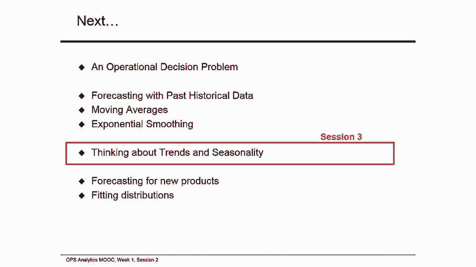

# 课程名称：沃顿商学院商业分析 - P37：移动平均法 📊

## 概述
在本节课中，我们将学习一种重要的预测工具——移动平均法。我们将从理解描述性统计（如均值和标准差）开始，然后学习如何利用这些统计量进行预测。课程将涵盖移动平均法的计算、应用、优缺点，以及如何评估预测的准确性。

---

## 描述性统计：均值和标准差
上一节我们介绍了预测的基本概念。本节中，我们来看看如何用数据描述过去的情况。描述性统计可以帮助我们总结和理解历史数据。

以下是两个核心的描述性统计量：

1.  **样本均值 (μ)**：它表示数据集的平均水平，计算公式为：
    `μ = (D₁ + D₂ + ... + Dₙ) / n`
    其中，`D₁, D₂, ..., Dₙ` 是过去 n 个时期的需求数据。

2.  **样本标准差 (s)**：它衡量数据围绕均值的波动程度。计算公式为：
    `s = √[ Σ(Dᵢ - μ)² / (n-1) ]`
    在Excel中，可以使用 `STDEV` 函数直接计算。

在我们的示例数据中，过去100期的需求均值为 **52.81**，标准差为 **13.73**。

---

## 预测符号与平稳序列
在开始预测前，我们需要明确一些符号。我们用 `F_{t, t+τ}` 表示在 t 期对 t+τ 期所做的预测。例如，`F_{100, 103}` 是在第100期对第103期需求的三步预测。

我们主要关注**平稳序列**的预测。平稳序列是指数据没有明显的上升或下降趋势，其需求 `D_t` 可以表示为：
`D_t = μ + ε_t`
其中，`μ` 是常数均值，`ε_t` 是均值为0、标准差为 `σ` 的随机扰动项。

---

## 移动平均预测法
对于平稳序列，移动平均法是一种简单有效的预测工具。它的核心思想是：用最近一段时间数据的平均值来预测未来。

**N期移动平均法的单步预测公式为：**
`F_{t+1} = (D_t + D_{t-1} + ... + D_{t-N+1}) / N`
这意味着，要预测下一期（t+1期）的需求，我们只需计算最近N期实际需求的平均值。

**多步预测**：在移动平均法下，多步预测与单步预测值相同。例如，`F_{t+3} = F_{t+1}`。

该方法之所以称为“移动”平均，是因为随着时间推进，我们用于计算平均值的数据窗口会不断向前移动，总是包含最新的N个数据点。

---

### 移动平均法实例计算
让我们通过一个例子来具体操作。假设我们使用最近10期数据（N=10）进行移动平均预测。

以下是计算步骤：

1.  从数据集中提取最近10期的需求值。
2.  计算这10个值的算术平均数，作为下一期的预测值。
3.  在Excel中，可以使用 `AVERAGE` 函数轻松完成。

在我们的数据中，最近10期需求的平均值为 **49.60**，这就是我们对下一期的预测值。同时，这10期数据的标准差为 **10.28**。

---

## 从描述性统计到预测统计
我们计算出的描述性统计量（均值和标准差）可以直接用于描述历史数据。但当我们想用它们来预测未来时，需要进行一点调整。

*   **预测均值**：与描述性样本均值相同。例如，用10期数据计算出的均值49.60，可以直接作为未来需求的预测中心。
*   **预测标准差**：需要进行调整，以反映我们用于预测的数据量有限这一事实。调整公式为：
    `预测标准差 σ = s / √N`
    其中，`s` 是描述性样本标准差，`N` 是用于计算移动平均的数据点数量。

例如，使用10期数据时，预测标准差为 `10.28 / √10 ≈ 3.25`。这意味着，我们可以认为未来需求围绕均值49.60波动，标准差约为3.25。

**数据量越多，预测越准**：当使用的数据点 `N` 很大时，校正因子 `1/√N` 会变得很小，预测标准差 `σ` 就几乎等于样本标准差 `s`。使用全部100期数据时，预测均值为52.81，预测标准差为 `13.73 / √100 = 1.37`。

---

## 评估预测精度：预测误差
任何预测都难免有误差。衡量预测误差可以帮助我们评估和改进预测方法。

**预测误差 (e_t)** 定义为预测值与实际值之差：
`e_t = F_t - D_t`

以下是三种常用的误差衡量指标：

1.  **平均绝对偏差 (MAD)**：计算所有时期绝对误差的平均值。`MAD = (Σ|e_t|) / n`
2.  **均方误差 (MSE)**：计算所有时期误差平方的平均值。`MSE = (Σ(e_t)²) / n`。它对大误差给予更大惩罚。
3.  **平均绝对百分比误差 (MAPE)**：计算绝对误差相对于实际需求的百分比的平均值。`MAPE = (Σ|e_t / D_t|) / n * 100%`。它提供了误差的相对规模。

一个好的预测模型应追求较低的MAD、MSE和MAPE值。

**预测偏差**：如果预测误差长期为正或为负（即持续高估或低估），则说明预测存在偏差。

---

### 误差计算实例
我们使用移动平均法对第81期到第100期进行预测，并计算误差。

*   使用10期移动平均法 (N=10) 时：
    *   MAD = 8.99
    *   MSE = 113.15
    *   MAPE = 19.72%
*   使用20期移动平均法 (N=20) 时：
    *   MAD = 7.66
    *   MSE = 92.61
    *   MAPE = 17.29%

比较发现，使用20期数据的移动平均法在所有误差指标上都优于10期方法。这表明，对于本例数据，使用更长的历史数据窗口能获得更稳定的预测。

---

## 移动平均法的优缺点
**优点**：
*   概念简单，易于理解和计算。
*   能提供相对稳定的预测，平滑掉数据中的随机波动。

**缺点**：
*   **滞后于趋势**：如果数据存在上升或下降趋势，移动平均预测总是会“落后”于实际变化。
*   **非因果模型**：它只基于历史数据模式，不解释需求变化的原因。
*   **数据权重均等**：它对所有N期内的数据给予同等权重，而通常近期数据可能包含更多信息。
*   **丢弃旧数据**：完全忽略了N期之前的所有历史信息。

如何选择最佳的N值？这通常需要通过比较不同N值下的预测误差（如MSE或MAPE）来决定。

---

## 总结
本节课中，我们一起学习了以下核心内容：

1.  **描述性统计**：学会了计算和解读数据的均值与标准差。
2.  **移动平均预测法**：掌握了这种针对平稳序列的基本预测方法，包括其公式、计算和“移动”的含义。
3.  **预测统计**：理解了如何将描述性统计量调整后用于预测，特别是预测标准差的校正。
4.  **预测评估**：学习了MAD、MSE和MAPE三种关键指标，用于衡量预测误差和精度，并通过实例比较了不同参数下的预测效果。
5.  **方法优缺点**：分析了移动平均法的适用场景和局限性。

移动平均法是一个强大的起点，但它无法处理趋势或季节性数据。在接下来的课程中，我们将探讨能够应对这些更复杂模式的预测方法。