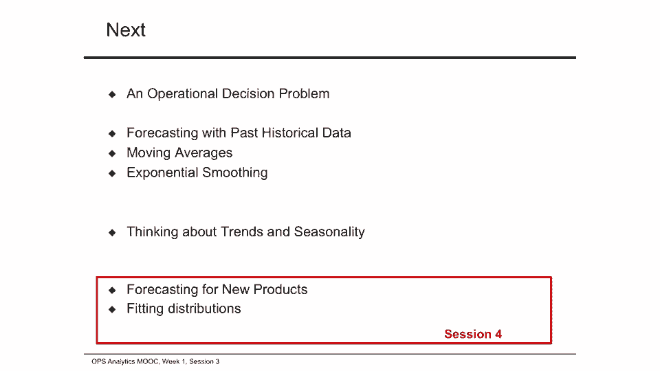

# 📈 课程 P038：趋势与季节性分析

在本节课中，我们将学习如何对具有趋势或季节性模式的数据进行预测。我们将探讨移动平均法、线性回归法以及季节性因子的计算方法，并通过实际案例演示如何应用这些技术。

---

## 数据中的趋势与季节性

上一节我们介绍了描述性统计和预测的基本概念。本节中，我们来看看当数据呈现趋势或季节性时，如何进行预测。

回忆之前展示的渲染需求数据图表，数据是平稳的，需求基本稳定，只有一些噪声和波动，没有明显的趋势。但实际数据往往存在趋势。例如，观察零售销售额图表，可以看到电子商务销售额和总销售额呈现普遍上升趋势。Y轴表示销售额（百万美元），X轴表示年份，除了少数年份外，整体趋势是增加的。

数据也可能存在季节性。例如，某些月份的零售额可能持续高于其他月份。在月度销售图表中，X轴表示月份，Y轴表示销售额（百万美元），可以看到2013年下半年的销售额更高，这种模式在其他年份也重复出现。季节性效应通常源于可预测的年度事件，可能是文化或天气相关的，例如美国的感恩节销售、印度的排灯节销售或冬季的滑雪装备销售。

当数据存在趋势时，我们研究两种预测未来需求的方法：一是使用移动平均法，二是使用线性回归法。此外，我们还可以采用指数平滑法来调整趋势预测。

---

## 移动平均法及其滞后性

使用移动平均法时，如果数据存在上升或下降趋势，移动平均预测值会滞后于实际趋势。当趋势上升时，移动平均预测通常低于实际需求；当趋势下降时，移动平均预测则高于实际需求。

以下是移动平均法滞后于趋势的说明：

考虑一个需求逐步增加的序列：10, 20, 30, 40, 50, 60... 虽然仅观察趋势就很容易预测，但使用移动平均法会导致预测滞后。

*   **使用两个数据点的移动平均**：预测第五期需求时，我们使用最后两个数据点（30和40），计算平均值得出预测值为35。这明显低于实际趋势值50。
*   **使用三个数据点的移动平均**：预测第五期需求时，使用最后三个数据点（20, 30, 40），计算平均值得出预测值为30。滞后更为明显。
*   **使用四个数据点的移动平均**：预测第五期需求时，使用最后四个数据点（10, 20, 30, 40），计算平均值得出预测值为25。滞后进一步加剧。

由此可见，使用的数据点越多，移动平均预测滞后于趋势的程度可能越大。

---

## 线性回归与趋势线拟合

为了解决移动平均法的滞后问题，我们可以使用线性回归进行时间序列预测。核心思想是拟合一条能捕捉数据趋势的直线。

模型是拟合一条直线，公式为：
**`d_t = a + b * t`**
其中，`d_t` 是第 `t` 期的需求预测，`a` 是截距，`b` 是斜率。

我们通过最小化数据点与趋势线之间误差的平方和（普通最小二乘法，OLS）来找到最佳拟合直线。平均平方误差（MSE）是衡量拟合优度的指标。

我们通过一个实例来演示如何在Excel中拟合趋势线。

---

### 案例：黄石国家公园游客预测

我们将使用黄石国家公园的年度游客数据（1965-2014年）来演示趋势线拟合。数据来源自美国国家公园管理局（NPS），用于规划服务、预算和生态评估等目的。数据显示出明显的增长趋势。

**在Excel中拟合趋势线的步骤：**

1.  选择数据（例如最近50年的数据）。
2.  插入散点图。
3.  在图表中选中数据系列，右键添加“趋势线”。
4.  选择“线性”趋势线，并勾选“显示公式”。
5.  调整公式标签的格式以便阅读。

**基于50年数据拟合的直线方程为：**
**`d_t = -53,525,580 + 28,248 * t`**
其中，`t` 代表年份序号。

**基于30年数据拟合的直线方程为：**
**`d_t = -57,400,121 + 31,091 * t`**

**如何进行预测：**
例如，要预测2017年（`t=27`）的游客数量，只需将 `t=27` 代入相应的方程进行计算即可。

---

## 季节性分析与预测

当数据存在季节性时，我们需要采用不同的方法。季节性对应于数据中周期性重复出现的模式。

我们使用**乘法季节因子**（`c_i`）来建模季节性，其中 `i` 表示第 `i` 个季节。所有季节因子之和应等于季节总数 `n`。例如，`c_i = 1.25` 表示该季节的平均需求比基线高25%；`c_i = 0.75` 则表示比基线低25%。

以下是估计季节因子的四个步骤：

1.  **计算样本均值**：计算整个数据集的平均值。
2.  **计算季节均值**：分别计算每个季节（如所有冬季、所有夏季）数据的平均值。
3.  **计算季节因子**：将每个季节的均值除以步骤1中的样本均值。
4.  **去季节性化**：将原始数据中的每个观测值除以其对应的季节因子，得到去季节性化序列。这个序列可以视为平稳序列，用于后续预测。

**预测步骤：**
1.  使用移动平均法等对去季节性化序列进行预测，得到季节性调整后的预测值。
2.  将该预测值乘以对应季节的季节因子，得到最终的季节性预测值。

---

### 案例：航空公司客座率预测

我们使用美国运输统计局（BTS）提供的国内前100条航线月度客座率数据（2003-2013年）。该数据同时具有趋势（客座率逐年上升）和季节性（某些月份更繁忙）。

在配套的Excel文件（第一周航空公司模板.xlsx）中，我们按照上述四个步骤：
1.  计算了整个数据集的样本均值（约79.44%）。
2.  计算了每个月份（1月至12月）的季节均值。
3.  通过将季节均值除以样本均值，得到了12个月的季节因子（例如，1月约为0.91，6月约为1.06）。
4.  将原始数据除以对应月份的季节因子，生成了去季节性化序列。

**进行预测：**
例如，要预测未来某个月份的客座率，可以先对去季节性化序列使用移动平均法进行预测，然后将结果乘以该月份的季节因子，即可得到包含季节性效应的最终预测值。

---

## 总结与注意事项

本节课中，我们一起学习了如何对具有趋势和季节性的数据进行预测。

*   我们探讨了**移动平均法**，并认识到其在存在趋势的数据上会产生滞后。
*   我们学习了使用**线性回归**拟合趋势线，并通过黄石公园游客案例进行了实践。
*   我们深入分析了**季节性**，掌握了计算季节因子和生成去季节性化序列的四步法，并通过航空公司客座率案例加以应用。

在进行预测时，还需要注意以下几点：
*   **初始化问题**：初期数据有限，随着预测进行，数据集会增长，需要方法处理有限数据问题。
*   **模型选择问题**：需要决定使用多少历史数据以及何种预测方法。
*   **预测期限**：对于简单时间序列数据，短期预测方法通常表现良好。长期预测（假设趋势和季节性不变）风险较高，因为技术或市场可能发生变化。
*   **误差跟踪**：监控预测误差对于发现预测偏差和改进模型至关重要。

在接下来的课程中，我们将继续研究新产品的预测和需求分布的拟合。