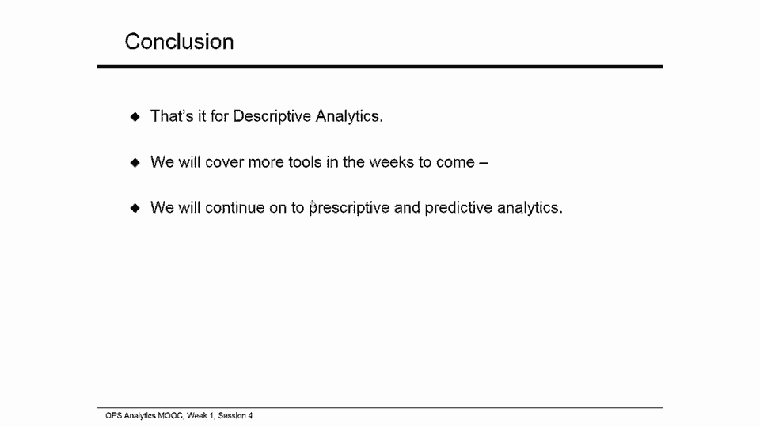

# 📊 商业分析课程 P39：第一周总结与服装行业应用案例

在本节课中，我们将回顾第一周所学的描述性分析核心概念，并通过一个服装行业的实际案例，学习如何在数据有限的情况下，为新产品的需求建立预测模型。

---

## 🧠 概述：从预测到需求分布

在之前的课程中，我们学习了在不同环境下进行预测的技术。这些预测方法基于对过去观测数据的总结。本节我们将聚焦于一个特定环境——服装行业，并在此背景下应用相同的预测工具来构建描述性分布。

---

## 🎯 案例背景：预测新产品需求

我们将研究一个新产品预测问题。当市场上出现新产品或新设计时，需求数据往往非常有限。在这种情况下，我们应如何进行预测？通常，我们会使用一些主观预测技术。

以下是几种常见的主观预测方法：
*   **销售团队综合意见法**：销售人员收集需求数据，进行估计并汇总所有需求信息。
*   **客户调查法**：通过客户服务渠道收集数据或预测需求。
*   **高管陪审团法**：组成一个由预测专家组成的委员会，利用集体知识提出预测。
*   **德尔菲法**：这是一种常用的方法，它汇总个人意见，然后经过多轮反复讨论和修正，直至达成集体共识。

所有主观方法最终都依赖于直觉和经验判断。

---

## 👟 实战应用：安迪户外用品公司

让我们来看一个预测应用实例。我们关注一家名为“安迪户外”的公司，它推出了一款新产品：新型男士登山鞋“流浪者”。这款特定设计的鞋子只销售了一个季度。

上一季度，公司预测需求为 **Q=1200** 双，实际生产了 **1500** 双，最终售出了 **1397** 双。目前可用的需求数据不多，安迪公司该如何思考“流浪者”鞋款的描述性统计呢？这正是我们要研究的问题。

---

### 📈 利用历史数据拟合分布

如果像安迪公司这样，过去的需求数据有限（例如针对新产品），我们从主观预测开始。然而，如果我们仔细思考，通常可以从其他产品中获得额外的历史需求数据。这些数据包含了公司预测与实际需求的偏差信息，非常有价值。

我们将采用一种方法，利用这些可用数据来拟合正态分布。虽然也可用类似方法拟合其他分布，但本节课我们重点讨论正态分布。

安迪公司拥有其所有鞋款的数据。下表展示了他们上一季度生产的所有产品信息：

| 产品 | 预测值 (F) | 生产量 | 销售量 | 实际需求 (A) |
| :--- | :--- | :--- | :--- | :--- |
| 产品A | 800 | 850 | 796 | 796 |
| 产品B | 2000 | 2200 | 1926 | 1926 |
| ... | ... | ... | ... | ... |
| 产品Ω | 2400 | 3000 | 2297 | 2297 |

**注意**：销售量和实际需求可能存在差异。**销售量**受库存限制，而**实际需求**是客户真实的购买意愿。例如，如果需求是1000双，但库存只有800双，那么销售量就是800双。为了准确预测，我们需要了解真实的需求分布。

---

### 🔍 评估预测精度：A/F 比率

为了获得真实的需求分布，我们需要将预测值与表中的实际需求进行比较。我们通过计算 **A/F 比率** 来衡量预测性能。

**A/F 比率** 的计算公式为：
`A/F 比率 = 实际需求 (A) / 预测值 (F)`

这个比率有助于我们理解预测的准确性。例如，A/F 比率为 0.8 意味着实际需求是预测值的 80%。通过评估所有历史观测值的 A/F 比率，我们可以了解当前预测的不确定性。

---

### 📊 拟合正态分布

我们从一个初始的主观预测开始（例如，预感、猜测或委员会预测）。假设对“流浪者”鞋款的初始预测是 **1000** 双。

接下来，我们根据历史数据计算比率。然后，我们按以下方式拟合正态分布的参数（均值 μ 和标准差 σ）：
*   **均值 (μ)**：设置为 `预测值 × 历史 A/F 比率的平均值`。
*   **标准差 (σ)**：设置为 `预测值 × 历史 A/F 比率的标准差`。

在我们的例子中：
*   预测值 = 1000
*   历史 A/F 比率的平均值 = 1.01
*   历史 A/F 比率的标准差 = 0.31

因此，拟合出的需求正态分布为：
`均值 μ = 1000 × 1.01 = 1010`
`标准差 σ = 1000 × 0.31 = 310`

这个 `N(1010, 310)` 的正态分布描述了我们对“流浪者”鞋款需求的认知。

**（注：** 如果为了未来预测目的，我们可能需要对标准差进行修正，例如使用移动平均方法进行调整，具体可回顾课程第二部分相关内容。**）**

---

## 💡 方法总结与拓展应用

尽管针对新产品数据有限，我们通过利用过去的预测过程数据，成功提出了一个需求分布模型，这有助于我们理解未来的不确定性。

这项技术的应用非常广泛。例如：
*   可用于评估国内生产总值（GDP）预测的准确性，通过比较预测值与实际观测值，来建立对预测过程的信心。
*   一家名为 Sport Obermeyer 的公司在预测过程中也采用了测量误差的方法。

通过跟踪预测误差，我们可以了解预测的可靠程度。这些信息反过来有助于描述需求的不确定性，即未来需求将如何分布。

---

## 🏁 第一周课程总结

让我们回顾一下第一周所学的内容：
1.  我们从**报摊问题**开始，引入了**随机变量**的概念。
2.  我们研究了**需求分布**，并学习了如何预测需求。
3.  我们学会了如何利用**历史数据进行预测**。
4.  我们探讨了预测中的**误差与偏差**。
5.  我们学习了两种预测技术：**移动平均法**和**指数平滑法**。
6.  我们学会了如何生成描述性统计数据（特别是**均值和标准差**），并使它们适用于未来的预测。
7.  我们研究了**趋势和季节性**，并学会了如何在 Excel 中实现相关预测。
8.  最后，我们掌握了如何**预测新产品**以及如何**拟合需求分布**。

至此，描述性分析部分告一段落。在接下来的几周，我们将继续学习**规范性分析**和**预测性分析**的更多工具。

---

本节课中，我们一起学习了如何在数据有限的情况下，通过分析历史预测精度，为新产品的需求建立概率模型（如正态分布）。这是将描述性统计分析应用于实际商业预测的关键一步。