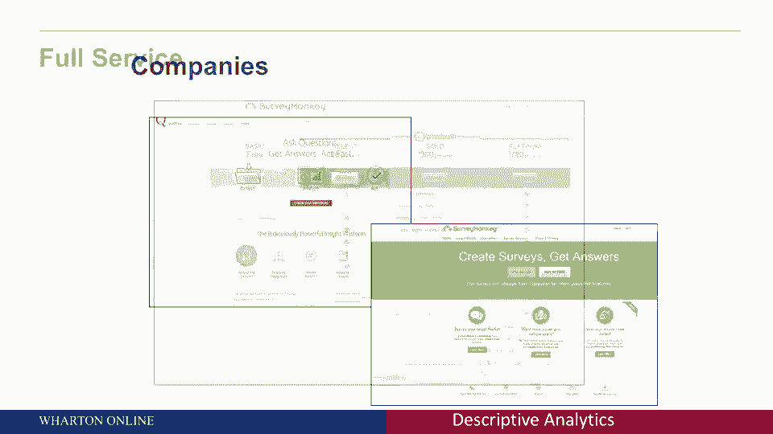
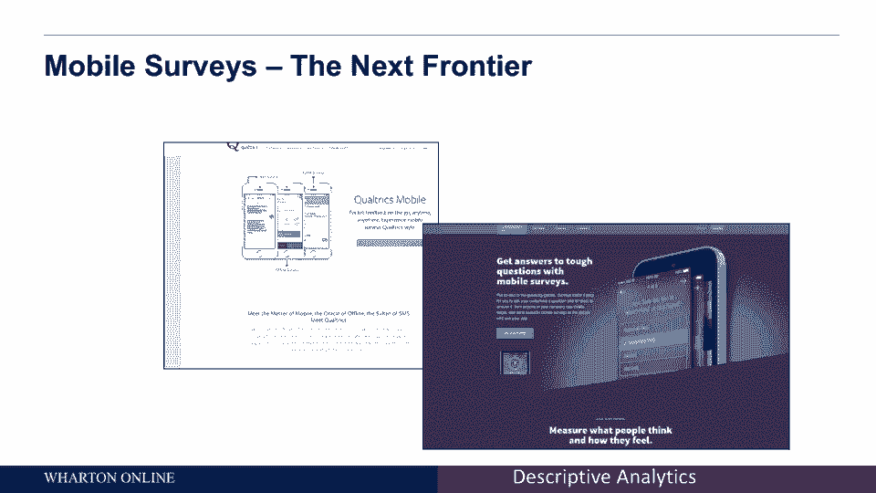
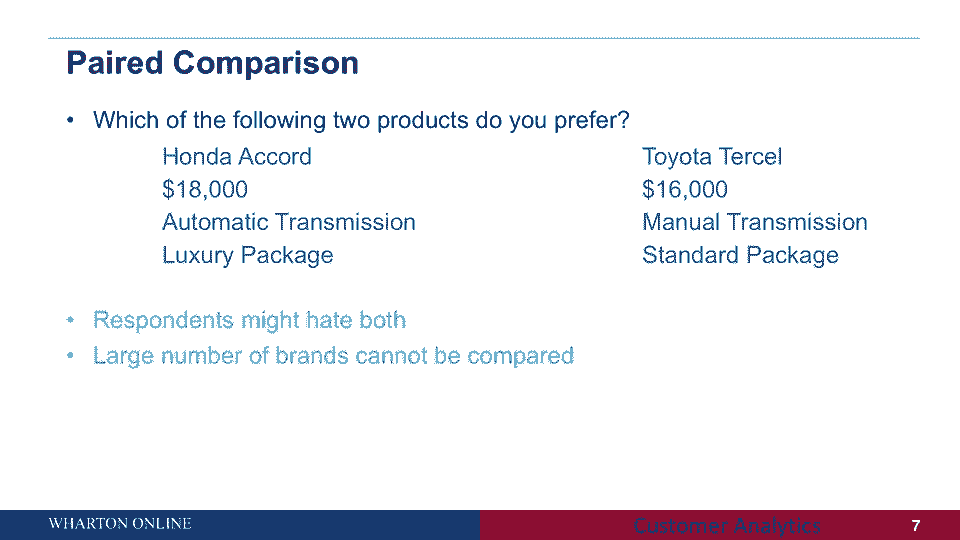
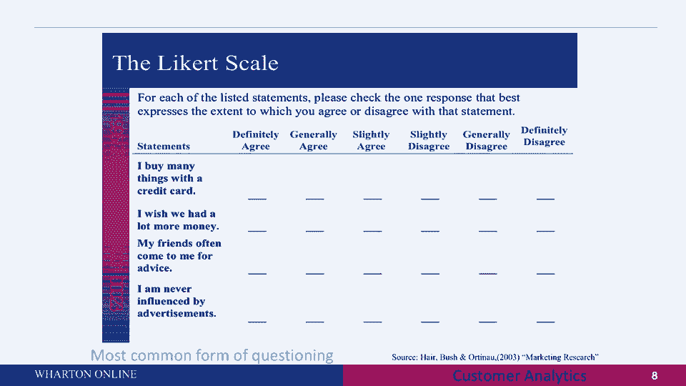
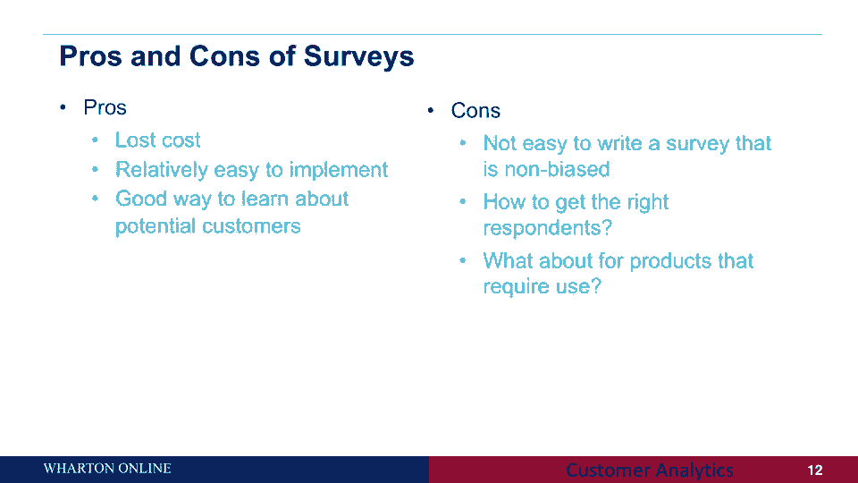

# 📊 课程名称：沃顿商学院商业分析 - P4：描述性数据收集与调查概述

在本节课中，我们将学习描述性数据收集的核心方法之一：调查。我们将探讨调查的类型、设计原则、有效性验证以及实际应用中的注意事项。通过本课，你将掌握如何设计有效的调查来收集客户数据，以支持商业决策。

---

## 🔍 什么是描述性数据收集？

描述性数据收集旨在理解商业环境中的基本事实，例如“我们的客户是谁？”或“我们的市场份额是多少？”。这类问题需要具体的数字答案。收集这些数据主要有两种方法：主动数据收集和不引人注目的数据收集。本节我们将重点讨论主动数据收集中的调查方法。

---

## 📝 调查：市场研究的支柱

调查是许多公司进行市场研究的核心工具。通过调查，企业可以收集客户态度、情绪、购买习惯等多维度数据。这些数据有助于细分客户群体、理解客户需求，从而制定有效的营销策略。

目前，市场上有许多公司提供专业的调查服务。例如：

*   **Qualtrics**：一家知名的全面服务公司，不仅提供调查工具，还能协助寻找受访者、分析数据。
*   **SurveyMonkey**：提供从免费到全面的付费调查解决方案，帮助企业接触客户并收集信息。

这些服务平台使得发起和执行调查变得更加便捷。

---

## 📱 移动调查：捕捉即时反馈

随着移动设备的普及，移动调查成为数据收集的新前沿。其核心优势在于能够捕捉客户在特定场景和时刻的即时反应。

以下是移动调查的几个关键特点：

*   **即时性**：在客户完成购买或体验服务的当下发送调查，能更准确地捕捉其真实感受，而非事后的回忆。
*   **情境化**：可以根据用户的地理位置（如在商场或餐厅）提出定制化的问题，使调查更具相关性。
*   **需谨慎使用**：尽管强大，但应避免过度向同一客户发送调查，以免引起“调查疲劳”，导致回复率下降或数据质量受损。

---

## ❓ 调查问题的类型与设计

设计调查时，选择合适的问题类型至关重要。不同的问题类型各有优劣，适用于不同的测量目标。

### 1. 分类量表问题
这类问题要求受访者在几个明确的类别中选择答案。

**示例**：你对你的健康保险计划有多满意？
*   非常满意
*   比较满意
*   一般
*   不太满意
*   非常不满意

**优点**：类别清晰，平衡了正面和负面选项。
**缺点**：受访者的参考标准可能不同（例如，与之前的保险计划比较），导致答案缺乏可比性。

### 2. 比较性问题
直接要求受访者将某个对象与一个明确的标准进行比较。

**示例**：与本地私人诊所相比，您认为私人执业医生提供的医疗质量如何？（从“差很多”到“好很多”）
**优点**：提供了统一的比较基准。
**缺点**：可能忽略了两个选项都不理想的情况，仅能反映相对偏好。

### 3. 排序问题
要求受访者对一系列选项按重要性或偏好进行排序。

**示例**：请对手机服务的以下特性按重要性进行排序（1为最重要，8为最不重要）。
**优点**：能清晰区分不同属性的优先级。
**缺点**：当选项过多时（如超过8个），受访者可能难以认真完成所有比较，导致后序位的数据质量下降。**最佳实践是限制在6-8个选项以内**。

### 4. 配对比较问题
强制受访者在两个具体产品描述之间做出选择。

**示例**：你更喜欢哪款车？
*   A. 本田雅阁，$18,000，自动挡，豪华套装
*   B. 丰田凯美瑞，$16,000，手动挡，标准套装

**优点**：模拟了真实的购买决策场景。
**缺点**：受访者可能两个都不喜欢；当品牌或属性过多时，比较会变得非常复杂。**最佳实践是每次比较2-3个品牌，每个品牌涉及4-6个关键属性**。

### 5. 李克特量表
这是最常见的形式，受访者对一系列陈述表达同意或不同意的程度。

**示例**：请表明你对以下说法的同意程度（从“非常不同意”到“非常同意”）：
*   我经常用信用卡购物。
*   我认为信用卡积分很有价值。

**优点**：可以高效收集人们对多个陈述的态度数据。

### 6. 连续量表
受访者通过一个连续的滑杆或刻度实时表达其偏好强度，常用于电脑介导的调查。

**示例**：观看广告时，观众可以移动滑块来实时表示喜欢或不喜欢当前内容。
**优点**：能捕捉偏好随时间（如观看视频时）的动态变化。

**核心要点**：没有一种问题类型是完美的。选择哪种类型取决于你的具体调查目标。

---

## ✅ 评估调查质量：效度与信度

设计好问题后，如何确保收集到的数据是有价值的？这需要通过效度和信度来评估。

*   **效度**：指调查结果能否有效预测我们关心的实际结果。
    *   **公式**：`调查得分` 与 `关键业务指标（如利润、客户留存率）` 之间存在显著相关性。
    *   **示例**：如果“净推荐值（NPS）”得分高的客户群体，确实为公司带来了更高的利润，那么这个调查就具有良好的预测效度。

*   **信度**：指测量结果的稳定性和一致性。
    *   **一种常见形式是重测信度**：在不同时间对同一批受访者进行相同调查，结果应该基本一致。如果波动很大，说明该测量工具不可靠。

---

## ⚖️ 调查的优缺点总结

在决定是否采用调查时，需权衡其利弊：

**优点**：
*   **成本较低**，且易于实施。
*   是了解潜在客户想法和需求的直接途径。

**缺点**：
*   设计一份**无偏见的问卷**具有挑战性（例如，问题措辞可能引导答案）。
*   **寻找合适的受访者**并保证回复率是一大难题。
*   对于**需要亲身体验的产品**（如复杂器械、香水），仅靠调查可能无法获得真实反馈，需结合焦点小组等方法。

---

## 🎯 课程总结

本节课我们一起学习了描述性数据收集的核心工具——调查。我们探讨了从传统问卷到移动调查的不同形式，深入分析了各种问题类型（如分类量表、排序、配对比较等）的设计技巧与适用场景。同时，我们了解了用**效度**和**信度**这两个关键指标来评估调查质量。最后，我们总结了调查方法的优势与局限，为你将来设计和实施有效的市场调查奠定了坚实的基础。