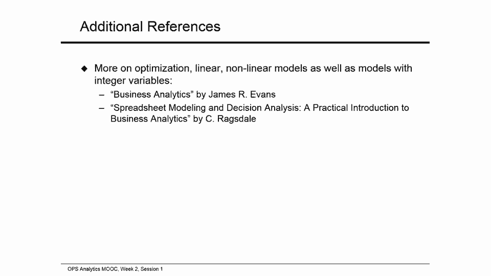

# 【沃顿商学院】商业分析 全套课程（客户、运营、人力资源、会计） - P40：[P040]01_how-to-build-an-optimization-model - 知识旅行家 - BV1o54y1N7pm

我是谢尔盖七号，我是运营系的副教授，沃特学校的信息和决定，我将指导你们完成第二周和第三周的运营分析成绩，在第一周，你已经研究了描述和预测不确定结果的方法和手段，你还被介绍到一个需求很大的典型问题。

在不确定的情况下供应，新闻供应商问题，为了成功地应对新闻供应商的挑战，我们必须明白，当面临不确定性时，如何首先评估任何行动方针，第二，在第二周和第三周，从所有可能的选择中选择最好的行动方案。

我们将学习如何使用两个基本的业务分析工具包，完成这些任务，第二周第一次，我们将重点讨论优化工具包，看看如何在低不确定性的环境中从众多选择中选择最佳替代方案，在第三周，我们将研究高不确定性设置。

我们将使用模拟工具包来评估，与任何可能的行动方针相关的报酬和风险，所有这些都将为你的第四周做好准备，当这个，优化和仿真工具包将一起使用，以确定最佳选择，让我们从第二周开始。

我们将研究如何在低不确定性的环境中识别最佳决策，第二周我们有三节课，第一届会议，我们将看一个制造公司面临的资源分配问题的例子，我们的重点将是用决策来描述这个问题。

公司必须制定它想要实现的目标和它面临的限制，我们将建立一个表达这个问题的分析模型，使用以后会帮助我们的公式，进行基于电子表格的最佳决策搜索，在第二次会议上，我们将转换会话一中内置的分析模型。

转换为电子表格表单，并使用名为Solver的Excel编辑来找到最佳的行动方案，我们将模拟实践中经常遇到的另一个决策，通过供应和需求地点网络运输货物的决定，就像在会话一中一样。

直到我们将建立一个描述网络管理问题的分析模型，将其转换为电子表格配方，并使用求解器确定最佳选项，让我们开始我们的第一次会议，我们开始分析如何在法律不确定的环境中做出最佳决策，通过看一个小例子，在本例中。

一个叫Zooter的UTA制造商，面临着在两种主要产品之间分配有限资源的问题，剃刀和纳瓦罗，纳瓦霍人比剃须刀稍微有利可图，每单位一百六十美元的利润贡献，对150美元，公司很小，它投射出。

这个利润率不会受到滑板车数量的影响，它可以现实地生产并投放市场，每个滑板车模型都需要使用三种资源中的每一种，它必须经过框架制造，威尔逊甲板装配和质量保险及包装，剃刀和纳瓦霍滑板车需要不同数量的每种资源。

比如说，为了生产一辆剃刀滑板车，公司必须花四个小时制造框架，威尔逊甲板组装1。5小时，Q组装1小时，A和包装，纳瓦霍斯库特的相应数字是五，两到八个小时，大家可以看到，纳瓦库斯更有利可图。

花更少的时间做Q，A和包装，但要用更多的车架制造轮子和甲板组装时间，在这个问题上，Zoa想计划下周的生产，在这一周内，它估计其资源将有以下限制，它将有5610个小时的框架制造时间。

可提供2200小时的车轮和甲板装配，和1200小时的质量保证和包装，所以它想决定每个滑板车型号有多少个单元，如果它计划下周生产，以便其有限的资源以最有利可图的方式分配，请注意。

我们在本例中使用的所有数据都是某些非随机数，换句话说，每条数据都是单个数字而不是多值概率分布，比如说，我们假设，一辆剃刀滑板车，将贡献正好150美元的利润，它的框架将需要整整四个小时来制造。

这意味着Zua为下周选择的任何生产计划，在利润和资源消耗方面会产生某些非随机的结果，随机性的缺失，在评估不同的行动过程中是一个非常强大的帮助，在没有不确定性的情况下选择最好的，即使是非常大的问题。

换句话说，拥有大量产品和资源的问题更容易解决，假设一种方式，在公司面临一项决定的情况下，不确定性可能是合理的，对其商业环境有相当强的控制，要么是因为它考虑了短期规划，或者因为它受益于长期合同。

使它能够自信地预测未来的数据参数，自然，这可能不是一个很好的假设，在存在影响管理行动结果的重大不确定因素的环境中，我们将仔细看看这个更复杂的设置第3周和第4周，好的，让我们回到UA的情况。

对任何问题的分析都集中在找到最佳的行动方案上，或者用另一个词来优化行动过程，必须从识别决策变量开始，在UDA示例中，公司必须决定生产的每个盾片模型的数量，所以决策变量是。

下周要生产的剃刀滑板车的数量是多少，以及未来一周生产的纳瓦霍滑板车数量，解是这些决策变量的特定选择，比如五百五百，所以如果祖达把它的决策变量设置为五百，它将获得十五万五千英镑的非营利收入。

这个计算把我们带到了优化模型的另一个重要组成部分，客观目标是标准，例如利润或成本，一个公司想做得尽可能大，或者尽可能小，在祖达案件中，目标是利润，公司希望最大化利润，重要的是要记住。

一旦我们决定了决策变量的值，我们应该能够计算出目标的价值，比如说，如果滑板车的比赛次数产生r，纳瓦霍滑板车的数量产生N，主要利润价值将是r的一百五十倍。加一百六十乘n。

将目标表示为决策变量函数的公式称为目标函数，目标函数值就是我们得到的，如果我们在目标函数中插入决策变量值的特定组合，所以如果我们把五百代入这个公式，我们得到150的目标函数值，五千。

约束构成优化模型的第三个构建块，如果Zooter每个滑板车模型做500个，这需要多少有限的资源在车架制造方面，Zooter需要四个，五百小时，没问题，它有更多的时间可用，无论决策变量的组合，缩放选择。

所需制造小时数不能高于可用小时数，这就是我们所说的约束，让我们来看看每款500英镑的生产计划，其他资源，它需要，没关系的，从车轮和甲板装配时间的角度来看，但这需要1750个小时。

不超过动物园200小时的可用时间，包装时间的Q A也是如此，所需的数字九百不超过可用的数量，那是一千二百，我们称这样的解决方案为可行的解决方案，如果UDA决定生产500辆剃刀滑板车呢。

提高纳瓦霍滑板车的产量，到七百五十个单位，嗯，这个生产计划比Zooter需要更多的框架制造时间，比祖达更多的轮子和甲板组装时间，嗯，它仍然在Q A和包装小时数的限制内，需要1100个，而现有1200个。

但我们仍然无法实施它，因为它需要从其他资源中获得什么，我们称这样的解决方案为无形的，请注意，对于不可行的解决方案，它不必违反所有的约束，即使违反一个也足够了。

所以如果我们想写一个以小时为单位的帧制造商数量的约束，作为包含决策变量r和n的公式，我们如何做好这件事，用语言，我们想说，所需的框架制造小时数不得超过可用小时数，作为一个公式。

我们可以写4乘以r加上5乘以n应该小于等于5000，六百一十条，我们在这个约束的左手边有什么，较小的等效符号是任何一对RNN所需的框架制造小时数，r的每单位为4小时，n的每单位为5小时。

我们在这个约束的右手边有什么，较小的等效符号是可用的框架制造小时数，现在我们可以为其他两个资源上的约束编写类似的表达式，第一行是约束的表达式，关于轮数和甲板装配时间，第二个是对q个数的约束。

A和可用包装时间，那么我们还有其他的限制吗，我们必须确保我们的RNN变量不能是小数的，换句话说，我们不能决定生产，比如说，四百六十七点四纳瓦霍滑板车，因为四辆滑板车卖得不太好，所以rnn必须是整数。

比如350或878，最后因为显而易见的原因，我们不能生产负数的滑板车，所以让我们把它放在一起，我们要选择决策变量的值，RNN以获得尽可能多的利润，等于一百五十乘r加上一百六十乘n。

同时确保我们不会超过资源可用性，我们生产整数非负滑板车号码，像那样的模特，换句话说，使用表达客观的公式的模型，根据决策变量的函数和约束称为代数模型，一旦我们把这个代数公式转换成电子表格格式。

那么优化模型的工具是什么，换句话说，它会为我们找到决策变量的最佳组合，要记住的几件事，优化模型可以有许多决策变量和约束，但它只能有一个目标，但如果一家公司对一些所谓的关键绩效指标感兴趣呢，例如利润成本。

而一般情况下，不可能优化所有关键绩效指标，同时，你总是可以这样做，你可以选择其中一个作为目标，并将其余的视为制约因素，比如说，你可以努力使利润最大化，同时确保资源利用率不超过某个阈值级别，在这里。

利润被选为目标，资源利用形成约束，另一件要记住的事是有些模型比其他模型更容易处理，看缩放模型，它包含常数，决策变量和常数的乘积，和添加，它还可以包含结果表达式的减法，像这样的模型被称为线性模型。

因为它们只包含决策变量的线性函数，线性模型一般更容易优化，换句话说，优化软件，如求解器或任何商业软件，在确定最佳决策方面会更容易，那么优化模型就更难了，更难的模型的一个例子是非线性模型。

当模型包含决策变量的乘积时，决策变量比率，决策变量根的幂，线性函数以外的任何东西，这样的模型是非线性的，而这些模型更难优化，尤其是当它们有大量的变量和约束时，即使你的模型是线性的。

在决策变量上添加整数要求也会使优化过程显著复杂化，所以总结一下，最容易处理的一类模型是线性模型，使用允许取任何小数值的变量，我们将在本周的第三节看到这样一个模型，如果您将整数需求添加到模型的变量中。

或者使其非线性，或者尤其是如果你同时做这两件事，你使模型更难优化，无论是使用求解器还是一些商业优化软件，对于一个小问题来说，这种区别可能并不重要，比如Zoa试图解决两个变量和三个约束的问题。

但它可能变得相当重要，如果模型中的变量和约束数量很大，如果您想了解更多关于优化的信息，以及优化模型的类型，有很多书可以帮助你，这里有两个例子。

在届会期间，我们研究了在许多备选方案中选择最佳决策的任务，在设置中，在那里，进入我们决策过程的每一条数据都是肯定的，作为一个例子，我们看了一个资源分配问题的小实例，两种产品争夺有限的资源，使用此示例。

我们已经确定了任何优化模型都有决策变量的三个元素，目标函数和约束，即使在低不确定性环境中，确定最佳决策的任务可能变得非常具有挑战性，因为可能的决策数量可能非常大，因此，我们可能经常需要优化工具的帮助。

如求解器，现在在使用软件找到最佳决策之前，用代数语言表达问题是非常有用的，特别是，识别建模错误可以容易得多，通过看代数公式而不是看电子表格，代数公式也可以帮助您创建一个结构良好的。

易于阅读的电子表格配方，我们将重点讨论Zooter问题的代数公式的转换，我们创建成电子表格配方，以及使用求解器识别最佳生产决策。

