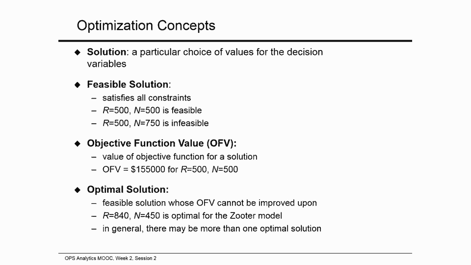

# 【沃顿商学院】商业分析 全套课程（客户、运营、人力资源、会计） - P41：[P041]02_optimizing-with-solver - 知识旅行家 - BV1o54y1N7pm

我是谢尔盖七号，我们开始第二次会议，操作分析课程第二周，在第一次会议上，我们看了Zooter的例子，资源分配问题，在这种情况下，有限的资源必须分配给两个相互竞争的产品，以最有利可图的方式。

我们确定了优化模型决策变量的三个主要组成部分，目标函数和约束，我们还写下了Zoa问题的代数公式，在本届会议上，我们将创建模型的电子表格公式。

并使用求解器优化工具找到最佳决策，好的，在第二次会议上，我们将采取一个代数模型，我们在第一次会议上放在一起，用电子表格术语表示，我们将使用求解器来优化它作为提醒，这是Zooter问题的代数模型。

我们的决策变量是要生产的剃刀滑板车的数量，和生产纳瓦霍滑板车的数量，目标函数，也就是利润的一百五十倍r，加上一百六十乘n，我们要最大化，现有资源的制约因素，正如我提到的，关于我们的决策变量。

求解器将是我们的首选武器，那么什么是求解器，求解器是一个标准，Excel在Windows上添加，它可以在Excel for Mac的更高版本上使用，如果你使用Mac，我们有一个链接为您解释细节。

如果你使用谷歌工作表，求解器的一个版本作为所谓的Add on可用，好的，这是我的Excel模板缩放器，下划线零，它发布在我们的网站上，所以你现在可以打开它，按照步骤操作，我在这里经历零版本。

我们已经输入了问题数据，并将其粘贴到代数模型的副本中，所以比较起来比较容易，在代数公式和电子表格公式之间，我们将一步一步地建立模型，然后我们将使用求解器为Suter找到最佳的生产计划，看这个例子。

我们将在Windows平台上使用Excel 213，如果你用的是Mac或谷歌工作表，取而代之的是，你还是要看台阶，我们在这里跟随，首先在我们建立模型之前，让我们找出在哪里找到求解器。

所谓的Excel求解器添加，我们在Excel 213上，然后这个版本的Excel求解器位于选项卡下，在抽头的部分中调用数据，称为分析，这是我的求解器按钮，如果你的设置和我一样，你看到那里的银按钮。

你可以走了，如果你没有看到银色按钮，那么您应该转到文件选项，加进去，在底部写着，管理Excel，添加ins，你点击去，并且要确保检查了求解器外接程序，你点击确定，在Excel的早期版本中。

求解器应该出现在Data选项卡下，你需要采取的步骤可能不同，但在任何情况下，请记住求解器是一个Excel，查找外接程序在Excel版本中的位置，并确保选择了求解器，好的，我们还没准备好建立我们的模型。

对于第一个示例，我们将非常详细地进行，以确保我们涵盖了模型设置的每个重要方面，和求解器功能，现在我们需要将代数模型转换为电子表格公式，换句话说，我们需要在电子表格上描述优化模型的三个关键组件，决策变量。

目标函数和约束，让我们从Zoa问题中的决策变量开始，我们有两种产品，剃刀和纳瓦霍滑板车，所以说，让我们创建细胞，它将保存值，将生产的每种类型的滑板车的编号，假设我们为此选择C10和D10单元格，c。

n将持有要生产的剃刀滑板车数量的值，这是决策变量的值，R和D 10将保留给纳瓦霍滑板车的数量，即决策变量n的值，让我们把头部放在A单元格中10个单位来制作，让我们在单元格C10和D10中添加一些试验值。

以确保这些单元格不是空的，让我们考虑每种滑板车生产500台，最后一件事，让我们使用蓝色和粗体突出显示决策变量单元格，通过在他们周围放一个框架，当然啦，你是否做这个点缀完全取决于你，不会影响优化。

但如果你这么做了，决策变量将很容易识别，Excel文件一打开，这将使您的文件更容易导航，所以我们定义了单元格来保存我们的决策变量值，稍后我们将把单元格指向求解器。

并要求求解器更改单元格C10和D10中的值，确定最佳的生产计划，好的，我们已经完成了决策变量，现在准备好了目标函数，这个模型中的目标是总利润，所以我们应该能计算出苏特将获得多少利润，决策变量的任意值。

现在，让我们计算并记录利润值，与每个型号五百台的生产计划相对应，让我们选择单元格F10来保存目标函数的值，这是F10单元格中的总利润值，我们将编写一个公式来计算总利润的价值。

我们从质量标志开始告诉卓越队我们在细胞中有一个公式，现在，每辆500辆剃刀滑板车，Zooter得到150美元，所以我们乘以一百五十，在这个价值上我们必须加上纳瓦霍滑板车的利润，那是一百六十。

所以总共是十五万五千美元，所以我们有一个目标函数的公式，因此，这个公式将计算任何决策变量选择的总利润值，比如说，如果我们尝试一个，比如六百把剃须刀和六百把纳瓦霍人。

F10中的数字立即改变以反映新的利润值，所以让我们回去把它换成五百，顺便说一句，如果您想查看特定单元格中的公式或编辑该公式，您可以使用Windows快捷方式f 2，所以我们在牢房里。

这里我们看到了这个问题中目标函数的公式，我们有两个决策变量，利润值的计算涉及到添加两个产品，剃刀滑板车数量的乘积，以及每辆剃刀滑板车的利润贡献，和纳瓦霍滑板车数量的乘积，以及每辆纳瓦霍滑板车的利润贡献。

但是如果我们的问题包含一千个决策变量呢，我们还得把利润公式写成一千种产品的总和吗？每个决策变量一个，幸好不是，Excel函数求和产品允许我们使用一种速记符号，在这种情况下。

下面是两个滑板车模型的求和乘积的工作原理，我们在F10牢房里，让我们用它的等价物来代替当前的利润公式，使用一些产品功能，所以我们打字，c九项和d九项利润贡献，c10和d10是决策变量。

求和乘积函数使用两个大小相等的单元格区域，并将第一个数组中的数字乘以第二个数组中的相应数字，第一个数组中的第一个数乘以第二个数组中的第一个数，第一个数组中的第二个数乘以第二个数组中的第二个数，等等。

之后呢，求和乘积简单地将所有这些乘积相加，所以公式总和C9D9，C10和公式C9乘以C10完全一样，加d九乘d十，你会得到同样的优化结果，不管你用哪一个，然而，和积公式方便多了。

当处理具有大量变量和大量约束的模型时，您可以在Excel帮助中找到有关求和乘积函数的更多信息，好的，关于目标功能细胞的最后一件事，就像我们对决策变量单元格所做的那样，让我们突出目标函数单元格。

以确保它在视觉上脱颖而出，让我们将字体颜色更改为红色，并使字体粗体，所以我们要把颜色换成红色，把手机加粗加上粗边框每次我们打开文件的时候，我们看到蓝色的决策变量细胞和红色的目标功能细胞。

所以这些细胞在视觉上可以与其他细胞区分开来，后来，我们将指示求解器更改蓝色单元格中的值，c十和d十，我们的决策变量值最大化红细胞中的值，十分，我们的目标函数值，当然啦。

我们不能只使用蓝色单元格中的任何值，但只限于那些不需要比我们现在拥有的更多资源来生产的，我们已经完成了决策变量和目标函数，是时候进入约束了，我们模型中的主要约束，表示三种生产资源的有限可用性。

框架制造时间，我们将在甲板集合时间，包装时间和Q A，让我们先来看看我们的框架制造，我们需要确保我们考虑的任何生产计划，本计划使用的框架制造小时数，不超过代数公式中可用的框架制造小时数。

生产计划使用的框架制造小时数，用决策变量r和n描述等于4乘以r加5乘以n，可用小时数是五千六百一十小时，在我们的电子表格配方中，cell g，十四持有可用的框架制造小时数的价值五千六百一十个。

让我们用细胞E，14以单元C计算生产计划所需的框架制造小时数，十和十方便，让我们把所需的时间写在十三个以上十四个单元格里，好的，我们还有两个约束要转换为电子表格格式，对车轮数量和甲板装配时间的限制。

以及对Q A和包装小时数的限制，如果你看看这些约束的代数公式，您会注意到两者的结构与约束的结构非常相似，我们已经处理过了，框架制造小时数的限制，所有三个约束都具有以下结构表达式，在约束的左手边。

所需小时数不能超过，在约束的右手边，可用小时数，我们去15号牢房，输入公式计算车轮数和甲板组装时间，单元格C10和D10中的任意对决策变量所需的，就像对所需框架制造小时数的类似计算一样。

我们需要将每个决策变量乘以车轮数和甲板组装时间，相应的滑板车模型使用并添加结果产品，换句话说，我们放入15号单元格的公式是c的乘积，十十和十五十五，用于生产计划，我们目前正在考虑每款滑板车500辆。

我们需要的车轮和甲板制造时间是1750小时，同样地，如果我们用E16单元格计算Q的个数，a和C10和D10单元生产计划所需的包装时间，我们会把公式和乘积，的c和d十和c十六d十六。

我们看到目前的生产计划需要900小时的资源，好的，但如果我们有成千上万种不同的资源来跟踪呢，我们必须继续进入e列中的单元格吗，一个接一个地键入求和乘积公式，幸运的是。

Excel提供了一种通过使用复制和粘贴来避免这种情况的方法，和所谓的绝对单元格引用或单元格锚定，让我们比较单元格E中的公式，14到单元格E 15和E 16中的公式，再来一次。

这三个公式都使用决策变量单元格C10和D10的和积，这是14号细胞的分子式，以及该单元的每种资源的消耗量c 14和d 14，c十五和d十五，15号牢房和16号牢房，所以如果我们在14号细胞中取一个公式。

复制并粘贴到E 15和E 16单元格中，我们需要指示Excel离开C10和D10，在此复制和粘贴操作期间不变，并改变C14和D14，变成c十五和d十五，变成C16和D16。

实现这一点的方法是使用绝对单元格引用，或者为C10和D10细胞出售锚定，在执行常规的Excel复制粘贴操作之前，以下是我们如何实现这一点，我们进入14号牢房，我们突出C10和D10细胞。

我们使用Windows快捷方式f 4，在C10和D10单元格的地址周围贴上美元标志，那些美元分配，指示Excel不要更改单元格的地址，复制粘贴时，如果我现在只复制并粘贴E14中的公式。

变成E十五和E十六，我在那些单元格里得到了正确的公式，所以我在复制和粘贴，比如说，如果我现在看细胞，十六岁，我看到了C10和C16和D16的公式和乘积，这是正确的公式，很明显使用这种锚定技术。

我可以简单地键入一个资源消耗的公式，把它弯曲成我想要的任何细胞，在这种情况下，决策变量单元格，然后将公式复制并粘贴到所有单元格，计算所有其他资源的消费量，这并不重要，如果我有数百个这样的。

我仍然可以在一次复制粘贴操作中完成所有工作，您可以使用Excel帮助了解有关绝对单元格引用的更多信息，让我们也用一个视觉提示来表明我们想要的，呃，在优化中，单元格E中的值，十四，e，十五，和e，十六。

小于或等于单元格中的值g，十四，g，十五，和g，十六，所以我们在这里放小于或等于符号，这只是一个视觉上的点缀，以确保我们可以在一个简单的，呃态度，好的，我们创建了保存决策变量值的单元格。

目标函数与资源消耗值，我们将如何找到最佳的生产计划，总之，我们想找到单元格C10和D10中的值，我们的决策变量单元格，使单元格中的值f 10，我们的目标功能细胞尽可能大，同时确保E14中的值。

e十五和e十六不超过g十四中的值，十五和十六，分别是，那些是资源限制，比如说，如果我们每种型号生产500台，我们以150英镑的利润赚取，五千美元，正如Excel告诉我们的那样。

我们所有的资源消耗值都在允许的范围内，嗯，我们可以通过增加产量来赚更多的钱吗？让我们试着生产500辆剃刀滑板车，但是有750辆纳瓦霍滑板车，我们的利润跃升至十九万五千美元。

但不幸的是我们用完了车架制造和车轮和甲板装配资源，所以我们不能简单地执行这个生产计划，现在让我们小声点说，六百纳瓦霍人，呃，滑板车，所以我们的利润下降到171000美元。

我们所要求的小时数保持在允许的范围内，这样我们就可以不断检查决策变量的不同值，试图提高利润，在资源限制内，问题是如果我们试图手动操作，我们可能会花大量的时间来检查各种可能性，即使这样。

我们也可能找不到最好的生产计划，尤其是当我们必须处理许多决策变量时，这就是求解器的用武之地，任何人都不可能检查所有可能的替代方案，仅仅因为可能有这么多的选择，求解器，虽然，做一个快得多的。

更彻底地检查这些替代方案，试图想出最好的，所以让我们引入求解器，让我们去数据，单击求解器，求解器参数对话框出现在设置的目标部分中，我们点击单元格选择工具，选择单元格F10来表示我们的目标。

正如你所看到的，求解器可以最大化或最小化目标，如果您正在处理成本最小化的问题，最小化可能会有所帮助，或者它可以选择决策变量的值来产生目标函数的期望值，在UDA问题中，2。我们实现了利润最大化。

所以我们检查最大选项，我们通过改变变量单元格来指定决策变量在哪里，所以我们再次使用单元格选择工具指向单元格C10和D10，我们回到过去，我们看到卓越队现在了解我们的决策变量在哪里，最后。

我们需要指定以解决约束是什么，我们使用服从约束分开，然后点击，添加对话框，添加约束出现在此对话中，我们使用单元格引用来选择单元格E 14，约束左手边的E15和E16，我们还使用约束部分来选择值g 14。

在约束的右手边，所以现在我们指示求解器，以确保E14不超过G14，e十五不超过g十五，e十六不超过g十六，知道我们还可以指定等类型的约束，或更大或相等类型，这里还有其他选择，我们以后会用其中一个。

所以让我们选择我们的小于或等于，让我们点击确定，我们看到这个约束被添加，剩下的，正在增加约束，它告诉求解器我们的决策变量必须是整数且非负，让我们先添加整数约束，我们可以单击Add。

选择我们的决策变量到十和d十，然后在下拉菜单中选择I T选项选项，意思是整数，所以现在当我们点击好的，Excel求解器理解它必须只使用单元格中的整数值，当它寻找最佳生产计划时，好的。

最后一个约束是非负约束，和，求解器提供了一种引入此约束的方便方法，对于所有决策变量，同时，我们所需要做的就是勾选这个框，下一步使所有无约束变量非负，我们需要选择一种解法。

Silver在这里提供了几种选择，默认值为GRG非线性，其中一个选择是LP单工，这是一种溶剂法，只能应用于线性模型，换句话说，目标函数和IT约束为决策变量线性函数的模型。

所以如果您确定您的模型是作为线性模型构建的，使用此选项，因为它非常有效地求解线性模型，如果你的模型不是线性的，但是，您正在尝试使用LP SimpleX选项，求解者现在将在这次讨论中抱怨。

我想把重点放在建模过程的细节上，而不是线性模型和非线性模型之间的区别，所以我将溶剂法作为GRG非线性，这种求解方法非常通用，将允许您使用许多不同类型的模型，都是线性的，提醒一句。

如果选择Geog非线性方法，您不必担心您的模型是线性还是非线性，这是一件好事，因为它是解决优化问题的一般方法，它将试图为您制定的任何模型找到最佳解决方案，然而，它可能并不总是能够保证它找到的东西。

给你作为一个解决方案实际上是最好的选择在每种情况下，此外，用Geog非线性方法优化的输出，可能取决于决策变量的试验值，所以在使用这种方法进行优化时，用决策变量的不同试验值多次运行。

看看能不能提高目标函数值，好的，优化前的最后一站，让我们转到选项，并确保忽略整数约束，这边，我们真的要确保求解器不会试图产生像五个这样的东西，四六滑板车，我们准备找出最佳的生产计划，让我们点击解决按钮。

并确保Sola找到，一个解决方案显示在出现的对话框中，它确实，让我们点击确定并查看电子表格，求解器推荐，生产840台剃刀滑板车，和450辆纳瓦霍滑板车，如果UDA想实现利润最大化，考虑到资源。

公司有相应的利润价值是一百九十八，在我们离开之前，关于求解器消息的几句话，这一次求解器想出了消息，求解器找到了解决方案，这是我们想看到的信息，我想提到另外两条我们不想看到的信息。

假设我们在建立模型时犯了一个错误，并且忘记包括一个或多个重要的约束，让我们进入求解器对话框，消除我们所有的限制，然后尝试优化一个生产计划，所以我们在这里说删除，我们说删除，所以我们没有限制，那当然很傻。

但让我们试着解决这个模型，看看什么样的信息，求解器想出，银色出现了一个巨大的红色感叹号，并且消息目标单元格值不收敛，这意味着这个模型中的利润可以增长到无穷大，当你看到这样的消息，当试图优化您的模型时。

请记住，这很可能表明您忘记了一个重要的约束，这三个约束应该少一点，这三个值应该小于或等于这三个值，让我们在决策变量上添加整数约束，所以我们选择这个，我们点击整数，我们回来了，让我们点击解决。

以确保我们把一切都做对了，这是最优解，好了，现在，让我们添加一个约束，这将使求解器无法找到决策变量的值，这将满足问题中的所有约束，比如说，现在我们想要生产计划使用的框架制造小时数，不超过五千六百一。

假设我们有一个约束，这也要求使用的制造框架制造小时数至少为6000个，当然啦，这两个约束不能同时满足，但是，让我们看看当我们试图求解模型时，求解器告诉我们什么，添加此约束后，所以我们要解决，我们在说。

让我们添加这个约束，让我们说，框架制造所需的小时数应至少大于或等于，然后呢，它与它们的其他约束是不兼容的约束，但让我们看看Sola反应会是什么，我们点击解决，银色出现了另一个红色的感叹号。

以及它找不到可行解决方案的信息，换句话说，它不能同时满足所有的约束，所以当我们看到这些信息中的一个，我们的模型有问题，在第一条消息的情况下，我们可能忽略了一个重要的约束，给定我们试图优化的目标函数。

或者在第二条消息的情况下，我们有一些不兼容的约束，让我们把我们的模型恢复到它的区域状态，再解决一次，确保一切都好，让我们删除这个虚假的约束，让我们点击解决，开始了，我们有了最优解，这最后的电子表格。

其中的注释反映了，我们介绍的公式以Uter的名字发布在我们的网站上，好的，下面是带有公式的优化电子表格的图片，我们有最好的解决方案，八百四十把剃刀和四百五十名纳瓦霍人，和尽可能好的利润，十九万八千美元。

好的，让我们回顾一下一些优化术语，决策变量值的特定组合称为解，一个可行的解决方案是满足所有约束的解决方案，不可行的解决方案是违反至少一个约束的解决方案，不管是哪个，目标函数值是一个数字，你将获得。

如果将与特定解对应的决策变量值插入目标函数，最后，在Zooter情况下，最优解是最佳可行解，是840辆剃刀滑板车，和四百五十辆纳瓦霍滑板车，有可能有不止一个最优解，但在这种情况下。

任何最优解都会产生相同的目标函数值，这次会议中最好的一个。

我们已经使用求解器优化工具设置，并解决缩放优化问题，在做这个的时候，我们学到了两种方法，在设置电子表格优化模型时通常很有用，在Excel中，求和乘积函数的使用，以及单元格锚定或绝对单元格引用的使用。

而在不同的平台上，求解操作的细节可能略有不同，比如说，windows与mac，优化过程的主要特征大致相同，特别是，我们必须为求解器确定优化模型的三个主要组成部分，决策变量，目标函数。

如果你在Mac或谷歌工作表上使用Excel，看看我们为你制作的两个简短的视频，看看一些微小的差异，以及如何设置和解决优化问题，Zooters问题有两个决策变量和三个资源约束。

实际的资源分配应用程序可能包含数十万个变量和约束，或更多，当然啦，索罗将无法处理如此大的问题，但是，商业优化软件包，功能强大，足以处理这种规模的问题，仍将使用决策变量进行操作，目标函数和制约因素。

就像求解器一样，Zoother问题是一个资源定位示例，我们将研究另一种流行的优化问题，在这种情况下，供应必须满足整个地点网络的需求。
