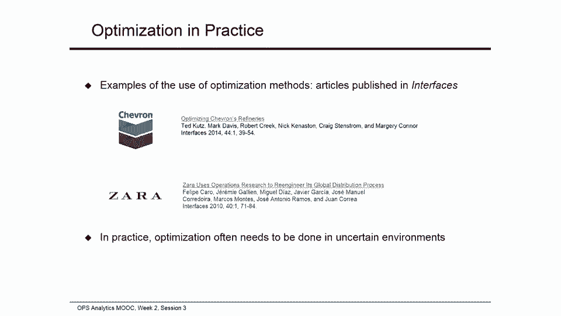

# 【沃顿商学院】商业分析 全套课程（客户、运营、人力资源、会计） - P42：[P042]03_network-optimization-example - 知识旅行家 - BV1o54y1N7pm

我是谢尔盖七号，欢迎回到第二周的运营分析课程，在第二次会议上，我们已经学习了如何设置和解决优化问题，以用于求解器，作为一个例子，我们在这个会话中使用了一个资源分配问题。

我们将查看另一个经常遇到的业务设置，其中可以使用优化工具包来做出最佳决策，它是一个网络设置，需求和供应分布在一个地点网络中的环境，目标是确保需求和供应以尽可能低的成本匹配。

让我们来看看第二部分，在这个会话中，我们使用Zooter示例来设置和解决一个资源分配问题，我们将研究一种不同的优化，优化涉及位置网络的问题，下面是我们将要分析Keystone干货的业务上下文。

物流是为客户运送货物的公司，这个特殊的客户需要Keystone来运输粉末饮料，客户拥有的地点网络包括三个仓库和三个配送中心，这是仓库，这里是配送中心，所以这是完整的网络。

拱顶石必须从每个仓库运出一定量的粉末饮料，比如说，从芝加哥仓库出来，它必须移动整整20吨，所以这里有一个必须运出的东西的插图，从洛杉矶运出15吨，20吨从芝加哥运出30吨从纽约运出。

每个配送中心对必须接收的金额都有最低要求，比如说，至少十吨必须运到丹佛配送中心，下面的图片说明了这两种类型的需求，对必须从仓库运出的确切金额的要求，以及运送到配送中心的月份的最低要求，我们的运费很贵。

以下是Keystone将产生的成本，当将一吨粉末饮料从每个仓库运送到每个配送中心时，比如说，如果它试图从纽约市向奥斯汀运送10吨，每吨的运费是132美元，过路费是一百三十二乘十，一千三百二十美元。

这就是Keystone试图解决的问题，它正试图找出最便宜的运输货物的方法，同时确保一定数量的货物，一些最低数量被送到每个配送中心，所以让我们把这个问题的表述分成三个部分，什么样的决定必须是关键。

将金额从每个仓库运送到每个配送中心，Keystone有什么目标，它想把运输成本降到最低，它面临什么样的约束，仓库有供应限制，以及配送中心的需求限制，所以我们可以指定决策变量，目标功能和制约因素。

让我们从公司需要确定的决策变量开始，从每个仓库运多少钱，就像洛杉矶，芝加哥和纽约，到每个配送中心，和奥斯汀，所以让我们分配一个变量x l，D代表从洛杉矶到丹佛的船的金额。

另一个描述他们在从洛杉矶到奥斯汀的船上，第三个表示从洛杉矶到华盛顿的船的数量，dc，让我们再加上三个变量来指定从芝加哥到丹佛的货物，奥斯汀和华盛顿特区，让我们对从纽约到丹佛的货物也这样做吧。

奥斯汀和华盛顿，d，c，所以我们有三加三加三九决策变量，那么目标拱顶石呢，尝试选择决策变量值以使总运输成本尽可能小，所以如果我试着把一吨的从洛杉矶运到丹佛，这样一个决定的成本影响是什么，好的。

我从洛杉矶乘船到丹佛，每吨要花我一百零五美元。所以把L deons从洛杉矶运到丹佛，产生105倍xl d的成本贡献，并将XL吨从洛杉矶运往奥斯汀，产生135倍x a的成本贡献，用同样的方式。

从洛杉矶向华盛顿运送XLW吨，DC产生153倍xa的成本贡献，因此，目标函数有三个来自洛杉矶的货物的贡献，另外三个来自芝加哥，另外三个是从纽约运来的，现在，在供应限制的情况下，目标功能必须最小化。

在仓库和配送中心的需求限制，好的，这里有一个关于供应限制的提醒，Keystone必须从每个仓库运送准确的数量，比如说，洛杉矶仓库的所有货物，去丹佛或华盛顿特区，或者奥斯汀加起来必须有15吨。

所以洛杉矶仓库的供应限制是这样的，用同样的方式，所有从芝加哥运来的货物加起来必须达到20吨，最后，所有从纽约运来的货物加起来必须达到30吨，总而言之，我们对洛杉矶的供应有限，芝加哥和纽约，需求限制呢。

这里有一个提醒，每个配送中心的要求是什么，让我们从丹佛配送中心开始，丹佛必须接收至少10吨，下面是这个约束的样子，奥斯汀中心必须接收至少13吨，最后华盛顿配送中心必须接收至少20吨。

以下是需求限制的摘要，我们有一个去丹佛的，一个给奥斯汀，一个给华盛顿特区，把一切都放在一起，我们有一个九变量的代数模型，我们已经表达了目标函数，根据这九个变量计算的总运输成本。

我们还把供应约束和需求约束的表达式放在一起，现在我们还必须保证发货量不是负数。我们没有必要将装运数量限制为整数。因为有可能运送少量，比如说，十二点，现在我们已经为Keystone问题建立了一个代数模型。

我们可以去卓越，建立此模型的电子表格公式，并使用求解器找到最优的运输计划，我们现在就做吧，我们为您准备了一个名为Keystone下划线零的模板，去吧，使用它，并按照我们在建立模型时所经历的步骤进行操作。

好的，下面是我们的Excel模板Keystone下划线零，如您所见，电子表格包含Keystone示例的数据，但没有一个公式，我们将需要找到最好的解决方案，如UDA示例中所示。

我们必须将代数优化模型转换为电子表格公式，为了完成这项任务，我们将在电子表格上定义优化模型的三个组件，决策变量，目标函数和约束，让我们从这个问题中的决策变量开始，决策变量是运送粉末饮料的数量。

在每个仓库和每个配送中心之间，有三个仓库和三个配送中心，所以我们的模板中有九个决策变量，我们有九个细胞，B 12到D 14有标题装运数量，让我们用这些单元格来表示决策变量的值。

就像我们在Zooter示例中所做的那样，让我们在这些细胞中放入一些试验值，说，让我们在这九个细胞中的每一个细胞中放入十个，从每个仓库运送10吨到每个配送中心，当然不是一个可行的解决办法，比如说。

仓库总共需要运出30吨，它只有十五个，但是没关系，就目前而言，我们放入每个决策变量中的数字，只是试用值也是如此，求解器以后将能够更改这些值，好的，我们定义了决策变量单元格，让我们把它们涂成蓝色。

并使字体粗体，就像我们在Suter例子中对决策变量单元格所做的那样，下一个目标函数单元，在本例中，目标是总运费，我们想尽量减少这一目标，如模板所示，让我们用F3细胞作为目标功能细胞。

那么我们如何计算由运输计划产生的整个运输成本呢，在决策变量单元格中，4。我们应该把九批货物中的每一批都乘以相应的运费，从B6D8单元格中，然后加入这九个乘积，灵魂听起来像是决策变量和相应成本值的总和。

让我们看看在这种情况下如何使用求和乘积公式，在F3牢房里，我们输入决策变量单元格的一些乘积，和相应的成本值b，根据Excel的结果是1万1千5百70美元，所以我们有目标功能细胞。

让我们把字体改成粗体和红色，就像我们在Zooter案例中对目标函数所做的那样，现在我们转移到Keystone问题中的约束，主要有六个制约因素，三个供应制约因素，每个仓库一个，三个最低需求限制。

每个配送中心一个，让我们从供应限制开始，第一供应约束，声明，从洛杉矶仓库装运的总量必须正好等于15吨，我们去12号牢房，并计算从A仓库发货的总金额，根据我们的试用装运计划。

我们需要把从仓库到每个配送中心的货运量加起来。所以我们派了12班的人去丹佛，结果是三十吨，现在我们可以对剩下的两个仓库做同样的计算，我们只需将公式复制粘贴到单元格E中，十二到单元格E，13和e，十四。

如您在试用装运计划下所看到的，我们认为每个仓库的出货量是30吨，那肯定是不可行的，但我们以后再让求解器担心这个，接下来，我们处理每个配送中心的最小需求约束，它必须收到一个最低金额。

让我们从丹佛配送中心开始，让我们在B15单元格中计算这个分配将获得的总金额，根据目前的装运计划，我们在计算每个仓库发往丹佛的货运量，b十三和b十四，答案是三十吨。

我们可以对剩下的两个配送中心做同样的计算，我们所要做的就是复制粘贴b15中的公式，到牢房c十五和d十五，这是，比如说，我们现在在D15中拥有的，它把运往华盛顿的货运量加起来，来自芝加哥和纽约。

我们已经指定了决策变量，目标函数与约束条件，我们准备调用求解器，我们去数据，我们点击求解器，让我们首先显示目标函数在哪里的求解器，它在三号牢房里，这一次我们想最小化这个函数，换句话说。

我们希望尽可能降低运费。下一个，我们指定决策变量在哪里，它们位于牢房里，最后是约束，供应限制表明，无论我们选择运送多少，每个仓库的装运总额必须正好等于我们指定的金额，所以我们点击。

相加并告诉求解器单元格E中的数字，十二至五，14必须与单元格g中的数字完全相等，十二，g十四，最小需求约束规定每个配送中心得到的不能少于所需的，因此我们点击，再次声明单元格中的数字b十五。

D15必须大于或等于单元格中指定的值，我们不需要指定装运金额为整数，我们可以在一个特定的仓库和一个特定的配送中心之间运送9-4吨，如果我们选择，检验决策变量选择的非负性，我们离开求解器方法。

因为它是GG非线性的，我们点击解决，这是我们的最优解，这是优化的电子表格的图片，我们可以看到，这里的最低成本是七千四百八十五美元，求解器是学习优化技术的有用工具，使用具有少量变量和约束的问题，然而。

实际尺寸问题可能会给求解者带来严重的挑战，幸运的是，有许多商业上可用的优化工具可以解决大问题，好消息是，无论您使用的是求解器还是商业优化工具，您仍然必须处理决策变量，目标函数和制约因素。

这里有一个链接到最近汇编的商业优化工具列表，一本名为Interface的杂志发表了关于分析技术的实际商业应用的文章，Interface文章是关于如何识别分析机会的实用知识的重要来源。

如何建立模型以及如何实现模型，这里我们选择两个例子，第一篇文章是关于炼油厂运营利润的优化，在人字形，世界上最大的综合能源公司之一，第二个是关于应用分析工具，包括世界领先的时尚零售商之一的优化，扎拉。

请记住，在实践中，分析项目可能经常涉及多种分析工具，特别是，优化可能需要与描述性和预测性相结合，像预测这样的分析工具，通常，最好的行动方针必须在非常不确定的环境中制定，我们将在第三周看到这样的设置。

手术的第二周就要结束了，和本周松懈的课程，我们关注的是一个优化工具包，它使我们能够在商业环境中找到最佳的行动方案，具有较低的不确定性，我们使用了一个代数公式，创建表达任何优化问题的简洁方式。

通过指定其决策变量，目标函数和制约因素，我们已经研究了代数模型应该如何转换为电子表格格式，以及如何将求解器用作识别最佳决策的工具，我们已经覆盖了，优化工具包如何应用于不同业务上下文的两个示例。

资源配置与网络优化，为了帮助您收集优化概念，准备第二周的家庭作业，我们准备了一个视频回顾会，其中我们将介绍与会话中介绍的优化示例类似的优化示例，这个视频回顾会完全是可选的。

如果您对到目前为止看到的优化示例感到满意，你可以继续练习问题，我们为您提供两个练习问题的解决方案，你可能想看看练习问题的一个特殊原因，我们要求你回答的问题类型。

与你们在第二周家庭作业中看到的问题非常相似，我们希望你在做家庭作业时会发现这些附加材料很有用，那么下一步是什么，还记得第一周的新供应商问题吗，也是为了做出最好的决定，但在商业环境中。

任何行动方针的影响不能肯定地确定，为了了解如何在这种情况下做出最好的决定，我们必须首先了解如何在不确定的情况下评估和比较决策，这将是我们课程第三周的主题。

