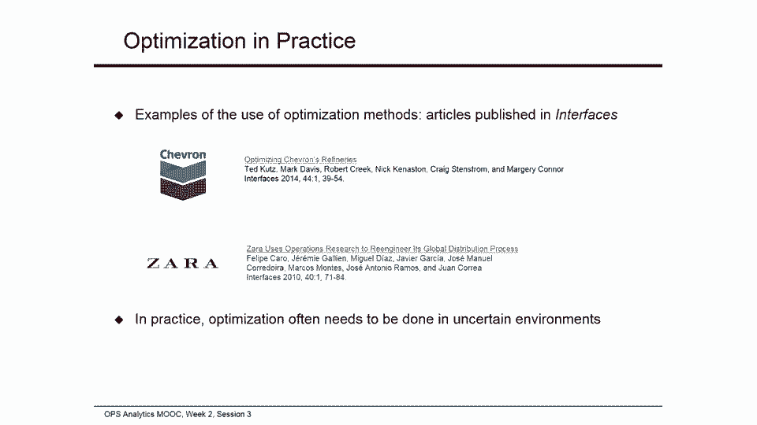

# 📦 课程名称：网络优化示例 - 运营分析 P42

## 概述


在本节课中，我们将学习如何运用优化工具解决网络环境下的业务问题。我们将通过一个具体的物流运输案例——Keystone干货公司的粉末饮料运输问题，来学习如何建立代数模型、将其转化为电子表格公式，并使用求解器找到成本最低的运输方案。

---

## 1. 问题背景与业务场景

上一节我们介绍了资源分配问题的优化方法。本节中，我们来看看另一种常见的业务场景：网络优化问题。

Keystone干货公司是一家物流公司，需要为客户运输粉末饮料。客户拥有一个由三个仓库（洛杉矶、芝加哥、纽约）和三个配送中心（丹佛、奥斯汀、华盛顿特区）组成的网络。

以下是该问题的具体数据：

*   **供应限制（必须运出的精确数量）**：
    *   洛杉矶仓库：15吨
    *   芝加哥仓库：20吨
    *   纽约仓库：30吨
*   **需求限制（必须接收的最低数量）**：
    *   丹佛配送中心：至少10吨
    *   奥斯汀配送中心：至少13吨
    *   华盛顿特区配送中心：至少20吨
*   **运输成本（美元/吨）**：
    | 从 \ 到 | 丹佛 | 奥斯汀 | 华盛顿特区 |
    | :--- | :--- | :--- | :--- |
    | 洛杉矶 | 105 | 135 | 153 |
    | 芝加哥 | 87 | 117 | 165 |
    | 纽约 | 132 | 99 | 162 |

Keystone公司的目标是：**在满足所有供应和需求限制的前提下，找到总运输成本最低的运输方案。**

---

## 2. 建立代数优化模型

任何优化模型都包含三个核心部分：决策变量、目标函数和约束条件。以下是Keystone问题的代数模型构建过程。

### 2.1 决策变量

决策变量是公司需要做出的具体决定。在本问题中，即从每个仓库运送到每个配送中心的货物数量。

我们定义9个决策变量：
*   `x_ld`: 从洛杉矶运往丹佛的吨数
*   `x_la`: 从洛杉矶运往奥斯汀的吨数
*   `x_lw`: 从洛杉矶运往华盛顿特区的吨数
*   `x_cd`: 从芝加哥运往丹佛的吨数
*   `x_ca`: 从芝加哥运往奥斯汀的吨数
*   `x_cw`: 从芝加哥运往华盛顿特区的吨数
*   `x_nd`: 从纽约运往丹佛的吨数
*   `x_na`: 从纽约运往奥斯汀的吨数
*   `x_nw`: 从纽约运往华盛顿特区的吨数

### 2.2 目标函数

目标是**最小化总运输成本**。总成本是每一条运输路径（仓库->配送中心）的运输量乘以单位成本后的总和。

**目标函数公式**：
```
Minimize Z = 105*x_ld + 135*x_la + 153*x_lw +
             87*x_cd + 117*x_ca + 165*x_cw +
             132*x_nd + 99*x_na + 162*x_nw
```

### 2.3 约束条件

约束条件分为供应约束和需求约束。

以下是供应约束（每个仓库运出的总量必须等于其供应量）：
*   洛杉矶：`x_ld + x_la + x_lw = 15`
*   芝加哥：`x_cd + x_ca + x_cw = 20`
*   纽约：`x_nd + x_na + x_nw = 30`

以下是需求约束（每个配送中心接收的总量必须至少达到其最低要求）：
*   丹佛：`x_ld + x_cd + x_nd >= 10`
*   奥斯汀：`x_la + x_ca + x_na >= 13`
*   华盛顿特区：`x_lw + x_cw + x_nw >= 20`

此外，所有运输量必须为非负数：`所有 x >= 0`。我们不需要限制为整数，因为可以运输小数吨位（如12.4吨）。

---

## 3. 在Excel中实现模型并求解

现在，我们将代数模型转换为Excel电子表格，并使用“规划求解”工具找到最优解。

### 3.1 设置决策变量

在Excel模板中，我们用单元格区域 `B12:D14` 来代表9个决策变量。初始可以填入任意试验值（如全部填10）。

### 3.2 计算目标函数

总运输成本（目标函数）在单元格 `F3` 中计算。我们使用 `SUMPRODUCT` 函数将决策变量区域 (`B12:D14`) 与对应的单位成本区域 (`B6:D8`) 相乘并求和。
**公式示例**：`=SUMPRODUCT(B12:D14, B6:D8)`

### 3.3 设置约束条件

以下是计算约束的步骤：

1.  **供应约束计算**：
    *   在单元格 `E12` 计算洛杉矶的总运出量：`=SUM(B12:D12)`
    *   将公式复制到 `E13` (芝加哥) 和 `E14` (纽约)。
    *   对应的供应量数据在 `G12:G14`。

2.  **需求约束计算**：
    *   在单元格 `B15` 计算运抵丹佛的总量：`=SUM(B12:B14)`
    *   将公式复制到 `C15` (奥斯汀) 和 `D15` (华盛顿特区)。
    *   对应的最低需求量数据在 `B16:D16`。

### 3.4 调用规划求解

1.  点击“数据”选项卡中的“规划求解”。
2.  **设置目标**：选择目标单元格 `$F$3`，并选择“最小值”。
3.  **通过更改可变单元格**：选择决策变量区域 `$B$12:$D$14`。
4.  **添加约束**：
    *   供应约束：`$E$12:$E$14 = $G$12:$G$14`
    *   需求约束：`$B$15:$D$15 >= $B$16:$D$16`
    *   非负约束：`$B$12:$D$14 >= 0`
5.  选择求解方法为“非线性GRG”，然后点击“求解”。

求解器将给出最优运输方案。在本例中，**最低总运输成本为7,485美元**。

---



## 4. 优化工具的实际应用与扩展

求解器是学习优化技术的有用工具，适用于变量和约束较少的问题。然而，实际业务中的大规模问题可能需要更强大的商业优化软件。无论使用何种工具，建模的核心——定义决策变量、目标函数和约束——是相同的。

在实践中，分析项目经常需要结合多种工具。例如，优化决策通常需要与预测性分析相结合，因为在不确定的环境下制定最佳行动方案至关重要（这将是第三周课程的主题）。

---

## 总结


本节课中，我们一起学习了网络优化问题的解决方法。我们通过Keystone公司的物流案例，完整经历了从理解业务背景、建立代数优化模型、到在Excel中实现并求解的整个过程。我们明确了优化模型的三个核心要素：**决策变量**、**目标函数**和**约束条件**，并掌握了使用规划求解工具寻找最优解的基本技能。这为我们解决更复杂的业务优化问题奠定了坚实的基础。