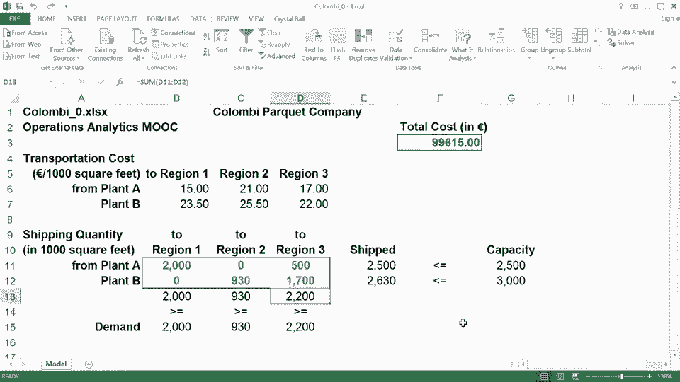

# 课程名称：运营分析 - 第二周复习课 (P043) 📚

## 概述

在本节复习课中，我们将通过两个具体的例子来巩固对优化工具包的理解。我们将学习如何将现实中的资源分配和网络管理问题转化为数学模型，并使用Excel求解器找到最优解。课程内容完全可选，旨在帮助您为本周的作业做好准备。

---

## 资源分配问题 🧱

上一节我们介绍了优化问题的基本框架，本节中我们来看看一个具体的资源分配案例。

一个联合国机构计划为自然灾害灾民建造住房。考虑四种住房单元类型：A、B、C、D。每种类型需要消耗不同数量的砖块、铁皮、木杆和劳动时间，并能容纳不同数量的人口。机构的目标是在有限资源下，决定建造每种单元的数量，以容纳尽可能多的人。

### 问题建模步骤

以下是构建该问题数学模型的步骤：

1.  **定义决策变量**
    我们需要决定每种类型住房的建造数量。
    *   `n_a` = 建造A型单元的数量
    *   `n_b` = 建造B型单元的数量
    *   `n_c` = 建造C型单元的数量
    *   `n_d` = 建造D型单元的数量

2.  **建立目标函数**
    目标是最大化受庇护的总人数。
    **公式：** `Maximize Z = 7*n_a + 6*n_b + 5*n_c + 7*n_d`

3.  **列出约束条件**
    所有资源消耗不能超过可用总量。
    *   **砖块约束：** `400*n_a + 600*n_b + 400*n_c + 300*n_d <= 5,000,000`
    *   **铁皮约束：** `20*n_a + 10*n_b + 25*n_c + 18*n_d <= 100,000`
    *   **木杆约束：** `3.5*n_a + 3.2*n_b + 2.6*n_c + 3.0*n_d <= 5,000`
    *   **劳动时间约束：** `300*n_a + 200*n_b + 200*n_c + 400*n_d <= 1,500,000`
    *   **非负与整数约束：** `n_a, n_b, n_c, n_d >= 0` 且为整数。

### 在Excel中求解

在提供的模板 `housing_relief_0.xlsx` 中：
*   决策变量 (`n_a`, `n_b`, `n_c`, `n_d`) 放入单元格 `C5:F5`。
*   目标函数公式放入单元格 `H5`，例如 `=SUMPRODUCT(C5:F5, C6:F6)`。
*   资源需求公式放入单元格 `G10:G13`，使用 `SUMPRODUCT` 计算。
*   在“求解器”中设置：目标为最大化 `H5`，可变单元格为 `C5:F5`，添加约束（资源需求 `<=` 可用资源，且变量为整数）。
*   求解后，最优解显示应主要建造B型和D型单元，以在资源限制内容纳最多人口。

---

## 网络优化问题 🚚

了解了资源分配问题后，我们接下来看一个网络优化问题，它涉及从多个供应点向多个需求点运输货物。

一家哥伦比亚拼花地板公司在A、B两地有工厂，需要向1、2、3三个销售区域运输硬木地板。每个工厂有产能上限，每个区域有最低需求。目标是在满足产能和需求的前提下，最小化总运输成本。

### 问题建模步骤

以下是构建该网络优化模型的步骤：

1.  **定义决策变量**
    我们需要决定从每个工厂运往每个区域的数量。
    *   `x_a1` = 从工厂A运往区域1的数量（千平方英尺）
    *   `x_a2` = 从工厂A运往区域2的数量
    *   `x_a3` = 从工厂A运往区域3的数量
    *   `x_b1` = 从工厂B运往区域1的数量
    *   `x_b2` = 从工厂B运往区域2的数量
    *   `x_b3` = 从工厂B运往区域3的数量

2.  **建立目标函数**
    目标是最小化总运输成本。
    **公式：** `Minimize Cost = 2.5*x_a1 + 3.0*x_a2 + ... + 2.5*x_b3` （系数为对应运输单价）。

3.  **列出约束条件**
    *   **供应（产能）约束：**
        *   工厂A总运出：`x_a1 + x_a2 + x_a3 <= 2500`
        *   工厂B总运出：`x_b1 + x_b2 + x_b3 <= 3000`
    *   **需求约束：**
        *   区域1总运入：`x_a1 + x_b1 >= 2000`
        *   区域2总运入：`x_a2 + x_b2 >= 930`
        *   区域3总运入：`x_a3 + x_b3 >= 2200`
    *   **非负约束：** 所有 `x >= 0`。

### 在Excel中求解

在模板 `columbia_0.xlsx` 中：
*   决策变量 (`x_a1...x_b3`) 放入单元格 `B11:D12`。
*   目标函数（总成本）公式放入单元格 `F3`，使用 `SUMPRODUCT` 计算。
*   计算每个工厂总运量（`E11`, `E12`）和每个区域总收量（`B13:D13`）。
*   在“求解器”中设置：目标为最小化 `F3`，可变单元格为 `B11:D12`，添加约束（工厂运出 `<=` 产能，区域运入 `>=` 需求）。
*   求解后，得到最优运输方案，实现了最低的总运输成本。

---

## 总结 🎯

本节课中我们一起学习了两个重要的优化模型应用。
*   在**资源分配问题**中，我们学会了如何在多种资源限制下进行产品组合决策，以最大化总体效益（如庇护人数）。
*   在**网络优化问题**中，我们掌握了如何建模并解决从多供应点到多需求点的运输问题，以最小化物流成本。

这两个例子展示了优化工具包在解决实际运营问题中的强大能力。核心步骤始终是：**定义决策变量 -> 建立目标函数 -> 列出所有约束条件 -> 利用工具（如Excel求解器）求解**。希望本次复习能帮助您更好地理解这些概念，并顺利完成相关练习。