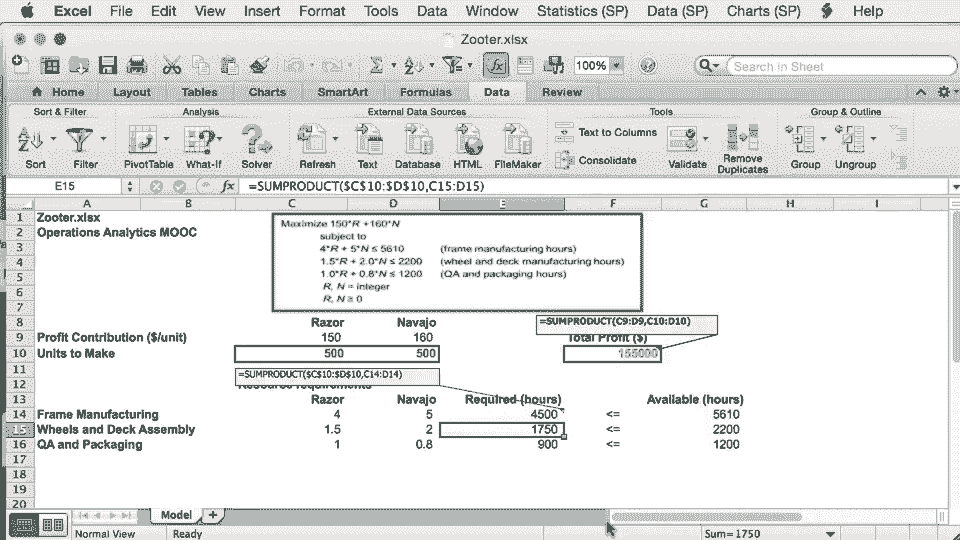

# 课程名称：沃顿商学院商业分析全套课程 - P44：Mac系统下的Solver求解器使用教程 🍎

在本节课中，我们将学习如何在Mac系统的Excel中设置和使用Solver（求解器）工具来解决优化问题。我们将重点介绍Mac与Windows平台在操作上的关键差异，并一步步演示如何配置和运行Solver。

---

## 概述 📋

本教程基于沃顿商学院商业分析课程的第44节内容，专门针对Mac用户。我们将探讨在Mac版Excel中定位、设置Solver工具的方法，并指出其与Windows版本在快捷键和操作界面上的主要区别。通过一个简单的缩放问题示例，我们将演示完整的求解过程。

---

## Mac与Windows的Solver设置差异 🔧

在上一节的主视频中，我们学习了在Windows平台Excel 2013中设置和解决优化问题。本节中，我们来看看在Mac系统上需要进行哪些调整。

首先，确保已在Mac版Excel中打开了示例电子表格。该表格包含一个试验性解决方案（例如，两个变量均为500），以及目标函数和资源使用量的所有计算公式。

---

## 定位并加载Solver工具 🧩

Solver是Excel的一个加载项。在Mac上，你需要通过以下步骤找到并启用它：

1.  点击顶部菜单栏的 **“工具”**。
2.  选择 **“加载项”**。
3.  在弹出的对话框中，确保 **“Solver”** 已被勾选。

启用后，Solver可能会出现在“工具”菜单下，或者更常见的是，出现在 **“数据”** 选项卡中，你会看到一个名为 **“求解器”** 的按钮。

---

## 关键快捷键差异 ⌨️

在调用Solver之前，了解Mac与Windows在Excel操作上的几个关键快捷键差异非常重要。以下是两个最常用的区别：

*   **显示/编辑单元格公式**：在Windows上，我们使用 `F2` 键。在Mac上，相应的快捷键是 `Control + U`。
    *   **示例**：选中利润公式所在的单元格F10，按下 `Control + U` 即可显示并编辑其中的公式。
*   **切换单元格引用类型（绝对/相对引用）**：在Windows上，我们使用 `F4` 键。在Mac上，相应的快捷键是 `Command + T`。
    *   **示例**：选中单元格E14，用 `Control + U` 显示公式后，高亮决策变量单元格C10和D10的引用，然后反复按 `Command + T` 可以在绝对引用（如 `$C$10`）和相对引用（如 `C10`）之间切换。

---

## 配置并运行Solver求解 🚀

现在，让我们开始使用Solver。从 **“数据”** 选项卡中点击 **“求解器”** 按钮。

可以看到，Mac上的Solver对话框与Windows版本几乎完全相同。我们需要按照以下步骤进行配置：

1.  **设置目标**：指定目标函数所在的单元格。
2.  **选择变量**：指定代表决策变量的单元格范围。
3.  **添加约束**：点击“添加”按钮，输入所有的约束条件。
4.  **选择求解方法**：确保选择了正确的算法（例如，对于线性问题，选择“单纯线性规划”）。

在添加约束时，注意勾选 **“使无约束变量为非负数”** 选项（如果适用）。接着，点击 **“选项”** 按钮，确认设置无误，例如确保 **“忽略整数约束”** 未被勾选（如果你的问题需要整数解）。

完成所有配置后，点击 **“求解”** 按钮，Solver将开始计算并给出最优解。

---

## 总结 🎯

本节课中，我们一起学习了在Mac版Excel中使用Solver工具的核心步骤。我们了解了如何启用Solver加载项，掌握了Mac特有的快捷键（`Control + U` 编辑公式，`Command + T` 切换引用），并完整演练了配置约束、目标函数和最终求解的过程。尽管平台不同，但Solver的核心功能与操作逻辑在Mac和Windows上保持一致。