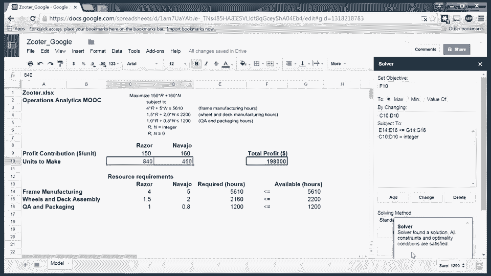

# 【沃顿商学院】商业分析 全套课程（客户、运营、人力资源、会计） - P45：[P045]06_optional-solver-in-google-sheets - 知识旅行家 - BV1o54y1N7pm

这段视频侧重于谷歌工作表上求解器的设置，你应该在看完第二次会议的主视频后再看这个视频，我已经上传了缩放问题的电子表格到谷歌表格，此电子表格反映了试用解决方案，每种滑板车500台，我也输入了所有的公式。

对于目标函数和谷歌工作表上使用的资源量，求解器是附加组件之一，为了加载求解器，我们需要去添加，单击搜索框中的获取添加类型求解器，当你找到它的时候，安装它，好的，在这里，我们有求解器出现在Add on下。

关于快捷方式的几个评论，在谷歌工作表上的特定单元格中显示和编辑公式的快捷方式，与F2窗口相同，所以如果我们去目标函数单元F10，我们可以使用相同的快捷方式显示和编辑它的内容，这同样适用于快捷方式f 4。

如果我们检查单元格E，可以用来施加绝对单元格引用，十四并突出显示决策变量单元格，我们可以通过重复按F来改变单元格在绝对和相对之间的地址，四，好的，让我们调用求解器，让我们选择Add ons求解器。

求解器对话框窗口出现在工作表的右侧，让我们在谷歌工作表中指定目标函数，首先转到电子表格上的目标函数单元格很方便，然后去设定的目标，所以现在我们选择了目标函数，我们对决策变量做同样的事情。

我们先突出C10和D10，然后通过改变盒子，C10和D10出现在那里，最终约束，我们先点击添加，然后我们突出单元格，e，十四，e，十六，然后到左手边，之后我们突出G14，g十六，然后往右边走，右手边。

然后点击，现在增加了约束，现在我们需要再次指定我们的决策变量是整数，我们点击添加，我们突出C10和D10，我们去左手边，然后在关系框中选择整数并单击确定，我们看到我们的约束是在溶剂法中添加的。

我们保持标准的GG非线性，因为它与我们在Windows上使用的JG非线性几乎相同，最后我们点击选项并确保，最后一个选项，确保我们的决策变量都是非负的，我们点击确定，然后我们点击，解决。

