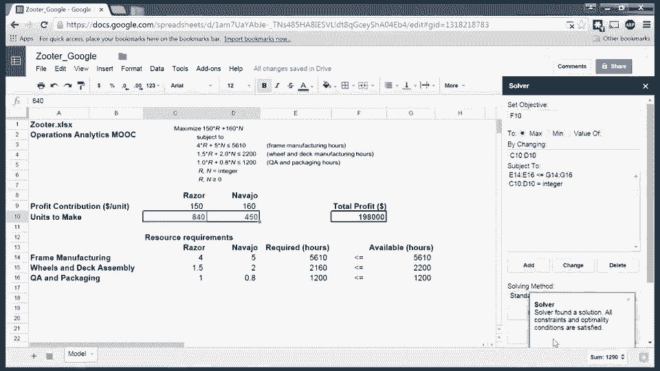

# 课程名称：沃顿商学院商业分析全套课程 - P45：在Google Sheets中设置求解器 🛠️

在本节课中，我们将学习如何在Google Sheets中设置和使用“求解器”附加组件来解决优化问题。我们将以滑板车生产计划为例，逐步演示如何配置目标函数、决策变量和约束条件。

---

## 概述

上一节我们介绍了优化问题的基本概念。本节中，我们来看看如何在Google Sheets这一云端表格工具中具体设置求解器，以执行线性规划求解。

我已经将包含滑板车生产问题的电子表格上传至Google Sheets。该表格已反映了初始的试验性解决方案（即每种滑板车各生产500台），并且所有必要的公式也已输入完毕。

---

## 加载求解器附加组件

求解器是Google Sheets的附加组件之一，用于处理优化问题。为了使用它，我们首先需要将其加载到表格中。

以下是加载步骤：

1.  点击菜单栏的“扩展程序”。
2.  选择“获取扩展程序”。
3.  在搜索框中输入“Solver”进行查找。
4.  找到后，点击“安装”按钮。

安装完成后，你可以在“扩展程序”菜单下找到“Solver”选项。

---

## 使用键盘快捷键

在具体操作前，了解两个常用的键盘快捷键会提高效率：

*   **`F2`**：在Windows系统中，此快捷键用于显示和编辑当前选定单元格中的公式。在Google Sheets中同样适用。例如，选中目标函数所在的单元格`F10`，按`F2`即可查看或编辑其公式。
*   **`F4`**：此快捷键用于在公式中切换单元格引用的类型（绝对引用`$A$1`、混合引用`A$1`或`$A1`）。例如，在编辑公式时，选中单元格引用部分（如`E14`），重复按`F4`可以循环切换不同的引用模式。

---

## 配置求解器参数

现在，我们开始调用并配置求解器。从“扩展程序”菜单下选择“Solver”，一个对话框将出现在工作表右侧。

我们需要依次设置三个核心部分：**目标函数**、**决策变量**和**约束条件**。

### 1. 设置目标函数

首先，将光标移动到工作表中目标函数所在的单元格（例如`F10`）。然后，在求解器对话框的“设置目标”区域，点击右侧的选择器图标，系统会自动捕获当前选中的单元格作为目标。

### 2. 设置决策变量

决策变量是我们希望求解器优化的数量。在工作表中，选中代表决策变量的单元格区域（例如`C10`和`D10`）。接着，在求解器对话框的“通过更改可变单元格”区域，点击选择器图标以导入该区域。

### 3. 添加约束条件

约束条件限定了决策变量的取值范围。以下是添加约束的步骤：

1.  在求解器对话框中，点击“添加约束”按钮。
2.  “单元格引用”区域：首先，在工作表中选中约束条件左侧的单元格区域（例如`E14:E16`），然后点击对话框左侧的选择器图标将其导入。
3.  中间的下拉菜单：选择约束关系（如`<=`）。
4.  “约束”区域：接着，在工作表中选中约束条件右侧的单元格区域（例如`G14:G16`），点击对话框右侧的选择器图标将其导入。
5.  点击“确定”按钮，完成一条约束的添加。

我们需要为决策变量添加“整数”约束。再次点击“添加约束”，选中决策变量单元格（`C10:D10`），在关系框中选择“int”（代表整数），然后点击“确定”。

---

## 选择求解方法并求解

所有参数设置完毕后，还需进行最后两步配置：

1.  **选择求解方法**：在“求解方法”下拉菜单中，保持选择“标准GRG非线性”。此方法与Windows版Excel中的“非线性GRG”引擎类似，适用于我们的问题。
2.  **确保变量非负**：点击“选项”按钮，在弹出窗口中勾选“假定变量为非负数”选项，确保所有决策变量不小于零。点击“确定”返回。

最后，点击求解器对话框顶部的“求解”按钮。求解器将开始计算，并很快给出满足所有约束条件下使目标函数最优的解决方案。

---

## 总结

本节课中，我们一起学习了在Google Sheets中配置求解器的完整流程。我们从加载附加组件开始，然后逐步设置了目标函数、决策变量以及包括整数和非负在内的各种约束条件，最终通过选择合适的求解引擎得到了问题的最优解。掌握这些步骤，你就能在云端表格中独立解决基础的线性规划问题。