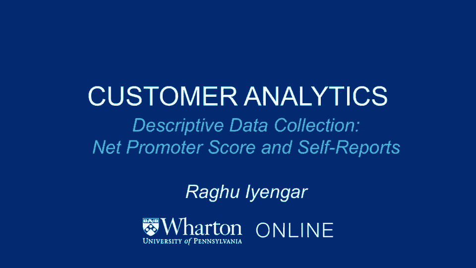
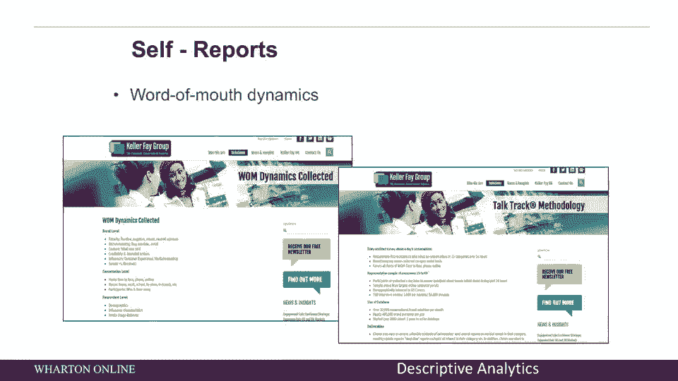

# 【沃顿商学院】商业分析 全套课程（客户、运营、人力资源、会计） - P5：[P005]03_descriptive-data-collection-net-promoter-score-and-self-reports - 知识旅行家 - BV1o54y1N7pm

我还想谈谈一种得到很多认可的特殊类型的调查，这是网络推广者得分，它实际上只是归结为一个问题，你推荐一个特定品牌的可能性有多大，你的公司给朋友或同事，只有一个问题，它是在零到十分的范围内完成的。

推广者是在这个量表上得9分或10分的人，被动语态是得分七八分的人，诋毁者是得零到六分的人，贵公司的网络推广得分是多少？这是发起人的百分比，减去诋毁者的百分比，那么这允许你这样做吗。

基本上可以让你跟踪你的品牌的健康状况，你的客户总体上喜欢你吗，还是有越来越多的人现在可能成为诋毁者，让我们来谈谈网络推广者得分的一个具体例子，这在许多不同的公司都非常受欢迎，比如说。

Zappos经常使用网络推广者得分来观察他们的客户服务如何，还有许多其他使用网络推广者评分的公司的例子，看看内部的人做得怎么样，当他们和顾客交谈时，当你考虑净推广人得分时。

顾客满意这个更大的问题浮现在脑海中，问题是如何衡量客户满意度，在这张图表的左手边，你可以看到有现成的措施，如操作措施，投诉分析，评分和评论等等，在另一个最右边，你可以有专注的努力，比如神秘，购物。

满意度调查等，所以最大的问题是你如何衡量客户满意度，正是在这种情况下，网络推广者得分出现了，网启动子得分的思路如下，它只问了一个问题，这就是为什么它如此重要和有用，你向同事或朋友推荐服务的可能性有多大。

所以它是在0到10的尺度上，就像你在这里看到的，从0到6的数字称为诋毁者，这些人对推荐这项服务不感兴趣，上面两边的数字，这九个和十个被称为推动者的人，这些人显然会向同事和朋友推广这项服务。

任何特定公司的净发起人得分是发起人的百分比，圈九或圈十的人，减去诋毁者的百分比，从零到六的人，所以如果你看看网络推广者得分，这是一个很好的方式来看待一个公司是如何做到这一点的，很明显。

你希望网络推广者得分为正，因为那个，基本上说，推动者的数量远远多于诋毁者的数量，如果你考虑网络推广者得分，它的产生方式来自弗兰克·赖克尔的一篇文章，谁是那个谈论网络推广得分的人，这是在HBR上发表的。

这些图表显示的是，网络推广者得分很好地捕捉到了，现在总体客户满意度是怎么回事，如果你仔细想想，顾客满意度的一种思考方式，也就是对网络推广者得分的批评是有一种美国人的满足感，消费者指数，这是很容易测量的。

已经做了很多很多年了，所以砖头批评网络推广者得分在另一边，它与ASCI指数非常相似，事实上，对于许多行业来说，也可以看到，ASCI指数有更高的r平方，行业增长，远大于净启动子得分。

所以没有明确的证据表明净启动子得分优于其他指标，我在这里做什么，我展示的是什么，你又是，有利的一面和不利的一面，网络推广评分很受欢迎，为什么是一个单一的问题，它很容易实现，因为这是你在一旁问你的顾客的。

你也要考虑，你想说什么？如果是关于客户满意度，还有其他衡量标准可能比网推广者得分做得更好，所以记住这一点，当你考虑在自己的公司实施网络推广者评分时，下面是两个面板上的一个示例。

你在这里看到的是与行业净增长相关的r平方，与ASI指数和净启动子得分指数的比较，你在这里看到的是一组公司，ASCI指数的r平方，实际上比网发起人得分的r平方高，所以再一次，记住这一点。

当您开始实现净启动子得分时，如果你在自己的公司里考虑，现在如果你仔细想想，如果你从预测有效性的角度思考，净发起人得分是否与盈利能力有关，一种思考方式确实是肯定的，网络推广者得分可以与客户满意度相关。

那个，事实上，在过去的研究中已经多次表明，它与盈利能力有关，总体文献通常表明，较高的客户满意度会给公司带来积极的结果，这里有什么问题，这种联系实际上可能比一个弱得多，经理们通常的想法，而相关性是正的。

顾客满意只能解释公司价值和公司业绩的有限部分，现在的问题可能是为什么直觉上，你会认为更满意的顾客，他们会更乐意和那家公司做生意，因此盈利能力应该更高，虽然情况确实如此，它仍然只能解释有限的一部分。

为什么那口井，一种思考的方式是，如何将满意度和盈利能力联系在一起，所以如果你看这个图，满意度在横轴上，盈利能力在垂直轴上，管理者的感知方式，满意度和盈利能力之间的联系通常是一条直线。

所以他们的直觉是如果你不断提高客户满意度，盈利能力会一直保持良好的增长，人们发现了什么，事实上，要复杂得多，我在这里画的是在横轴上，我们很满意，在垂直轴上，我们有盈利能力，我们在这里看到了什么。

有一种积极的关系，但它不是一条直线，事实上，最初，当你考虑提高客户满意度时，如果你在低端，你确实看到盈利能力的增加，但许多公司实际上可能处于曲线的平坦部分，就是一切照旧。

你在这里看到的是一个大的平坦区域，盈利能力不断增加，增加满意度实际上并不能增加盈利能力，一旦你穿过那个特定的区域，然后你就进入了快乐的区域，更少的公司，这些人有惊人的客户服务，这些是突出的。

在其特定类别中的作用，你会再次看到，不断增加的满意度确实会增加盈利能力，我为什么要提起这件事，因为很多公司可能在平坦的部分，所以你可能会在你公司的案例中看到。

增加满意度可能不会对盈利能力产生可衡量的变化，这并不意味着他们两个没有联系，这意味着它们不是线性联系的，它们可能是非线性连接的，所以你也可以发现竞争可能会影响这种关系，我为什么要提起这些。

从某种意义上说，我提出这一切的原因，作为总结，每当你想做任何形式的调查，在这个例子中，我们讨论的是网络启动子得分，有几件事你需要考虑，第一个是它在捕捉什么，它是在捕捉，顾客满意，它到底捕捉到了什么。

与其他调查相比如何，可以捕捉到同样的东西，这就是我们刚才谈到的，当我们将净启动子得分与ACCI指数进行比较时，它做得更好吗，它做得更糟吗，它捕获的内容与其他服务所能做的有多大不同。

最后一部分是关于预测有效性的，您捕获的度量是如何，在这种情况下，净推动者得分与管理成果挂钩，你感兴趣的只是总结一下，我们在最后几张幻灯片中看到的，你可能会认为满意度和盈利能力之间有关系，积极的关系。

确实如此，但它不是典型的线性，有很大一部分曲线，满意度的提高可能不会对盈利能力产生可衡量的变化，所以当你开始考虑做自己的调查时，无论是网络推广者评分还是其他类型的调查，记住以下几点，它在捕捉什么。

它与你感兴趣的事情有什么关系，盈利，股价，顾客满意，无论你对捕捉什么指标感兴趣，净启动子得分，在将分数与股价挂钩方面发现了很大的杠杆作用，将分数与未来的销售联系起来，并作为你的品牌有多好的领先指标。

所以调查是接触客户的一种明确方式，从他们那里收集数据，但还有其他方式客户自己可能愿意给你一些数据，所以除了公司接触客户的调查之外，很多次，顾客可以通过自我报告他们正在购买的东西来联系公司。

当他们买的时候，所以说，infoscout就是这样一家公司，或激励消费者做以下事情，一旦他们做了，他们买了东西，他们拿着收据，他们有移动设备，给收据拍张照片，然后把它送回去Infosck用它做什么。

他们基本上在许多地方收集所有这些信息，许多顾客在购买某些产品时获得洞察力，他们在哪里买的，在夫妻店吗，是在便利店吗，在大盒子商店里吗，这是一个例子，客户向公司提供信息，另一个例子是口碑动力学。

所以作为一家公司，我们想知道人们在购买什么。

但我们也想知道人们在谈论什么，我们的品牌是如何被提及的，所以有很多公司收集这种类型的数据作为例子，凯勒费是一家收集口碑动态的公司，他们是怎么做到的，他们有一个客户小组，基本上被赋予以下任务。

当你和别人说话的时候记下来，是谁是朋友吗，是同事吗，随着时间的推移，你对以日记的形式收集这些数据有什么看法，跨越几个月，他们能够观察到人们在谈论什么，他们在和谁说话，一个品牌是如何被提及的，等等。

动态是了解品牌情绪如何随时间变化的有力方法，等等，现在再来一次，人们可以用很多很多不同的方法来收集这些数据，凯勒是一家通过面板数据来做到这一点的公司，通过日记的形式。

还有其他不引人注目的方法来收集这些数据，我们接下来会讨论，所以在这一点上，我们接下来讨论了数据收集的主动方法。

