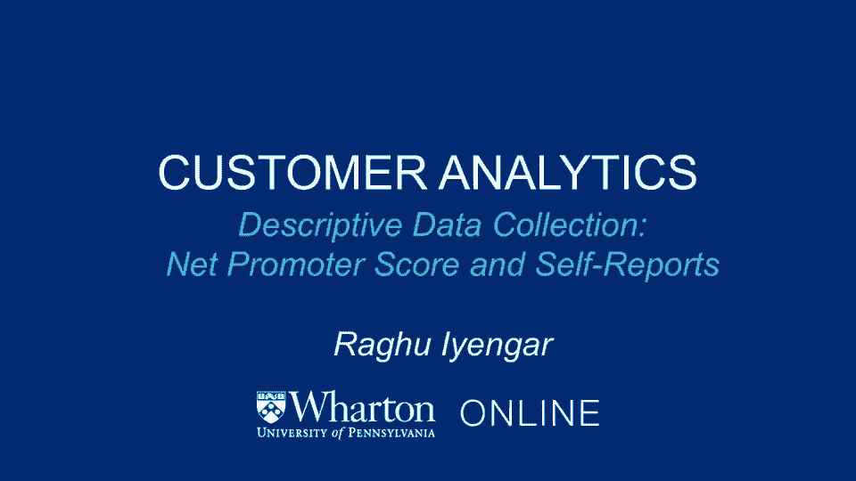

# 课程名称：沃顿商学院商业分析 P5：描述性数据收集 - 净推荐值与自我报告 📊

在本节课中，我们将要学习两种重要的描述性数据收集方法：净推荐值（NPS）和客户自我报告。我们将探讨它们是什么、如何运作、各自的优缺点，以及如何在实际商业分析中应用它们。

## 净推荐值（NPS）简介 📈

上一节我们介绍了调查作为主动数据收集的方法，本节中我们来看看一种得到广泛认可的特殊调查类型——净推荐值。

净推荐值实际上只归结为一个问题：“你向朋友或同事推荐某个特定品牌的可能性有多大？”这个问题在0到10分的范围内完成评分。

以下是基于评分的客户分类定义：
*   **推荐者**：在这个量表上给出9分或10分的人。
*   **被动者**：给出7分或8分的人。
*   **贬损者**：给出0到6分的人。

净推荐值的计算公式如下：
`净推荐值（NPS） = 推荐者百分比 - 贬损者百分比`

这个指标允许你跟踪品牌的健康状况，了解客户总体上是否喜欢你，或者是否有越来越多的人可能成为贬损者。

## NPS的应用实例与讨论 🛍️

让我们来谈谈净推荐值的一个具体应用例子。它在许多公司中非常受欢迎。例如，Zappos就经常使用净推荐值来观察他们的客户服务质量。还有许多其他公司使用净推荐值来评估内部员工在与顾客互动时的表现。

当你考虑净推荐值时，客户满意度这个更大的问题就浮现出来。核心问题是如何衡量客户满意度。在衡量方式的频谱上，一端是现成的操作指标（如投诉分析、评分和评论），另一端是专注的努力（如神秘顾客、满意度调查等）。正是在这种背景下，净推荐值得到了应用。

净推荐值的思路是只问一个问题，这使其简单且有用。它询问客户向他人推荐服务的可能性。任何特定公司的净推荐值就是推荐者的百分比减去贬损者的百分比。

## NPS的优缺点分析 ⚖️

净推荐值是一个很好的方式来评估公司的表现。显然，你希望净推荐值为正，因为这基本上表明推荐者的数量远多于贬损者的数量。

净推荐值源于弗雷德·赖克哈尔德在《哈佛商业评论》上发表的文章。这些图表显示，净推荐值很好地捕捉了总体客户满意度。

然而，对净推荐值的一种批评是，它与美国消费者满意度指数非常相似。事实上，对于许多行业，ACSI指数在预测行业增长方面具有更高的R平方值，远大于净推荐值。因此，没有明确的证据表明净推荐值优于其他指标。

我在这里展示的是净推荐值的利与弊。净推荐值很受欢迎，因为它是一个单一问题，易于实施。但你也需要考虑，如果目标是衡量客户满意度，可能还有其他指标比净推荐值做得更好。当你考虑在自己公司实施净推荐值时，请记住这一点。

## 客户满意度与盈利能力的复杂关系 📉

现在，如果你从预测有效性的角度思考，净推荐值是否与盈利能力相关？一种思考方式确实是肯定的。净推荐值可以与客户满意度相关联，而过去的研究已多次表明，客户满意度与盈利能力有关。总体文献通常表明，较高的客户满意度会给公司带来积极的结果。

但这里的问题是，这种联系可能比管理者通常认为的要弱得多。虽然相关性是正的，但客户满意度只能解释公司价值和业绩的有限部分。

直觉上，你会认为更满意的客户会更乐意与那家公司做生意，因此盈利能力应该更高。虽然情况确实如此，但它仍然只能解释有限的一部分。一种思考的方式是看满意度和盈利能力是如何联系在一起的。

管理者的感知方式通常是一条直线：不断提高客户满意度，盈利能力就会持续良好增长。但研究发现，事实要复杂得多。在横轴（满意度）和纵轴（盈利能力）的关系图中，我们看到一种积极的关系，但它不是一条直线。

最初，在满意度较低时提高它，确实能看到盈利能力的增加。但许多公司可能处于曲线的平坦部分，在这个区域，增加满意度实际上并不能增加盈利能力。只有当你穿过那个特定区域，进入“快乐区域”（那些提供惊人客户服务的杰出公司），才会再次看到增加满意度能提升盈利能力。

我提起这一点是因为许多公司可能处于平坦部分。因此，在你的公司案例中，增加满意度可能不会对盈利能力产生可衡量的变化。这并不意味着两者没有联系，而是意味着它们不是线性连接的，可能是非线性连接。竞争也可能影响这种关系。

## 实施调查的考量要点 📝

我提出这一切的原因，作为总结，是每当你想进行任何形式的调查（在此例中是净推荐值），有几件事你需要考虑：
1.  **它在捕捉什么？** 它是在捕捉客户满意度吗？它到底捕捉到了什么？
2.  **与其他调查相比如何？** 与其他能捕捉同样内容的调查相比，它做得更好还是更糟？它捕获的内容与其他指标有多大不同？
3.  **预测有效性如何？** 你捕获的指标（如净推荐值）如何与你感兴趣的管理成果（如盈利能力）挂钩？

总结我们在最后几张幻灯片中看到的，你可能会认为满意度和盈利能力之间存在积极的关联，确实如此，但它不是典型的线性关系。在曲线的很大一部分上，满意度的提高可能不会对盈利能力产生可衡量的变化。

所以，当你开始考虑进行自己的调查时，无论是净推荐值还是其他类型，请记住以下几点：它在捕捉什么？它与你感兴趣的事情（盈利、股价、客户满意度）有什么关系？研究发现，净推荐值在将分数与股价、未来销售挂钩，以及作为品牌健康状况的领先指标方面，具有很大的影响力。

## 客户自我报告数据收集方法 📱

调查是接触客户、从他们那里收集数据的一种明确方式。但还有其他方式，客户自己可能愿意主动提供一些数据。

除了公司接触客户的调查之外，很多时候，顾客可以通过自我报告他们的购买行为来联系公司。例如，Infoscout就是这样一家公司，它激励消费者做以下事情：购物后，他们用移动设备给收据拍照，然后发送回去。Infoscout收集所有这些信息，从而洞察许多顾客在何时、何地（夫妻店、便利店、大卖场）购买某些产品。

这是客户向公司提供信息的一个例子。另一个例子是口碑动力学。作为一家公司，我们不仅想知道人们在买什么，还想知道人们在谈论什么，我们的品牌是如何被提及的。

有很多公司收集这种类型的数据。例如，Keller Fay是一家收集口碑动态的公司。他们的做法是建立一个客户小组，赋予其一项任务：以日记形式记录几个月内与他人（朋友、同事）的谈话内容。他们能够观察人们在谈论什么、与谁交谈、一个品牌是如何被提及的。这种动态是了解品牌情绪如何随时间变化的有力方法。

人们可以用许多不同的方法来收集这些数据。Keller Fay是通过日记形式的面板数据来实现的。还有其他不引人注目的方法来收集数据，我们将在接下来讨论。

## 总结 🎯

本节课中，我们一起学习了两种重要的描述性数据收集方法。我们深入探讨了净推荐值的定义、计算、应用及其在衡量客户满意度方面的优缺点，并理解了客户满意度与盈利能力之间复杂的非线性关系。接着，我们介绍了客户自我报告数据的方法，如收据扫描和口碑动态收集，这些方法让客户主动提供有价值的消费和互动信息。这些工具共同帮助分析师更全面、更细致地理解客户行为和品牌健康度。