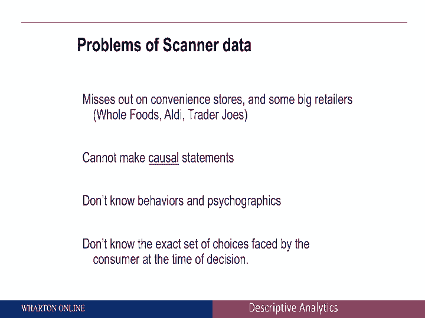

# 【沃顿商学院】商业分析 全套课程（客户、运营、人力资源、会计） - P7：[P007]05_passive-data-collection - 知识旅行家 - BV1o54y1N7pm

所以就被动不引人注目的数据收集而言，公司可以通过多种方式从客户那里获取数据，这只是为了一些例子，它可能是媒体策划的销售点数据，例如，可能是关于无线电的数据，电视，社交媒体，观众的参与，可能是网络数据。

移动数据，我们在这个特定的模块中要做的是讨论不同类型数据的示例，更重要的是，也与人们可以使用这种类型的数据回答的问题类型有关，所以销售点数据只是一个例子，所以在这个例子中，例如，我们看杂货类别。

健康美容产品，这只是消费者和公司可获得的数据类型的一个例子，典型的数据链有大约8000个200个消费品包装，制造商，很多，很多家庭，就地理位置而言，可用的信息类型是相当戏剧性的，产品时间。

以及你可以拥有的营销变量的类型，你可以有不同种类的商店，您可以根据skus进行聚合，您可以在时间方面进行聚合，有许多不同种类的数据可用，现在有很多公司提供销售点数据，我给你们举一些这样做的大公司的例子。

C尼尔森是获得场点eta的巨大力量，这是一个例子，iri是另一家公司，第三个连是旋转，现在这三家公司基本上给你不同类型的销售点的数据，所以II中的AC磨坊通常处理传统商店，你在杂货店里有的，传统产品。

旋转给你很多关于有机产品的信息，所以这取决于你所在的公司，取决于你看C尼尔森的产品，ii或Spins可能是现在给你这种类型数据的理想公司，为什么人们首先要为销售点数据支付这么多钱，相当完整。

您可以将总销售额与营销工具联系起来，比如说，作为营销经理，你想回答以下问题，促销如何影响我的销售来回答这个问题，你需要关于促销的好数据，你需要关于销售的好数据，销售点数据可以为您提供这些信息，挺及时的。

您可以获得不同类型聚合的数据，你可以在一个月内得到一周内的数据，如果你想做这种决定，最后它非常准确，回到你可以尝试用这种类型的数据回答的问题，谁在促销活动中购买产品，我们的客户与未来的销售接壤。

所以如果我作为顾客买了两箱橙汁，今天，是从我未来的销售中借来的吗，我可能会推迟买未来的橙汁，采摘者变得忠诚，所以如果我决定买，例如今天的纯果乐，而不是细小的肉，因为纯果乐提供促销活动，我会忠于纯果乐吗。

对于品牌经理来说，这些都是重要的问题，要理解为什么，因为这告诉你，促销会有什么影响，不仅仅是在短期内，但从长远来看，你也可以开始考虑影响或展示，比如说，所以你们这些在超市过道里走来走去的人。

你可以开始寻找，比如说，在过道的尽头展示，过道中间的显示器，这些小展示可以让你看到哪些品牌在促销，他们是如何工作的，我会显示比文件结束显示更好，需要具体的数据，最后你可以开始思考不仅仅是。

在某一特定产品类别中有什么作用，你可以开始考虑跨产品类别的行动，从零售店经理的角度来看，这是非常重要的，整个连锁店是如何做什么产品在一起销售的，什么产品在互相蚕食。

所有这些问题都可以通过销售点的数据很好地回答，有什么注意事项，尽管有一个警告是它错过了便利店等东西，再次，在食品杂货中，全食等品牌，所有的交易员乔的都不在数据集中，回想一下我们谈过的，伊诺童子军。

INO Scout是这个InfoCard的解决方案，实际上希望人们给他们的收据拍一张快照，然后寄回给他们，所以如果这些顾客在购买产品和全食产品明信片上就会有这些信息，但销售点数据可能没有。

另一个例子是你不能做出因果陈述，这里有什么问题，我想知道，比如说，我的促销如何影响消费者行为，你可以得到很多信息，你可以得到很多关于人们在买什么的信息，但这有因果关系吗，当我们讨论因果归因时。

我们会回到这个问题上来。

我们不知道客户心理图谱，最后我们也不知道，消费者在看的确切产品是什么，但仍然记住所有这些警告，销售点数据是一个非常重要的数据，如果你开始考虑试图捕捉顾客购买的东西，他们在哪里买。
