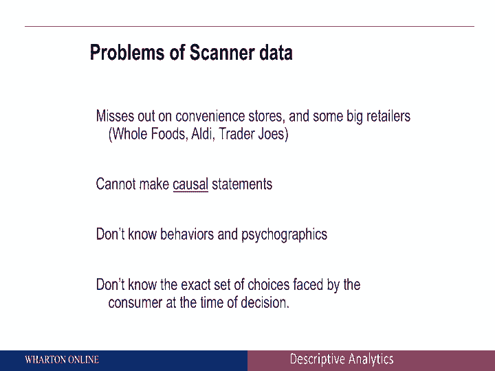

# 📊 商业分析课程 P007：被动数据收集

在本节课中，我们将学习什么是被动数据收集，以及企业如何利用销售点数据来理解客户行为和回答关键的商业问题。

---

## 概述：什么是被动数据收集？

被动、不引人注目的数据收集是指公司通过多种方式从客户那里获取数据，而无需客户主动提供。这只是其中一些例子。数据可能来自媒体策划、销售点数据，例如关于广播、电视、社交媒体观众参与度的数据，也可能是网络数据或移动数据。

在这个特定模块中，我们将讨论不同类型数据的示例。更重要的是，我们也将探讨人们可以利用这类数据回答的问题类型。

---

## 销售点数据：一个核心示例

销售点数据只是一个例子。在这个例子中，我们以杂货品类中的健康美容产品为例。这只是消费者和公司可获得的数据类型的一个例子。

典型的数据链涉及大约8000个消费品包装制造商和许多家庭。就地理位置而言，可用的信息类型相当广泛，包括产品、时间以及你可以拥有的营销变量类型。

你可以有不同种类的商店，可以根据库存单位进行聚合，也可以在时间维度上进行聚合。有许多不同种类的数据可用。

---

### 主要的数据提供商

现在有很多公司提供销售点数据。以下是几家大型公司的例子：

*   **尼尔森**：是获取销售点数据的巨大力量。
*   **IRI**：是另一家公司。
*   **SPINS**：是第三家公司。

这三家公司基本上提供不同类型的销售点数据。IRI和尼尔森通常处理传统商店（如杂货店）中的传统产品数据。SPINS则提供许多关于有机产品的信息。

因此，取决于你所在的公司和关注的产品，尼尔森、IRI或SPINS可能是提供此类数据的理想公司。

---

## 为何销售点数据价值巨大？

为什么人们首先要为销售点数据支付这么多钱？原因如下：

1.  **相当完整**：你可以将总销售额与营销工具联系起来。
2.  **及时性**：你可以获得不同类型聚合级别的数据，例如一周内或一个月内的数据。
3.  **准确性**：数据非常准确。

---

### 可回答的关键商业问题

回到你可以尝试用这类数据回答的问题。以下是一些例子：

*   **谁在促销活动中购买产品？**
*   **我们的促销是否在透支未来的销售额？** 例如，如果一位顾客今天买了两箱橙汁，这是否意味着他未来会推迟购买橙汁？
*   **促销能否培养品牌忠诚度？** 例如，如果我因为促销而今天购买了纯果乐而非美汁源，我以后会忠于纯果乐吗？

对于品牌经理来说，这些都是重要的问题。因为这告诉你促销的影响，不仅限于短期，也包括长期。

---

## 深入分析：展示与跨品类影响

你也可以开始考虑展示的影响。例如，在超市过道里，你可以观察过道尽头的展示和过道中间的展示。这些小展示可以让你看到哪些品牌在促销，以及它们的效果如何。过道尽头展示是否比普通货架展示更好？这需要具体的数据。

最后，你不仅可以考虑单一产品类别内的作用，还可以开始思考跨产品类别的影响。从零售店经理的角度来看，这非常重要。例如：

*   整个连锁店中，哪些产品是一起销售的？
*   哪些产品在互相蚕食市场份额？

所有这些问题都可以通过销售点数据很好地回答。

---

## 注意事项与局限

尽管强大，销售点数据也有其注意事项。

**一个警告是它可能遗漏某些渠道**，例如便利店。在食品杂货领域，像全食超市、乔氏超市这样的品牌可能不在数据集中。

回想一下我们之前讨论过的“伊诺侦察兵”。伊诺侦察兵是InfoCard的解决方案，它鼓励人们给收据拍照并寄回。因此，如果顾客在乔氏超市或全食超市购买产品，明信片上就会有这些信息，但销售点数据可能没有。

**另一个例子是你不能轻易做出因果陈述**。这里存在什么问题？假设我想知道促销如何影响消费者行为。你可以获得大量关于人们购买什么的信息，但这能证明因果关系吗？当我们讨论因果归因时，我们会回到这个问题。

我们不知道客户的心理图谱。最后，我们也不知道消费者具体在看哪些产品。

尽管如此，请记住所有这些警告，销售点数据仍然是一种非常重要的数据源，特别是当你开始考虑捕捉顾客购买了什么以及他们在哪里购买时。

---

## 总结

本节课中，我们一起学习了被动数据收集的概念，并深入探讨了销售点数据这一具体类型。我们了解了它的来源、主要提供商、巨大价值以及能帮助回答的各种商业问题，例如促销效果、品牌忠诚度和跨品类分析。同时，我们也认识到其局限性，如数据覆盖范围可能不全以及难以直接推断因果关系。掌握这些知识是进行有效商业分析的重要基础。