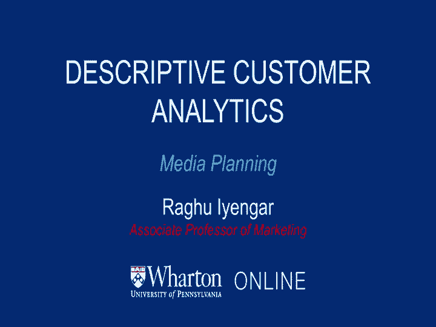
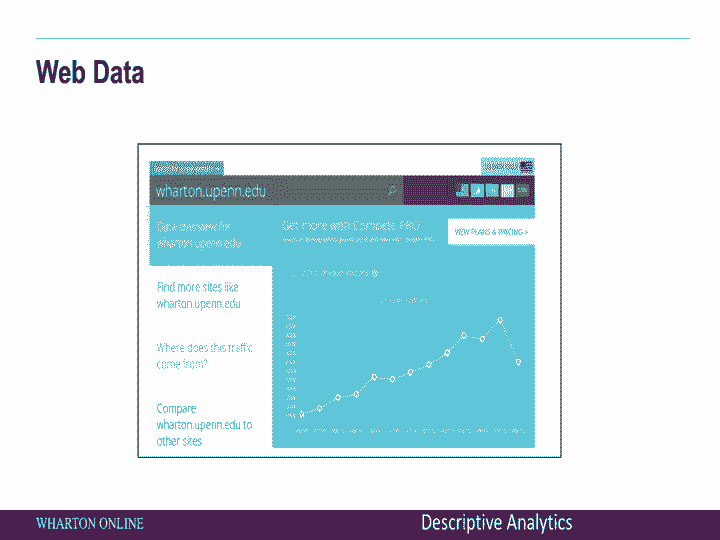
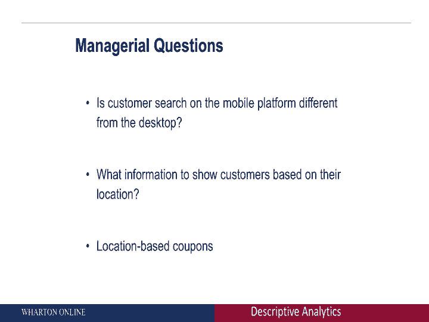

# 【沃顿商学院】商业分析 全套课程（客户、运营、人力资源、会计） - P8：[P008]06_media-planning - 知识旅行家 - BV1o54y1N7pm

so now from point of sales data，let's go to media planning，now。

i want to give you some examples of how companies can go ahead and collect some data。

sometimes themselves and sometimes by the aid of other companies to get a sense of audience engagement。

so in radio，for example，there are companies out there that can collect this type of data。

so kantar media，for instance collects a lot of data in terms of who is listening to different radio shows。

how is the popularity of different stations，and so on there are other companies as well that collect this type of data。

for example nian audio again，you can think about these kinds of engagement，even at the tv level。

so here nielsen collects a lot of data，which is from the tv level。

how do they do that with a set top box，so this is the box which will go along with your cable box。

what are they trying to do here，they're trying to basically record。

who are the people who are watching a particular tv station，who is it in the family。

and then they aggregate at different households，to get a sense of how popular is a particular tv show。

how popular are different channels and so on，so again ac nielsen is not the only company doing this。

there are many other companies as well，another company is the following example。

again rent track is a company that basically collects information again about tv engagement。

there's slightly different ways of doing it，but the overall idea is exactly the same。

what would we want to do in these kinds of issues，tv or radio get a sense of how popular is a particular show or a particular channel。

what are the kinds of questions that can be answered，with these kinds of data that's available。

so for example，who is watching what show as a brand manager，or in fact as a tv station manager。

we would like to know which shows are popular，which shows potentially can be funded next year。

how is the viewership pattern changing over time，and for example。

if you start thinking about viewership pattern，how should i be spending different kinds of money on different types of ads。

in these tv shows，so broadly these kinds of questions can be answered by getting information about audience engagement。

and that's what companies like nielsen，companies like kantar media。

that's what they're doing when they're collecting different types of data。

either through radio shows or for tv shows，so now we'll talk about social media analytics。

so social media is becoming extremely popular，there are many many people on facebook twitter。

you name the different formats，people are there talking about brands，talking to each other。

and so on so clearly when you think about it yourself，as a brand manager。

you start thinking about what are customers talking about，you need data about social media。

and there are companies out there that will help you get that data，for example。

hootsuite is a company that does a lot of information and data collection on things。

going on on facebook or twitter，so it's a platform that collects that data。

sprout social is another example，so there are many companies out there that are collecting information on。

what customers are saying and doing on social media。

so what are the kinds of questions that a manager can answer using this type of data。

the first one is just audience engagement，if i'm running a campaign on facebook。

if i'm running a campaign on twitter，how many people are responding，that gives me a sense。

on how good that campaign is，another example might be more along the lines of thinking about brand mentions。

is our brand being mentioned more times than our competitors，what's our share of voice，so。

for example，as we just saw we could track，for instance。

how many times wharton came up in the last month on twitter。

you can start doing this search for your own brand，and see how it compares to your competitors。

you can also start thinking about doing sentiment analysis，so it's not just about mentions。

but how is it being mentioned，is it being mentioned in a positive way。

is it being mentioned in a negative way，how is it being mentioned。

and then you can start thinking about linking，for instance，what might be going on in the economy。

all different kinds of issues，together with brand mentions to see how they might change over time。

so social media data is very，very powerful，there are companies out there that can help you collect this type of data。

to see how your company is trending on social media as compared to your competitors。

so now we'll talk about another type of data，this is broadly categorized as web data。

this would be basically，all the different kinds of searches that you're doing on the internet。

all the different websites that people might be visiting and so on。

of course there's a wealth of information out there，first is。

you can start looking at your own company's website and seeing what customers are looking at。

but at the same time，you also want to know what's happening in the marketplace。

and that's where these other companies come in，for example，compete dot。

com is a website that will allow you to look at what people are looking at，at different sites。

there are，of course many other companies that do the same thing，for instance。

comscore is another company that collects this type of data as well，so are many other companies。

so this is another example，and lots of other companies that basically collect information on what are people searching for。

which websites are visiting，and so on what does a data stream look like again。

i went to compete，com，and looked for the type of searches。

and the type of people who are coming in on the wharton website。

that's what it looks like in the last month，so it gives you information on。

for instance on unique visitors and so on。

so besides，of course，going out and looking at companies that collect a wealth of information。

you can have data from your own website，for instance，as an example。

etsy com is a company where you can get a lot of information。

for instance on what are people looking at，so etsy has this data。

they can look at what people are searching for，and get a sense of what products are becoming popular。

what websites for example are becoming popular，and so on。

so collectively web data，gives you a lot of information in terms of what your customers are looking at。

either on your own website or competitive website，and so on，broadly。

this type of data helps you answer questions which are very managerally oriented。

you can start thinking about any kind of campaign，you can broadly categorize。

the type of spending that you're doing in terms of earned media，aid media and own media，own media。

basically is your own website，aid media，is any kind of engagement that you're doing in terms of paying for that media。

and earned media，are people who are organically coming to you。

if you start thinking about collecting this type of web data。

it gives you a sense of what is the roi for many kinds of campaigns，that you're doing so again。

the type of data and the type of questions you're trying to answer，have to go hand in hand，finally。

of course，when you start thinking about the holy grail。

it's mobile data that's where many many companies are making inroads，think about facebook。

of course it started off as a desktop，but many more people are accessing facebook using their mobile phones。

facebook has this data，they know where people are accessing facebook。

and they know the location as well，that's a wealth of information，as another example。

this is foursquare again，this is a website in which people kind of check in。

usually through their mobile phone，foursquare again has a lot of information on where people are。

where they are checking in what else is around them。

so many many such companies are basically collecting this information on the flip side。

there are companies such as fluy analytics，what do they do，they get a sense of，you know，hey。

how's your app doing in terms of overall customer engagement，and they can also start helping you。

monetize the app，and make it better in terms of people accessing it easily。

and trying to make more money out of that，what are the type of managerial questions that can be answered。

for example，is customers search in the mobile platform，different from the desktop。

what information should show customers based on their location，so think about foursquare。

for instance，they have information on where you are。

should the information they show you be different，depending on your location，probably yes。

and of course another type of question would be，are there coupons that can be sent based on your location。

all of these questions can be answered by looking at mobile data。

and again there are companies out there that can help you collect the data，you collect the data。

you collect the data。
