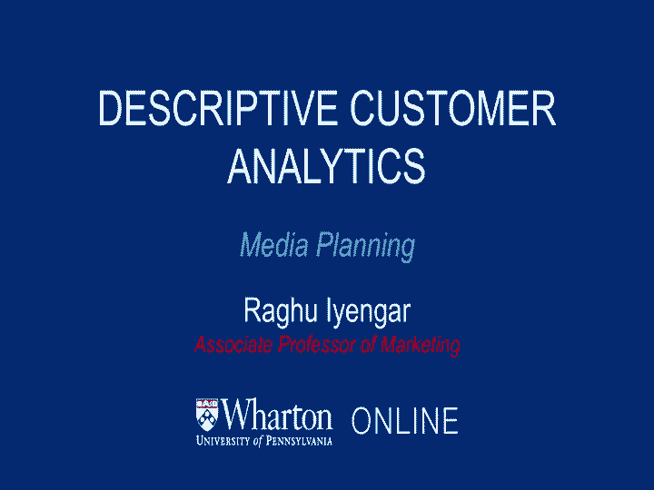
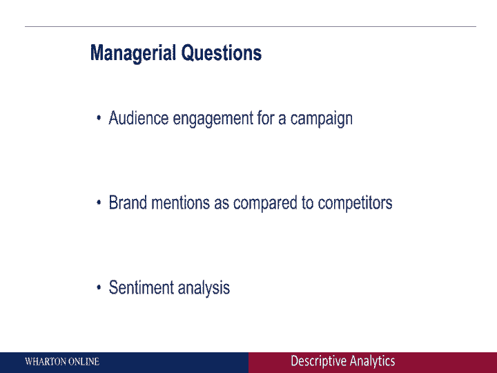
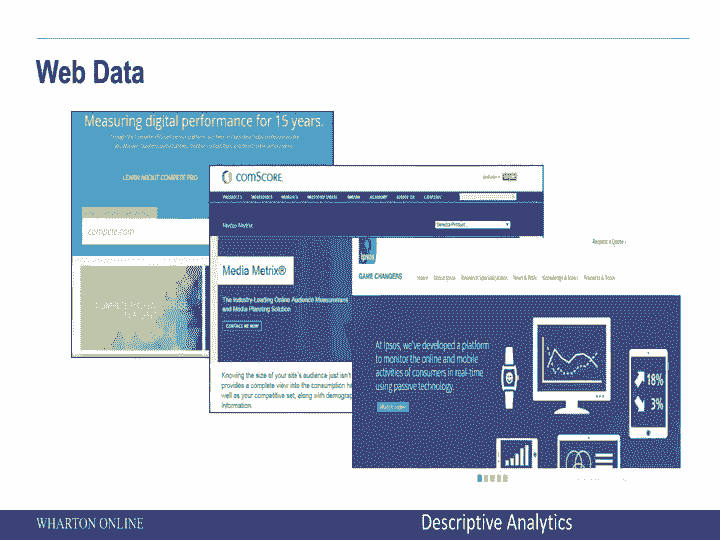
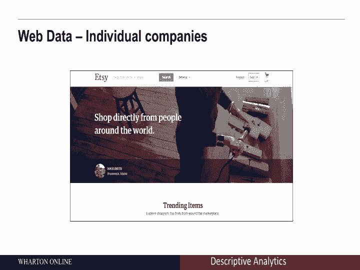
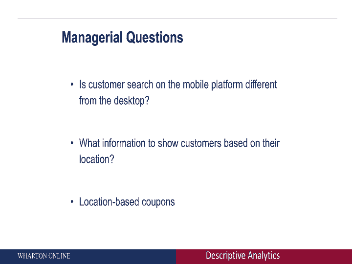

# 沃顿商学院商业分析课程 P8：媒体规划 📊

在本节课中，我们将学习媒体规划，了解企业如何通过不同渠道收集数据来衡量受众参与度。我们将探讨广播、电视、社交媒体、网络以及移动数据等关键领域，并分析这些数据如何帮助管理者做出更明智的决策。

---

## 从销售点到媒体规划

上一节我们讨论了销售点数据，本节中我们来看看媒体规划。企业有时会自行收集数据，有时会借助其他公司的帮助来获取受众参与度的信息。

### 广播数据收集

以下是广播领域数据收集的例子：

*   **Kantar Media**：这类公司收集关于不同广播节目听众、各电台受欢迎程度等大量数据。
*   **Nian Audio**：是另一家收集此类广播参与度数据的公司。

### 电视数据收集

在电视层面，衡量参与度的方式类似。

*   **尼尔森 (Nielsen)**：通过机顶盒收集大量电视数据。机顶盒与有线电视盒配合使用，旨在记录家庭成员中谁在观看特定电视频道。然后，他们汇总不同家庭的数据，以了解特定电视节目或频道的受欢迎程度。
*   **Rentrak**：是另一家收集电视参与度信息的公司，方法略有不同，但核心理念完全相同。

利用电视或广播数据，我们可以了解特定节目或频道的受欢迎程度。以下是这类数据可以解答的问题：

*   作为品牌经理或电视台经理，我们想知道哪些节目受欢迎，哪些节目明年可能获得资助。
*   收视模式如何随时间变化？
*   考虑到收视模式，我应如何在不同的电视节目中分配广告预算？

总的来说，通过获取受众参与度信息，可以解答上述问题。这正是尼尔森、Kantar Media等公司在通过广播或电视节目收集各类数据时所做的工作。

---

## 社交媒体分析

社交媒体正变得极其流行，许多人在Facebook、Twitter等平台上讨论品牌、相互交流。作为品牌经理，你自然会思考客户在谈论什么，因此你需要社交媒体数据。

市场上有公司可以帮助你获取这些数据：

*   **Hootsuite**：这家公司在Facebook或Twitter等平台上进行大量信息和数据收集。
*   **Sprout Social**：是另一个例子。有许多公司都在收集客户在社交媒体上的言论和行为数据。

管理者可以利用这类数据回答以下问题：

*   **受众参与度**：如果我在Facebook或Twitter上开展活动，有多少人响应？这能让我了解该活动的效果。
*   **品牌提及度**：我们的品牌被提及的次数是否多于竞争对手？我们的“声量份额”是多少？例如，我们可以追踪上个月“沃顿”在Twitter上被提及的次数。你可以为自己的品牌进行此类搜索，并与竞争对手进行比较。
*   **情感分析**：这不仅仅是提及次数，还包括如何被提及。是以积极的方式还是消极的方式被提及？

你还可以开始思考将品牌提及度与经济形势等各种问题联系起来，观察它们如何随时间变化。因此，社交媒体数据非常强大。有公司可以帮助你收集这类数据，以了解你的公司在社交媒体上的趋势与竞争对手相比如何。

---

## 网络数据

我们将讨论另一种类型的数据，广义上归类为网络数据。这基本上包括你在互联网上进行的所有不同类型的搜索，以及人们可能访问的所有不同网站等。

当然，这里有丰富的信息。首先，你可以查看自己公司的网站，了解客户在看什么。但同时，你也想知道市场上发生了什么，这时其他公司就派上用场了。

以下是收集网络数据的公司例子：

*   **Compete.com**：这个网站允许你查看人们在不同网站上浏览的内容。
*   **Comscore**：是另一家收集此类数据的公司，还有许多其他公司也是如此。

这是另一个例子，许多公司基本上都在收集关于人们在搜索什么、访问哪些网站等信息。数据流看起来是什么样的？例如，我访问了Compete.com，查找了沃顿网站上的搜索类型和访问者类型。这就是上个月的数据情况，它提供了诸如独立访客数量等信息。

当然，除了查看收集大量信息的公司，你还可以从自己的网站获取数据。例如，Etsy.com是一家你可以获取大量信息的公司，比如人们在看什么。Etsy拥有这些数据，他们可以查看人们的搜索内容，了解哪些产品正变得流行，哪些网站正变得受欢迎等等。

总的来说，网络数据为你提供了大量关于客户在你自己的网站或竞争对手网站上看什么的信息。广义上，这类数据帮助你回答非常具有管理导向的问题。你可以思考任何类型的活动，并大致将你的支出分类为**自有媒体**、**付费媒体**和**赢得媒体**。

*   **自有媒体**：基本上是你自己的网站。
*   **付费媒体**：指你为媒体参与支付的任何费用。
*   **赢得媒体**：指那些有机地找到你的人。

如果你开始收集这类网络数据，它能让你了解你所进行的许多活动的投资回报率。同样，数据的类型和你试图回答的问题必须相辅相成。

---

## 移动数据

最后，当你开始思考终极目标时，那就是移动数据，许多公司正在这一领域取得进展。以Facebook为例，它最初是桌面端，但现在越来越多的人通过手机访问Facebook。Facebook拥有这些数据，他们知道人们在哪里访问Facebook，也知道位置信息，这是丰富的信息。

另一个例子是Foursquare，这是一个人们通常通过手机“签到”的网站。Foursquare同样拥有大量关于人们在哪里、他们在哪里签到、他们周围还有什么等信息。因此，许多此类公司基本上都在收集这些信息。

另一方面，也有像Flurry Analytics这样的公司。他们是做什么的？他们能了解你的应用在整体客户参与度方面的表现，还可以开始帮助你实现应用货币化，使其在人们更容易访问方面变得更好，并试图从中赚取更多利润。

以下是可以通过移动数据解答的管理问题：

*   客户在移动平台上的搜索与在桌面端是否不同？
*   应根据客户的位置显示什么信息？以Foursquare为例，他们拥有你的位置信息，他们向你展示的信息是否应根据你的位置而不同？很可能是的。
*   当然，另一个问题是：是否可以根据你的位置发送优惠券？

所有这些问题都可以通过查看移动数据来解答。同样，市场上有公司可以帮助你收集这些数据。

---

本节课中我们一起学习了媒体规划的核心内容。我们探讨了企业如何通过广播、电视、社交媒体、网络和移动设备等多种渠道收集受众参与度数据。每种数据类型都能帮助管理者解答特定的商业问题，从评估活动效果、分析品牌声誉到优化广告投放和基于位置的营销。理解这些数据来源及其应用，是进行有效媒体规划和商业决策的基础。