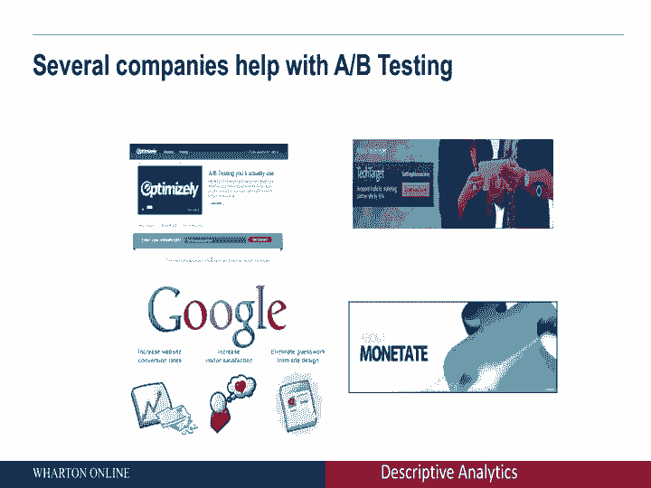
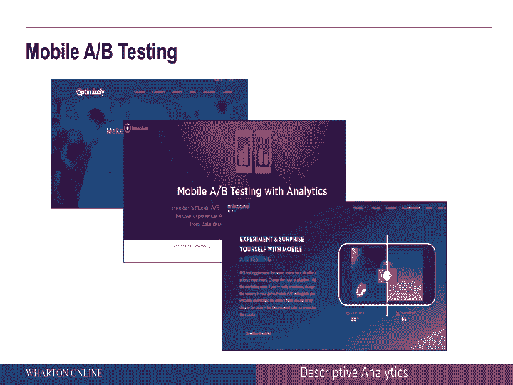
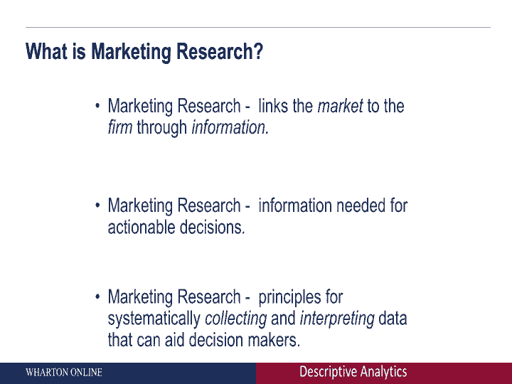

# 课程P009：因果数据收集与总结 📊

在本节课中，我们将要学习因果数据收集。我们将探讨如何通过实验（例如A/B测试）来建立变量间的因果关系，并理解其与相关性的关键区别。

---

## 从探索性、描述性到因果性数据收集

上一节我们介绍了描述性数据收集。本节中，我们来看看因果数据收集。这种类型的数据收集要求更为严格。

很多时候，公司会考虑其网站登陆页面的效果。例如，我们想确定登陆页A是否比登陆页B更好。为了确定这一点，我们可能需要进行实地实验。让一组客户看到登陆页A，另一组客户看到登陆页B，然后观察点击率，从而决定哪个页面更优。换句话说，我们试图在更改登陆页面与观察点击率之间建立因果关系。这就是现场实验的核心。

许多公司支持进行这种A/B测试。当你开始考虑A/B测试时，需要区分相关性和因果关系。

---

## 区分相关性与因果关系

相关性描述的是两个变量之间的关系。例如，价格与销售额可能存在相关性：价格下降时，销售额可能也会下降。其关系可以表示为：

**相关性：** `变量X` 与 `变量Y` 之间存在统计关联。

因果关系则指一个变量对另一个变量产生直接影响。相关性和因果关系不是一回事。

为了理解因果推理，需要满足三个要求：
1.  **相关性**：`X` 与 `Y` 之间存在联系的证据。
2.  **时间先行性**：`X` 必须发生在 `Y` 之前。
3.  **无混杂因素**：没有第三个因素同时驱动 `X` 和 `Y`。

让我们通过一个经典例子来理解两者的区别。

---

## 一个经典例子：鹳与婴儿

有一个著名的故事：在较冷的国家，人们过去常看到鹳落在某些房屋上。几个月后，这些房屋里会有婴儿出生。鹳真的能送来婴儿吗？

以下是分析每个要素的方法：
*   **相关性**：鹳的出现与婴儿出生在同一所房子里，两者存在关联。
*   **时间先行性**：鹳先飞来，婴儿后来出生，时间顺序成立。
*   **第三因素**：关键问题在于是否存在第三个驱动因素。通常，鹳选择落在更温暖的房屋上。而这些房屋之所以更温暖，可能是因为里面有孕妇居住。因此，房屋的温暖（由孕妇导致）同时吸引了鹳并预示了婴儿的出生。

这个例子说明了存在相关性，但绝不存在因果关系。理解相关性与因果关系的这一关键区别至关重要。

---

## 通过现场实验建立因果关系

区分相关与因果的关键方法是进行现场实验。这意味着系统地操纵一个变量（如价格或登陆页面），并观察其对结果（如销售或点击率）的因果影响。

许多公司提供工具来帮助进行此类A/B测试。以下是一个简单的操作流程：

假设你想比较登陆页A和登陆页B的效果。
1.  随机将访问你网站的客户分为两组。
2.  一组客户看到登陆页A。
3.  另一组客户看到登陆页B。
4.  随后，追踪并比较两组的点击率或购买转化率。

通过这种方式，可以确定哪个登陆页面效果更好。这正是许多A/B测试公司（如Optimizely）的核心服务。它们帮助企业测试并优化网页元素，以最大化商业价值。

---

## A/B测试的应用与工具

A/B测试不仅限于网站，也广泛应用于移动端优化，例如测试哪个应用图标或界面设计更有效。

以下是提供此类服务的部分公司：
*   **Optimizely**：帮助进行网站和移动端的A/B测试。
*   **Leanplum**：另一家专注于移动体验优化的公司。
*   此外，市场上还有许多其他竞争对手提供类似服务。

这些公司的定价计划通常包括免费的入门套餐，允许用户自行进行基础的A/B测试。当涉及更复杂的购买漏斗优化或企业级需求时，则需要购买高级的企业套餐。

---

## 因果数据能回答的问题

利用因果数据收集方法，可以帮助企业回答以下类型的问题：
1.  **网站优化**：应该使用哪种登陆页面？应该展示哪个图标？网站应如何设计？
2.  **移动应用设计**：手机应用程序应如何设计才能获得最佳用户体验和转化率？
3.  **个性化营销**：极端情况下，可以针对不同的客户展示不同版本的内容，实现一对一的精准营销。

所有这些都通过现场实验来实现。你系统地操纵某个变量（如登陆页面、结账流程），并观察这些系统性的变化如何引起客户行为的改变。

---

## 本模块总结：数据收集与决策的协同

在本模块中，我们探讨了三种不同类型的数据收集，它们分别对应三种不同的营销决策：

1.  **探索性数据收集**：用于回答开放式、探索性问题。方法包括焦点小组和互联网社区。
2.  **描述性数据收集**：用于了解现状和描述性指标。方法包括调查、销售点数据和媒体策划数据。
3.  **因果数据收集**：用于确定变量间的因果关系。方法主要是现场实验（如A/B测试），并可以借助Optimizely等公司的工具。

理解管理目标与数据收集类型之间的协同作用至关重要。如果你想回答的问题更具探索性，就应采用焦点小组等方法；如果想了解具体的市场份额等描述性指标，则需要收集调查等描述性数据；而如果想探究“如果我改变登陆页面会发生什么”这类因果性问题，就必须依靠现场实验来收集数据。

---

**本节课中，我们一起学习了：**
*   因果数据收集的核心概念及其与相关性的区别。
*   如何通过现场实验（如A/B测试）建立因果关系。
*   区分相关与因果的三个关键要求：相关性、时间先行性和无混杂因素。
*   A/B测试在网站和移动端优化中的应用及相关工具。
*   三种数据收集类型（探索性、描述性、因果性）如何与不同的商业决策问题协同匹配。