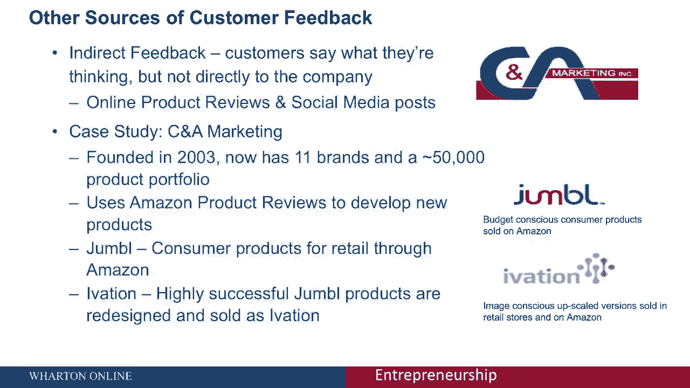

# 【沃顿商学院】创业 四部曲：发现机会、建立公司、增长战略、融资和盈利 - P14：[P14]03_2-3-customers-as-sources-of-opportunities - 知识旅行家 - BV19Y411q713

我是卡尔蒂克，我要谈谈客户如何帮助我们，找出值得追求的机会。

现在回想一下，大多数企业成功的几率都很低，风险基金通过维持投资组合明确说明了这一点，但作为一个企业家，你如何应对这种高度的不确定性。

一个人可以做两件事，首先，你可以同时探索和培养多种选择，其次，你可以用多个潜在客户来测试这些想法，以识别真正特殊的机会，然后投资于这些机会，在这次会议上开发出那些特定的产品或服务。

我将讨论如何实现这两个目标，这产生了多种想法，然后在一次机会中与客户测试这些想法，这本质上是把客户作为机会来源的想法。

这节课与企业创业特别相关，在一个公司中有现有的客户基础，它可以利用它来识别新的产品机会，但当创造性地接近时，启动，企业家也可以利用潜在客户来获得想法和机会。

以非常相似的方式，现在，我将使用线程列表的案例研究，来说明利用客户来寻找值得追求的机会或想法的概念，所以Threadless是一个面向人群的T恤设计网站，以及其他服装的设计。

Threadless是该领域的早期创新者，这家公司是由一位名叫杰克·尼克尔的设计师在2000年创建的，现在杰克参加了一个在线T恤设计挑战，他赢了，当他赢得挑战时，他获得了一个奖项。

但他没有收到他的设计的印刷品，这让他思考，如果他创造了一个每周设计比赛，在那里获胜的设计实际上被印刷并卖给人们。

所以这让他创办了一个网站他每周都有比赛，来自世界各地的设计师前来贡献他们的设计，他的团队每周都会宣布获奖者还把这些设计打印出来在网站上出售，获奖者获得现金和在Threadless。

com上产生的销售额的版税。

现在，有趣的是，无螺纹，是网站上生成的设计的无与伦比的数量和多样性，每周，提交了近千种不同的设计，随着时间的推移，该公司选择了大约十个用于打印，这导致了大约50万个独特的设计被提交给该公司。

大约有30万贡献者，在这段时间里公司印刷了七千到八千个图案。

现在，这真的很有趣，因为虽然他们经历了一个伟大的，大量的设计和印刷，Threadless的员工中没有一个设计师，你不仅得到了大量的设计。

所以你会得到各种各样的设计，啊，Threadless上70%的设计来自美国以外，s，包括来自南亚的，东南亚，欧洲，南美洲和澳大利亚，贡献这些设计的人从14岁的孩子，给65岁左右的退休人员。

所以你可以在无线程上得到大量和多样化的设计。

Threadless已经能够追求这种模式，正如我所说，没有一个设计师，所以无线程对我们特别有教育意义，尽管Threadless并没有真正追求众包的想法，想出创业点子，尽管如此。

它对我们作为企业家还是有用的，因为服装设计，比如创业本身就有风险，不可预测，大多数桶的设计，尤其是对于独特的服装实际上失败了，Threadless能够解决这个问题，通过试图最大化他们得到的设计数量。

并利用客户来选择最好的设计，然后在这个过程中最大限度地减少他们的风险，所以说，而Threadless并不完全代表客户帮助产生创业机会的情况，然而，它凸显了一个充满客户需求不确定性的过程。

我们如何改变这一点，当你利用客户来产生想法时，并选择值得追求的想法，和，事实上，众包的基本概念已经在许多其他环境中使用，在那里，客户被用来为新产品和新机会产生想法。

比如说，戴尔公司有一个名为“创意风暴”（idea storm）的网站，戴尔的客户可以在网站上发布对新产品的建议，以及他们希望在戴尔看到的服务改进，随着时间的推移。

戴尔在这个网站上已经获得了不到两万五千个不同的想法，根据社区成员提交的想法实施了几项产品创新，比如说，基于这一建议在戴尔网站上的流行，戴尔推出了背光键盘，另一个这样的例子是我的星巴克想法。

这是星巴克推出的一个网站，允许顾客建议新的服务，以及星巴克可能在这个网站上推出的新产品，星巴克已经收到了超过20万个不同的想法，并实施了其中的许多。

包括推出新产品，如他们的平白，本质上是蒸牛奶的浓缩咖啡，这是一种澳大利亚人可以买到的产品，和新西兰，这是由星巴克建议的，除了发射平坦的空隙，还有许多其他产品，就像莫科椰子的重新引入。

星冰乐又是基于我在星巴克的想法。

现在众包不仅是大量不同想法的伟大来源，它也可以是一个非常有用的工具来选择机会，众包平台上的投票可以很好地反映需求，一个公司可以观察到某些想法获得了多少，了解这个产品想法在消费者中可能有多受欢迎。

考虑到机会选择早期阶段的不确定性，这尤其有益，比如说，在无线程上，公司根据投票选出前5%的想法，这些都是管理层考虑的，然后管理层会从前五名中挑选一些非常具体的设计。

然后把它们卷出来，请注意，Threadless并没有推出前五名或前十名的设计，他们只是拿了前五名，然后利用管理判断来确定该选择哪些，这很重要，因为投票是没有成本的，但购买不是。

因此投票可能不能完美地反映购买意图，比如说，有些设计我觉得很酷，我可能会投他们的票，但我可能觉得它们可能不适合我穿在我的T恤上，所以投票和购买意向之间可能会有一定的不匹配。

同样地，有可能，投票人口可能并不完全反映实际客户的偏好，因为，比如说，在无线程上，大多数选民将是那些对设计充满热情的人，也许设计师自己，而你的普通买家不是设计师，所以偏好可能会有差异。

所以人们必须对此负责，尽管如此，你还是通过这些投票获得了有价值的数据，可以帮助您选择对客户最有价值的正确产品创意，并与管理判断相结合，这些投票在解决周围的不确定性方面非常有用，现在顾客会坚持什么。

当然啦，当我说，从供给和需求的角度来看，众包都是一个强大的工具，这意味着从供应的角度来看，它有助于产生很多想法，这在早期可能非常有用，从需求的角度来看，它们帮助我们找出哪些想法实际上解决了客户的痛点。

因此帮助我们现在选择正确的想法，同时它在供给和需求两个维度上都有用，让众包发挥作用，客户需要有明确的动机来参与这个过程，并为公司提供他们最好的想法。

因此，思考什么是正确的激励是很重要的，这里有许多相关的激励措施，我将提到三个最重要的，第一个激励是货币激励，例如，在无线程上，获奖者可获得一笔总付的款项，还有收入分享安排，因此，我可能会提交设计。

我最好的设计到无线程，因为我觉得我有机会赢，另一个参与的原因可能是因为你想鼓励一家公司解决你自己的问题，所以如果你看看戴尔创意风暴或我的星巴克创意，我在这些网站上发布建议，因为如果公司实施了这些建议。

它为我解决了一个个人问题，它帮助我获取数据，我想，或者它帮助我获得星巴克的体验或星巴克的产品，我想去商店，最后，另一个重要的原因可能是我参与了这样一个技能发展网站。

所以在无线程上，有些设计师可能会提交设计，即使他们认为自己获胜的机会很低，因为这有助于他们练习和发展他们的技能，它帮助他们从社区获得反馈，所有这些都是重要和有用的，从技能发展的角度来看。

所以把这一切放在一起，寻找无线程的想法，暴风雨，和其他这类地点，以下是一些公司可能实施的最佳实践，当试图让客户与公司分享他们最好的想法时，首先要仔细考虑激励措施，思考货币激励是否相关，如果是这样。

什么是正确的结构，是固定付款吗，是收入分享吗，或者那种性质的东西，第二次，重要的是要为那些没有获胜的参与者提供价值，这样他们就有了回来的理由，所以说，比如说。

这种价值可能来自社区提供给无线程参与者的反馈，我提交设计，人们评论他们，作为一个设计师，这对我来说很有价值，最后，鼓励社区意识是有用的，例如，为人们提供一个互动的论坛，如果你有这样的论坛。

那么一个人可能更愿意参与，即使现在没有监控和激励。

尽管有这些激励措施，我会提到或分享，在某些环境中，可能很难说服客户给我们他们最好的想法，即使我们在这种环境中有一定的激励措施，一个人必须考虑从客户那里获得反馈的其他方法，了解他们在想什么。

即使他们不愿意直接与公司分享，例如，人们可能会留下产品评论，或者他们可能会在社交媒体帖子上分享他们的观点，在脸书或推特上，我们如何提取它来找出，哪些是客户痛点，哪些是值得解决的问题。

这里有一个很好的案例研究是一家名为CNA营销的公司，这是在消费品领域，这家公司成立于2003年。现在有11个不同的品牌产品组合大约有5万种不同的产品，他们在这个领域取得了很大的成功。

主要是因为他们根据客户的反馈来确定该开发哪种产品。

但他们与客户没有直接联系，因为他们没有直接的客户群，和他们有关系的人，他们可以回到，而是，该公司挖掘亚马逊上的产品评论，找出什么是值得开发的新产品，例如，他们可能会考虑无线或蓝牙扬声器。

他们可能会看这些产品的评论，一个评论者可能会说嘿，我喜欢这个蓝牙扬声器，我带着它去洗澡了，但你知道它停止工作了，因为它对水很敏感，另一个评论者可能会说是个好演说家，但如果它也是防水的就太好了。

所以你可能会注意到一个模式，人们喜欢无线扬声器，但他们会喜欢里面的防水功能，所以这可能会导致CTO开发出一种非常相似的产品，或作为现有扬声器的无线功能，但他们可能会增加新的产品功能。

比如你知道它是防水的，这使得产品可以在没有大量研究的情况下开发出来，因为顾客设计了他们的产品，而且这个产品成功的机会很大，因为顾客实际上帮助构思了。

这导致该公司推出了，你知道的，他们有一系列的产品叫做杂物，本质上是他们在亚马逊上零售的消费品，主要是因为它们是基于亚马逊的评论，他们有另一个产品线叫liation。

它本质上是在杂乱的产品线中非常成功的产品，这些都是重新设计的，让我们更高端一点，有时在亚马逊上出售的升级版本，但在其他时候，在传统零售店。

所以说，这里有一个公司的例子，它有一个庞大的产品组合，有五万种产品，而不是自己想出主意，他们研究顾客以评论和社交媒体帖子的形式留下的数字痕迹，他们从那里识别产品机会，他们不仅得到了好的产品创意。

他们得到了很多产品创意，但大多数都成功了，因为客户帮助他们选择了这些想法，所以总而言之，客户可以成为公司想法的一个很好的来源，他们可以帮助他们识别新产品，或者它们可以帮助我们识别现有产品的新功能，当然。

为了使其大规模工作，你需要一个庞大的客户社区，他们会分享这种反馈，因此，这个想法对企业创业是最有力的。

在你有现有客户基础的地方，话虽如此，我认为初创企业和企业家，早期企业家，也可以通过以较低的规模接触潜在客户来利用这一想法，并进一步，他们还可以寻找评论和社交媒体帖子形式的间接反馈，尽管如此。

它们还是非常有用的，嗯，我怀疑众包的想法，以确定新的机会，值得追求的可能会对非常实际的人有效，有点增量的产品改进，而不是完全创新的想法，打破没有人想过的模式。

因为如果你想要一个没有人想过的想法，不太可能，有很多顾客对此发表评论，是谁要求的，尽管如此，还是让客户来帮助你，让客户帮你选择，既能加快思想产生的过程，并加快寻找产品市场适合性和寻找客户验证的过程。

因此，它是一个非常强大的工具，可以保存在企业家的武器库中。

