# 【沃顿商学院】创业 四部曲：发现机会、建立公司、增长战略、融资和盈利 - P19：[P19]02_3-2-understanding-user-needs - 知识旅行家 - BV19Y411q713

嗨，我是卡尔提克，我们现在要谈谈了解用户需求。

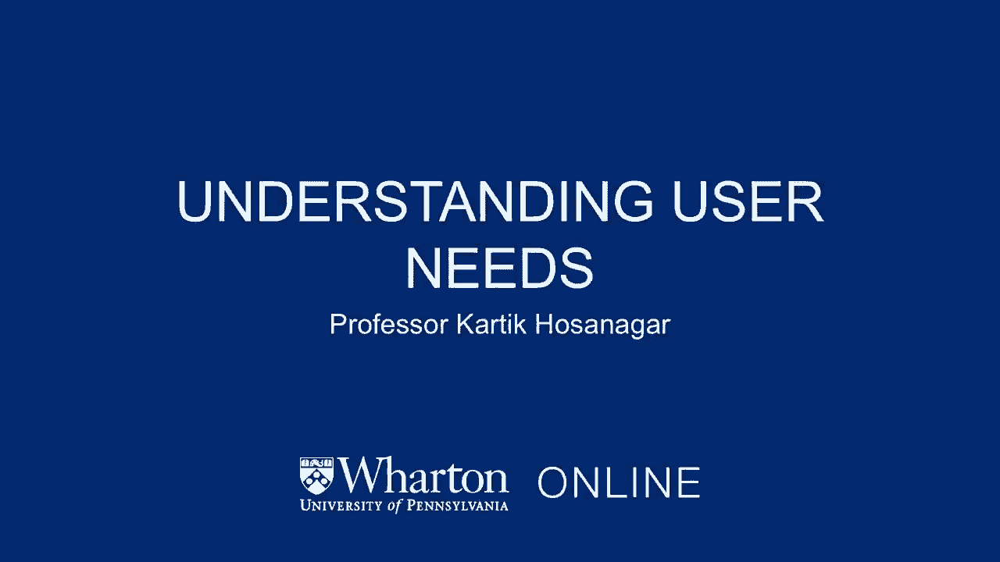

在我们潜入概念开发或产品开发之前，用户研究是了解用户需求的极好方法，为了确保产品开发是有方向的和有效的，这是至关重要的。

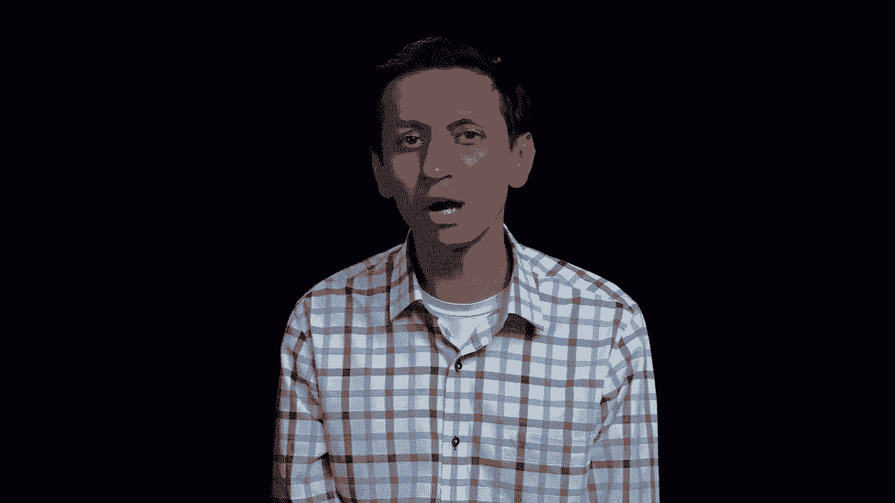

但在我们深入研究用户研究之前，警告，像Facebook和谷歌这样的公司在开发他们的产品之前可能从来没有做过任何正式的用户研究。

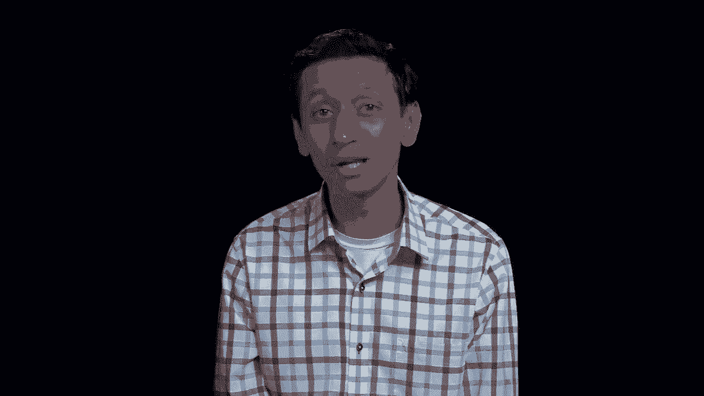

但却取得了巨大的成功，所以重要的是要承认。

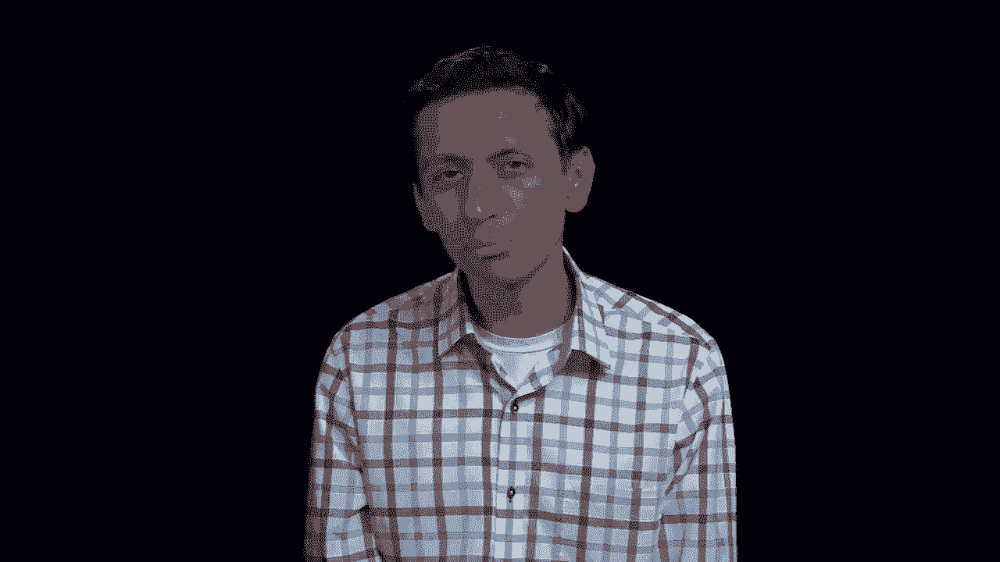

但话虽如此，同时，我们知道每一个谷歌和脸书，有成千上万的，事实上，可能有成千上万的企业家在没有必要的用户研究的情况下开发产品，却看到产品一败涂地，事实上，因为对企业家或工程师来说。

制造一种产品几乎是很自然的，基于你的假设。

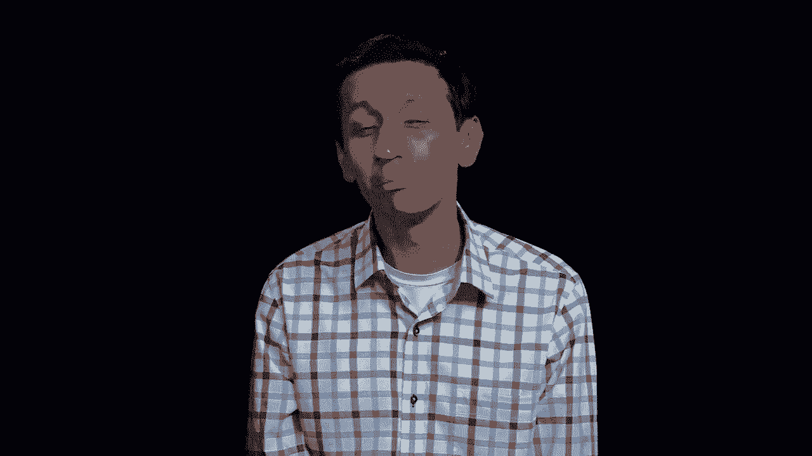

在我们的头脑中一切都有意义，但问题是用户是否真的重视产品，在没有用户研究的情况下，失败的机会可能很高，仅仅是因为您可能构建了一些对用户来说不是真正重要的痛点的东西，也可能是正确的痛点。

但你用错误的方式建造它，或者在产品市场适合之前，你可能会经历太多的迭代，因此你最终会浪费时间，用户研究可以帮助避免所有这些。

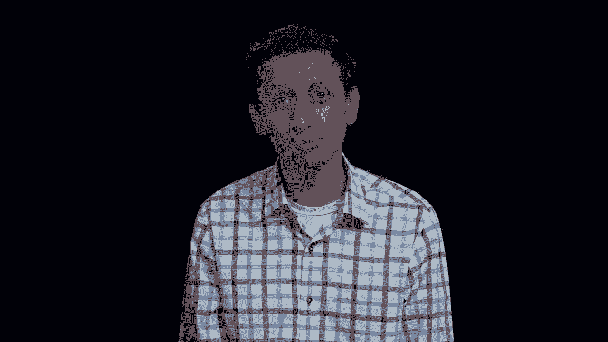

如果你考虑用户研究，真的有四个简单的步骤，第一步是从客户那里收集关于他们需求的原始数据，第二个是解释这些数据，下一个，我们根据我们观察到的不同类型来组织需求，所以我们可能会观察到多个人。

用不同的方式重复同样的需要，我们可能会把它们组织成不同的桶，最后，我们确定这些需求的相对重要性，并确定哪些是用户现在最迫切的。

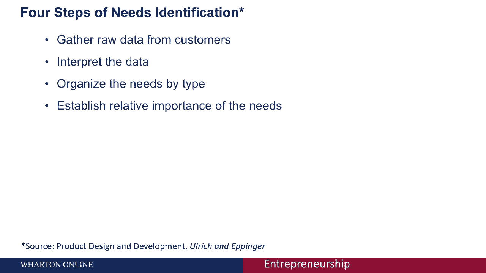

让我们从第一步开始，它正在收集客户需求的原始数据。

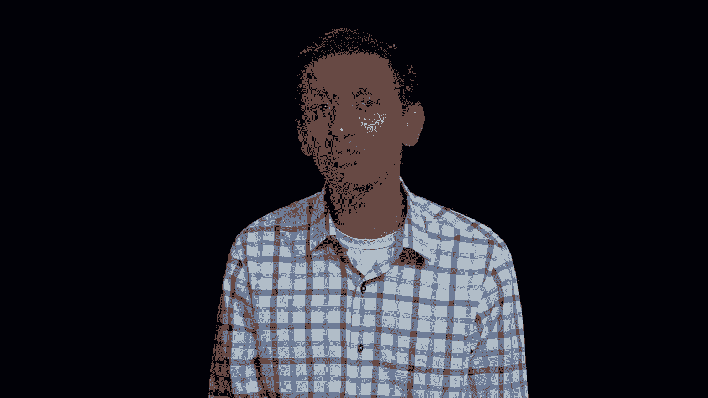

有很多方法可以做到这一点，一个流行的方法是现在使用调查，调查是好的，当你有具体的问题时，比如说，3。这种产品我应该怎样定价，需求有什么变化？3。如果我把价格降低，比如说两美元，或者为了优先考虑产品特性。

你知道特征A和特征B，用户会看重哪一个，它对这些非常直接的问题很有用，但在机会识别的早期阶段，调查不太有用，事实上，我们后来谈到了测试概念的调查和采访，一旦这些概念被发展出来，但在这个早期阶段。

当我们试图了解用户需求时，调查现在不太有用了，我们可用的另一个工具是有一个焦点小组，说八到十个顾客，现在焦点小组工作效率很高，你可以让你的参与者之间进行很好的讨论，但这也是一种非常昂贵的数据收集方法。

最后，你有面试，你有一对一的形式。

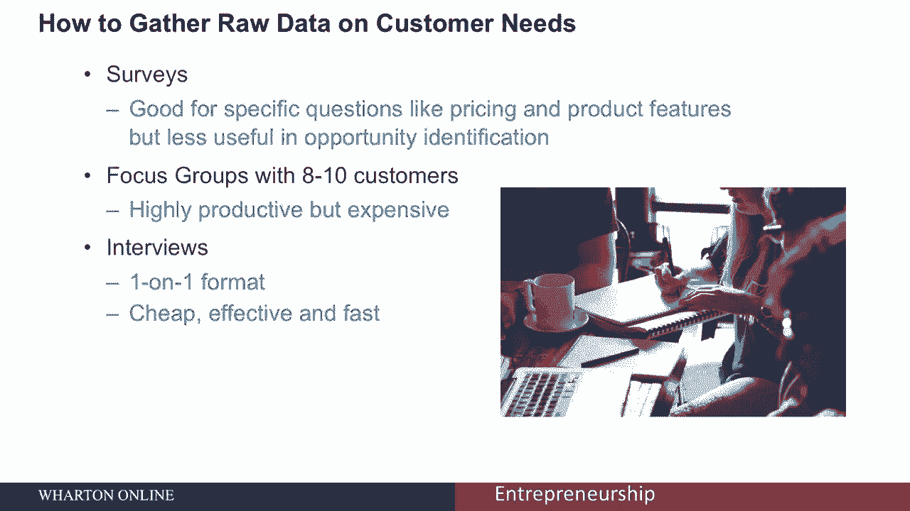

相对于焦点小组来说，这种形式往往有些便宜，而且往往几乎和焦点小组一样有效，而且速度快得多，因此，这是我个人收集用户需求的首选方法，所以我们会把重点放在采访上，以及如何进行采访。

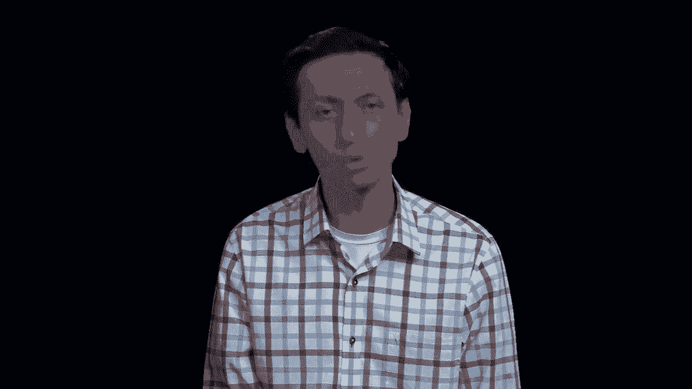

当我们试图进行面试时，出现的第一个问题，我们采访谁，我们要采访多少人，采访所有相关的利益相关者是很重要的，这包括最终用户，但也包括产品的购买者，买方不是最终使用者，它可能包括负责产品安装的IT人员。

在企业软件产品的情况下，它还包括顾问，他们为买家或用户提供建议。

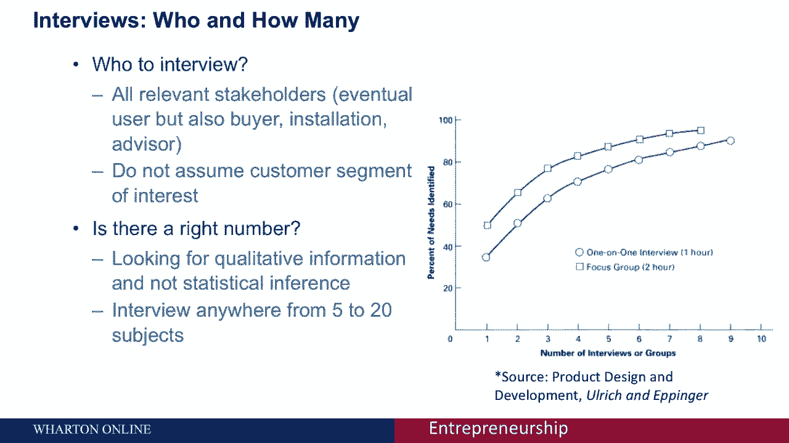

在他们的选择中，真正重要的是要记住什么，当你决定采访谁时，一个人不应该假设客户感兴趣的部分，您可能已经决定您产品的正确用户。

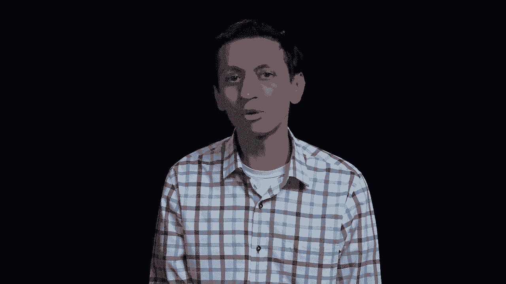

是年龄在二十岁到三十五岁之间的人，他来自一个，我不知道。

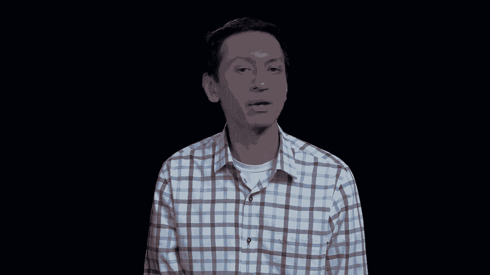

常春藤联盟大学从事咨询或软件工作，但那做得太大了。

过早的假设，所以你的样品要有足够的多样性是很重要的。

现在，问题是正确的数字是多少，嗯，这个问题没有好的答案，但重要的是要再次承认，我们试图在这个阶段鸟瞰用户的需求，所以我们在寻找定性信息，而不一定是统计推断，根据我们进行的采访。

所以我们不是在寻找1200个用户的大样本量来采访，取而代之的是，五到二十个受试者的样本量可能是正确的，在用户需求识别的早期阶段。

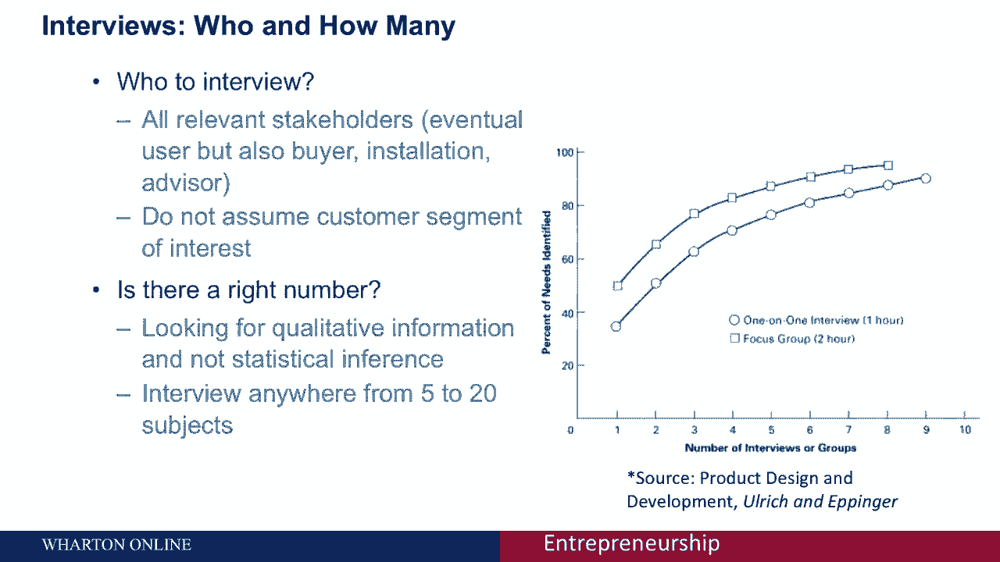

现在，如果你可能只有一个重要的利益相关者类别，也许采访五个受试者就足够了，但是如果你有很多不同的利益相关者，比如说，用户和买家不一样，有值得采访的顾问，在这种情况下，你现在可能会接近20岁。

我还应该指出，许多研究表明，一旦你采访了大约九到十个人，你很容易就得到了80%以上的用户需求，此外，访谈的表现几乎与焦点小组相当，所以最佳地点可能在十点左右。

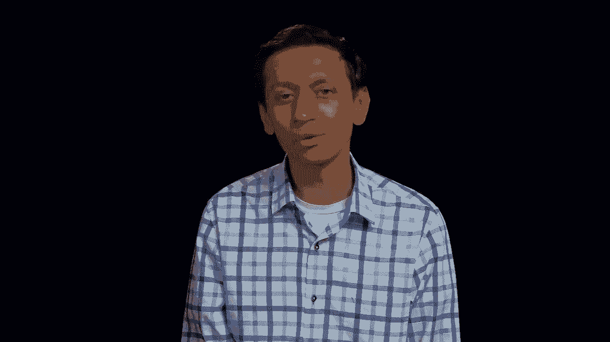

现在，一旦我们知道要采访谁和多少人。

问题是，面试应该如何进行，有几个最佳实践值得记住，首先，忘记你心目中的产品概念是非常重要的，在某种程度上，你已经在你的脑海中充实了它，而是更多地关注用户的需求。

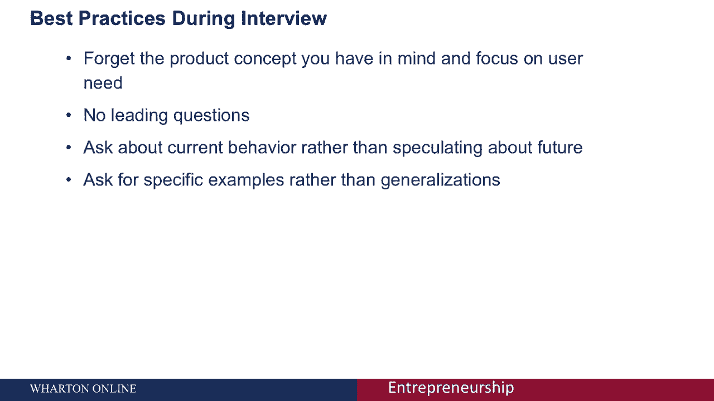

这很重要，因为向用户询问某种产品是很自然和诱人的，你心目中的，你可以问用户，你知道，你想要这个特定的产品还是这个功能，当然，受试者可能会说是，只是为了取悦你，所以不要问问题。

你重视这个功能吗，还是改用此功能，问他们更开放的问题，再次重要的是要记住，这是关于用户的，而不是在这个阶段关于产品，在思想发展的早期阶段不要问引导性的问题，问更多开放式问题，比如说，别问，你做这个吗。

而不是问你如何做你感兴趣的事情，当面试官也询问用户当前的行为时，而不是猜测他们未来可能的行为，所以不要问用户问题，喜欢你会用这个产品吗，或者我们不问他们关于，你将来怎么做这件事，而是问他们。

你目前如何做某事，因为人们真的不知道他们将来会怎么做，他们会推测，这不会有特别的信息，最后尽量具体，你的问题，并试图得到具体的答案，所以问例子，当提供的答案非常笼统时，所以我们不是在寻找概括。

我们正在寻找具体的故事，然后可以导致关于用户需求的有趣见解。

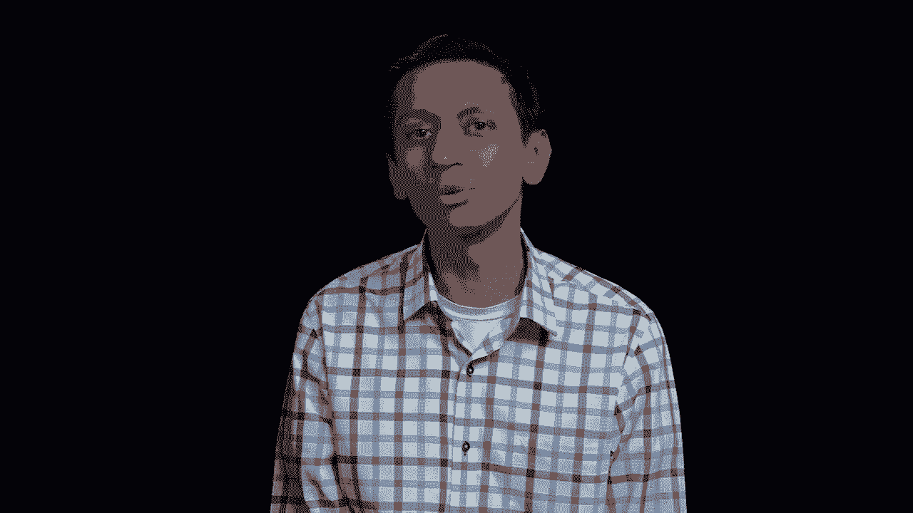

让我们也谈谈面试的内容，我们应该试着问什么。

我们希望从面试中得到什么，我的方法是在面试之外，我在寻找两种主要的见解，首先，我试图了解用户的行为模式，通过这个我可以理解不同的用户角色，反过来，你可能听说过的一个术语，也就是客户细分。

客户细分通常是关于人口统计的。

这是关于人们可能采取的角色，比如说，如果你使用谷歌文档，我们可能有不同的角色，我可能是创建文档的人，其他人可能与我合作，可能会编辑文档，因为它有编辑的角色，第三人可能扮演读者的角色。

他们并不真正编辑文档，但他们实际上是在消耗我创建的文档，所以现在这些是不同的规则，角色捕捉客户细分市场的一些特性。

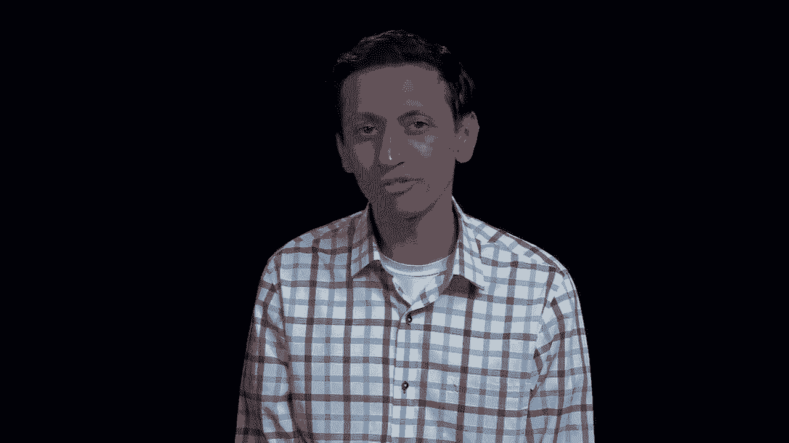

比如人口统计和角色，但他们也超越了，它们有很多行为信息，与用户如何做感兴趣的事情有关的行为模式，这反过来将预先反馈到产品设计中，我认为这就是角色和客户群的最大区别，这真的是一个角色将超越客户群体。

像人口统计这样的信息，并尝试进入最终反馈到产品设计中的行为。

除了用户行为专利，另一大类信息，我在面试中寻找，是了解客户旅程中的步骤或客户体验，比如说，如果我申请大学，那么步骤可能包括从和我的朋友谈论哪些大学开始，以及对哪些专业感兴趣，对他们来说。

基于这些对话和一些谷歌搜索，然后我可能会确定感兴趣的专业，然后我可能会查这些专业的大学排名，我可能会和这些大学的一些校友谈谈，并最终确定一小部分学院和专业，然后应用到这些地方，所以这就是旅行的本质。

因此，了解用户在这一旅程的每一步中实际做了什么是很重要的，用户的痛点是什么，用户的情绪是什么，在这段旅程的每一步都是积极的还是消极的，这将帮助我们了解在整个用户旅程中最紧迫的痛点在哪里。

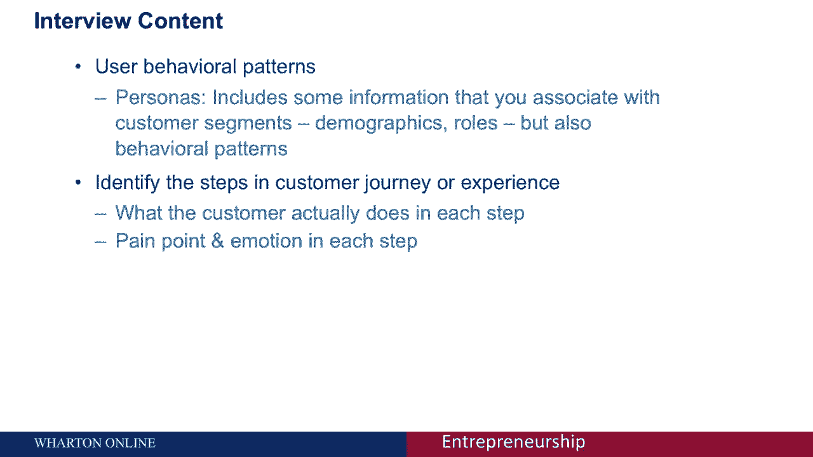

所以我现在要用一个采访来试着说明，你知道的，我在这次采访中谈到的一些原则，我假设我们有兴趣了解用户的需求，与饮食和营养有关，也许我们在脑海中有一个特定的概念，试图帮助人们做出更好的营养和饮食选择。

但这可能意味着几种不同的产品概念，它可能意味着一个门户，我们在那里为用户提供关于营养的信息，这可能意味着一个人们可以快速搜索卡路里和其他信息的应用程序，与他们正在考虑制作的特定食谱有关。

或者它可能是一个连接消费者和营养学家的市场，所以这些是非常不同的产品概念，与相同的基本原理联系在一起，帮助人们做出更好的营养选择的用户需求，所以我们将利用这次采访来更好地理解。

真正需要加入我的用户是斯蒂芬妮，所以斯蒂芬妮，我要问你，一堆与你的饮食和营养选择有关的问题，首先让我问你饮食或营养有多重要或突出，为了你，你多久会发现自己在想这件事。

并有意识地做出与此相关的决定，我想这几乎是我日常生活的一部分，从我还是个孩子的时候就开始了，在我成长的过程中，我做了很多运动，所以我不得不考虑我在吃什么和我的练习时间表，这伴随着我的整个成年期。

不是以同样的身份，就像我小时候一样，或者当我上中学的时候，但现在我跑了，我不一定称自己为跑步者，但我跑过半程马拉松，所以我知道我的训练计划中有锻炼，我的营养需要是什么，当我在那个训练团的时候。

给我举一两个选择的例子，你由你的锻炼方案驱动。

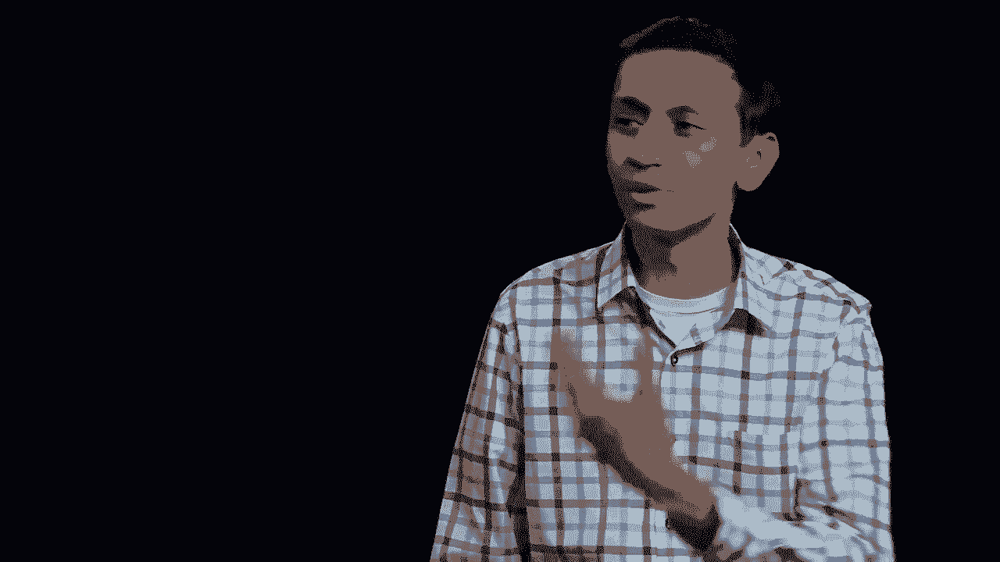

只是确保我在吃东西，你知道足够的碳水化合物，吃适当的蔬菜和水果，观察我的蛋白质摄入量，是不是太多了，是不是太少了，我最重要的是确保我喝足够的水，好的，所以我发现自己经常脱水。

所以这是我必须不断提醒自己喝水的地方，当你说它太多或太少的时候，你想的范围是多少？嗯，我没有，所以我对营养的看法，我不一定计算克或细节，但只是知道我晚餐需要吃像瘦蛋白质一样的东西。

也许我午餐吃了两分钟的碳水化合物，所以也许我应该平衡一下，晚餐吃沙拉和瘦蛋白质，记住这一点，这样我就不会吃三块饼干了，好的，也许我用一块饼干换了一块水果，那种事情，你觉得你的方法是被动的还是预防性的。

我想说大多数时候这是预防性的，我成年后一直努力保持体重，由于生病和生病，我在这方面有一些波动，不得不走过场，你知道的，病愈后再次校准身体，所以，嗯，我想这是我试图预防的事情，然后很明显，如果我在训练。

我认为人们对此有一点反应，因为你在倾听你的身体，试图在精神上度过任何事情，你在为正确而训练，所以很明显，你的训练驱动了你的很多选择，但是有没有。

你知道吗，思考一个家庭成员可能患有的慢性病，或，或者这可能是很多新闻。

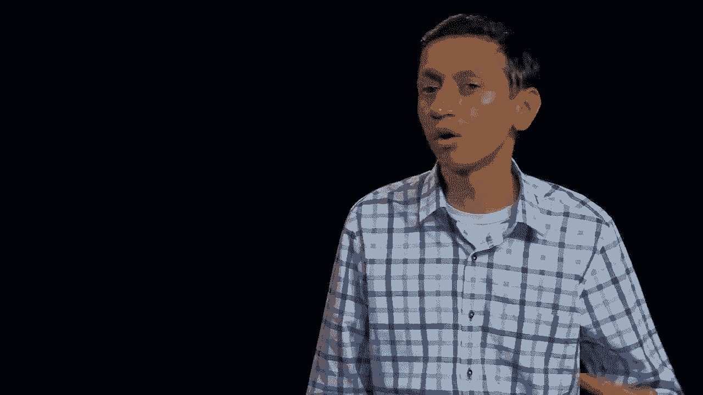

这也可能推动其中一些选择，是啊，是啊，我认为主要的是，我们有癌症和糖尿病的家族史，所以这些是我脑海中普遍存在的事情，我做的一些选择，确保我在锻炼，我定期去看医生，每年体检一次，去看专家，如果我需要。

只是认识到我正在采取的饮食，看着我的糖，不吃高脂肪的食物，所以当你说糖和脂肪食物时，这又是由糖尿病或癌症驱动的。

而这些种类，是的我一直在想我越老，我相信保持健康和健康可能会更加困难，所以如果你现在能采取这些行动知道你的饮食中应该有什么，应该是什么，所以你能给我举个例子吗。

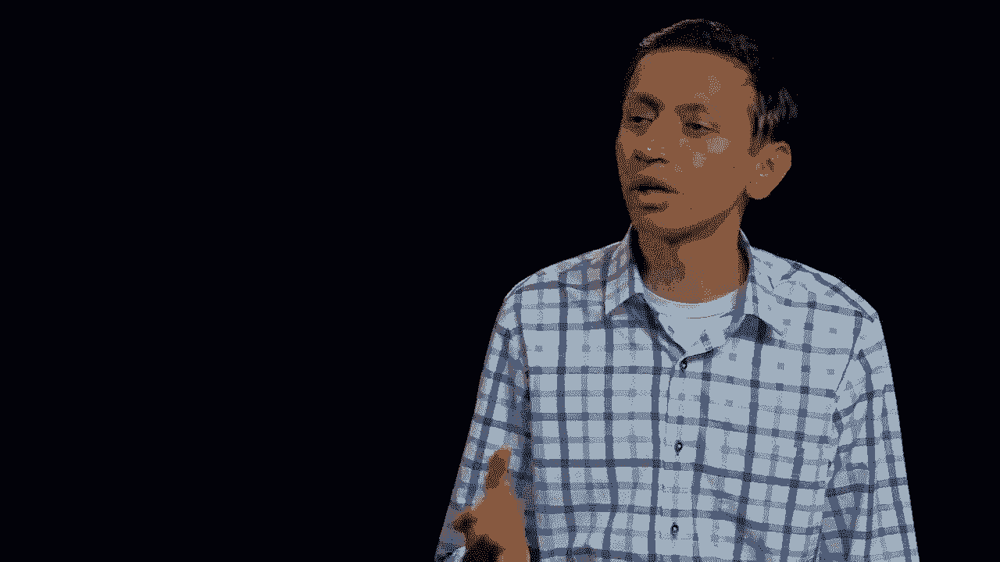

你知道的，任何你真正改变饮食的情况，那个过程是什么，或者像第一个触发点一样的旅程，然后你从哪里得到额外的信息。

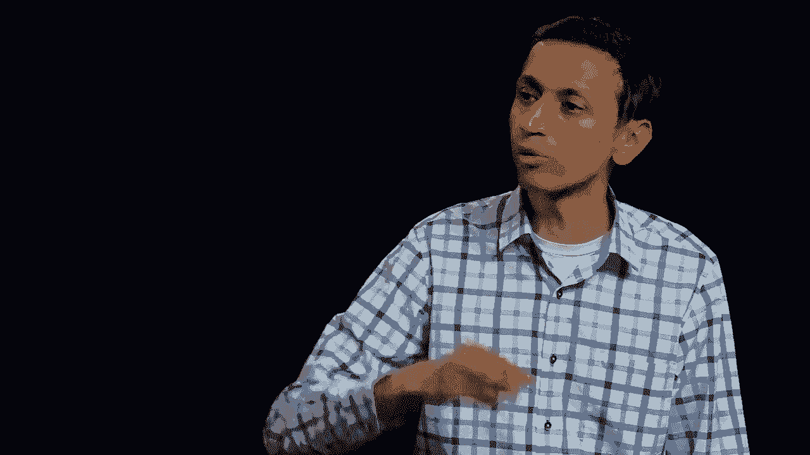

你是怎么改的，只要带我走过各个步骤就行了。

所以我实际上在西非国外工作了两年，好吧，当我回来的时候，我有寄生虫，寄生虫，毁了我很多身体，真的影响了我的身体对我吃的某些食物的反应，所以我真的不得不坐下来思考，是什么引发了我身体的反应。

所以我和一位营养学家和几位医生一起研究这个问题，但除了他们给我的信息，我做了很多研究，主要在互联网上，和其他可能有类似情况的人交谈，这正常吗，你做了什么，或者你知道你多久有这种感觉，那种事情，好吧。

这里的顺序可能是什么，听起来去看医生是第一个序列，在这个序列中的第一步是营养学家。

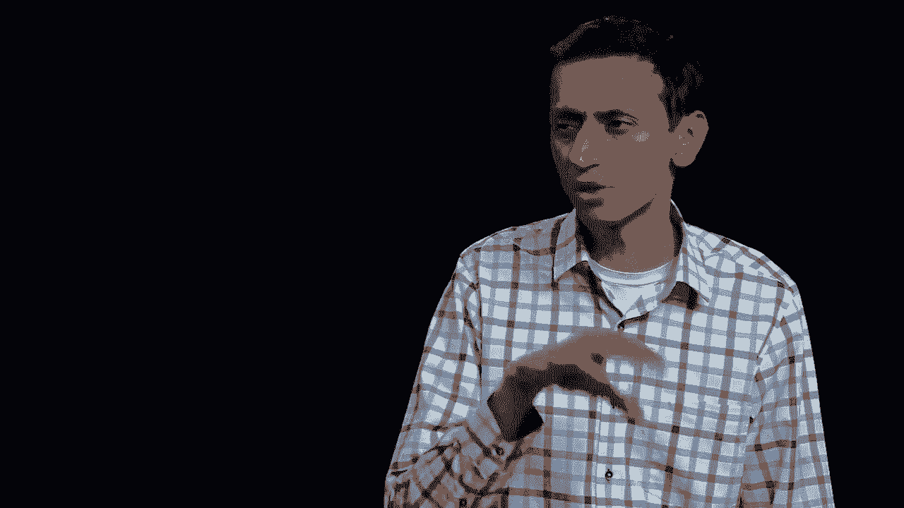

还是在和朋友说话。

还是在网上研究，嗯，首先是意识到症状是什么，是啊，是啊，这促使我去看医生，有些不对劲，所以我去看医生被转诊给另一个医生，然后就这样，建议也和医生的营养师谈谈，医生给出了建议，是呀。

这样我就能定期和某人见面谈论美食杂志，把这些事情写下来，想出一个计划，如何评估我是如何照顾自己的，如果我的饮食或调整有什么问题，以及这是如何影响的，我的感受，好的，你提到了一本食物杂志。

所以即使在今天你也保持着，我今天不维护它，但是嗯，我想也许在精神上我保持了它，我意识到，我吃得更多的是什么，和某些食物，我只是避免或试图避免，因为我仍然会联想到他们给我的感觉，当我以前生病的时候。

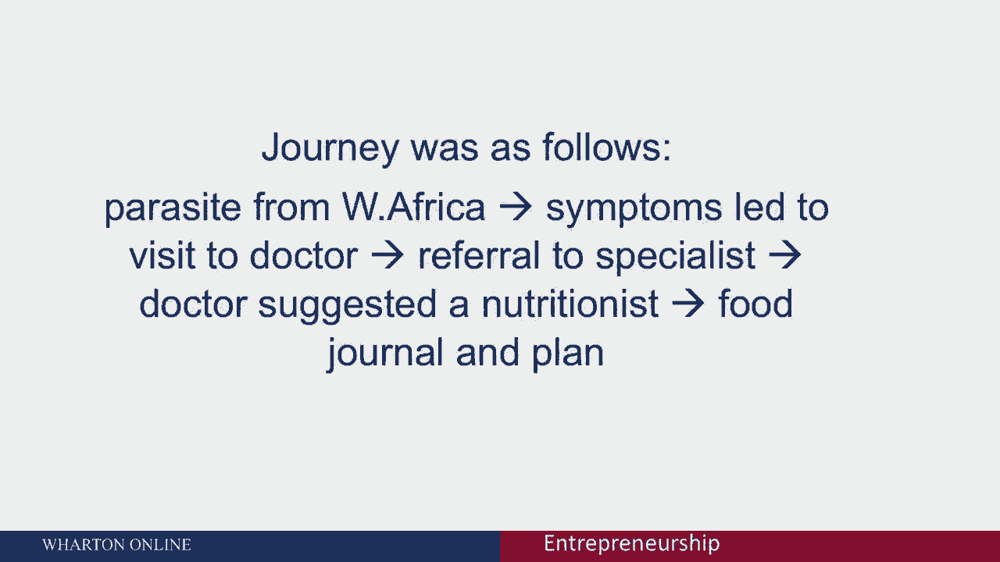

当你讨论这些步骤时。

就像医生一样，营养学家在线研究，与朋友和家人交谈。

然后最终得出你今天满意的营养选择。

那是一系列相对平稳的步骤吗，或者在这个过程中是否有某些步骤或部分更痛苦，在那里需要更长的时间来获得必要的信息，或者获得必要的动力，为了做出改变，否，我会说这是一个相当稳定的过程，它是相当线性的。

我想我的挫折是有时你知道你，你和一个医生说话，他们不太确定，所以你在等待其他的想法和测试，我和那个，但一旦我知道问题出在哪里，最初是一个尝试和错误，但有一次我有一个过程，今天我得去见营养师。

我必须这么做，我得确保我吃的不是这个，嗯，还算顺利，最关键的时刻是什么，或者是当你遇到营养师的时候，还是你在网上找到的，还是朋友或家人给了你批判性的洞察力。

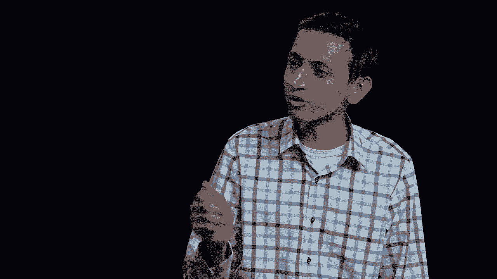

还是没有这样的啊哈时刻。

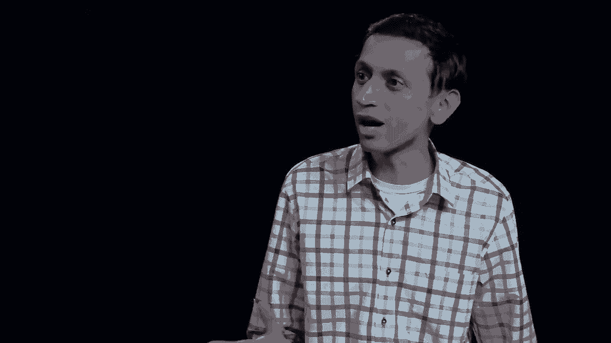

但这只是一系列小的渐进步骤，我认为这更多的是一系列小的和渐进的步骤，嗯，使用这些不同资源的结合，不管是医生，营养学家，我自己，真正倾听我身体的纪律，知道我需要做什么，嗯，但那是它是渐进的，我不记得曾经。

哦是的，我想通了，没关系。

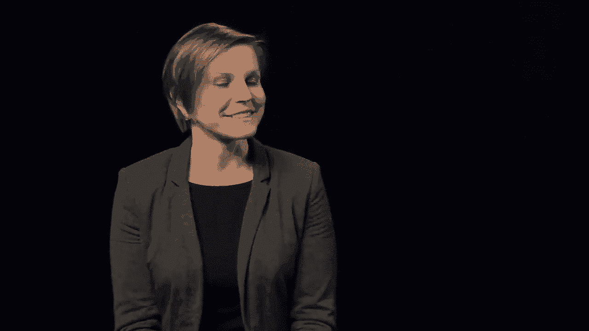

最后与营养联系在一起，与此相关的最后一个问题是，如果你想到。

你知道这是否是获取信息，或者是接触营养师或医生这样的人。

还是你知道它的动机和行为方面。

你知道是什么让你承诺，在这段旅程中，任何一个因素都比其他因素更难。

你说过的，我觉得，主要是，只是我自己的行为，我自己的自律，和自我调节，你知道的，记住我需要做什么，如果我需要帮助，或者我感觉不舒服之类的，不要试图自己弄清楚，去看医生，和他们谈谈发生了什么，并保持健康。

最后，我想了解你生活方式的其他方面。

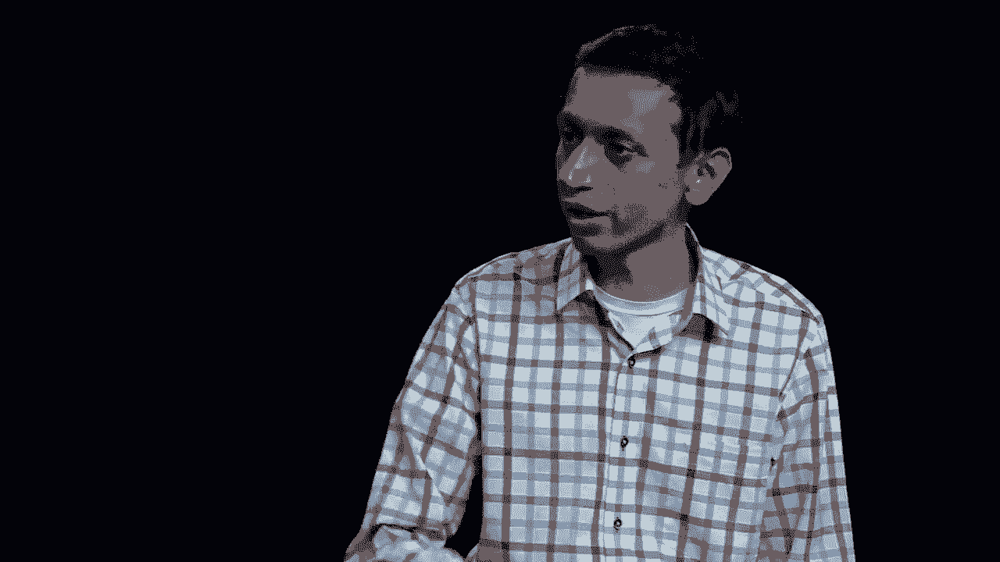

与健康和营养无关的，你认为自己精通技术吗。

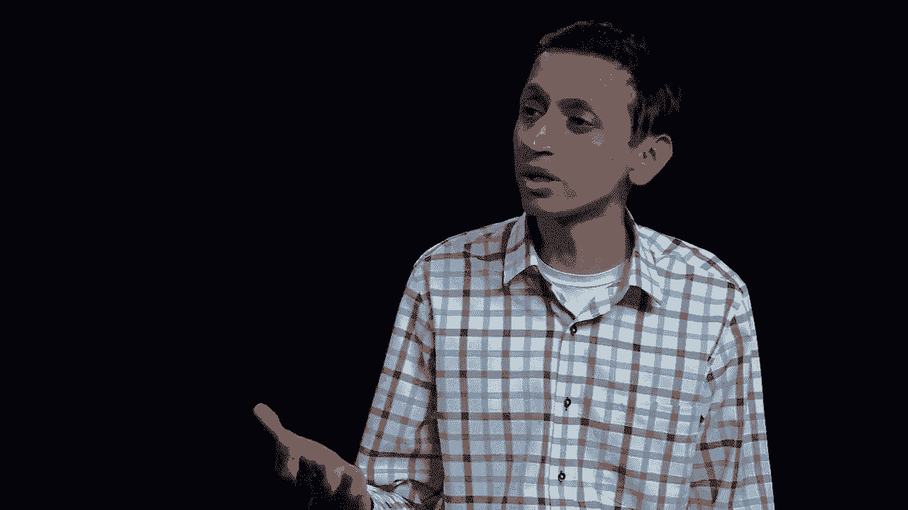

或者是相对的技术新手，我会说我很精明。

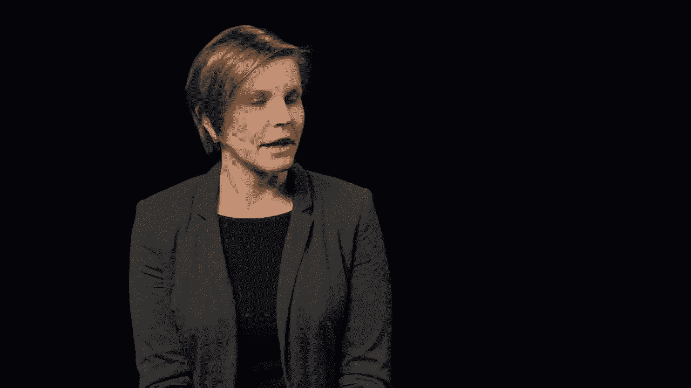

好的，你又知道了，让我们来谈谈一些网站和一些工具，嗯，你可能会使用，你用Facebook吗，是呀，推特怎么样，是呀，你使用Facebook以外的消息吗，消息传递，就像，比如说Skype或谷歌聊天。

或者这些啊，是呀，他们用所有这些，我会把它们都用上，好的，优步和Airbnb怎么样，你用过这些东西吗？是呀，我两个都用过，你两个都用了，好的，嗯，让我问你关于健康相关的网站，你去过什么。

像WebMD或者Liong。

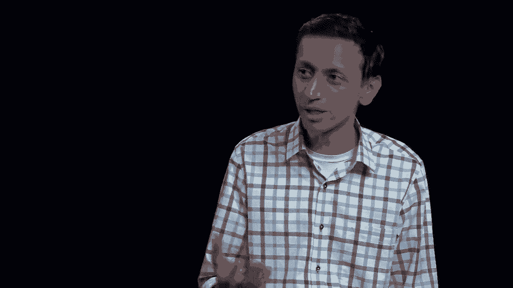

或任何其他网站，是啊，是啊，韦伯姆，我也经常上疾控中心的网站，只是你知道我喜欢，因为我以前所有的旅行，了解不同疾病的某些知识，以及免疫接种，保持所有这些东西的最新对我来说很重要。

所以我检查了一下看看有什么症状，你知道的，即使只是流感感冒症状，两者的区别，所以是的，我会说，获得这些政府资源，也看到当地卫生所可能提供的，你知道的，他们提供某种健康吗，或者营养日。

或者类似的东西你买过健康相关的产品吗，特别是与饮食和营养有关的产品，所以你很清楚地谈到了。

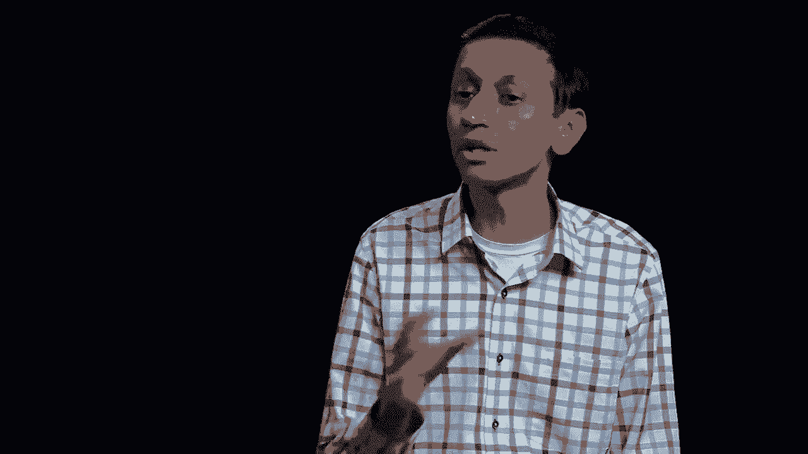

为营养师等提供者付费，你曾经为任何，帮助你做出更好选择的软件或数字产品，是一个帮助你制作，帮助你跟踪你的饮食，营养或帮助做出选择，或者健身追踪器什么的，任何与健康和营养有关的产品。

所以我有一个心率监测器，你知道它跟踪你的心率，嗯，我没有像Fitbit这样的东西，但我手机上有一个应用程序，好的，是一个免费的应用程序还是一个页面，这是一个免费的应用程序，是啊，是啊。

但这是我一直在努力的方向，我真的很想，你知道一种可穿戴的东西，这样我就可以更有规律地跟踪事情，好了，现在，如果你的雇主曾经为你提供过免费服务，你可以用，那就是，你知道，比如说，咨询营养师或信息。

或者那种性质的东西，你会考虑用它吗，如果对你来说是免费的，好吧，你自己，你会从口袋里掏钱去寻求这些服务吗，在预防的基础上，如果没有条件需要担心，我想我会，是啊，是啊，好的。

但听起来就目前的健康相关产品而言。

你不一定要为其中任何一个付钱不，我不好，但我不反对付钱给他们，好的，所有的权利，非常感谢，谢谢。最后，一旦面试结束，我们收集所有的数据，我们处理采访记录或笔记。

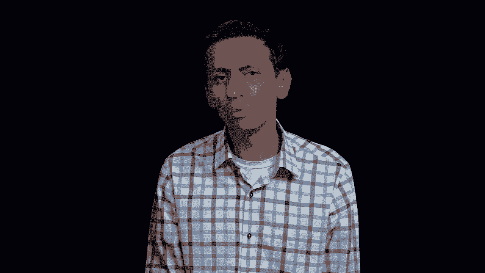

我们解释说，我们识别出不同主题提到的所有不同需求，然后我们可以将这些需求组织成不同的类型，一旦我们做到了，然后我们可能会试图确定它们的相对重要性，我们可以通过看到这些需求被提及的次数来做到这一点。

我们可能会看到人们在谈论这种需求时传达的实际情感，或者我们可以观察他们的肢体语言，但最终所有这些都帮助我们确定哪些是最重要的需求。

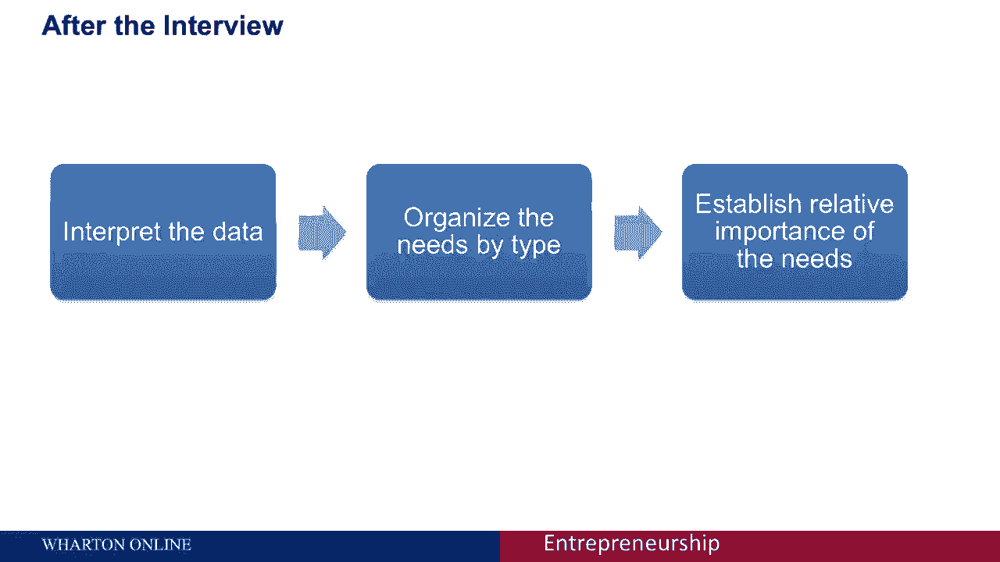

所以总而言之，通过访谈进行用户研究是了解用户需求的一种非常有用的方法，在我们潜入产品开发甚至概念开发之前。

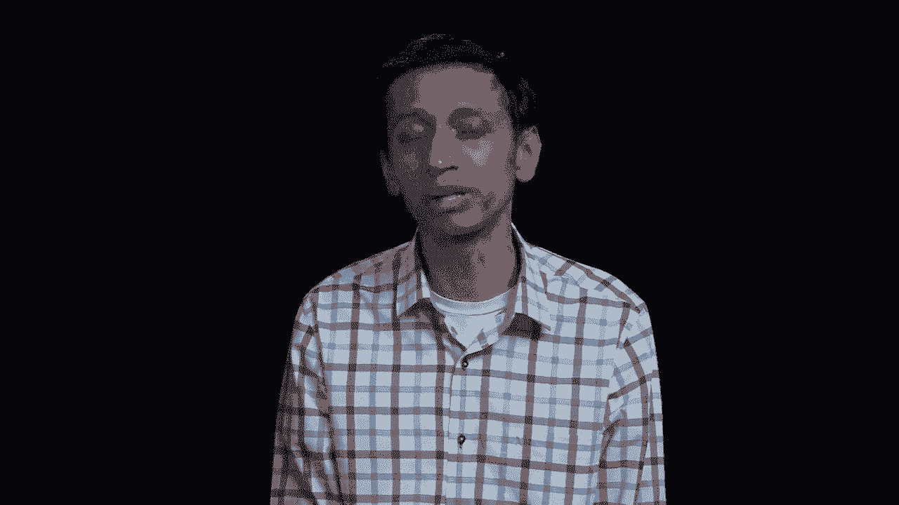

它可以帮助节省大量的时间和金钱，它有助于确定用户需求的优先级，并有助于避免您认为重要但与用户真正无关的功能，它还有助于减少进入产品市场所需的产品迭代次数。

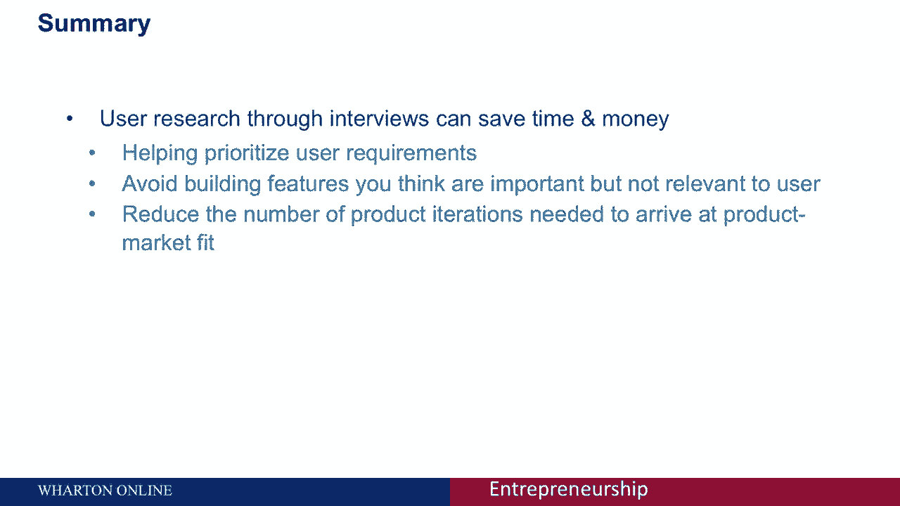

下一个适合，我将通过实际采访来说明这些原则。

