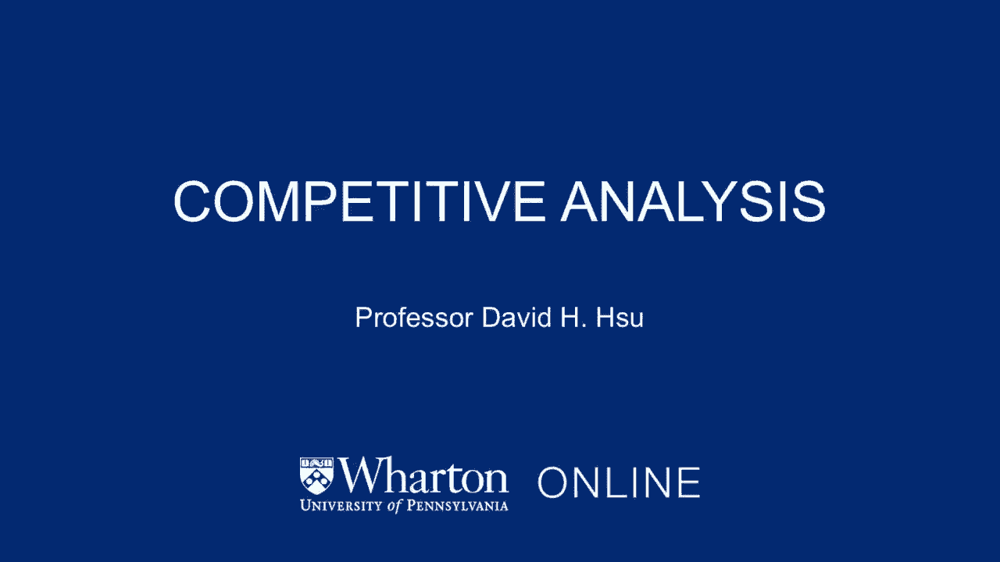
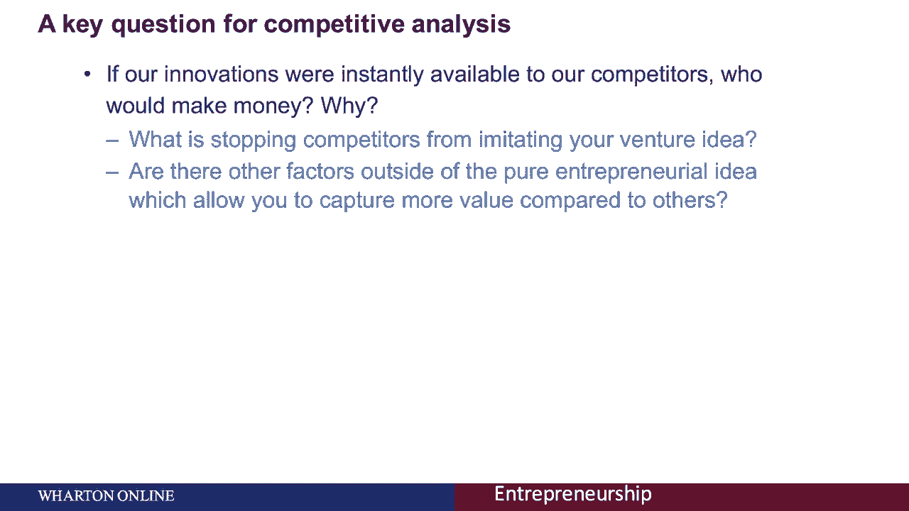
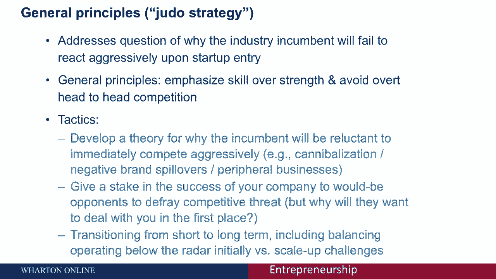
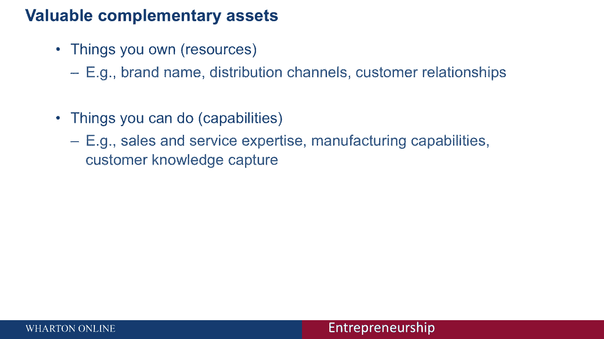
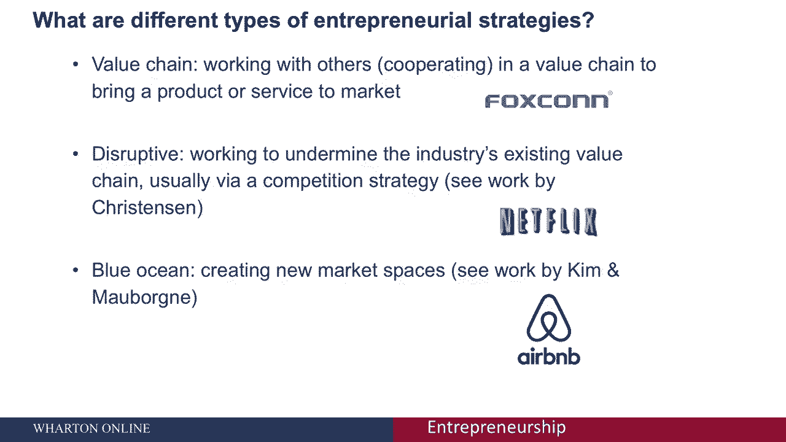

# 【沃顿商学院】创业 四部曲：发现机会、建立公司、增长战略、融资和盈利 - P20：[P20]03_3-3-competitive-analysis - 知识旅行家 - BV19Y411q713

作为一个新进入者，我们可能会考虑的关键问题之一。

在新的市场空间，这个问题，如果我们的创新立即提供给我们所有的竞争对手会发生什么。

这个问题确实迫使我们面对和深入思考，我们公司真正能够获得回报的基础是什么，与其他可能进入该领域的人相比。

现在，摆桌子。

我想介绍一个一般原则，我要把它变成柔道策略，这里的图像是。

如果你是创业中心，你怎么能翻转或退出，竞争一个更大的现任者。

毕竟，这是你作为新进入者或创业企业家所面临的基本挑战。

在给定的空间里，它真的迫使我们思考这个问题，与局外人相比，你在什么基础上会有任何形式的影响力，总的来说，它将强调技能而不是力量。

它将强调这种概念。

我们怎样才能避免面对面的竞争。

因为毕竟，现任者的口袋会大得多，将有一个更成熟的企业声誉。

与任何新市场空间的任何新进入者相比。

因此，让我们来谈谈作为一个创业企业家，你可能会使用的几种策略。

第一个是你必须真正能够发展一个理论，为什么现任者没有动力进来，马上和你激烈竞争，现在，那可能是因为你在雷达屏幕下面飞行，现任者并没有真正注意到你，但即使现任者注意到你是，作为企业家，你可以思考一些理论。

为什么你至少会有一些小的时间窗口，在这种情况下，现任者不会有巨大的激励来进来，咄咄逼人地与你竞争，这些可能是因为，比如说，现任者不想蚕食其现有的产品或服务，可能是因为进入新的市场空间。

您作为初创企业所覆盖的，我们会有负面的溢出效应，与现任者的家庭或旗舰产品相比，让我用一个例子来说明，以红牛为例，新进入美国。

现任玩家可能是可口可乐。

现在红牛有意识地建立了一个更加前卫的声誉或地位，极端，这是由建筑造成的。

这是一个非常不同的定位或品牌与可口可乐。

正在努力培养家庭形象，健康等等。

因为红牛在建筑上真的试图与它保持距离。

健康的品牌形象，家庭声誉，古柯，可乐。

可能不太愿意进来，并在新的市场空间中激烈竞争。

你可能会使用的第二个策略是给一个赌注，在你与现任者的创业成功中，在某种程度上，这是一个双赢的命题，你作为初创企业所做的电池，就他们的表现而言，现任者做得越好，在你的业务成功中拥有股权或版税股份，这将。

现在，真正运用战略的前提是，确保你有一个引人注目的价值主张，以至于现任者想和你做一笔交易，这里的最后一个方面，就战术而言，能够转换短期机会窗口，作为初创企业，你可以进入，并采取进一步行动。

这样你就能把一个成功转化为另一个成功。

这将延长机会窗口，现在想象一下，你的竞争对手可以立即获得你的创新，在你进入保护你的东西后不久，这就引发了一个紧密持有的补充资产的概念。

补充资产，是将特定的技术创新转化为商业回报所必需的资产吗。

这些例子是这样的。

卓越--你现在培养品牌的知识或能力，这里重要的是成为竞争优势的基础，这些补充资产必须紧紧抓住，那就是它们必须是独一无二的，它们不可能普遍提供给行业中的每个人，现在考虑半导体芯片设计者的背景。

如果所有这些设计师都能进入同一个制造设施来制造。

这些芯片的制造将不再是任何竞争优势的基础。

因为这个行业的每个人都可以进入同样的制造设施。

因此不再是竞争优势的基础。

现在这些互补的资产分为两个桶，首先是你拥有资源的东西，第二个是你可以做的事情--组织能力或能力，你拥有的资源可以是品牌名称或客户关系，而你可以做的事情--组织能力--可以是。

捕捉客户的信息和他们喜欢什么。

最后，让我给你们举三个不同的创业策略的例子，当谈到进入时。

这可能是竞争优势的基础。

一是价值链战略，这本质上是一种合作策略，你在哪里，因为初创企业正在努力加强现有的价值链，但在价值链的某些方面进行创新，想想Foxon，这家公司实际上是制造商，iPhone，iPad和Kindle。

他们进入了苹果和亚马逊的价值链，通过在价值链的一个环节上进行创新，但比苹果、苹果或亚马逊做得更好、更有效，可以自己做，这是第一个策略，第二种策略本质上是一种竞争策略，颠覆性战略，作为一个创业企业家。

你试图颠覆价值链，行业现有价值链，我们在这里说的是，呃，哈佛大学的克雷克里斯滕森所阐述的理论，商学院等给出了一个具体的例子。

考虑一下Netflix，这家公司正在提供。

媒体内容。

在进入的早期，互联网上的电影，老牌行业现任者一鸣惊人，他们有一种非常特殊的方式向消费者分发电影。

那就是消费者会开车去大卖场看看，Netflix开创了一个颠覆性的战略。

基本上是通过邮寄DVD来代替Blockbuster。

然后流式传输内容，真的，这是一个不同的价值链，取代了行业现任者的市场力量。

最后还有第三种策略，这里的蓝海战略，它不一定与颠覆性战略相互排斥，但这里的本质是你试图发现新的市场空间，正如这一战略的倡导者所阐述的那样，欧洲工商管理学院的教授们给出了一个具体的例子，考虑Airbnb。

这是一家允许同行或用户进入的公司，租公寓或公寓的房间，它实际上是一个点对点类型的平台，它正在发现新的市场空间，因为从来没有人想到这会是一个可行的业务的基础，但最终造成了相当大的破坏，发现新的市场空间。

这最终使希尔顿等公司的市值黯然失色，喜来登酒店。

所以总而言之，我们已经覆盖了一些，呃。

进入者能够真正支付竞争费用并解决问题的策略。

什么，如果竞争对手能立即获得我们开创的创新，作为一个初创企业，根据什么，我们真的能赢吗，与那些竞争者竞争。

