# 【沃顿商学院】创业 四部曲：发现机会、建立公司、增长战略、融资和盈利 - P26：[P26]01_4-1-the-elevator-pitch - 知识旅行家 - BV19Y411q713

今天我们将讨论你的高水平投球，传统上，电梯推销是商业计划的总结，这是一种提取大文件的方法，比如150页的商业计划书变成更简洁的版本，现在电梯推销是你业务的独立展示，它可能包括像问题或痛点这样的东西。

你的解决方案，您的业务竞争对手的目标市场，团队。

财务摘要和今后的里程碑，然而，其中一个误解是，这些东西都需要包括在你的推销中，有一个正确的方法来订购你的投球，现实是音高变了，音高实际上取决于多种因素。

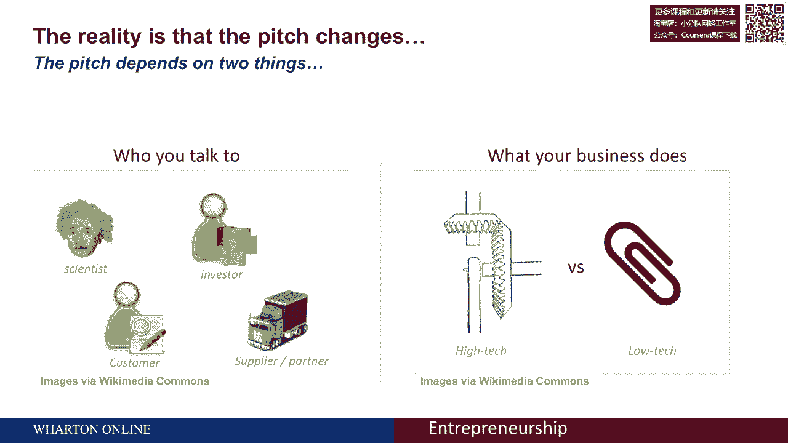

包括你和谁说话，你的业务是做什么的，知道你是否在和投资者说话是很重要的，比如说，或潜在客户。

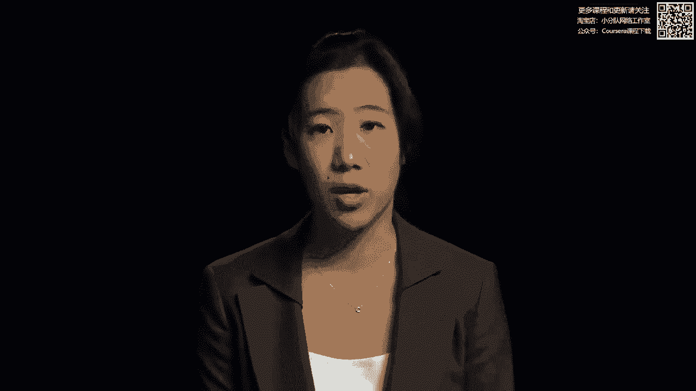

了解你的业务是否是高科技和非常复杂的，或者更低的技术。

让我们从你的观众开始，你在跟谁说话？首先要记住的是，作为一个企业家，你总是在推销，你的演讲看起来像什么取决于你在和谁说话，然而，成功的推销会根据手头的目的定制信息，所以你可以从你目前需要的角度来考虑。

是融资吗，它是否与潜在的员工交谈等等，最相关的交流方式是什么，这条信息将是如此，如果你在考虑融资，你要想想你能提供什么，它有什么特别之处，什么能让你赢，增加你潜在的金融家投资的价值。

如果你在和一个潜在的员工说话，比如说，你可能会想为什么他们应该选择这份工作而不是另一份工作，他们会采纳你的观点吗，他们能在这项工作中取得成功吗？如果你在考虑潜在客户。

与沟通相关的是为什么他们会选择你的产品或服务而不是另一个，以及它将如何具体地为他们带来价值，潜在合作伙伴，另一方面，你可能想交流，为什么要一起工作。

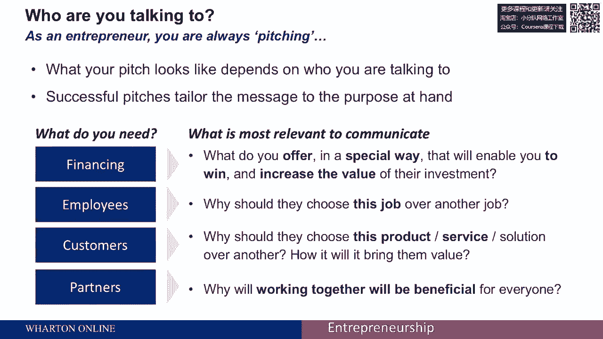

对每个人都有好处，您的产品或服务对听众来说很重要。

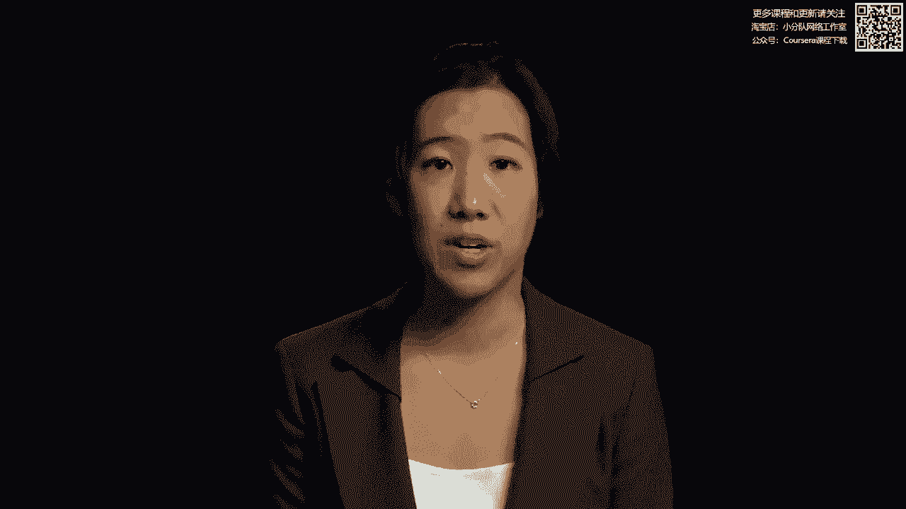

你还需要考虑要进入的细节级别，然而，在你知道你所做的之后，你需要决定在多大程度上深入你的产品或服务，一种思考的方式是推销并不是经常销售，人们总认为推销和销售是一样的，更多的是产生兴趣和开始对话。

这不是单行道，在那里你说话并试图交流一些东西，但事实上，你试图给出你的土地和你的愿景，并开始对话，一种思考的方法是把它分为两个不同的阶段，整个演讲可能由第一阶段组成，你在那里说话，第二阶段你要回答问题。

你可能会在第一阶段来来回回，你要做的是确立你的业务是做什么的，你试图传达你的愿景和你的土地，你在这里的目的是以高水平的方式解释你的产品。

你不一定想进入细节和本质，你想引起兴趣，这样在下一个层次上，问题就会很有趣，它会让你在第二阶段大放异彩。

你在回答问题，这些是听众更具体的问题，你想确保有关键问题，关切和疑虑得到解决，这是增加你的可信度和在他们眼中建立合法性的一种方法，当他们有疑问的时候，你就能回答他们的问题，真正发光发热。

为进一步的对话产生兴趣，推销的重点通常是创造对话，并创造一个立场，从这个立场上你可以讨论未来的事情。

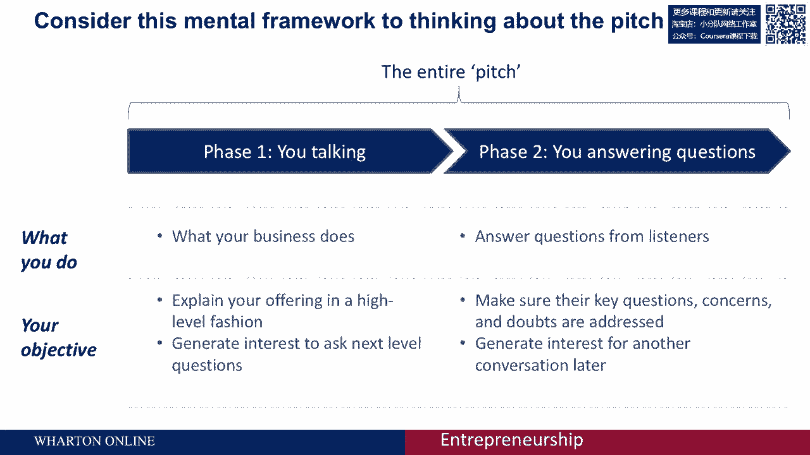

就详细程度而言，你可以从你的观众对VIS的知识的角度来考虑它，您的产品或服务的特定属性。

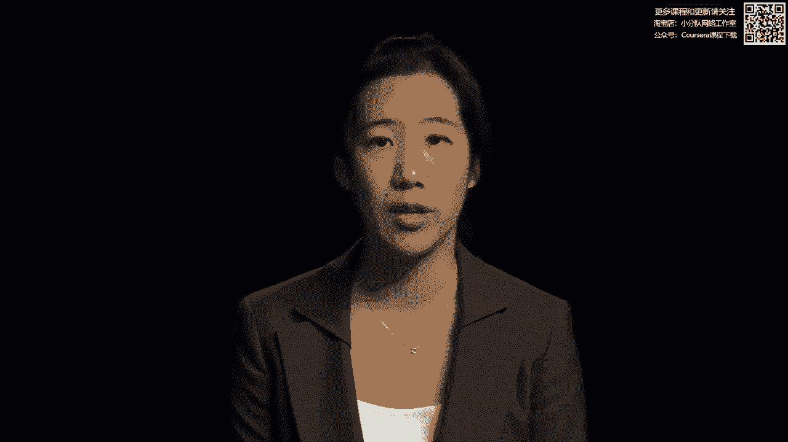

你可能要考虑一下你提供的产品的复杂性，和你的听众在左上角框中的知识水平，这就是您提供的复杂性极高的地方，但你的观众知识很低，人们往往对这个盒子有最大的麻烦，倾向于过于深入技术细节，你最终失去了你的观众。

发生这种情况是因为你很了解你的产品，你假设你的观众也会知道你产品的技术细节。

当他们实际上没有作为一个例子。

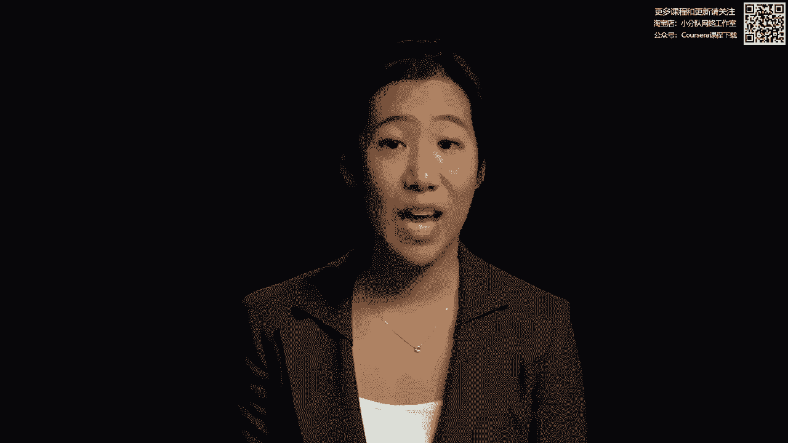

让我们在Evernote上观看这场比赛，嗨，我是菲尔·利宾，Evernote的首席执行官，永远不知道你的外脑，每当有什么重要的事情发生，你可以把它放进Evernote，你会一直把它放在手边。

当你需要的时候，您可以将Evernote与当前拥有的许多设备一起使用，我们有一个适用于Windows和Mac的版本，您也可以将其用于任何Web浏览器，任何电话或相机，现在你的记忆有很多不同的形状。

有很多东西你想记住，所以你可以用每一个音符，例如给某人的名片拍照，或者拍一张你想记住的白板或酒标的照片，或者你可以给自己留一条短信或语音短信，所有这些信息都上传到Evernote服务器。

在那里处理和索引，让你做一些事情，比如搜索图像中的所有文本，允许您按位置搜索，然后将信息同步回您的客户机，所以它总是在手边，所以你总能找到你需要的，无论你在哪里，evernote有两个订阅级别。

您有免费订阅和高级订阅，额外订阅费是每月五美元，你可以得到几乎无限的存储空间和各种各样的其他好东西，谢谢。正如我们刚刚看到的，Evernote的创始人对他的公司很了解。

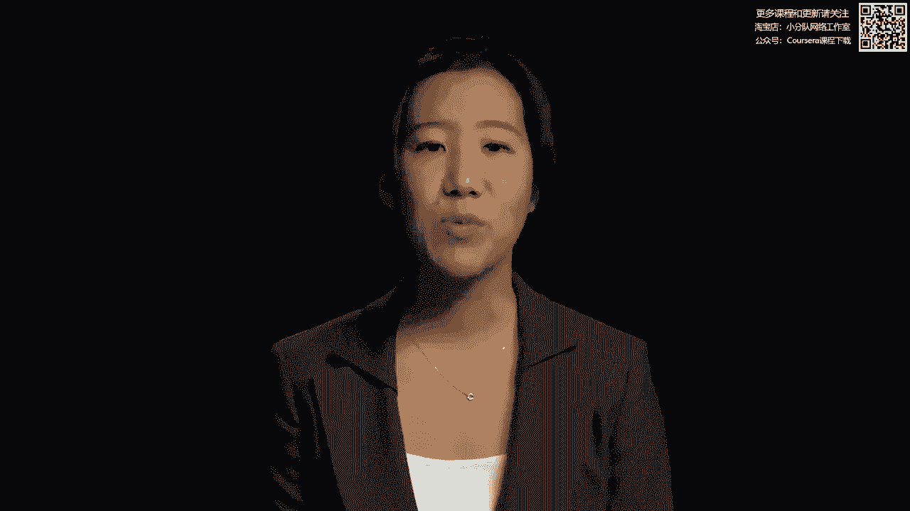

就像他应该做的那样，他谈到了他的产品的许多特殊属性，他谈到了所有不同的定价选择。

他真正做的是专注于上面的一组盒子，然而，他没有想到的是他的观众的知识，如果他的观众不熟悉Evernote。

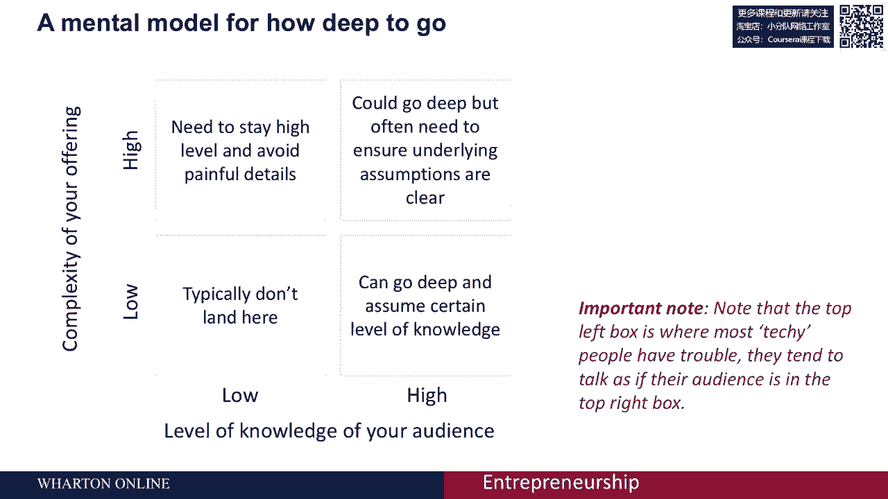

他可能会失去很多潜在的客户，因为他们不熟悉公司的工作，需要他在什么方面保持更高的水平，特定的产品和内容本身同样重要。

你给人的印象是企业家，在我的一些研究中，比如说，我发现真实性和激情等属性是至关重要的。

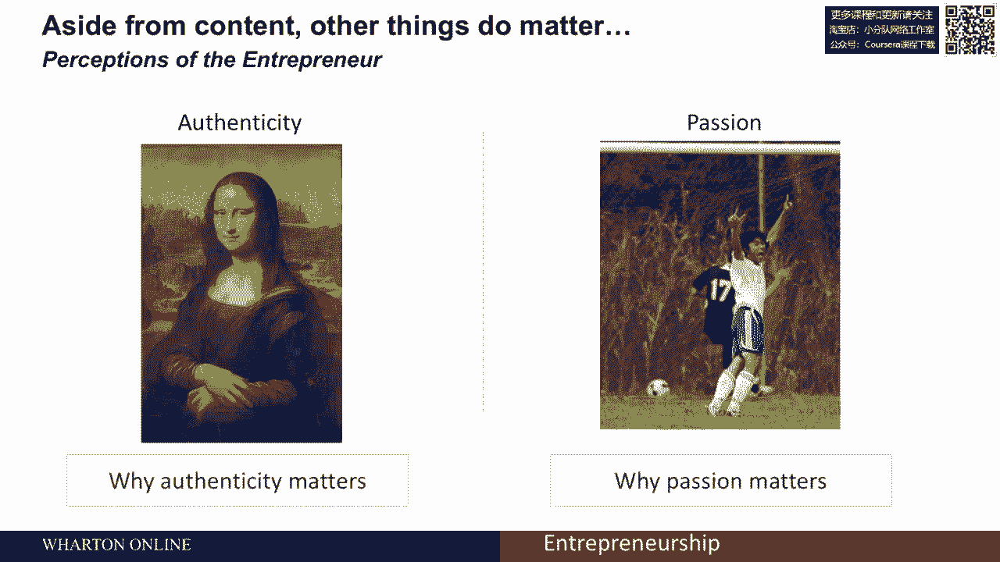

尽管不是以我们可能一直认为的方式，让我们看一个例子，地球上使用最广泛的制造材料是混凝土，平均，每人每年要用3吨多混凝土，不幸的是，混凝土制造过程造成了全球10%以上的二氧化碳排放，然而。

我们已经能够建立一个混凝土，而且它比普通混凝土坚固五倍，我们的设计是独一无二的，因为我们发现了如何改变混凝土的纳米结构，这种方法是环保的，同时它降低了40%的混凝土制造成本，鉴于U。

China’中国的混凝土市场每年超过1000亿美元，这使得我们的产品从混凝土制造商那里非常有利可图，我们是一个由五名研究人员组成的团队，包括麻省理工学院的三个超级明星偏好，我自己，我是去年的博士生。

研究创新混凝土，我们正在寻找两个更有激情的人来完成我们的团队在财务方面的工作，正如我们刚才看到的，这位企业家有着非常独特的风格，我经常让学生投票决定他们是否认为这位企业家赢得了推销比赛，他参加的比赛。

然而，如果你想到真实性和激情，这位企业家展示了很多真实性，他谈到了他对混凝土的热情，他谈到了他在具体创新方面的博士学位，事实上，他确实赢得了这场比赛。

因为他确实给人留下了我们所看到的非常真实和热情的印象，明确你的工作是很重要的，你在和谁说话，了解你的观众知道什么也很重要。

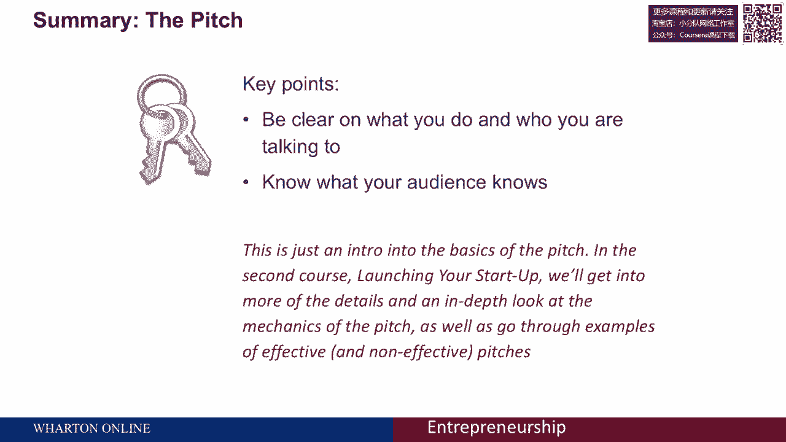

这只是对球场基础的介绍，在第二道菜中，启动启动，我们将讨论更多投球的细节，看看球场的力学，并通过其他有效和无效投球的例子。

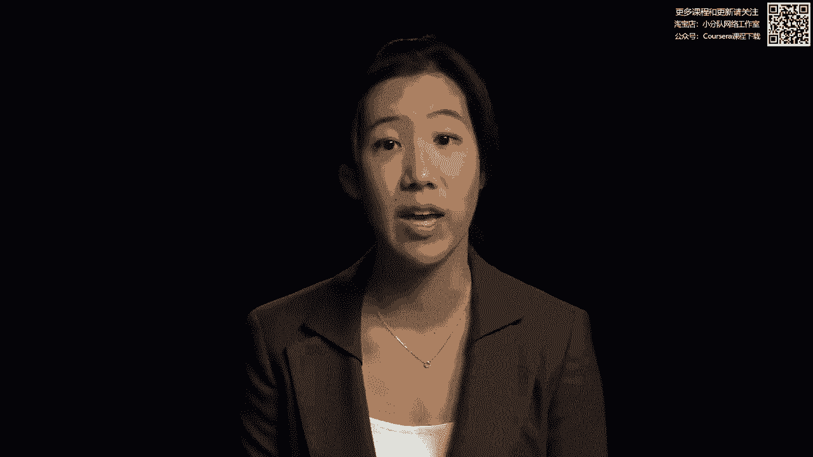