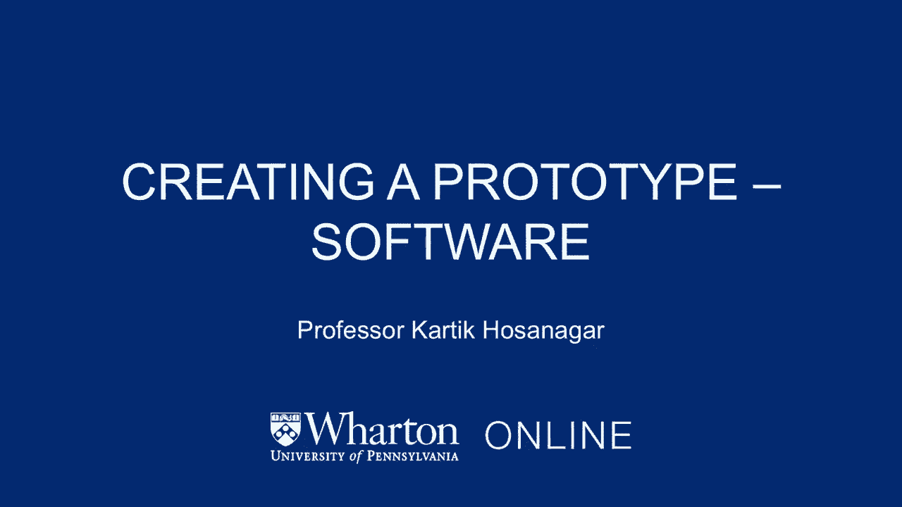
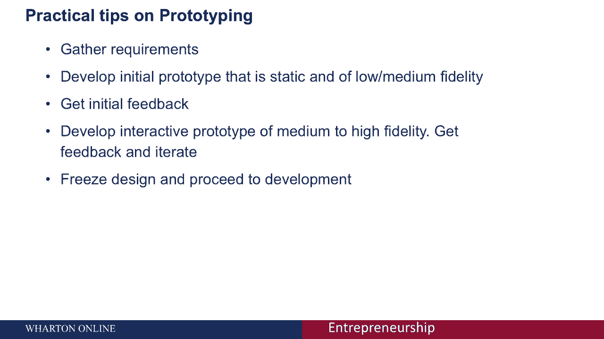
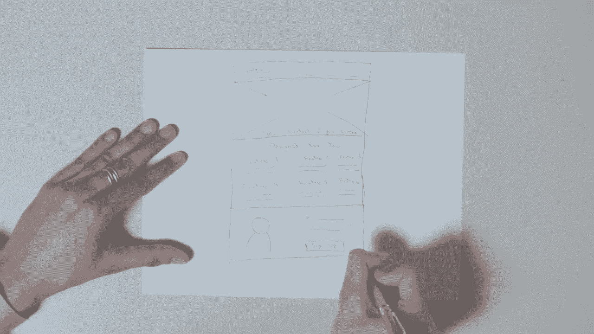

# 【沃顿商学院】创业 四部曲：发现机会、建立公司、增长战略、融资和盈利 - P30：[P30]05_4-5-creating-a-prototype-software - 知识旅行家 - BV19Y411q713

嗨，我是卡尔提克，这节课是关于创建一个软件原型。

现在假设您有一个软件产品，一旦您充实了解决方案的概念，你已经确认它引起了用户的共鸣，直接进入产品开发阶段是很有诱惑力的，这种方法可能代价高昂，虽然，因为虽然你的产品概念可能会吸引用户。

实际产品可能不符合用户的期望，或者因为功能缺失，原型的目的是确保，我们最大限度地减少了完全重做软件的需要，由于我们在如何实现一些高级解决方案概念方面存在差距，我们心目中的，我将从讨论原型的不同方法开始。

并举几个例子来说明，如何选择适合您的方法，最后，我将用一个简单的例子来结束你是如何，企业家可以参与软件的原型制作，即使你没有平面设计经验，但首先我们为什么要费心去做原型呢原型有两个主要目的。

首先是向用户澄清用户界面，以及最终实现产品的开发人员，第二次，原型制作，还有助于澄清最终产品中支持的功能，这样做提供了几个好处，从长远来看将有助于您的项目，它将有助于减少相对于构建完整产品的成本和时间。

然后在构建产品后迭代，最好事先明确需求，而不是一次又一次地重做昂贵的开发，你也不需要成为一个开发人员来参与原型制作，这样你就可以让其他利益相关者参与进来，在原型阶段，如非工程合作创始人进入产品讨论。

最后，原型也有助于提高产品质量，在我们开始产品开发之前，在我们讨论如何原型化之前，了解一个人可以开发的不同类型的原型是很有用的，原型可以沿着多个维度进行分类。

我要讨论的第一个问题是原型是否是一次性的原型，或者进化原型，一次性原型背后的想法是创建最终系统的模型，一旦获得用户反馈，用户就可以评估，设计和要求被冻结，开发开始，原型可能在此阶段被丢弃。

这是一种相对快速的原型方法，它允许用户在分享反馈之前体验系统的所有重要部分，第二种方法是进化原型，那个，顾名思义，只构建系统中我们理解的那些部分，然后随着时间的推移慢慢地到达其他部分。

这个想法是开发团队创建一个具有很好理解的特性的系统，原型实际上演变成了我们大部分讨论的最终产品，我会专注于一次性原型，因为它的速度，使用户对系统有充分了解的能力。

也是我们在没有正式开始开发的情况下进行的能力，另一个有趣的方面是原型的保真度，保真度可以从低到高，中间有很多选择，低保真度的原型通常是手绘草图，这样做的好处是速度快，当您可以迭代多个设计时。

它在早期也很有用，人们可以考虑许多选项，而不会真正放慢低保真度选项的速度，光谱的另一端是高保真设计，这几乎是你看到的就是你得到的设计类型，它配有完整的视觉设计，因此你需要一个平面设计师。

为了想出一个完全保真度的设计，全保真度设计的优点是，用户很容易理解我们试图构建的内容，软件开发人员也很容易获得完全的保真度，或者高保真设计并开始编码，当产品复杂时，这种方法很有帮助。

用户很难将系统可视化，或者也可以，在实际编码之前，但另一方面，因为它也很贵，重要的是要问，如果在实际进行之前需要做一个完全保真度的设计，终于，在高保真度和低保真度设计之间的选择是中保真度。

这达到了很好的平衡，在低保真的速度和高保真的真实感之间，在这张幻灯片中，我提出了几个不同保真度的原型，一个名为Smarty Pal的儿童教育产品网站，我以前共同创立的。

你可以看到我们是如何从一个低保真度的素描开始的，并慢慢地实现了高保真的设计，完成所有的视觉元素，第三种分类原型的方法是基于支持的交互性级别，一方面，你有静态原型，本质上只是一系列屏幕，另一方面。

你有交互式原型，这些原型对用户输入做出反应，交互式原型是可点击的，允许用户将输入输入到表单中，在某种意义上，一个交互式原型模拟最终产品将如何以非常逼真的方式工作，在静态原型或交互式原型之间进行选择。

反映你最初为什么要做原型是很有用的，产品是否相对复杂，产品差异化的关键点，或者了解应用程序实际上是如何工作的以及如何与之交互是很重要的吗，如果是这样，通常通过交互式原型来实现这些是最好的。

我的经验表明交互式原型总是更好，除非产品比较简单，原型的目标主要是澄清视觉设计，如果是这样，静态原型可能会很好地工作，比如说，如果产品本身是一系列静态页面，那么静态原型可能就足够了，下一个值得问的问题。

用于原型制作的最佳工具是什么，答案有点取决于对前面问题的回答，我提出了不同类型的原型，如果一个低保真度的静态原型适合你，那么你只需要一张纸和一支笔，你的原型将由手绘草图组成。

如果你想让中保真度或高保真度，但对于原型来说是静态的，然后像Photoshop这样的绘图或照片编辑工具，维齐奥，甚至微软的PowerPoint或Smart Art，只言片语就够了。

如果你想制作中等或高保真和交互式原型，然后像Balsamic和Aare这样的线框工具，最后，如果您是一名开发人员，并希望直接进行进化原型，这是合适的。

那么像Visual Studio和Eclipse这样的开发工具是很有吸引力的选择，我提供的一个实用建议是开发一个静态的初始原型，和低或中保真度的，您使用该原型从用户那里获得初始反馈，一旦你有了反馈。

你回去开发中等到高保真的交互式原型，您使用这个原型来获得反馈，你迭代直到你对设计满意，在这一点上，你冻结设计，我们准备继续开发。

如果你不是设计师，把原型工作外包给设计师是很有诱惑力的。你当然应该依靠设计师，但作为一家软件初创公司的创始人，积极参与原型阶段是有帮助的，一种方法是率先开发低保真度的设计。

我不打算举例说明开始是多么简单，假设我在做摄影或录像，专注的网站，为订户提供伟大的视频和采访，专业人士教我们如何使用相机，拍摄我们的拍摄对象，拍摄最好的照片和视频。

现在我正试图为这个网站设计一个登陆页面，我要向你展示我们如何才能发展好，在相当短的时间内进行低保真度设计，我将从我经常使用的经典设计开始，所以让我从这里开始，所以我的头就在上面，我要在这里用一个标志。

也许是公司的一个班轮，然后我为产品资源添加了几个链接，现在免费资源和其他类似的东西，浏览登陆页的主要内容，因为它是一个关于视频和摄影的网站，我可能想用一个视频来解释这个网站是关于什么的。

接下来还将展示一些客户推荐，我可能有一个客户的报价，然后在行动呼吁之下，要求用户注册，就在那下面，也许我想说一点关于产品的事情，所以我们可以说我们为什么要建造，你知道吗，不管我们叫什么x y z。

这里我们可能想多说一点，嗯，我们的产品，所以产品的一些特点，你知道我们可能会说嘿，我们遇到了和你们一样的问题，那么我们可能会继续说，我们发现没有解决办法，把我们从头到尾，这就是我们想为你做的。

然后我们可能会进一步说嘿，我们有专业人士，这些专业人士有他们可以教我们所有人的诀窍，所以我们可以说，这是下一节，最后我们可能只有页面的页脚，在那里我们可能有关于我们的信息，或者联系我们，诸如此类的事情。

我喜欢这个设计的原因是，正如我提到的，这个网站是关于摄影和录像教育的，我们用一个视频来传达这个价值主张，但假设我发现视频太贵了，拍不出来，或者我没有足够的时间拍那个视频，我不打算考虑另一个设计。

这是使用该视频的另一种选择，现在假设我想尝试一个没有任何视频的设计，可能是因为拍视频太贵了，或者你知道它让我慢下来，我想尽快让网站上线运行，所以我要尝试一个类似的设计，这次没有视频，所以对于头部来说。

你知道我有个标志，关于公司的一句俏皮话，产品的几个链接，资源，现在我可能有一个客户推荐在这里，因为我不打算用视频，也许我要用，给我们推荐的一个真正顾客的照片，然后这次在这个下面。

也许我想强调产品的易用性，而不是我们为什么建造它，所以我可能有一个部分说三个简单的步骤，使用我们产品的名称，所以第一步，这是步骤，第二步，你应该这样做，第三步，然后我可能会在视觉上展示这是第一步。

然后第二步说你应该在那里做什么，然后第三步，所以我有三个简单的步骤，最后我有了网站的页脚，页脚可能有，你知道我不知道，联系我们，也许我们的Facebook链接之类的东西，现在我有一个设计。

我已经设法消除了视频，但我不喜欢的是，嗯，不是特别情绪化，所以也许我想试试，我想用一张照片，但不仅仅是某人的脸和他们的感言，但我想要一个不同的设计，更情绪化的东西，以及更强调产品特性的东西。

以便说服您为这项服务付费，所以我要尝试一个稍微不同的设计来做到这一点，所以我要尝试一个稍微不同的设计，标题与徽标相似，现在有一堆链接，也许这次我去，你知道的，页面顶部只是某种全屏图像，只是一张照片。

它展示了一个摄影师在拍摄一个主题时玩得很开心，只是展示拍摄有多容易，上面写着控制你的相机之类的东西，一些标语，传达这是多么容易，我们展示了一个非常快乐的人的形象，做他下一步要做的事，我也想。

除了做一些更情绪化和更有说服力的事情，我还想强调产品的特点，说服您付钱，所以为了做到这一点，我想向你展示我们有很多功能，所以也许在这里，我向你展示了一堆功能，所以我们是这是为你设计的，我们可能有。

你知道的，特色一，你对那个功能略知一二，我们有两个专家采访，关于这一点，我们有特色三，关于那个功能的一点，也许只是因为我想让你付钱，我想向你展示我们有很多很棒的功能，所以我要向你展示六大功能。

你知道这可能不是你向用户展示的最好的想法，用户可能会做出反应，说哇哦，那对我来说是很多信息要消化，在这种情况下，你会把它归结为三四个最重要的功能，但我才刚刚开始一些设计。

在这之后我觉得即使我去掉了客户的推荐信，它不在页面的顶部，我觉得它一定在某个地方，因为如果有人付钱让我加入这项服务，知道其他人尝试过并喜欢它是有帮助的，所以也许在底部我会插入我的客户感言。

我有客户的报价，然后我有一个大牌子，现在，行动呼吁，这几乎是我的第三个设计，正如你所看到的。

这些设计中的每一个都是在几分钟内开发出来的，这就是低保真度原型的全部想法，它很快，你可以想出几十个原型然后决定你真正喜欢哪一个，然后向您的用户显示一组这些，然后找出你想在哪些方面投资更多。

并将视觉设计应用于，大家可以看到，很容易参与低保真度的原型制作，这显然不是最终输出，但它让你，企业家与你的设计师和你的用户进行有意义的对话，这就是低保真度原型的价值，我高度倡导每一位企业家。

即使是那些没有设计技能的人也能参与原型阶段。