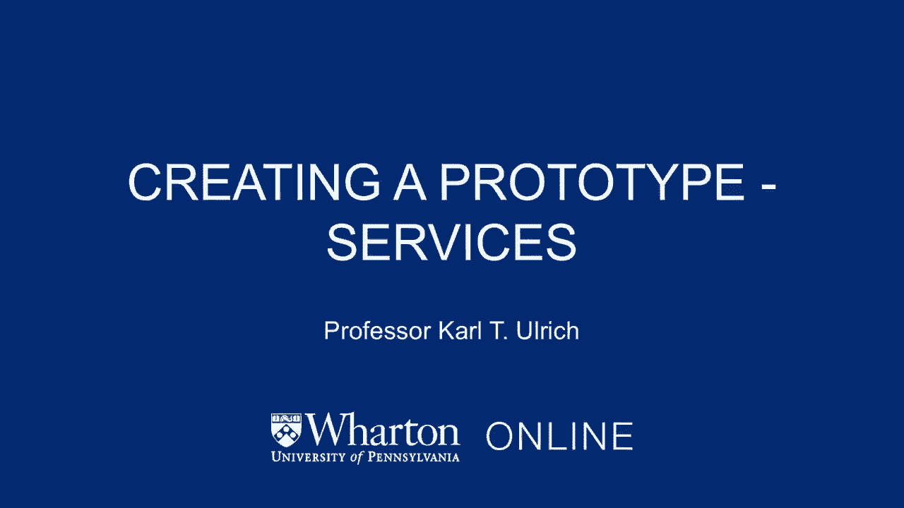

# 【沃顿商学院】创业 四部曲：发现机会、建立公司、增长战略、融资和盈利 - P31：[P31]06_4-6-creating-a-prototype-services - 知识旅行家 - BV19Y411q713

这节课是关于创建一个原型，在你提供服务的情况下。

在服务的原型设计中，您通常不会面临深刻的技术挑战，也不需要大量的资本强度来生产服务，和硬件一样，你通常也得自己做，大多数情况下，餐饮公司经营自己的餐馆，航空公司拥有的，并操作自己的飞机。

保险公司拥有并经营自己的，他们自己的，他们自己的服务，你通常不会和合作伙伴一起提供核心产品，硬件公司通常与制造商合作以创造他们的产品的方式，但挑战仍然是，你如何测试和验证你的概念。

而不一定要进行所需的全部投资来建设，服务的完整生产版本，我想谈谈一个好把戏，这在服务的设计和开发中非常有效，这就是所谓的绿野仙踪方法，它指的是音乐剧《绿野仙踪》中绿野仙踪的想法，绿野仙踪，这本书。

电影的音乐剧，OZ的向导是向导已经出现在屏幕上，和对观众的必要性，对观众来说，就是不要注意幕布后面的人，就是看着屏幕，忘了后面有个小个子男人在拉杠杆，您可以用您的服务概念的原型来做同样的事情。

让我给你举个例子，杰森·王科创办了送餐服务鱼子酱故事真的很有趣，他在旧金山市的另一家初创公司工作，他和他的团队总是面对这个，吃午饭的问题，旧金山有一家特别的餐厅他们很喜欢那里的午餐。

那家餐馆有一种叫泡菜玉米煎饼的产品，所以他们真的很喜欢泡菜玉米煎饼，有一天他们说哇，你知道的，也许我们应该忘记这个创业，我们正在努力，想出如何更有效地获得泡菜卷饼，所以他们想嘿，这是一个很有趣的想法。

我们能不能想出一种方法来为城市提供更有效的食品配送，城市居民，城市居民，他们说我们怎样才能让这种体验变得更好，所以他们做了什么来测试他们的概念，这是一个基于应用程序的精心策划的食品配送服务。

那是高质量的，预选的产品，可以用应用程序交付，他们说好，让我们构建应用程序的前端，如果我们接到任何命令，我们就骑自行车去玉米煎饼店，拿起玉米煎饼送过去，所以这就是他们所做的，字面意思是杰森本人。

鱼子酱的创始人会骑自行车，去泡菜卷饼店，拿起泡菜卷饼送到他的顾客手中，他们通过一个非常好的前端订购，所以你可以明白为什么它被称为绿野仙踪方法，因为消费者不知道幕后是什么，消费者只是通过前端体验点餐。

他们在后端争先恐后地，他们现在可以用哪种方式提供服务，那有什么好的，在服务的情况下是为了验证服务概念，你不必建立整个送货网络，你甚至不必从，带动一批餐厅加入平台，他们可以走进任何一家餐馆。

把维萨卡给他们，买了食物，然后把它送到他们的顾客那里，给顾客最终完整的鱼子酱体验，鱼子酱后来成为一个非常成功的送餐业务，他们在运营的第二年就卖掉了，给了非常成功的公司Square com一亿美元。

所以总而言之，如果您正在建立一项服务，仔细想想你实际上要建造多少，以便与您的客户实际测试这个概念，也许你可以采取绿野仙踪的方法，也就是给你的客户一个前端的体验。

