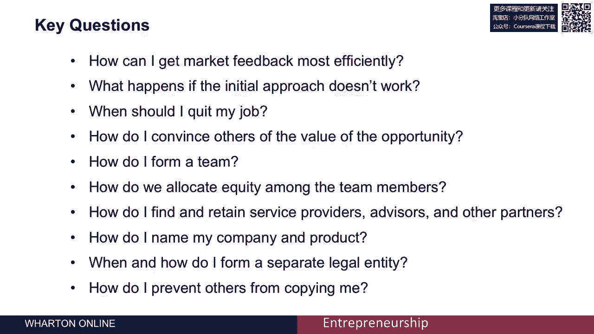

# 【沃顿商学院】创业 四部曲：发现机会、建立公司、增长战略、融资和盈利 - P34：[P34]01_1-0-introduction - 知识旅行家 - BV19Y411q713

我是卡尔·乌尔里希，我是沃顿商学院的教授，我教创新的地方，创业与产品设计。

我很兴奋能成为你们的导师之一，对于本课程，启动您的启动，本课程是四门专业课程的一部分，第一个课程是发展机会，接下来是启动你的创业课程，然后我们有第三门关于增长战略的课程，第四门课程涉及融资和盈利能力。

这一切都与一个顶点项目有关，它将课程中的知识集成到课程项目中，现在你可以以任何顺序选修这些课程，但这门课假设你从一个机会开始，那就是你已经发现了市场上的一些需求或痛点，你有一个解决这个需求或痛点的想法。

现在我们在这门课上要做的是，我们将抓住这个有效的机会，让你准备好把解决方案推向市场，我们将在本课程中讨论的一些问题是，如何最有效地获得市场反馈，如果我最初的方法不起作用会发生什么。

我应该辞掉白天的工作吗？我什么时候才能让别人相信机会的价值，我在追求，我如何组建一个团队，我们公司的股份怎样分配？整个团队成员，我如何寻找和留住合作伙伴，我需要，服务提供者，顾问和其他人。

我如何命名我的公司和产品，我何时及如何成立新的法律实体。

我如何防止别人复制我，这些都是超级有趣的问题，它们对启动初创企业的挑战都是必不可少的。