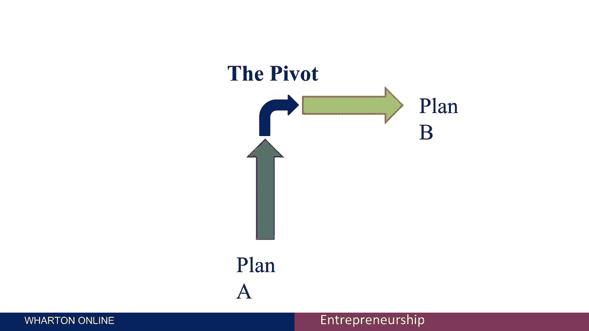
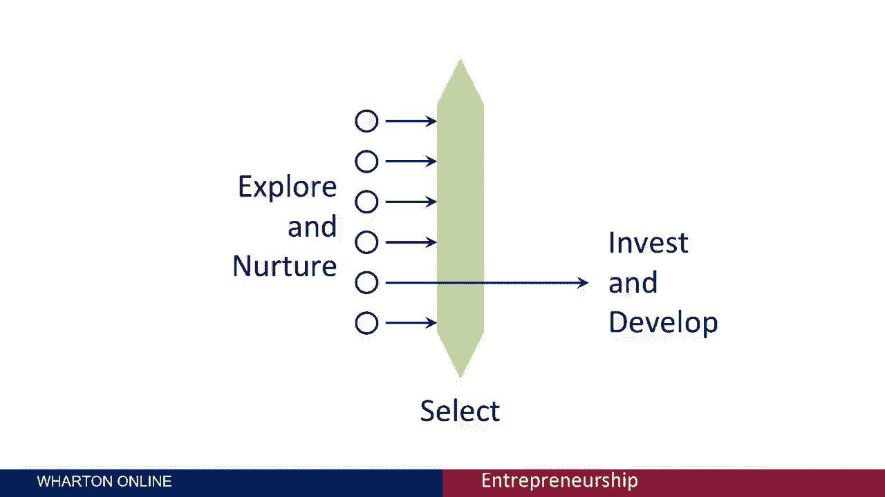

# 【沃顿商学院】创业 四部曲：发现机会、建立公司、增长战略、融资和盈利 - P38：[P38]05_1-4-the-pivot - 知识旅行家 - BV19Y411q713

这个会话被称为枢轴，Pivot是一个你在创业中经常听到的术语，支点是指一个新的企业在方向上的重大改变，通常是因为最初的计划不成功，所以你继续A计划。

然后你转向B计划，比如说，kia annenbaum创建了一家名为elect next的公司，当选人接下来要做的是向选民提供关于候选人的信息。

这样你就可以反思你对枪的感受，你对税收的看法，你对社会问题的看法，选举脖子会根据你的兴趣告诉你哪些候选人和你匹配，下一个选择的问题是它真的是季节性的，所以在重大选举期间，你可以让很多客户感兴趣。

但至少在美国是这样，在下一轮兴趣之前的漫长四年，所以Kya转向了一个非常不同的行业，叫做反之亦然，反之亦然，试图与选民建立接触，全年都和公众在一起，允许他们参与专栏，在印刷出版物中，在网上和网上。

所以B计划也是她的支点，作为对未能真正得到什么的回应，我们可能会把牵引力称为A计划和下一个选择，2。我现在左右为难啊，当然如果A计划失败了，你得用B计划，企业家面临着许多内在的不确定性。

当他们开始新的冒险时，因此，如果这种不确定性得到解决，事实证明，A计划是行不通的，那么改变方向也无妨，鉴于新企业固有的不确定性，旋转是极其常见的，我想说我参与的企业中至少有四分之一。

另一方面会做某种枢轴，如果你一头扎进你考虑的第一个机会，在没有仔细分析的情况下，那么枢轴可能会被避免，浪费时间和金钱是可以避免的，前期做一点工作，比如说，当我两五岁的时候。

我花了几个月的时间造了一辆雪地自行车，这是基于拖拉机胎面而不是后轮，这是骑自行车穿越南极洲计划的一部分，现在我没能做的，仔细分析了南极的地形，而不是花几个月的时间造自行车，我应该研究一下南极洲的地形。

这是在谷歌图像时代之前，顺便说一句，如果我知道火车会是什么样子，我会意识到雪地自行车真的是个愚蠢的想法，从处理不确定性的有效策略开始，从一开始就考虑几种可能的选择，花一点时间和精力去探索它们。

只有当一些最初的不确定性被解决，然后承诺、投资和发展，这降低了不得不进行枢轴的可能性，尽管如此，正如我所说，在创业本质上充满不确定性之前。

如果你不做一些新的和不确定的事情，那么你在创业中真的没有做一些有趣的事情，由于内在的不确定性，必须转向一点也不常见，但聪明的企业家是那些能够将几个概念的探索结合起来的人，愿意转向。

