# 【沃顿商学院】创业 四部曲：发现机会、建立公司、增长战略、融资和盈利 - P40：[P40]07_1-6-the-art-of-the-pitch - 知识旅行家 - BV19Y411q713

欢迎来到我们关于球场艺术的讲座，你可能还记得我们关于开发机会的课程。

我们谈到了电梯投球，并谈到了球场是如何单向的。

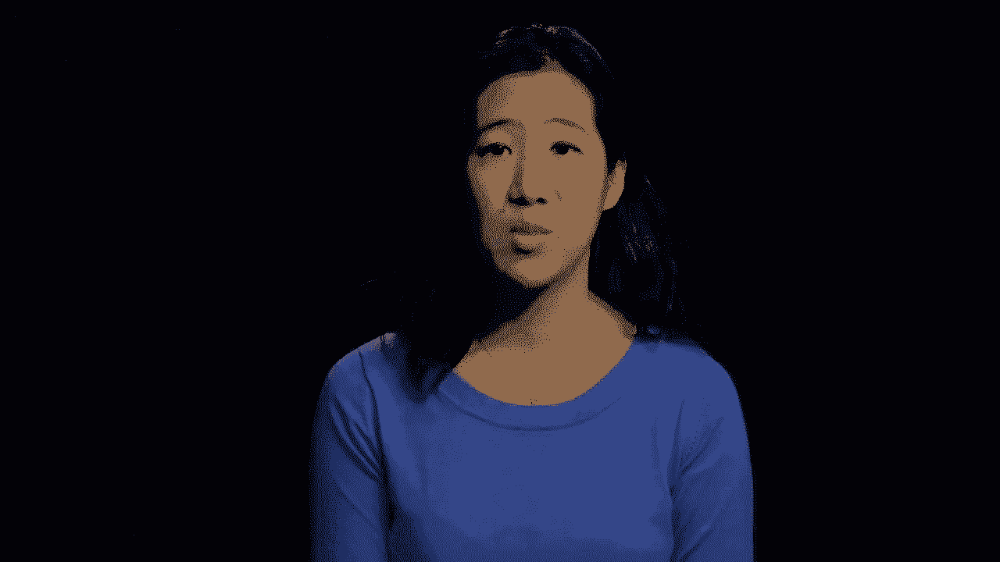

封装和总结您的业务，我们讨论了推销中包含的许多组件。

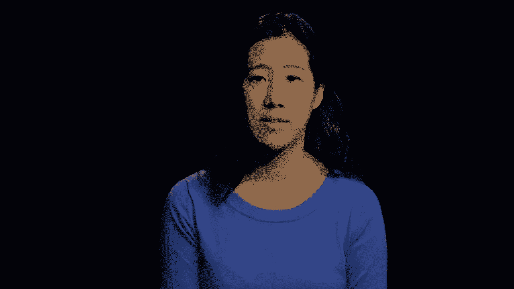

比如问题或者痛点，你的解决方案，目标市场竞争对手，团队，财务摘要和里程碑。

电梯音高只是音高的一种。

然而，今天我们将更详细地介绍所有不同形式的投球。

各种不同形式的俯仰沸腾的原因，事实上，你将与广泛的观众交谈，关于你所做的，每个观众可能需要不同类型的宣传和不同的信息。

而是从谁应该是投球的人开始。

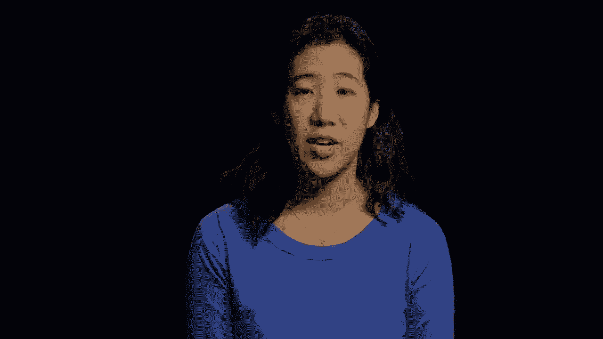

应该是创始人或创始团队中的某个人，只有创始人或创始团队中的某个人知道最初的产品市场适合度，正确的目标段，正确的推销，你的管道的特点和你的定价和营销策略。

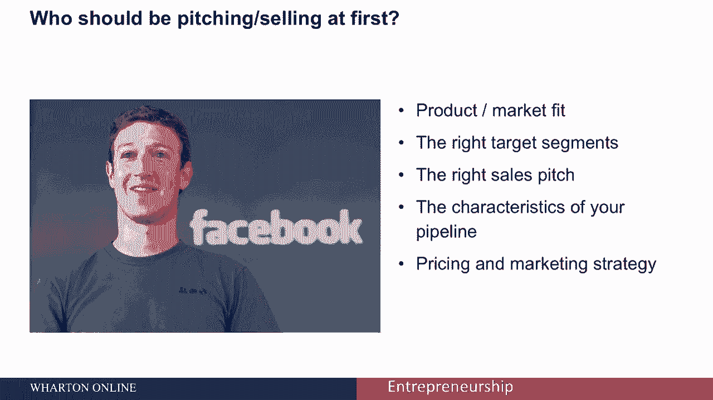

然后在准备投球的时候。

有多种方式来呈现您的信息，有高概念音高，有电梯俯仰，有一个两句话的音高，有一分钟的投球，有五分钟或更长的投球，我们将逐一讨论这些问题，高概念球场看起来像专业人士的脸书，你觉得那是什么。

如果你猜的是LinkedIn，你说的对，那全电动保时捷呢，对于使用亚马逊的宠物来说，谷歌怎么样。

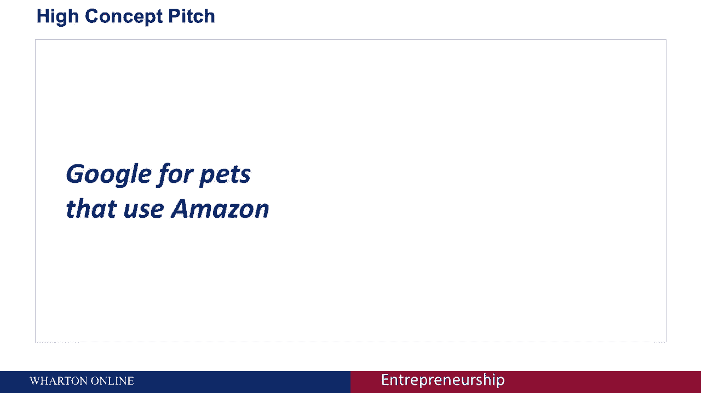

我们不知道，正如你所看到的，高概念音高可能会走得太远。

你不想仅仅为了名字而使用名字。

比如说，很多时候我们看到人们使用像我们是X的优步这样的东西。

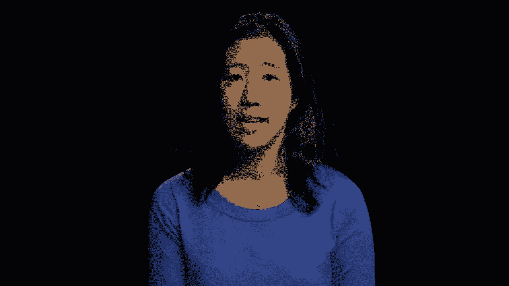

或者我们是X的谷歌，在你把它放进你的高概念音高之前，确保它是有意义的，高概念音高是你最重要的音高之一，你应该能够把你的公司所做的事情提炼成四五个字，这往往是最难的投球。

因为这需要很多思考和关心来思考如何描述你的投球。

接下来只有四到五个字，让我们继续两句话的音高，对于有需求的目标受众来说，这两个句子的音高是这样的，产品名称是提供关键好处的产品类别，不像竞争对手或替代品。

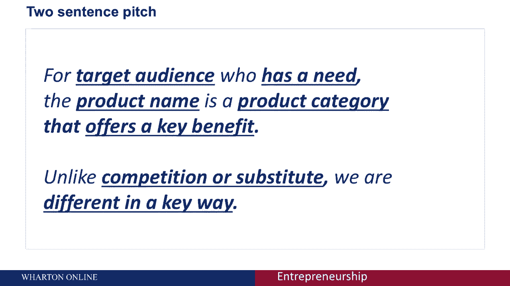

我们在一个关键方面是不同的，让我们举一个两句话音高的例子。

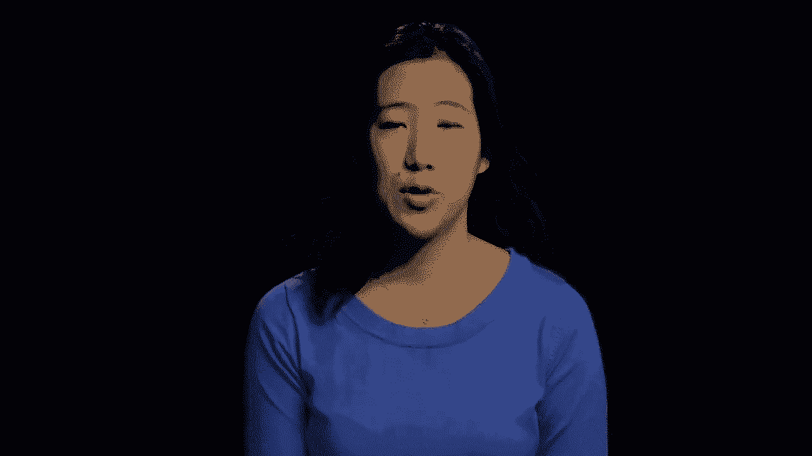

如果我们以特斯拉为例，对于富人和车迷来说他们的推销可能是这样的。

谁想要一辆环保的高端跑车，特斯拉跑车是一款提供前所未有性能的电动汽车，不破坏环境，不像法拉利和保时捷。

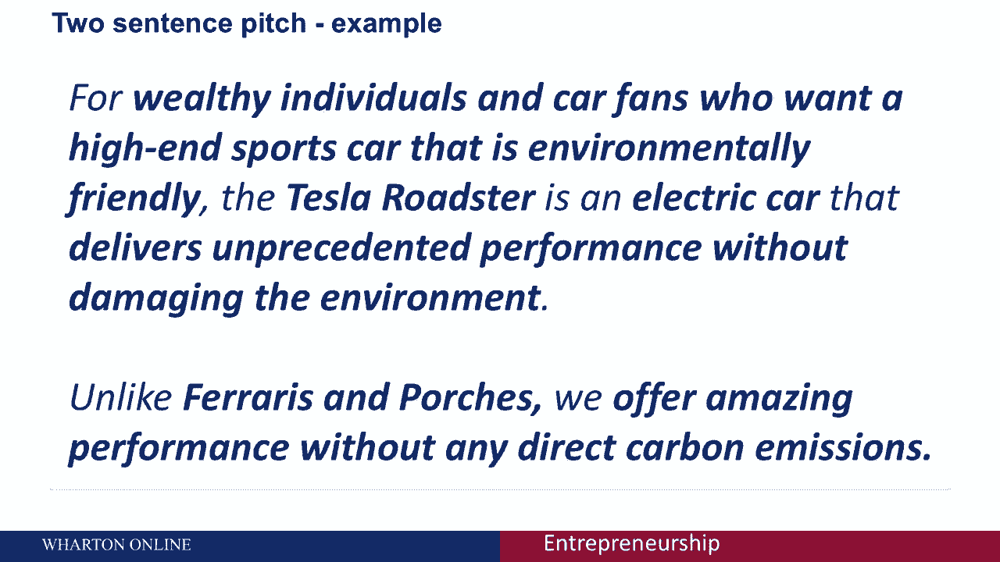

接下来，我们提供惊人的性能，没有任何直接的碳排放。

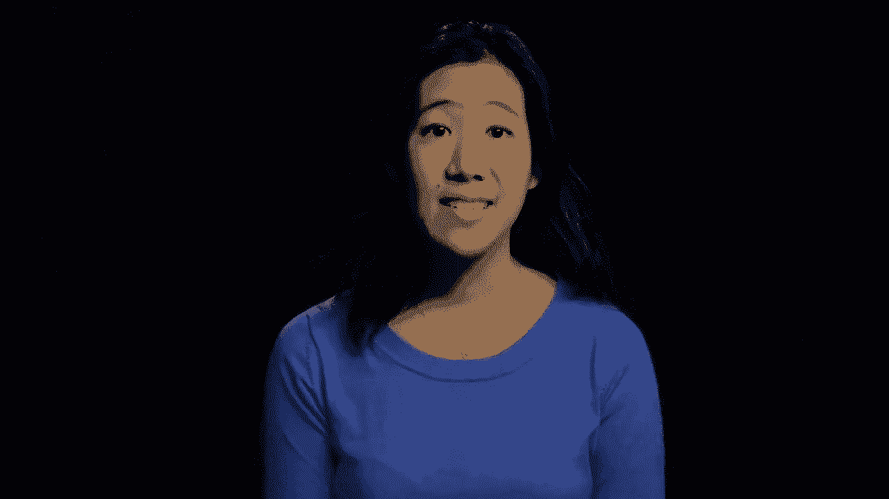

让我们进入一分钟投球，这里有一个一分钟投球的例子，地球上使用最广泛的制造材料是混凝土，平均，每人每年要用3吨多混凝土，不幸的是，混凝土制造过程造成了全球10%以上的二氧化碳排放，然而。

我们已经能够开发出一种混凝土，而且它比普通混凝土坚固五倍，我们的设计是独一无二的因为我们发现了如何改变混凝土非常狭窄的结构。

这种方法是环保的，同时也降低了40%的混凝土制造成本，鉴于U。

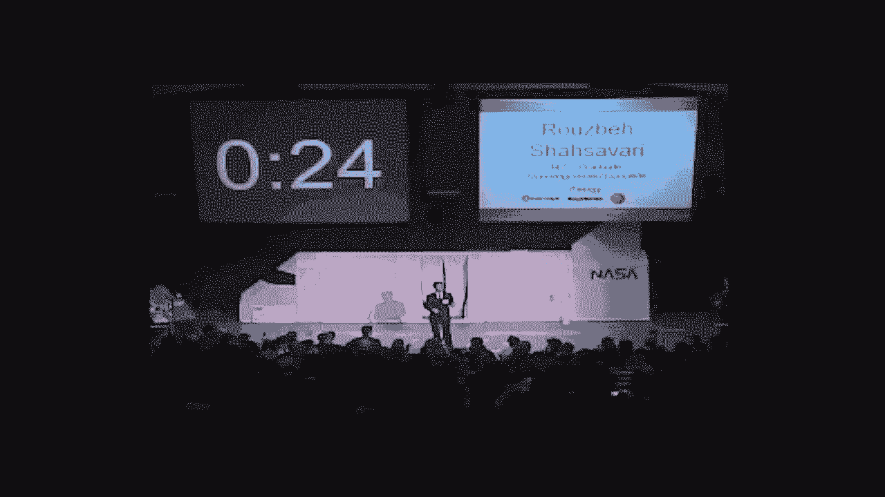

China’中国的混凝土市场每年超过千亿美元，这使得我们的产品从混凝土制造商那里非常有利可图，我们是一个由五名研究人员组成的团队，包括麻省理工学院的三个超级明星偏好，我是去年的博士生，研究创新混凝土。

我们正在寻找两个更有激情的人来完成我们的团队在财务方面的工作。

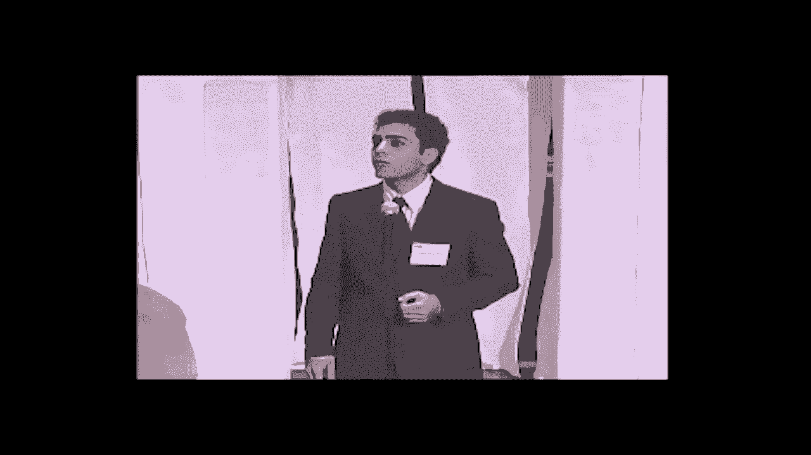

这是另一个一分钟投球嗨的例子。

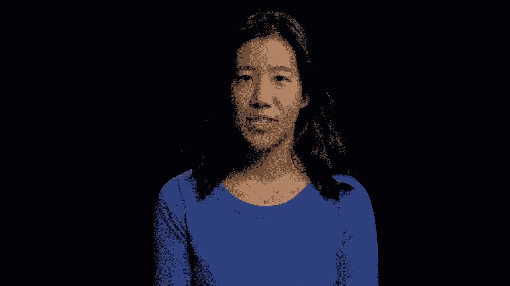

我是菲尔·利宾，Evernote的首席执行官永远了解你的外脑，每当有什么重要的事情发生，你可以把它放进Evernote，你会一直把它放在手边，当你需要的时候。

您可以将Evernote与当前拥有的许多设备一起使用，我们有一个适用于Windows和Mac的版本，您也可以将其用于任何Web浏览器，任何电话或相机，现在你的记忆有很多不同的形状，有很多东西你想记住。

所以你可以用每一个音符，比如说，给某人的名片拍照，或者拍一张你想记住的白板或酒标的照片，或者你可以给自己留一条短信或语音短信，所有这些信息都上传到Evernote服务器，在那里处理和索引。

让你做一些事情，比如搜索图像中的所有文本，允许您按位置搜索，然后将信息同步回您的客户机，所以它总是在手边，所以你总能找到你需要的，无论你在哪里，每个便笺都有两个订阅级别，您有免费订阅和高级订阅。

额外订阅费是每月五美元，你可以得到几乎无限的存储空间和各种各样的其他好东西，谢谢。大家可以看到，你想保持高水平，你想用简单的术语来解释它，你现在想瞄准核心问题，让我们进入五分钟甚至更长的演讲。

你想想想你的五分钟演讲吗，贾斯汀是一个两句话音高的阐述，人们经常试图打包太多的信息，因为他们认为他们有五分钟或更长时间，你想坚持和你的两句话一样的基础，清楚地识别你打算利用的市场机会。

并回顾建立业务的关键因素，五分钟过得很快，你可能认为你有时间，但是用你的时间来谈论价值主张，谈市场和竞争，谈论财务前景，并提出一个形式，如果可以的话，你想谈谈风险吗，不确定性与假设检验。

并分析关键挑战和风险，以及你打算如何在可能的情况下最终解决这些问题，别只是猜测，试着通过研究来支持你的假设，以及通过其他数据，正如我们所看到的，清楚你在做什么，你在和谁说话是很重要的。

试着知道你的观众知道什么，或者做一些有根据的猜测。

