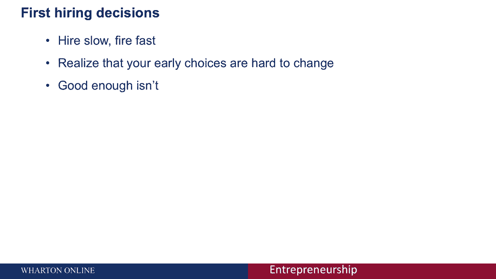

# 【沃顿商学院】创业 四部曲：发现机会、建立公司、增长战略、融资和盈利 - P43：[P43]02_2-1-the-role-of-early-hires - 知识旅行家 - BV19Y411q713

所以我已经谈到了为什么创始团队如此重要，但你需要考虑的另一个问题是你在一家公司的第一批员工。

这些和以各种不同的方式解决创始团队的问题一样重要，所以有一种叫做泰尔定律的东西，它是以彼得·泰尔的名字命名的，著名的天使投资人，他说一个初创公司在基础上搞砸了是无法修复的。

我们多年来对创业的证据和研究发现这是真的，所以你创业时的创始问题非常重要，它创造了这种形式的印记，我们实际上有证据，有三百年历史的组织，仍然保持着公司成立时建立的基本结构，所以这真的很迷人。

尽早把这些东西做好真的很重要，因为如果你一开始没有把时间放进去，你以后会付钱的，早期雇佣尤其重要，主要有三个原因，首先呢，只是在实际意义上，这些是你每天要和他们一起工作的人，所以你想和他们相处。

你不想对他们感到怨恨，你希望有一个不仅仅是各部分之和的组织，第二个问题是认识到员工之间的绩效差异是巨大的，所以努力把它做好，把它做好，公司里的人会对你的公司产生很大的影响，最后是角色惰性的问题。

我会讨论的，但这对你雇佣的人和角色有很大的不同，因为这可能会永远固定你公司的角色，所以让我们先谈谈性能差异的问题，所以我们实际上有很多证据表明人和组织之间的绩效差异，最著名的可能是技术人员。

对于程序员来说，我实际上在这里复制，一些衡量编程能力的尝试图表，你会看到什么，这些点代表了各种任务中的能力，你会看到这个绿色的盒子，代表第75个百分位数，平均数和值得注意的是重复的，研究发现了一些事情。

比如前75名程序员之间的差异，第百分位数，排在倒数2。5个百分点的人可能是，根据一些措施，现在2-7倍的性能差异是巨大的，我们并不是在所有情况下都发现有时是十倍，有时是三次。

但是让一个好的程序员加入进来，而不是找一个平庸的程序员，实际上可以对你公司的生产力产生巨大的影响，你发现的错误数量，如果一个人可以好到三四个或五个，才华横溢的个人，让才华横溢的人加入进来是成功的关键。

这不仅仅是像编程这样的技术规则，所以我做了一系列研究，观察视频游戏行业，试图理解是什么解释了视频游戏之间的性能差异，所以让我带你走过，我是如何看待这个问题的，所以让我们想象一堆不同的游戏。

这些游戏有不同的收入水平，所以有些游戏比其他游戏赚得多，有些游戏比其他游戏更成功，现在我自己也是个游戏玩家，所以我控制了所有让游戏不同的因素，游戏的流派，有多少钱用于开发，他们在什么平台上。

还有一大堆其他因素，这是什么类型的游戏，即使你控制了这些因素，仍然有，性能差异大，所以如果你想想传统的战略和创业战略，它告诉你公司和业绩的差异往往来自公司本身，对呀，所以让我们来看看，加入公司。

想象公司的绿色，公司蓝和公司紫都是不同的视频游戏开发商，你可以看到你可以开始说出一个模式，嗯，看起来格林的作品要倒闭了，紫色做得很好，所以这只看公司层面的事情，我想得很好，如果我们看看个体。

制作这些游戏的人，具体来说，让我们来看看游戏行业中的两个不同角色，所谓的制片人，所以这些人帮助协调事情，帮助运行计划，高级经理与组织内低层人员之间的协调，他们可能会为类似的公司做类似的游戏。

从一家公司转移到另一家公司，然后在组织中也有创造性的角色，我很抱歉，我用黑眼豆豆专辑封面上的照片来代表有创造力的个人，我对黑眼豆豆的创造力水平没有任何声明，但它是很好的像素艺术，所以在创新者方面。

我们有我们称之为游戏设计师的人，所以这些人在做创造性的工作，在组织内部提出创造性的想法，所以我可以从统计上分开，一个游戏中收入的差异有多少是由于游戏本身，和生产它的公司，以及在项目上欠设计师多少钱。

我发现的是，我觉得很有趣，所以两个，产品游戏性能的变化有百分之一是由公司是谁来解释的，22%是由男经理是谁来解释的，几乎不重要的是设计师，大约是7%，所以这告诉你即使在一个非常有创意的行业里有很多变化。

就像电子游戏，他们可以解释变化和性能，这些都是十亿美元的产品，有时是百分之二十二，一场比赛的成败决定了两亿两千万美元，我发现他们实际上带着他们的技能，所以当他们从一个公司跳到另一个公司时。

他们实际上带着这种能力，所以弄清楚，不仅仅是设计师是谁，你们公司的程序员是谁，但实际上雇佣了合适的人，早期经理对你公司的长期结果有很大的影响，所以你需要考虑这些问题，在这门课程中。

我们讨论了其他地方的招聘，但值得思考这些问题，并意识到把这些事情做好很重要，这并不重要，因为人们的生产力不同，它的不同也是因为我们所说的角色惯性，想象一个创始团队成员，你在努力决定你要雇佣谁。

感觉在你的公司里绝对是关键的角色，也就是人力资源，谁将成为人力资源公司的负责人，现在，HR可以意味着许多不同的事情，人力资源部的人可以处理招聘，所以让人们进入你的组织并雇佣他们，他们可以处理管理。

他们可以处理公司的法律问题，所以你可能会有一个人力资源人员，他是处理就业法的律师，所以让我们想象一下你雇了一个人来扮演这个角色，这是一个人力资源部的人谁不处理法律问题，所以你的公司开始成长。

这个人力资源部的人做得很好，他们和你一起发展这个公司，他们在招聘方面做得很好，这是他们的专长，你最终不得不聘请律师，处理人力资源工作的法律方面，过了一段时间，你的人力资源部决定离开公司。

现在你需要雇人来填补人力资源的角色，你现在所做的是因为人力资源部的人离开了，因为他们有一套特殊的技能，你围绕这些技能建立了这个角色，所以现在你不能雇佣一个负责你公司法律方面的人力资源。

因为你雇了律师来做那件事，所以你公司的角色会重叠，所以你现在只限于人力资源，不处理你公司法律方面的人，这就是我们所说的罗兰·奥蒂亚，在你围绕这个人建立了公司之后，他们在你的公司留下了一个漏洞。

这正是他们技能集的形状，这意味着从现在开始你必须雇佣符合这种技能的人，因此，很难改变一个组织的结构，从招聘，你所做的选择，当你第一次雇用你的前二十名员工时，实际上决定了你的整个公司在未来是如何组织的。

所以你需要考虑角色，围绕这些角色来设计你的公司，所以你不只是雇一个人来填补一份工作，但你雇的人是为了帮助创造未来的工作，早期员工如此重要的另一个原因，所以当你做出第一次招聘决定时，慢工出细活是很重要的。

所以在一卷卷准备好之前，如果有人不工作，摆脱他们，把时间花在正确的招聘上，而不仅仅是雇佣随机的人，因为你现在需要身体，创业公司通常有很大的压力，尽早配备人员，并尽快让人们进入您的组织。

因为有很多工作要做，这可能是个错误，因为如果你不考虑生产力差异的问题，你没有考虑你正在创造的角色惯性，你最终可能会做出以后会困扰你的选择，所以通常在招聘方面足够好，是不对的，所以如果有足够好的东西。

不是那不是你想用的标准，你需要优秀的人，你需要考虑你正在做的角色，你需要仔细设计以确保你早期做出的选择。

