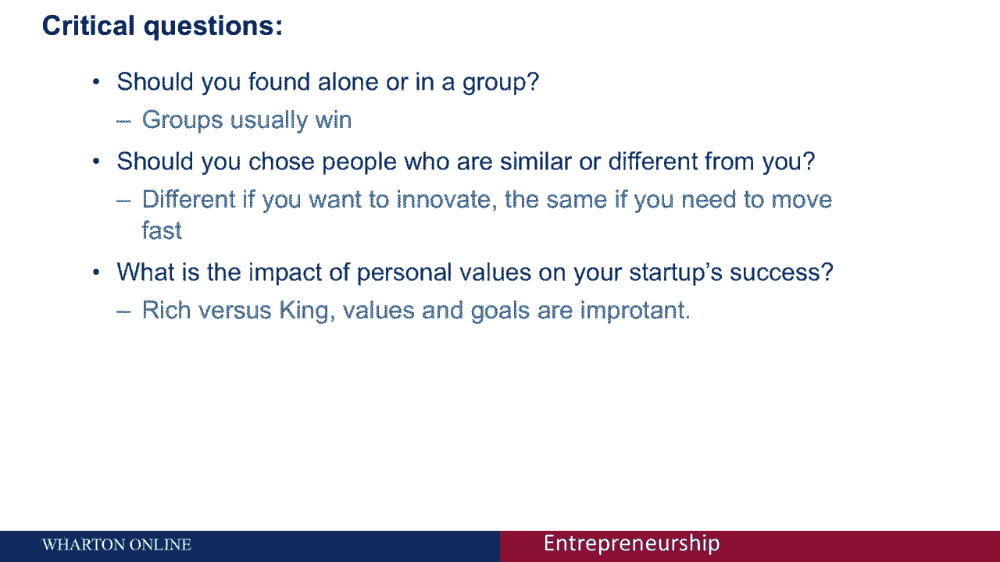

# 【沃顿商学院】创业 四部曲：发现机会、建立公司、增长战略、融资和盈利 - P44：[P44]03_2-2-goals-and-motivations - 知识旅行家 - BV19Y411q713

上次我们讨论了60岁的事实，风投支持的公司失败的5%的原因，与高级管理团队问题有关，可能会有更高的数字，为什么创始团队在早期阶段就失败了与高级管理问题有关，所以我想花几分钟和你谈谈。

创建公司时需要考虑的一些关键问题，好的一点是，它不像许多其他学术讨论，我们实际上有一些答案，有数字来支持它们，所以我想解决三个非常关键的问题，首先，你应该独自找到你的公司。

或者你应该作为一个团体的一部分找到它，第二，你应该选择和和你相似的人一起工作，还是和不同的人一起工作，最后，这种个人价值的东西到底有什么区别，当你创办一家初创公司时，所以当你组建你的团队时。

这些都是需要考虑的关键事情，我有一些答案给你，所以第一个问题是，你应该找到贷款还是在一个团体中答案是一个团体，所以我们实际上有一些数字，联合创始人更成功，他们通常更快乐，因为它们的互动更好。

我们实际上有，你可以在这个小图表中看到，诺姆·乏色曼的一些工作中的一些迹象，这得到了其他关于剩余创始团队数量的研究工作的支持，和公司的估值，还有那些在筹集风险资本时还剩下三名创始团队成员的公司。

或者天使的钱，是估值最高的，所以从数字的角度来看，这是有意义的，从团队动态的角度来看，三是一个相当好的数字，因为它允许你打破团队，团队分开投票，仍然有明确的决定，所以二比一，它还可以让你很好地划分角色。

分为技术方面和操作方面，销售方，嗯，所以三个创始团队成员通常是理想的，但又一次，这是处理事情的一种方式，当然有很多成功的公司有两个创始团队成员，和许多成功的贷款成立的公司，当你开始增加创始团队的规模时。

你也开始有一个下降评估，但再次成为多个团队成员通常有一个优势，人们在创业后问我的最常见的问题之一是，就是，哦天啊，我需要一个共同的创始团队成员，你能帮我找一个吗，这通常很难做到，因为这么多水已经进了桥。

很难让不是创始团队成员的人上场，最初，所以好好想想这个问题想想如何才能建立一个团队，而不仅仅是一个孤独的人，所以第二个关键问题是你应该和谁在一起，最终，这个选择不仅仅是关于你是否与朋友和家人一起创建。

或者你是和陌生人一起建国，而且也是，不管是不是，和你一起创立的团队是相似的还是不同的，所以不管是一个多样化的团队还是一个同质的团队，当我谈到多样性时，我不一定是指种族，种族或性别多样性，事实上。

我们的研究几乎表明，至少在性别多样性方面，那里有更多的研究，拥有一个多样化的团队与更高的成功率有关，所以有性别多样性，拥有种族多样性通常是一件好事，我说的是背景的多样性。

你希望每个人都有相同的工作经历吗，有相同的职业背景，来自同一家公司，来自同一所学校，你想要一个由所有MBA组成的团队吗，他们都去了沃顿这样的地方，他们都在投资银行工作，比如说。

还是你想要一个多样化的团队，在这个团队里，你有一个可能是投资银行家的人，他获得了沃顿商学院的MBA学位，但你也可能有律师，你可能会有一个艺术家，你可能会自学，所以这就是多样性，同质性与相似性。

每个队的优势和劣势取决于你的策略，所以一个同质的团队，一个每个人都有非常相似背景的团队，与更多样化的团队相比有一些优势，主要的好处是每个人都已经说同样的语言了，所以你们都来自同一套文化。

用于处理相同问题的相同背景，这意味着当你主持会议时，每个人都已经知道会议将如何运作，你们可以天衣无缝地互相交谈，这意味着如果你使用同样的语言，这意味着你用同样的方式来谈论客户或理解世界。

这使得团队更有效率和更快地运作，也使它更容易操作，你们作为一个团队不太可能分崩离析，所以这种同质的团队真的很擅长快速运作，利用机会，一种是你复制市场上其他现有的想法，试图更快地运作。

你不是想重新发明轮子，所以你不是想成为第一家快速休闲墨西哥连锁店，但你正试图推出自己的禁食，你镇上的休闲墨西哥连锁餐厅，拥有一个有着相似餐厅运营背景的团队，将是一个优势，但这种相似性的缺点是。

你的创新能力远不如多样化的团队，所以一个多样化的团队有更多解决问题的方法，创新来自思想的重组，所以当他们遇到问题时，一个多样化的团队，将能够接触到许多不同的人群，许多不同领域的经验，他们会更多地创新。

所以同质的团队更好地团结在一起，但他们少，他们不太可能创新，另一方面，多样化的团队行动要慢得多，因为人们说不同的语言，他们来自不同的背景，有时字面上，但经常，律师理解世界的方式是非常不同的。

比一个艺术家了解世界，这会导致很多问题，也会引起摩擦导致团队解散，另一方面，这些团队在创新方面要好得多，这些创新实际上产生了真正的影响，因此，对于创始团队的每一组不同的背景经验，研究，发现了。

你的公司的估值实际上会增加7%到12%，如果你是一家试图筹集风险资本的创新公司，所以让多样性参与进来会有真正的财务影响，因为它让你更有创新精神，但它确实会让你变慢，如果你想成为一个追随者。

并在一个行业中迅速行动，一个多样化的团队实际上会让你慢下来，但如果你想做一些创新或新的事情，多样性是你的朋友，会对你有很大的帮助，所以我被问到的最后一个问题是关于这些值，东西。

所以价值观似乎总是有点敏感，感觉，问题是这在，很难了解生意，答案是很多，除了价值观问题经常会分裂团队成员，最终导致它们分裂，所以如果有人看重钱，其他人重视公平，这可能是一个非常有问题的设置。

但价值观有更直接的影响，也就是当你开始创业的时候，通常你可以实现两个不同的目标，每个人都想尝试得到这两个，但这很难做到，一个目标就是我们所说的国王目标，国王是为了自己的独立和控制而建立公司的人。

他们想掌握自己的命运，他们希望能够塑造一个组织，他们希望能够解决一个问题，他们认为在世界上很重要，这些人是国王，你可能想开公司的另一个原因，是因为你想赚尽可能多的钱，我们称这些人富有并不奇怪。

所以这就是以独立为目标的人之间的紧张关系，他们想保持控制，和想赚钱的人，为什么这种关注，因为随着时间的推移，最终发生的事情，想成为国王的人最终不得不做出决定来最大限度地控制自己。

这通常意味着他们不能带来那么多有经验的高级员工，因为那些人也想控制，所以你最终雇佣了更多没有那么多经验的初级人员，这意味着筹集资金更难了，因为风险资本家和天使投资者通常想在公司中拥有控股权。

或者至少对组织有一些控制，国王往往会避免这种情况，所以他们经常会放弃融资，这样他们就可以保持对组织的控制，所以当他们遇到它的时候，做出一系列选择，始终如一地最大限度地提高他们的控制程度。

这通常会减缓他们成长和尽可能多地赚钱的能力，另一方面，如果你想走这条丰富的路线，你想最大化回报，这意味着你要引入风险投资或天使投资者，或者其他形式的股权融资，这些融资会放松你对公司的控制。

这意味着你想在海平面上引入其他高级顾问，可能在您的组织中持有股权并保持子控制的员工，这也消除了控制，所以你所做的这些选择经常会随着时间的推移而推动你，要么和有钱的国王一起去，丰富的方法或国王的方法。

有几个精选的创始人，你听说过的许多最成功的，不管是史蒂夫乔布斯还是比尔盖茨，或者谷歌的创始人，他们既是富人又是国王，所以他们设法保持对组织的控制，赚了很多钱，也保持了很多股权。

马克·扎克伯格就是一个例子，对我们来说有趣的是，在我们的研究中，从统计数据来看，这些人极其罕见，一般来说，很难实现这一目标，所以如果你的目标是成为下一个马克·扎克伯格，这通常不是初创企业遵循的模式。

所以寻找那些异常值或者试图成为史蒂夫，乔布斯或马克·扎克伯格，拥有一切，既当国王又有钱，对于大多数初创企业来说，往往是一条失败的道路，除非你是那些罕见的例外，最终成为历史上最成功的初创企业。

所以你必须决定你是否试图成为一个局外人，试着保持控制并以此致富，或者你是否愿意跟随市场的大众，这种权衡是非常真实的，这种权衡不是理论上的，因为这不是理论上的问题，这对作为创始人的你有真正的影响。

如果你看下面的图表，它实际上是在绘制初创企业中富人与国王的倾向，如果你一直看图表的左边，你会看到那些放弃董事会控制权的初创公司，创始人的首席执行官控制权，所以这些人一直站在富人的一边。

他们放弃了对该组织的所有控制，他们可以，下一步是保住首席执行官职位但放弃董事会控制权的人，然后你有创始人，他们保持对董事会的控制，这比CEO的角色更强大一点，最后有的人真的保持了国王级别的地位。

他们保持了首席执行官和董事会对组织的控制，图的垂直轴告诉你，创始人持有的公司以百万美元为单位的估值，你会看到一个非常有趣的趋势，放弃最多控制权的人，谁走了我们所说的富有的道路，是估值最高的。

即使他们放弃了创始人手中的控制权，事实上，选择一路走下去成为一个富有组织的人，并放弃了尽可能多的控制权，实际持有公司股票价值是创始人的两倍，比那些尽可能保持控制并沿着国王角度前进的人。

所以你是否想保持控制的选择，或者你是否想保持尽可能多的财富对大多数组织来说是一个真正的问题，所以你需要思考你的个人目标是什么，什么让你快乐，你想当国王吗，你有没有，就是，你能控制一切很重要。

这就是你创办你的组织的原因吗，就是独立性，还是因为你想尽可能多地赚钱，这个选择往往是非常困难的，实际上有一些证据表明这也有文化方面，这是经合组织调查的结果，企业家问他们为什么要创办公司。

深绿色是那些创办公司的人，因为他们想增加收入，浅绿色是那些创办公司的人，因为他们想要自己的独立，你会看到的是在法国，每个人都想当国王，所以人们开公司不是为了赚尽可能多的钱，而是因为他们想掌握自己的命运。

另一边是比利时那里的大多数人似乎都在开公司，因为他们想赚尽可能多的钱，他们不在乎他们是否能控制局面，美国在中间的某个地方，所以这里的想法是，这是一种个人的感觉，你有，你需要做出选择。

因为这个世界会迫使你思考你是否想变得富有，对或王，你还需要考虑你的联合创始人，他们真正的目标是什么，是为了赚尽可能多的钱吗，是为了保持对自己命运的控制吗，如果你和他们在这方面有冲突这可能是一个问题。

这是你需要经常谈论并努力解决的问题，因为富人对国王的分歧是真实的，那么这些问题的答案是什么呢，所以你应该在一群人中找到一个孤独的人，答案通常是一组，都是为了你自己的理智，因为从统计数据来看。

这似乎做得更好，你应该选择和和你相似的人一起工作吗，或者和你不一样的人，答案是如果你想创新一个不同的，多样化的群体是有利的，如果您想快速执行，那么你可能想和一群更相似的人一起工作，再说一遍。

这是关于背景的，这与其他类型的多样性无关，种族或族裔，国籍或性别，在那里结果更加明确，多样性是有利的，然后价值观如何最终变得很重要，你自己的目标和价值观很重要，因为这就是你试图最大化创业的原因。

所以思考你的团队在这个维度上是如何匹配的是很重要的，你还需要考虑富人对国王的决定，你是在最大化控制还是最大化收入之间做出选择。

所以这些都是你需要回答的关于你的创始团队的关键问题，如果你没有关于人数的答案，你为什么选择这个团队的多样性，如果你没有有意识地考虑价值观和富人对国王的决定。

