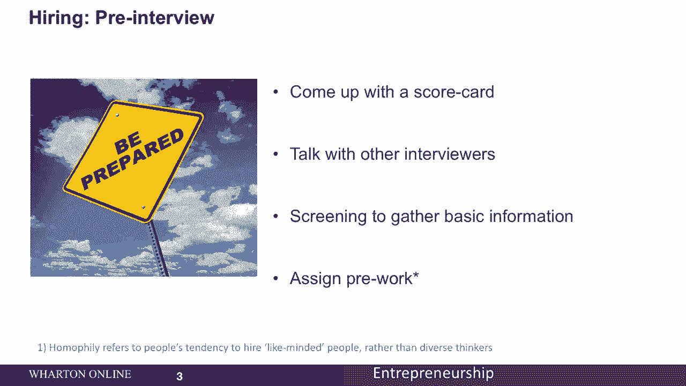
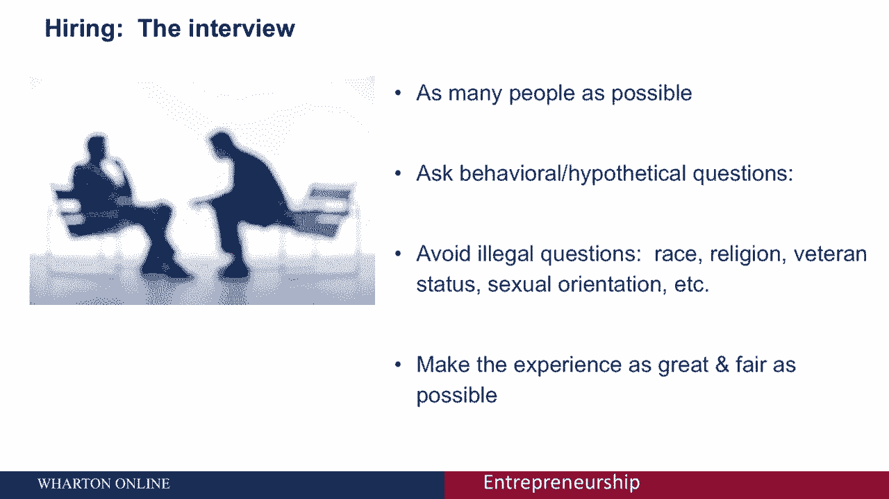
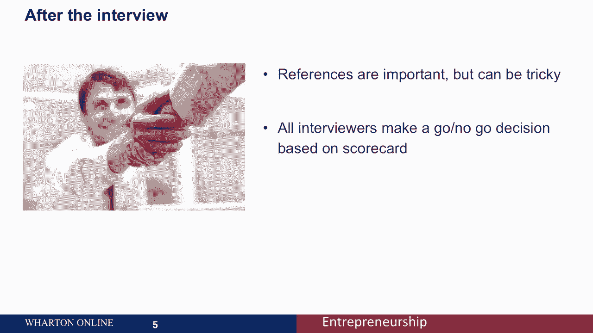
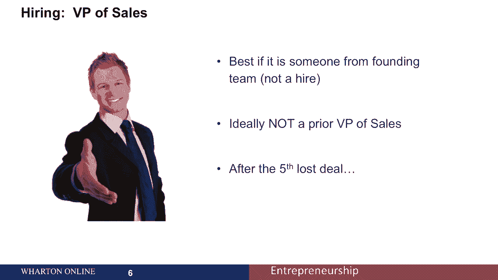
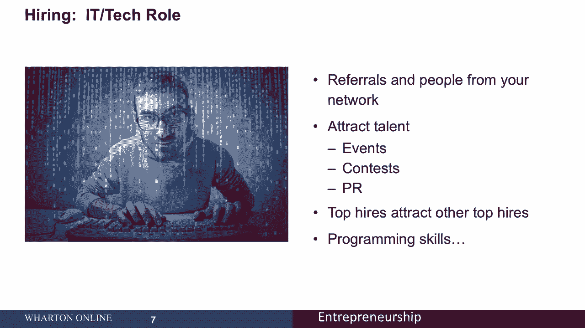

# 【沃顿商学院】创业 四部曲：发现机会、建立公司、增长战略、融资和盈利 - P46：[P46]05_2-4-hiring-key-management - 知识旅行家 - BV19Y411q713

欢迎参加我们关于雇用您的主要管理团队成员的讨论，我们将讨论在招聘过程中要记住的一些关键事情。

我们还将讨论如何雇用两个最难雇用的职位。

为你的顶级销售和营销人员和你的顶级技术人员，我们会谈到面试本身，以前的最佳实践，面试期间和面试后，那么我们将讨论雇用销售人员时的一些违反直觉的概念，然后我们会讨论在招聘时雇佣你们的技术负责人。

你想在面试之前考虑一下面试过程，你想想出一个团队成员同意的记分卡，你想和其他面试官谈谈，谈谈筛选，以收集基本信息。

你也可以考虑分配预工作，这在程序员和开发人员的上下文中尤其相关，他们可能会在面试过程中专门为你编程。

你想采访尽可能多的人，你想试着问行为和假设的问题，以及技术问题，比如在这种情况下你会怎么做，显然避免关于种族的非法问题，宗教，老兵身份等，让体验尽可能的美好和公平因为候选人会经常和其他候选人交谈。

面试结束后，您还需要考虑收集参考资料。

但请记住，参考文献可能很棘手，因为它们通常是压倒性的积极，面试结束后，也要确保所有的面试官都做出一个“去不去”的决定。

根据记分卡，现在，让我们开始雇佣两个关键职位。

如果创始团队的人，不是雇佣，已经做了前几笔销售，这个人可能最了解产品市场，适合产品提供，等等，理想情况下，他们经常管理领土，查看电子表格和数字，而不是在地面上做交易，你也想雇一个愿意转向的人。

和你一起迭代，你不希望有人在第五次交易失败后。

只是说让我们回到路上，开始卖更多的东西，你想让他们停下来。

和你一起思考，为什么它可能不起作用，为什么销售不起作用。

如果产品适合市场，接下来应该更多地适应，让我们看看I，技术角色，为了雇佣IT或技术人员，你想考虑推荐和你的关系网中的人，这对线索来说很好，还有其他吸引人才的方法，你可以举办有小奖品的活动和比赛。

他们提交参赛作品试图赢得奖项，顶级雇员也吸引其他顶级雇员，所以一旦你雇佣了一个非常，非常强，他们很可能也会带上他们的朋友，思考他们的编程技能，给他们一些专门测试他们编程技能的任务。

正如我们所看到的，雇人是你做的最重要的事情之一，你想专注于整个过程。

追求实质和补充技能。

