# 【沃顿商学院】创业 四部曲：发现机会、建立公司、增长战略、融资和盈利 - P4：[P04]02_1-2-profile-of-the-entrepreneur - 知识旅行家 - BV19Y411q713

欢迎参加本次企业家简介会，当你开始研究创业时。

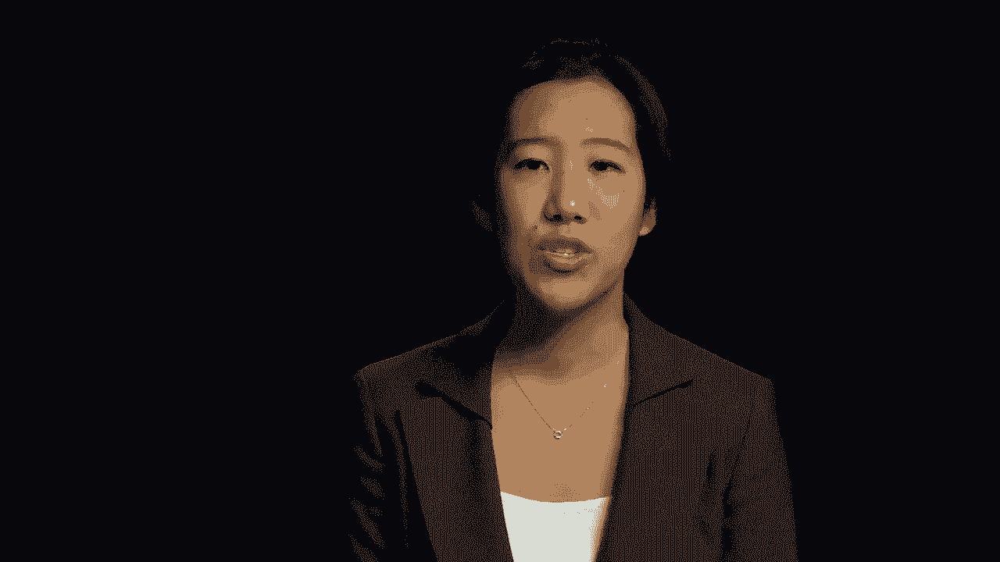

你会听到很多关于什么是企业家和谁是企业家的不同意见。

比如说，你可能会听说企业家是商业领袖，你可能会听到企业家让一个概念变得可行，你可能听说过企业家组织和管理企业，或者你可能听说一个企业家经营自己的公司。

它可以是我们在街上听到的这些定义中的任何一个或更多。

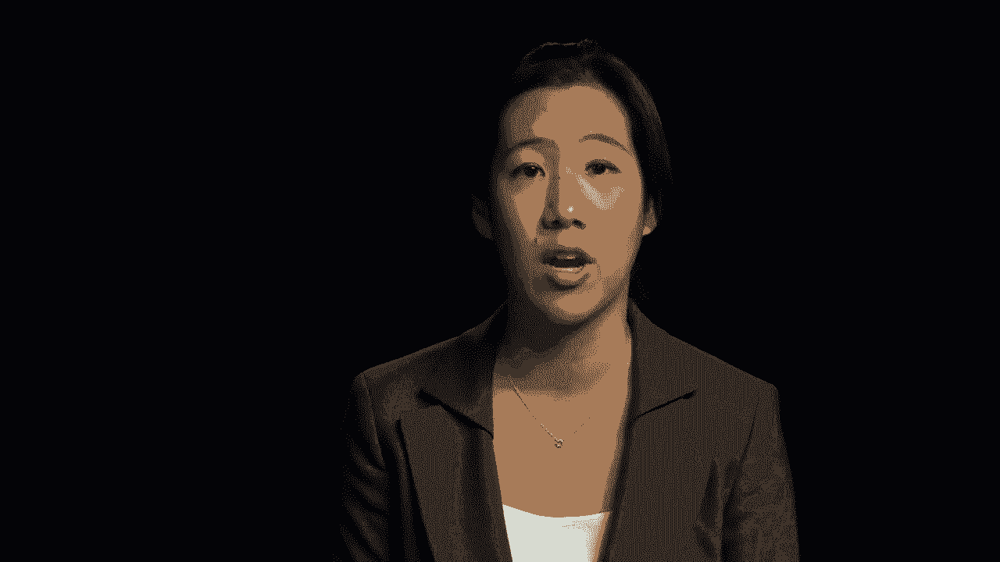

考虑到外面所有的意见，谁才是真正的企业家，有清晰的轮廓吗，我们能预测谁会真正成功吗，真的有一种企业家吗，有没有一种心态最适合创业，我们经常听到一种叫做企业家心态的东西，这就提出了一个问题。

有些人更擅长或更倾向于创业吗，因为他们的个性。

我们在研究中发现这不是真的，人们实际上会成为研究人员称之为基本归因错误的牺牲品。

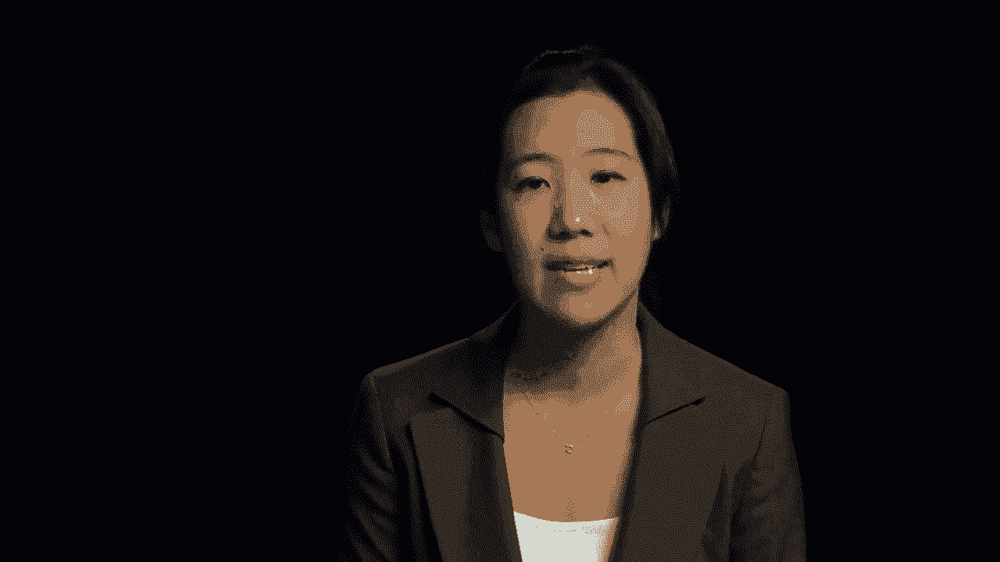

根本的归因错误是什么，假设行为是由某人的性格引起的，即使环境是真正的解释，拿着，比如说，超速的司机，我们可能会认为司机超速是因为他们不负责任，而不是假设有某种紧急情况，这种错误在西方文化中尤其常见。

比如价值观更个人主义的美国，这些解释符合我们关于公平的世界观，比如好人应该得到奖励，当我们想到企业家和企业家的心态时，应该有公平。

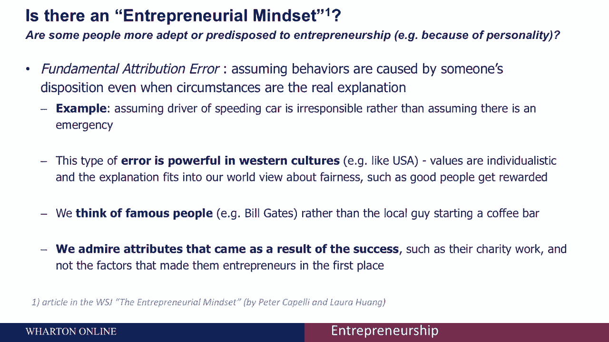

我们倾向于认为成功的企业家。

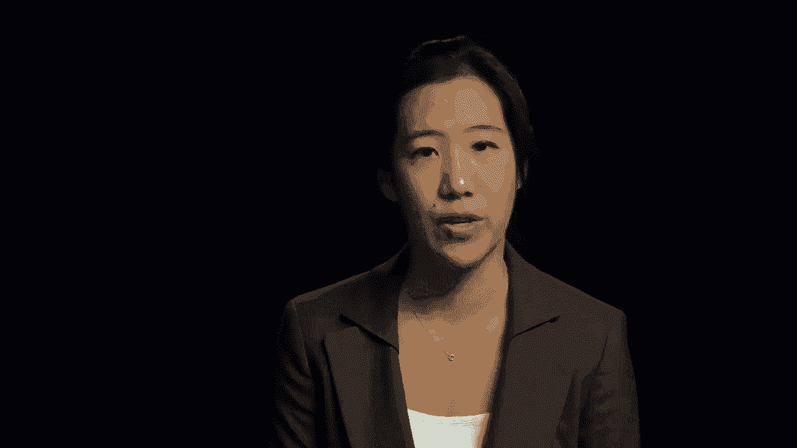

像比尔盖茨和其他著名的企业家，而不是想着当地人开咖啡吧，比如说，所以它的作用是，我们倾向于把这些名人归因于他们，并把他们与成功联系起来，低估了更多人的存活率和成功率。

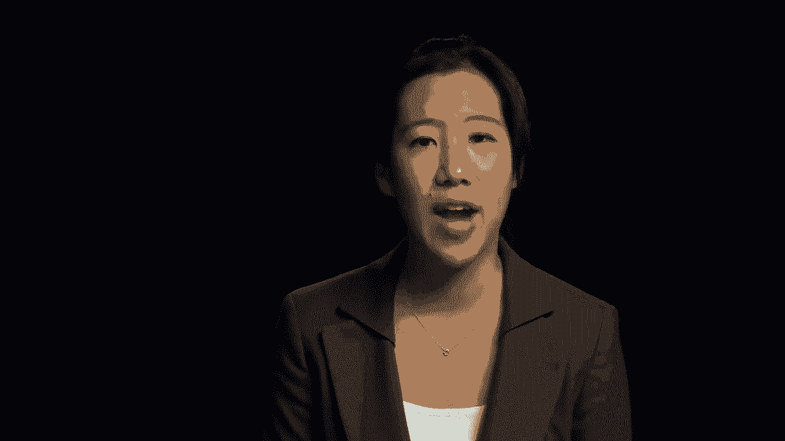

更普遍的企业家群体。

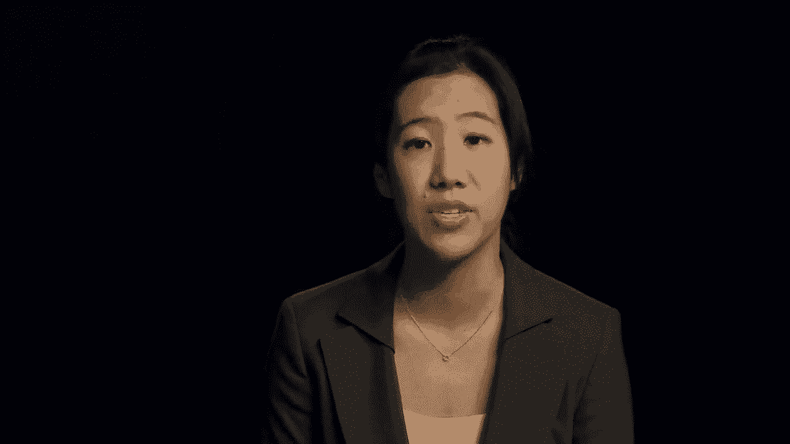

我们往往钦佩，这些也是成功的结果，比如比尔·盖茨可能正在做的慈善工作，或者其他与他们最初成为企业家的原因无关的因素，我们从创业研究中确实知道了一些事情，然而我们知道，比如说。

有一些证据表明企业家更有可能表现出过度自信。

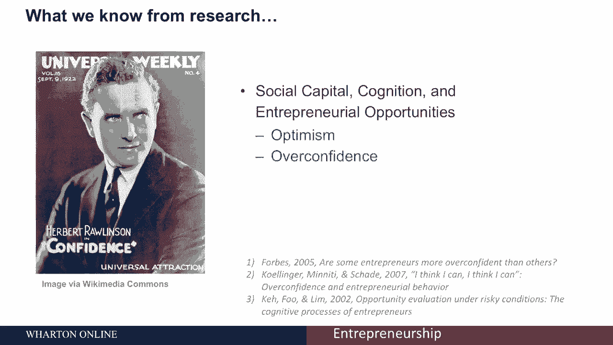

因此，在研究社会资本、认知和企业家机会的研究中，我们看到企业家更有可能表现出一些乐观，一些超出普通人群的乐观程度。

还有过度自信，但总的来说，大多数研究结果喜忧参半，关于企业家的特殊特征和属性，与其他特征相关的发现确实喜忧参半，比如说，风险倾向，有一些研究表明，企业家更有可能容忍更高水平的风险。

但其他发现表明，在风险倾向方面没有差异，一点都没有，性格特征也是如此，激情也是如此，我们经常听到创业激情。

但事实上，我们实际上不知道创业激情包括什么。

所以，这些发现表明，没有一种类型的个性。

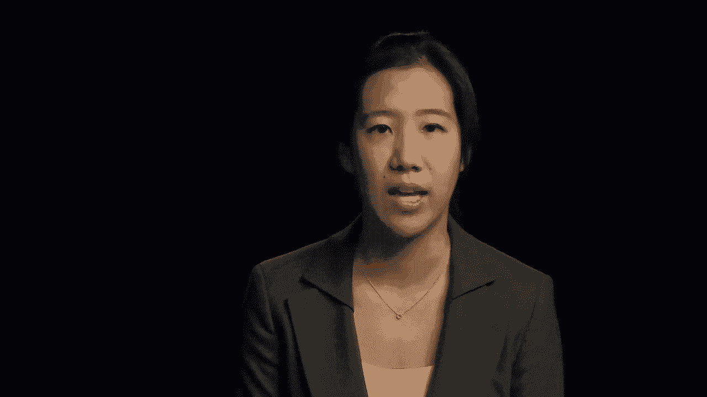

或者区分企业家和非企业家的一种属性。

不管这些发现，我们确实发现个人倾向于分为三种主要的企业家类型，它们确实倾向于归入我们可以归因于一些特定特征的类别，这些类别是连续企业家，平行企业家和非传统企业家，我们将进入这些中的每一个，在一些细节上。

从连续企业家开始，连续创业者是指专注于一个接一个地创办多家企业的人，他们的重点是成立一家新公司，通常先卖掉那个公司，然后再创办他们的后续公司，连续创业者的一个例子是史蒂夫乔布斯，我们也有平行的企业家。

平行企业家是指同时经营不止一家成功企业的人，史蒂夫·乔布斯，顺便说一句，当他同时经营皮克斯和苹果时，他也是一个平行的企业家。

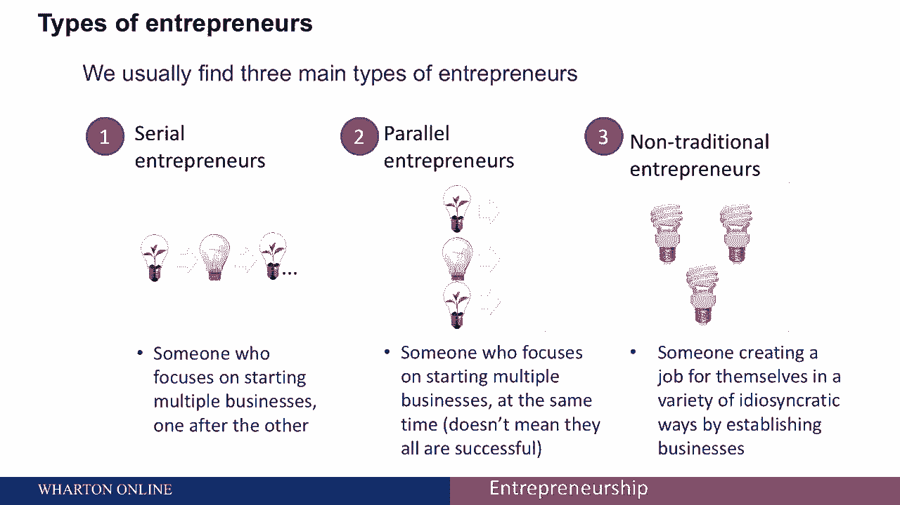

同时，埃隆·马斯克既是一个连续的企业家，也是一个平行的企业家。

首先，在1995年，他创立了ZIP 2，这是一个基于网络的报纸城市指南。

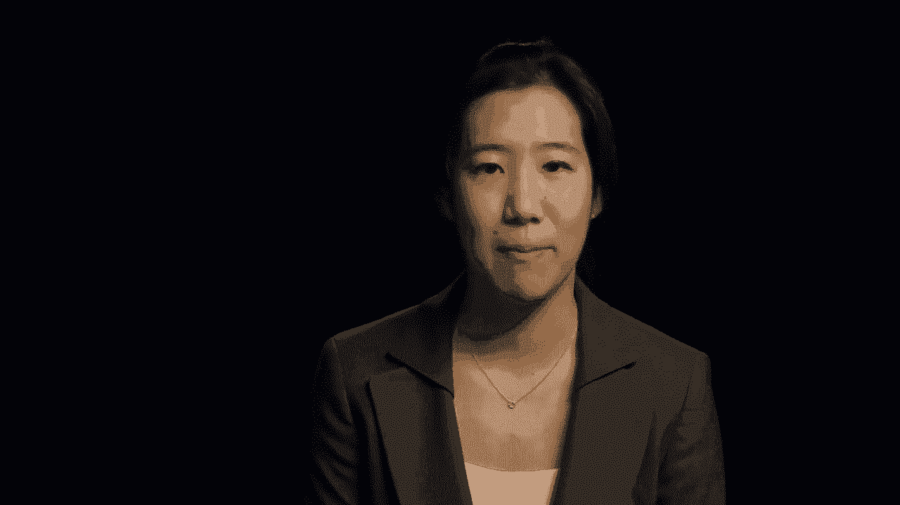

他随后以370万英镑的价格卖给了Compact，之后他创立了X。

www。icj-cij。com，这是一项电子支付服务，最终通过合并，它变成了贝宝，他现在是特斯拉汽车公司的首席执行官，同时他也是SpaceX的创始人，它是世界领先的私人太空发射提供商，在业余时间。

他还担任太阳能城董事长。

美国第二大太阳能安装商，s，所以你可以看到他同时经营多家企业。

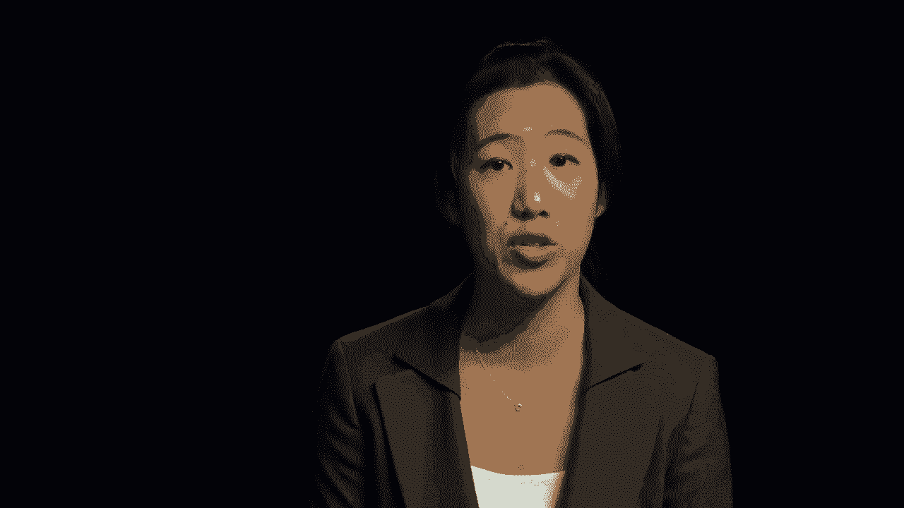

在更典型的尺度上，你可能会想到一个零售店老板，他发现自己有时间经营网上商店，还帮助他的孩子创办自己的初创公司，在业余时间，我们还可能发现工人需要运行不止一项工作，同时支付账单。

所以微型企业家发现他们经常这样做，以抵消经济困难时期，第三类包括非传统企业家，其中包括以各种特殊方式为自己创造就业机会的人，通过自己创业，这往往是因为，随着全球经济的发展。

许多跨国公司对生产和服务进行了重大的重新分配。

