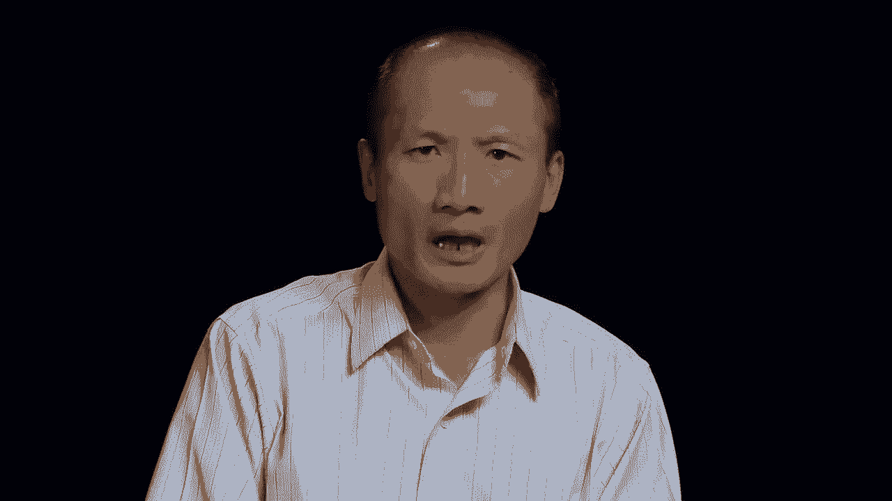
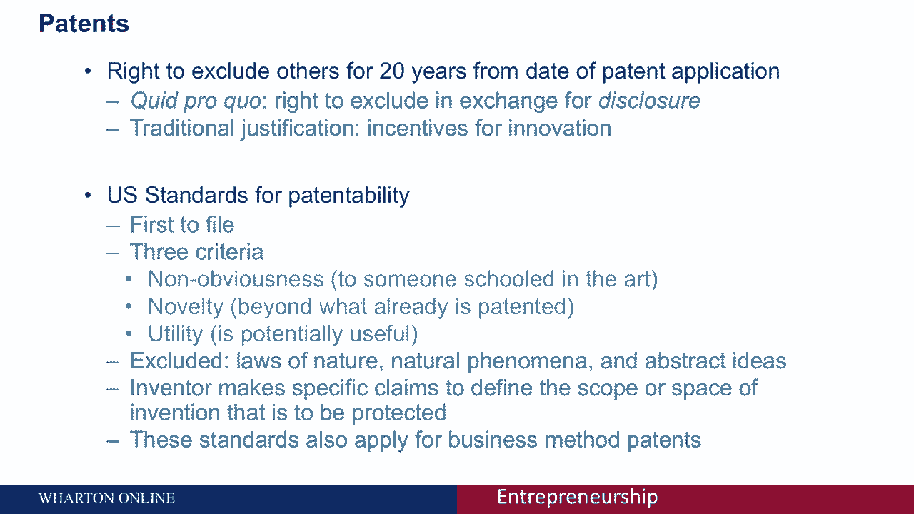
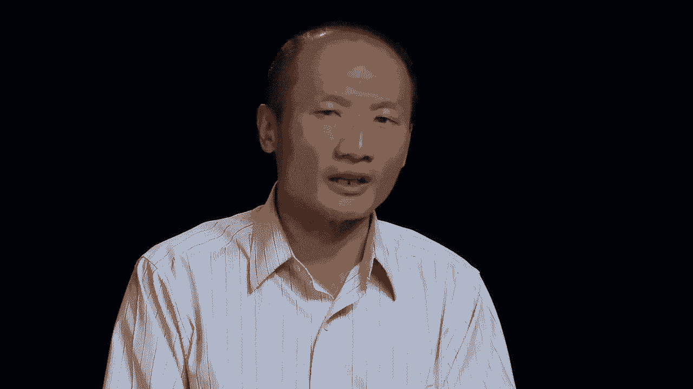
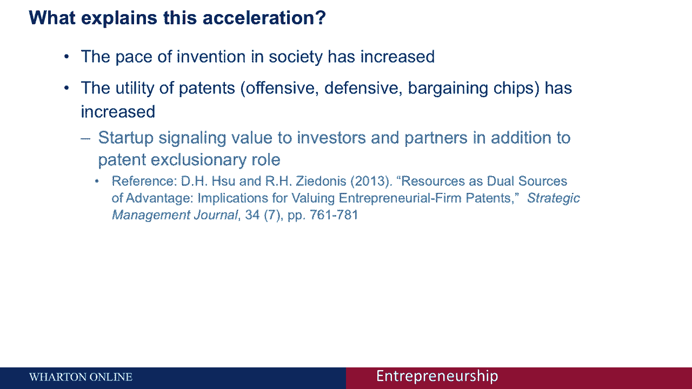
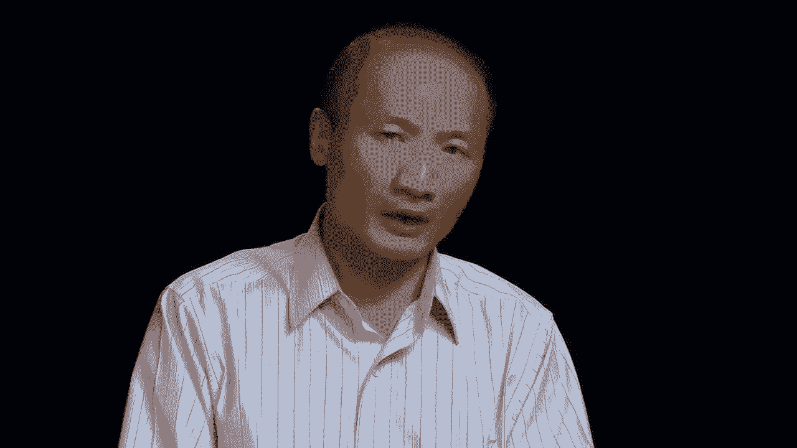
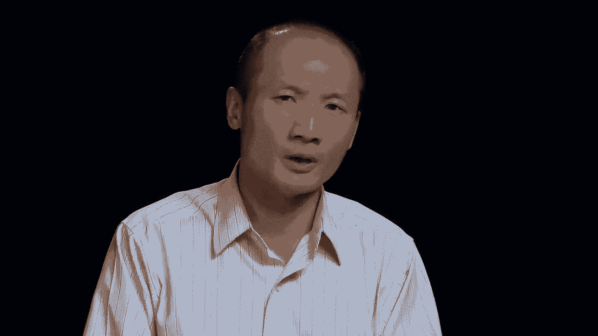
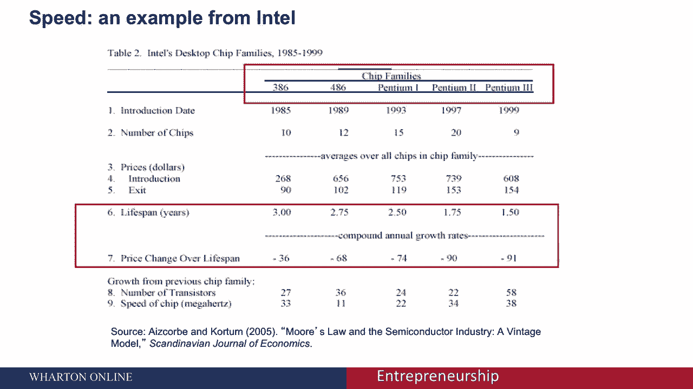

# 【沃顿商学院】创业 四部曲：发现机会、建立公司、增长战略、融资和盈利 - P52：[P52]04_3-3-intellectual-property-overview - 知识旅行家 - BV19Y411q713

大家好，朱大卫正在报道一个关于知识产权的会议，我这次会议的目标。

是向你概述各种形式的知识产权，这对你现在作为一个创业企业家来说可能很重要。

为什么知识产权首先对企业家很重要，嗯，授予某些权利的传统理由实际上是为了激励创新，让我举两个快速的例子，一个例子是激励你，作为企业家投资你的时间，努力，钱，我们想给你时间收回投资，作为你的交换。

正如我们将在专利中讨论的那样，详细披露信息，我们作为政府会给你一些垄断，对你的想法在一定时间内使用的专利保护，在以下方面可能特别重要，比如说，制药业，我们将要讨论的另一种形式的知识产权是版权的概念。

那就是控制，创造性作品的分发，想想这在数字时代有多重要，在某种程度上，复制是非常没有成本的，制作歌曲或计算机程序的另一个副本。

为了激励你，作为创造性歌曲或计算机程序的创始人。

我们想给你一些保护，这样你就会觉得自己投入到真正的创新中。

现在，重要的是要认识到知识产权类似于不动产，就像一块财产，你可以卖掉你拥有的房子，就像你可以出售专利权一样，你可以把它租出去或者许可知识产权，就像你有一个真正的房子。

你会把你的房子放在市场上让租房者来住，但您仍然保留所有权或任何其他，与不动产的一种类比，知识产权的规定相当古老，第一条在一七九十七或一七八十七，是一项允许这种激励的规定，真正激励作者和发明家。

披露他们一直在做什么以换取保护。

现在知识产权的各种形式是什么，你会讨论三四种不同的类型。

首先是专利保护，它真的允许发明者排除其他人，或者试图在给定的时间内排除他人使用受保护的属性，之后又回到公共领域，这里的一个例子是轧棉机或灯泡，这些都符合可申请专利的标准，我们稍后将讨论。

但在专利保护结束后，它进入了公共领域，知识产权的第二种形式是版权，允许作者控制其创造性作品的复制或分发，想想，这真的是表达，我们想为第三种类型提供一些保护的创造性表达是贸易保密，在这里。

它允许公司试图保护他们认为有商业价值的信息，所以这并不是每个人都能得到的，这方面的例子是商业计划，食谱，方法，技术，流程，真正使公司有能力超越竞争对手的模式，其他，这里的一个例子是肯德基。

秘制酱料没有任何其他方法的保护，但是贸易保密，我们将更详细地讨论这一点，终于可以有速度了，如果你知道我十五个月前所知道的，也许这可能并不那么重要，因为与商业相关的信息可能会以相当快的速度传播。

所以我们会举一个例子，在半导体行业的背景下，专利保护，在美国，这是排斥他人的权利，从你申请专利之日起二十年内，从政府的立场来看，传统的理由是，鼓励披露，给你一段时间作为创新者，收回你的投资。

你在发明上投入的时间和精力。

因此作为一个社会，我们不是真的在重现轮子，相反，我们站在巨人的肩膀上，当我们在社会中进步的时候。

这将在美国取得累积进展，这是第一个提交文件的国家，世界上大部分地区也是如此。

可专利性有三个标准，首先，对于一个受过艺术教育的普通人来说，这必须是不明显的，其次，它必须是新奇的，相对于以前获得专利的东西，它现在也必须有用，达到这三个标准，明确排除的是任何自然发生的事情。

任何热力学定律，万有引力定律，任何自然发生的现象或抽象的想法，不受专利保护的，然而，如果你作为发明家创新者，在基因上改造了一些东西，想出一个新品种的苹果、玫瑰或绵羊，那不是自然发生的，可以是专利的。

可以受到专利保护的，现在，专利申请中的发明人必须对他们所做的事情提出具体的要求，那是新的和新颖的，这有助于划定，发明的范围或空间应为，这些标准也适用于商业方法，新的经营方式。

你们中的一些人会熟悉亚马逊的一键专利，这是一种新的经营方式，其他做生意的方式也是如此，也许是优化或分析，这是一个新的算法，那不是自然发生的，随着时间的推移，专利的发展速度很快。

你在这张图中看到的是随时间的加速度，我们在美国授予的，第一百万次，下一个百万项专利，第一个专利是在1790年授予的，它实际上花了121年才获得第100万项专利，时间大大缩短了，当你从说。

第八到第九百万项专利，这可能反映了现在的一系列解释，什么解释了随着时间的推移加速度，为什么我们能够实现这些里程碑，越来越快，一种假设可能是我们是一个更有创造力的社会，另一种假设是专利的效用或使用。

不管是为了冒犯的手段，防御手段，或者随着时间的推移，讨价还价的筹码加速了，这种解释或一套解释在学术界变得相当重要，来说明一下。

这方面的一个具体例子，它对创业创新者尤其重要。

专利不仅允许你作为创新者。

去尝试，排除，或排除他人复制或进入专有领域。

它还可以用来向风险资本家等资源提供者发出信号，你有一个真正的差异化来源，在你的专利授权中，什么实际上是专利，这可能对解释获胜的马很有意义，这对风险投资投资者来说可能很有吸引力，有一些争论。

我不会过多地讨论这一套特定的概念，知识产权保护对创新是好是坏，一方面，我们都很熟悉这些专利巨魔，或不，被大众媒体嘲笑的实践实体，从商业化或将产品推向市场的角度来看，实际上没有生产力。

这已经成为一些立法的主题，比如说，针对这些非执业实体，另一方面，在某些情况下，这些创新可能已经普及，正是因为它们不是知识产权的主体，这里有两个例子，使用特定的财务选择，定价公式。

被称为布莱克·斯科尔斯公式，它不是知识产权保护的主题，而是教授们，教授，布莱克和斯科尔斯在一篇学术文章中披露了他们的创新，也许这就是它在墙中如此受欢迎的原因，街道。

交易员和其他金融个人和行为者是因为它被放在那里，如果与事实相反，他们决定申请专利或寻求知识产权保护，也许它不会那么受欢迎，同样的事情，那里的引用提到了一个非常有趣的游戏，数独。

它的普及可能正是因为它没有寻求专利保护，知识产权保护的第二种形式是商业秘密，商业秘密，允许个人和公司，图案，方案，与外人相比，可以让他们领先的技术或过程，现在商业秘密和专利有一些明显的区别，首先。

它是在州一级而不是联邦一级裁决的，专利也是如此，其次，商业秘密只要能被无限期地保密，这与我们之前谈到的专利形成了鲜明的对比，现在重要的是你，作为商业秘密的持有人，必须采取合理的预防措施来保护这些秘密。

不受保护的是通过独立发现获得的信息，由竞争对手制定的，通过逆向工程，或者你可能无意中透露了，由竞争对手获得，你可以援引一些贸易保密法来帮助，试着保护你的商业秘密现在让我来掩护。

对实现这种保护很重要的具体合同条款，第一个是保密协议，如果有一个特定的信息，你试图保护，作为创新者，你可以，在向某人透露该信息之前，草拟保密协议，这是合同上的，是契约契约，保护这一点信息不被泄露。

属于贸易保密的第二种知识产权保护形式，不竞争的契约的概念，排除或帮助排除以前为你工作的人，作为他们的雇主，现在出去为竞争对手工作，在这种情况下，前雇员可以向该雇员披露该资料，那么。

一个不竞争的契约或一个不完整的竞争条款，基本上是禁止员工立即外出，从竞争到被竞争对手公司雇佣一段时间。

最后，我想快速讨论速度的概念，作为一个例子。

如果你是在一个竞争非常激烈的环境中运作，正式的保护可能就没有那么重要了，我想和大家讨论的一个例子是英特尔的案例。

在其不同芯片家族的情况下，在这里你可以看到一个表格，列出了不同的芯片家族，从386代开始，一直到各种版本的奔腾，我在这里强调的是特定芯片家族的寿命，以及特定芯片系列的价格折扣。

从芯片家族生命的开始到芯片家族的结束，拿着，例如奔腾三，这是一个有架子的芯片，生命约一年半十八个月，在这18个月里，你可以看到英特尔只能收取一美元，在该时间段开始时，但在这一时期结束时。

一美元只有9美分，所以想象一下，如果你在那种环境中工作，知识真的很快就过时了，你会对通过正规渠道不太感兴趣，也许是专利程序或贸易保密程序，因为这些知识很快就过时了。

回顾一下这次关于知识产权的会议，我们已经涵盖了不同形式的知识产权，以及一些制度安排，这些安排可能会让你作为创业企业家，一种或另一种知识产权保护。

