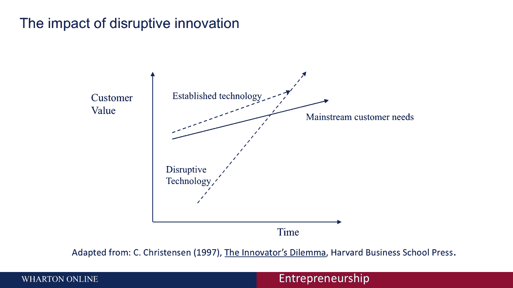
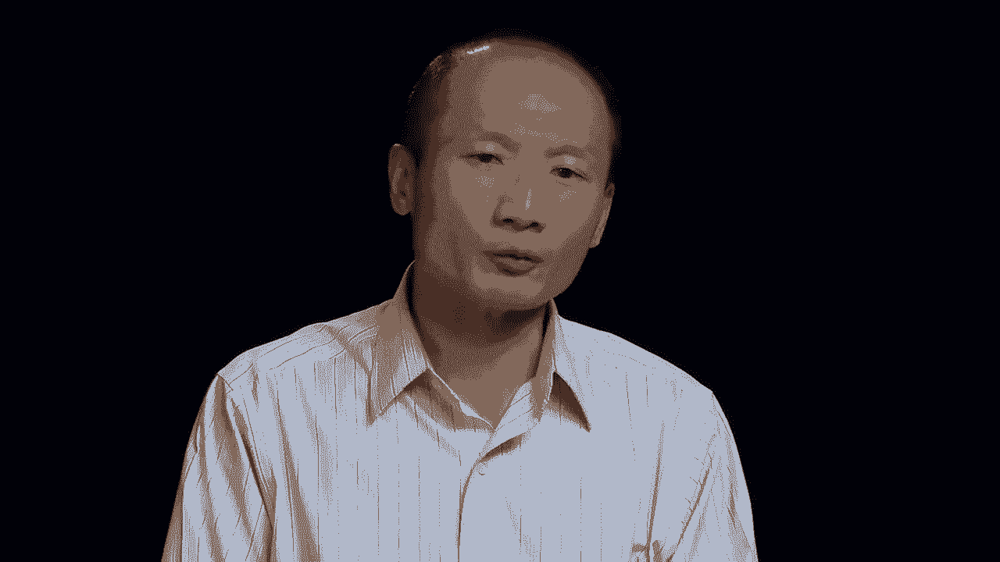
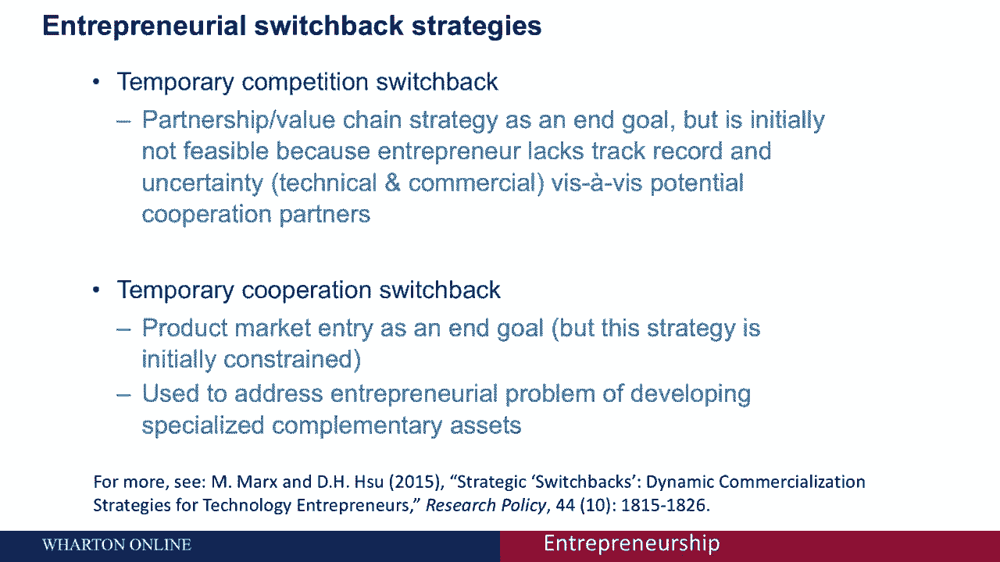
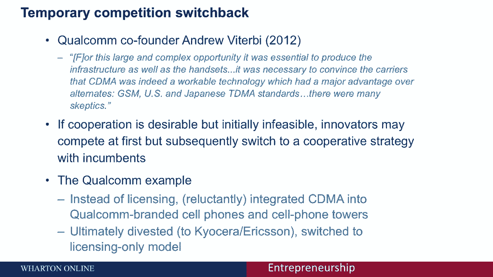

# 【沃顿商学院】创业 四部曲：发现机会、建立公司、增长战略、融资和盈利 - P58：[P58]03_4-4-entrepreneurial-strategy - 知识旅行家 - BV19Y411q713

大家好，沃顿商学院的大卫苏正在报道一个关于创业战略的会议，激发本次会议的一个开场问题是，为什么战略对企业家来说很重要，如果你把墙捡起来，街道，期刊，或任何其他主要商业媒体。

你经常听到关于成功创业的头条新闻，因为我们在努力，1。我们击败了竞争对手，在一天结束时，我们只是让它发生了，所以这将是一个极端的观点，另一个极端的观点是，作为一个企业家，你的资源极其有限，所以对你来说。

制定策略更重要，考虑竞争对手对你的参赛会有什么反应，在某种程度上，你能够得到一些理论，或者假设你为什么会成功，这将补充你的执行，您的实现，所有其他对你来说真正胜过策略所必需的事情。

并成功地与更成熟的竞争对手和现任者竞争，在一天结束的时候，有一个战略会让你作为企业家真正优先考虑，在你创业之初，真正必须做的事情是什么。

为了让您成功进入市场，这才是真正的动力，今天的会议。

让我给你一个真实的例子，所以回到1999年，有一家非常有趣的公司叫WebVan，这是一家非常受吹捧的公司，这将使食品杂货在线送货成为可能，你将能够打开你的互联网网站，浏览器点击你想要的杂货。

突然间那些杂货就会出现在你的后门，那家公司实际上消耗了大量的风险资本，但最终失败了，它采取了一种真正试图扰乱行业现任者的策略，另一方面，大约在同一时间成立了另一家公司，Peapod和这里。

而不是作为行业现任者的替代品，他们，他们认为这将是对现有杂货店连锁店的赞美，在这里，他们允许顾客做的是，如果客户想要。

他们将能够打开一个网站，并能够在网上订购他们的食品杂货，并让他们交付，营销没有那么多，我们将更换食品杂货连锁店pepod，而是，我们将成为在线部门，所以如果你希望你的杂货出现在网上并在网上订购。

那个频道也可用。

在这里，这是一家实际上做得很好的公司，这里的教训是企业家，这是两家创业公司，真正寻求利用同样的创业机会，这是由互联网的兴起提供的，但结果截然不同，可能是因为他们有非常不同的策略。

我将为企业家们提出三种不同的策略，一是价值链战略，与行业现任者合作，加强他们已经建立的价值，然而，你正在沿着价值链的一部分进行创新，以富士康为例，这是一家生产iPod的公司，iPhone。

与行业现任者合作的Kindles等，亚马逊和苹果，但处于制造业的前沿，这将是一种创业价值链战略，第二个完全不同的策略，它更像是Webvan的路线，试图破坏的策略。

或者通过带来一个不同的平台来破坏行业现有的价值链，一个不同的价值链到现场，所以除了这个例子，我们可能会想到Netflix，因为它试图进入并扰乱，作为分销渠道，媒体和电影，与当时的行业和能力相比一鸣惊人。

第三个策略是完全转移竞争，并试图思考如何进入市场空间，那是绿地，全新的，这不是业内任何人提供的，这是一个被这些引用教授推广的概念。

真正创造新的市场空间，这里的主要例子，R和B和B创造了一个新的市场类别，在某种意义上是一种替代。

但以前没有想过，在为寻求住房的个人提供住房的空间，我们会回到这些例子，再深入一点，现在你可能会问的一个问题是，哪一个是解决的最佳策略，那个，嗯，你们中的一些人可能知道这些独角兽，独角兽是一个术语。

真正暗示私人价值的术语，至少在10亿U的水平上，S元，让我告诉你这里的方法。

我在沃顿雇佣了一组研究人员，分类，140家被贴上独角兽标签的公司，我们试图分析，他们正在使用和上市的策略是什么，也许对你们中的一些人来说很惊讶，大体上，价值链战略比颠覆战略重要得多。

就这些统一的独角兽公司使用什么策略而言，现在，这是一个非常特殊的数据点，但至少给了你一个概念，价值链战略可能非常重要，不仅仅是颠覆性的策略，嗯，在媒体上普及了，关于有价值类型公司的基础是什么。

现在强调价值链战略的一件事是，这种与他人合作的观念，与破坏策略形成鲜明对比，这更像是一种竞争类型的策略，因此，回顾一下与行业现任者合作的一些好处，一个人很清楚有这种分工。

所以初创企业正在做他们最擅长的事情，那就是上游创新，然而，他们通过做一笔交易，两全其美，或与合作伙伴合作，拥有下游资产的行业现任者，通常这些现任者都很好，产品推向市场，他们有优越的制造条件，分配。

市场营销，渠道销售类型，这些下游资产往往与行业现任者有关，如果你能把这两个实体结合在一起，这可能是一个获胜的策略，在社会一级，各国政府，比如说，可能会在乎我们不想重现事物，避免重复投资。

如果我们能在社会上有这种分工，所以这些都是与他人合作的好处，这就引出了一个问题，为什么合作总是发生，有几个摩擦与合作有关，一个很简单，交易成本可能很难找到合适的合作伙伴，即使你能找到合适的伴侣。

想想所有这些深入收缩你必须做的，你必须明确在世界糟糕的状态下谁对什么负责，谁获得权利，所有这些不同的编纂要素，不同的现金流，与过程的承包类型相关联的控制权限，这些都是与合作相关的各种交易成本。

也可能有分歧和信仰，对一方可能对某种创新是否重要有不同的看法，对，因此，一方可能对与另一方做交易不感兴趣，会有感知上的差异，可能是一个不同的，创业的价值主张未经验证，所以这些事情可能会导致信仰的差异。

因此破坏合作，最后从初创企业的角度来看，可能会有这种披露困境，与行业现任者做任何交易都需要披露一些细节，你所做的一切，没有适当的保护，披露该信息，可能会削弱你作为创业企业家的价值。

所以仅举一个具体的例子，有一部电影，基于一个企业家带着一个，有一个更好的挡风玻璃雨刷会很兴奋。

流向行业现任者，汽车制造商说看，我发明了一个非常重要的挡风玻璃刮水器，你愿意和我做个交易吗？

汽车行业的现任者说谢谢你的到来，但我们已经在努力了，所以你们中的一些人可能知道这部电影，天才的闪光，它真的经历了与那个特定事件相关的所有头痛和心痛，所以这真的强调了与现任者谈判的概念。

在签约或合作过程中都有自己的陷阱，现在我想做的是离开去，在使用价值链策略时，给你留下了一些其他的考虑因素，即使你有抱负，如果你--尤其是如果你有学习生产技能的愿望。

因为有一天你必须长大并从创业企业家的行列中毕业，成为行业现任者，对你来说，通过制作来进入游戏可能会更好，而不仅仅是让事情保持一定的距离，因为你必须犯错误，你必须沿着学习曲线前进。

以便您有融入生产的长期前景，你需要做好的所有下游方面，作为一家成熟的公司，如果你只是以保持一定距离的方式做交易，和一个从长远来看可能对你不太好的现任者在一起，我想介绍的下一个策略是现在的颠覆策略，记住。

与合作战略形成对比，这是说明这一概念的竞争策略，让我给你举一个具体的例子，摘自哈佛商学院的克雷克里斯滕森教授，在他1997年的书中，他所展示的是，跨越几代人的硬盘驱动器，当你从8英寸的一代到5。

5英寸的一代，看看这些属性，这些是与这个特定行业相关的关键绩效指标，当你从8英寸的一代到5。5英寸的一代，硬盘驱动器的容量变差了，访问时间变得更糟，每兆字节的成本都变得更糟，所以如果你问顾客，做。

您更喜欢这些更差的性能指标，当你进入新的表演时，新一代硬盘驱动器，大多数顾客会说不，这是颠覆性技术的标志，那就是，如果你问顾客，他们喜欢什么，他们从来不告诉你他们更喜欢新一代。

这只是在一个属性上变得更好，大小，尺寸的小型化，但在很大程度上，在其他属性上变得更糟，以修复这个想法，这个理论有一个广义的概念，与现有技术相比，颠覆性技术最初的性能更差，但看看改进的轨迹。

与现有的技术相比，它要陡峭得多，并在建立，颠覆性技术使普通主流消费者的需求黯然失色，这正是行业现任者被打乱的时刻，现在回到Netflix或Airbnb的例子，现在Airbnb我在蓝海战略下覆盖。

但它不一定与一开始的颠覆性技术相互排斥，性能要差得多，在Airbnb的情况下，你睡在沙发上，以及行业现任者希尔顿和喜来登，他们不认为这个Airbnb是一个，对他们的业务是一个可信的威胁。

但Airbnb的业绩轨迹要陡峭得多，与希尔顿和喜来登使用的增量进步相比，突然间，当你在这个行业快速前进时，有一个性能轨迹要好得多，这些公司的希望，像网飞，Airbnb，优步是一个。

当行业现任者认识到破坏性时，太迟了，因为他们赶上了日食。

按对客户的表现计算的市场价值，结束这一节，我想做的是给你一个比较，都来自初创企业，从现任行为的角度来看，以及启动行为，就挑战而言。

这是我已经讨论过的材料，而是封装在这个里面，这张方便的幻灯片或图表，真正给中央管理或创业带来挑战，与这些策略中的每一个相关联的，价值链战略，你知道吗，为什么不，为什么合伙人，现任者想和你一起工作。

对于颠覆性战略，现任总统会在什么时候醒来并真正做出回应，为了蓝色的海洋，为什么会有，为什么在新的市场空间方面会错过这个机会，在某种意义上，这是留在桌子上的，现任者已经涵盖了，从创业的角度来看。

就挑战和关键问题而言，我们也可以总结一下这些东西，从价值链的每一种战略的角度来看，你如何减轻你的征用威胁，或者让伴侣相信这真的是他们应该感兴趣的事情，作为一个创业企业家与你合作，以及颠覆性和乳液策略。

主要的挑战是你将如何执行，假设现任者醒来，你有什么方法来保护你的想法或执行现任者，如果他们决定进来和你激烈竞争，以上是三种创业入门策略的总结，在这个特定模块的上下文中。

我想向你介绍一个新主意，在我们讨论价值链战略的概念之前。

以及你与行业现任者的合作。

或者破坏或蓝海战略，会话策略，在这种策略中，您将与行业现任者竞争。

作为一个创业企业家，很多时候。

您可能无法立即使用这些选项，所以类似于攀登一座山的类比。

最有效的登顶方式，就是直接上山。

但很多时候对于创业企业家来说，即使你的目标是最终合作或竞争，这可能很难，因为我会很快，我很快就会讨论，因此作为一个可行的战略。

你要做的是曲折，先采取一种策略，这可能会启用不同的策略，我们所说的，这是一个企业家的转变策略，它是基于我自己的一些研究，让我把想法介绍给你，有两种类型的企业家转换。

第一个是我们在这里称之为暂时的竞争转换。

这个想法是，你的最终目标是与行业现任者合作，但作为一个创业企业家，你可能面临的问题是，就是，也许行业现任者不相信你会兑现承诺，创新类型，你声称有很大的不确定性，都在U的水平上。

He’他是个没有前科的企业家，或者你试图推向市场的产品或服务，所以在这种情况下你可能想做的是你的最终目标是竞争，就是最终合作，而是首先以竞争策略进入市场，向世界和现任者证明或展示你不仅仅是在谈论。

汽化器，你真的想出了，你声称想出的创新，然后合作可能会更有效率，或者和行业现任者做交易，所以本质上，在这个转换中，你要做的是向合作伙伴展示，你有它所需要的，你的创新是真的，现在。

相反的策略是作为一个创业企业家，暂时的合作转换，你的最终目标是在产品市场上竞争，但这里的困境是，你没有所有其他的组织资产，为了实现端到端的解决方案，您需要的补充资产，到市场，所以取而代之的是。

你可能会做的是在你作为一个创业企业家的历史的第一阶段，与现任者进行合作交易，那就是尝试做一些联合营销，与行业现任者的一些联合制造，所以你一路上都在学习，然后在第二阶段，你可以结束这些合作关系。

这样你最终就可以用自己的品牌进入产品市场，所以这个想法是，你能够解决和建立你的组织能力，这样你就能在以后的产品竞争中处于有利地位，让我详细介绍一下这些策略。

暂时的竞争逆转，让我给你举一个来自高通的具体例子。

这是一家真正提出了这个重要创新的公司，叫做CDMA代码部门，多址接入，它允许通信模式，它基本上使地窖手机行业，在高通进入这个行业之初，他们提出了这个新标准的创新，与以前的标准竞争，在世界各地被称为GD。

gsm或tdma，时间分割，多址接入，当我们和创始人交谈时，高通创始人之一，他的挑战啊，真正明确的是，没有人真的相信这可能是真的，cdm似乎好得让人难以置信，所以高通要做的是他们必须进入市场。

尽管这对他们来说非常昂贵和低效，建造手机塔和手机，因为没有一个运营商相信他们想出的是真的，所以当他们，当高通进入并向世界证明这是一个可行的标准，然后他们剥离了这些部分的业务，对他们来说不再有效。

在世界各地建立手机信号塔，所以他们最终会剥离这些手机信号塔。

给京瓷和埃里克森，在手机端。

他们变成了我们今天所知道的高通，这只是产生知识产权。

推动CMA和其他类型的标准。

所以这很好地说明了这个难题。

对于一些创业企业家来说，他们希望最终合作或采取价值链战略。

但由于怀疑和缺乏声誉，这很难，关于行业现任者。

现在让我更详细地介绍一下我们讨论过的另一种转换策略，也就是这里的临时合作切换，你会记得，最终的策略是与行业现任者竞争，也许采取蓝海或颠覆性策略，但问题是最初你作为一个创业企业家，没有任何下游补充资产。

你不知道如何营销，你不必知道如何制造，所有这些成功竞争所必需的补充资产，想想像宏基这样的公司的例子。

你可能会想到宏碁，我们现在知道他们是品牌电子产品的制造商，通信电子设备，但在早期，它们必须是白色标签，甚至可能是像戴尔这样的原始设备制造商戴尔本质上说。

按我们的规格制造这些电脑盒，我们要给他们贴上标签。

那么像宏基这样的公司就不仅仅是为别人的设计制造产品了，但后来成为原创设计制造商。

他们负责设计设备的ODM。

戴尔仍然在终极盒子上得到它的名字，但至少宏碁能够提高他们的设计能力。

然后是毕业的最后阶段，成为一名成熟的品牌球员，他们在设计和品牌自己的设备，这就是我们所知道的，王牌还是今天的王牌。

但在此期间他们不得不与一些最好的品牌合作，为了开发其中的一些组织资产，所以在。

本质上，可以让你和一些最好的合作伙伴一起学习。

但一旦你学会了这些能力，你可以摆脱这些伙伴关系，基本上出去竞争。

所以我们可以涵盖其他例子，这句话我不会一字不差地读，但你可以看到与遗传相关的相同模式，一个非常不同的部门，但是这里的创始人讲述了他们是如何带来他们的第一个产品的，胰岛素以合作形式推向市场。

但后来它们成为我们今天所知的基因，它本质上是一家独立的公司，在回顾中给自己的产品打上品牌，创业的转变策略可能是相关的，如果你被阻碍或阻止。

最初采取你喜欢的策略。

