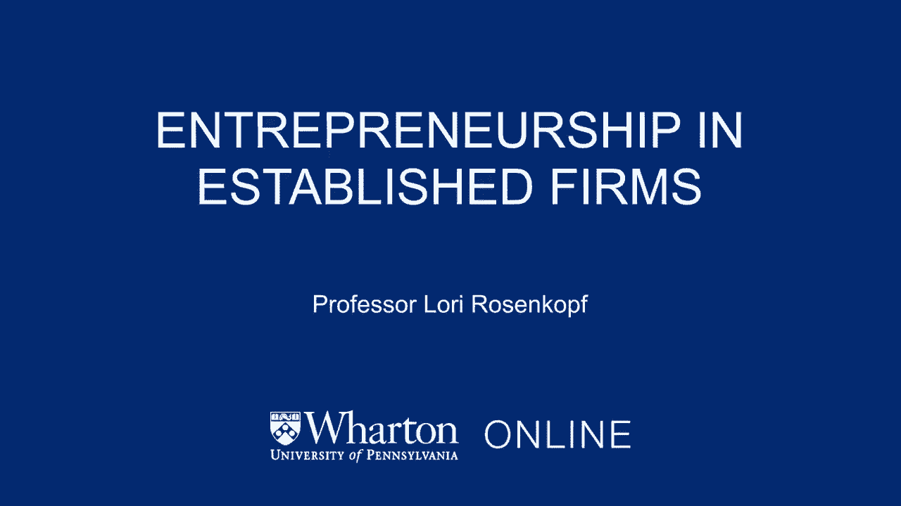

# 【沃顿商学院】创业 四部曲：发现机会、建立公司、增长战略、融资和盈利 - P5：[P05]03_1-3-entrepreneurship-in-established-firms - 知识旅行家 - BV19Y411q713

老牌企业能否成为企业家的问题还有待解释。

一方面，很多从业者，很多学者，会争辩说，我们在这个专门化中提出的概念和技术同样适用于更大的，已成立的公司，也许在这些类型的公司中更重要，经理们需要评估盈利能力，原型和测试，获取和保留，顾客，所以说。

当然啦，经理即使在，但另一方面，在大众媒体上做了很多工作，在学术文献中，表明新的企业和年轻的公司比老牌公司更灵活，他们有能力从根本上改变行业和技术，这意味着老牌公司可能难以抓住新的机会。

最终失去市场主导地位，答案是两者都是真的，有挣扎，但也有机会，在这个模块中，我们将研究为什么老牌公司会变得惯性，并与这个问题作斗争，但同时，他们将用来开发和追求新机会的做法。

在大众媒体和学术文献中都有很多关注，关于老牌公司的经理如何创业，作者们用许多不同的术语和短语来描述这种活动，所以如果你想了解更多，你可以搜索一些术语和短语，我们今天讨论的内容包括，两手灵巧的创新。

双手工作，同时做这两件事，再次平衡探索，同样的想法，我们稍后会更多地讨论这些，还有动态能力，所以所有这些都有大量与之相关的文学作品，如果你想看得更远，这个图用机会表示一个公司的机会空间，我是说。

每次公司，已成立的商号，寻找机会，他们将决定他们是否，体现增量创新与间断创新，那是我们的x轴，以及这项技术是否会被带到现有的或新的市场，这是我们的y轴来举例说明，增量技术与不连续技术，想想iPhone。

最初的iPhone是一个断断续续的创新，移动设备功能的根本差异，该设备的制造商，等，相比之下，iPhone6S将是增量创新，仍然有一些新功能，感觉有点不同，但在很大程度上。

它在很大程度上建立在已经建立的技术上，在整个iPhone的轨迹中，当我们思考市场时，你可以把任何特定的产品带给现有的客户，所以iPhone6可能很多顾客也买了，比如说iPhone4。

或者你可能会把你的技术带到一个全新的市场，有新的地理吗，比如说，你要带的，所以老牌公司面临着这种机会空间，他们有很多事情要做，有很多想法，但在某个时候，他们的资源是有限的，他们对收入的数额有门槛。

他们希望用任何新的机会来产生，随着公司越来越大，这些门槛也越来越大，所以在许多情况下最终会发生什么，许多老牌公司被困在这张图的左下角，他们正在为现有客户寻找增量创新，所以他们遵循当前产品或服务的轨迹。

虽然这没有错，利用现有技术和现有客户群的变化，以及你如何到达它们，这是许多公司收入的来源，我们知道，但我们知道，对于长期坚持下去的公司来说，他们需要在绿色圆圈之外的一些空间里移动，也在做一些探索。

要么找到方法将，非常不同的技术，或者进入非常不同的市场，或者两者的结合，这就是为什么你会听到学者们谈论平衡探索和开发，在已成立的公司，两手灵巧的，因为你可以用双手工作，平衡这两个活动，为什么这很难做到。

为什么这么多公司陷入开发而不探索，就像他们想要的那样，关于为什么现有公司可以是惯性的另一个观点，是克莱·克里斯滕森给的，在这张图上关于颠覆性创新的著名工作，x轴表示时间，而y轴表示特定产品或服务的性能。

图中有两种颜色的线，绿线代表客户的需求或预期表现，事实上，客户的平均预期表现不仅仅是一条线，而是有三条线高，中低，因为客户可能有不同程度的需求，比如说，当我使用文字处理软件时。

我只使用了可用功能的一小部分，但是，出版界的人，将使用更大比例的可用功能，所以我们有不同水平的客户，叠加在这张图上的是红线，代表实际产品或服务的性能，顶线，持续创新。

所以这是老牌公司能够为他们的产品实现的业绩，你可以看到在时间的开始，该产品满足了低需求客户的需求，刚刚开始满足客户中等期望的需求，但随着时间的推移，很快，该机构能够满足客户的需求，即使是最高的期望。

然后继续改进，远远超出客户的需求，下面的红线，正在将一项技术推向市场，一开始几乎不能满足任何客户的需求，但随着时间的推移，它继续改善，嗯，它可以慢慢地消耗市场的低端，然后正如你在图表上看到的。

当我们不断穿越时间，它很快就会继续得到足够的改善，满足中期望和高期望用户的需求，这就是现任公司倒闭的原因，至少就这个产品而言，克里斯滕森使用的例子是微型轧机技术，综合钢铁生产商多年来生产各种质量的钢材。

和非常大的工厂微型磨坊出现了，一开始他们只能做，极低质量钢，真的是废金属，所以顾客不多，但随着他们的不断改进，他们一直在抢占市场的低端，直到我们到达重点，在那里，所有的钢铁现在都可以在许多工厂生产。

所以这是干扰，话虽如此，让我们换挡，关注老牌公司如何真正培养，我将在这里简单地谈论三个类别中的每一个，内部发展，在自己的组织内做事，伙伴关系，与其他公司合作的战略机会，最后是收购。

如果一个公司选择自己进行开发和内部发展，我们可以考虑你要求你的人做什么，你要求组织做什么，更一般地，首先想想最简单的方法，这实际上是一种文化干预，那是专门的时间，你可以对你的人说，我们想要。

你要花一定的时间做事情，而是专注于探索，三米开创性，多年前他们所说的十五次的使用，基本上这只是告诉他们的工程师，他们的技术人员，他们的销售人员，他们的市场开发。

人们认为他们可以花15%的时间在这些探索活动上，也不是每天都这样，有人说，哦，我得找到我百分之十五的时间，而是当一个人想追求创新的东西时，如果有人说哎呀，这里着火了，你现在需要战斗，他们会说不。

你知道吗，我现在15岁了，谷歌把它变成了20倍，并在相当长的几年里使用了这种技术，最近，他们已经不再正式强调20次，但它真的注入了他们的文化，有很多人一直在说，我有时间和机会追求新的项目，更一般地。

许多公司为他们的员工提供休假来追求新的想法，所以IBM和LinkedIn都以这种方法而闻名，思考更大的组织方式来鼓励创新，许多大公司正在组建或已经组建了独立的部门或研发实验室，以确保他们正在促进发展。

AH产品工艺的研究与开发，可能促进创新的基础技术，无论是短期还是长期，微软，雅虎，所有这些公司都有研发设施，使他们能够真正追求新技术，与利润动机有些分离，至少在短期内，谷歌X现在只是被称为X。

作为字母表的附属，以追求他们所谓的月球拍摄技术而闻名，他们在那里寻找真正的，真的有各种各样的技术，这些技术将从根本上颠覆性的，并将真正改变世界，正如我们所知，对战略伙伴关系的思考。

现在我们正在超越仅仅是个人建立公司的界限，并说，那家公司怎么能和别人合作呢？市场准入，以便为每个公司创造更多的机会，一个很好的例子是特斯拉汽车公司，特斯拉与丰田达成战略合作。

他们在那里帮助开发和提供丰田电动汽车的部件，所以特斯拉在电池方面的所有专业知识，技术和类似的东西可以用于这种伙伴关系，两家公司显然都从这种思想交流中受益，知识产权，等等，同时。

特斯拉也与Airbnb有合作关系，这是他们追求的一系列根本不同的问题，与Airbnb，如果你去Airbnb和特斯拉的网站，你可以看到他们为电动汽车创造了共享经济，和电池充电器，本质上。

Airbnb主机可以注册拥有特斯拉充电器，放进他们的家里，这样他们就可以把它作为他们家的一个附加功能来宣传，同样的道理，Airbnb上的租房者，如果他们开的是特斯拉汽车就能找到提供这种服务的主机。

所以市场的两边都得到了服务，特斯拉正在把这项技术带到这个旅行者的世界，在共享经济中，关于战略伙伴关系议题的报告，我们还应该讨论大公司的企业冒险武器，你经常会发现一个单独的子公司专门寻找合作伙伴。

并在这些伙伴关系中创造股权投资，所以在某些方面，这与你会听到的纯粹的风险投资有一些相似之处，在课堂上多次，但同样的道理，它也往往有，与传统风险投资形成鲜明对比。

公司风险资本倾向于更多地将战略重点放在投资上，我包括技术，这更有可能内置到未来的产品和服务中，在公司里，所以这样，这些战略联盟，或者这些伙伴关系，这些股权投资起到了桥梁或门户的作用。

最终可能导致公司收购，那我们来谈谈公司收购吧，比如伙伴关系，他们提供了对资源的访问，但是，当然啦，通过收购另一实体，成立的公司对这些资源有充分的使用权和完全的控制权，因为他们成为组织的一部分。

所以再一次，获得技术，我想和大家分享一个收购的历史例子，这也说明了现任者在获得和，并在新技术方面取得成功，这是一个在美国的A和T的故事，There’在二十世纪的大部分时间里，它是一家受管制的垄断企业。

提供电话服务，它也被称为钟系统，1992年，ATT对Macaw Cell进行了股权投资，为了开始获得技术，用于蜂窝服务，用于无线电话，以及麦考的顾客，这很讽刺，因为A和T有一个皇冠上的宝石研究设施。

叫做贝尔实验室，在整个20世纪无线和蜂窝技术的发展中发挥了重要作用，尽管他们开发了这项技术，我们前面谈到的激励措施和成本结构，导致他们直到美国的电话服务之后才真正进入这个行业。

S在20世纪80年代放松了管制，所以在1992年他们对成本蜂窝进行了股权投资，然后在1994年，在他们评估了这一点后，他们收购了整个公司，十年后，这被称为T移动，一家名为奇异的公司最终收购了ATT移动。

奇异是为了缩放的目的而这样做的，奇异已经有了一个非常大的网络，是那个，两个婴儿铃铛，一些从ATT剥离出来的公司，当它被放松管制和单一的时候，最终获得ATT流动性，就规模而言，它实际上更小。

但故事中最有趣的部分是，在二千零七年，这家公司通过进一步的行业整合和合并而倒闭，就像它被重新命名为T和T无线，所以你们中的许多人现在可能使用的AT T服务，这是一个T和T无线实际上是一个非常。

与T的原始公司非常不同，这是20世纪创新民俗的一部分，但是转移到一个最近的例子，让我们谈谈Facebook，让我们来谈谈收购活动的一个最近的例子，在Facebook的老牌公司保持创新行为。

Facebook已经进行了50多次收购，已经两点了，其中五个在U之外，如此，而他们的许多收购目标都在他们总部所在的硅谷地区，他们也在更远的地方寻找对他们有意义的技术，他们著名的收购之一是，当然啦。

Instagram是一笔10亿美元的收购，脸书为这项技术收购了Instagram，应用程序本身与他们的应用程序集成，他们都在Instagram上，而且，当然，这一举动消除了一个潜在的竞争对手。

因为当时Instagram发展非常迅速，积累了大量的客户，所以通过获得它们，Facebook能够巩固这一客户群，并确保他们不会在前线被超越，自那以后，Facebook进行了更大的美元收购。

在Oculus VR虚拟现实技术中，我想那是25亿美元，当然还有价值190亿美元的老祖宗WhatsApp。

很容易跟踪你感兴趣的任何公司的收购，仅仅通过去维基百科，你可以在Facebook上搜索，看到Facebook列出的所有收购，以及原产国和收购价格，当它被披露时，所以有很多可用的信息。

如果你有兴趣了解任何特定的公司，上市公司真的试图，所以在这个模块中，我们回顾了为什么老牌公司很难创新，还有他们使用的一系列技术和管理方法，克服这些惯性倾向。

