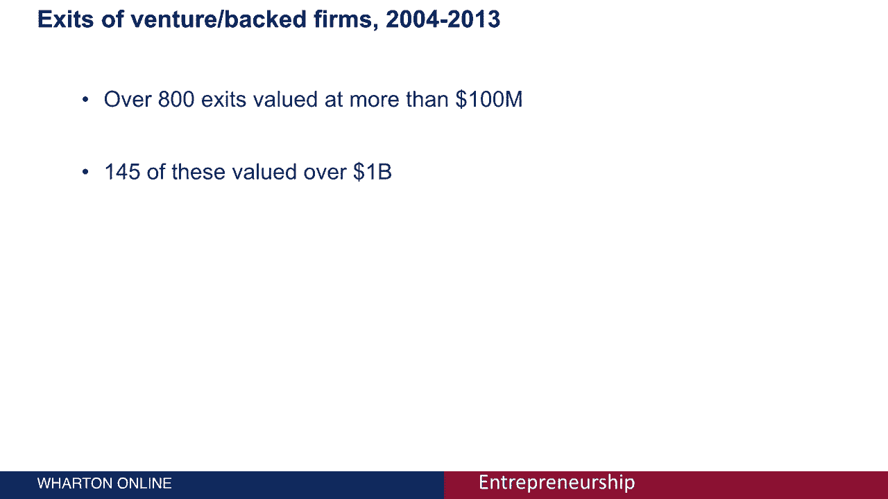

# 【沃顿商学院】创业 四部曲：发现机会、建立公司、增长战略、融资和盈利 - P6：[P06]04_1-4-venture-creations-role-in-society - 知识旅行家 - BV19Y411q713

为了思考社会，那里有很多演员，我们要做的是开发一个非常，简单，风格化的风险创建模型，其中将包括一个非常，非常，在整个生态系统中无关紧要的一小部分行为者，但这将允许我们专注于几个实体。

在那里我们可以检查一些统计数据，真正理解一些关于创造的价值的东西，所以要开始，我们需要创业公司，对呀，我们需要冒险来创造，所以我们有企业家，那些想法，这些创始团队最终需要一些资金。

所以风险投资正在为许多具有高增长潜力的初创企业提供资金，同样地，对于专注于初创企业的老牌公司来说，与他们所提供的产品或服务相辅相成的特定产品或服务，除了这种流向想法的资金，我们还看到了另一种流动。

所以虽然钱是用绿色箭头表示的，红色箭头用来表示人流，从老牌公司到初创企业，对呀，我们在另一个模块中讨论了老牌企业如何在创新面前保持惯性，所以这些公司的专业人士，会感觉到被这些惯性压力所限制。

他们会想追求这些技术，所以这就结束了，导致他们中的一些人离开并成立了自己的公司，或者加入能够追求这些技术的实体，当然，这在科技领域经常发生，这里的传统例子是硅谷的飞兆半导体。

飞兆诞生了许多著名的半导体公司，当他们组织的成员离开并创建新的公司时，所以仙童的一个婴儿是，当然啦，英特尔，在那个领域非常成功，但有相当多的，这是另一个值得查阅的历史，这不仅仅发生在高科技公司。

但是在启动上下文中创建的大部分价值，是在科技行业，我们很快就会看到，但也有其他例子表明，人们会离开老牌公司，所以说，比如说，专业服务公司，咨询公司之类的，这些公司的合伙人可能会离开，找到更多的公司。

所以同样的想法，老牌公司产生后代，所以让我们谈谈在这种情况下发生了什么，在那里创造新的产品和服务，价值正在被创造，正在进行投资，让我们首先关注创造的价值，仅仅是因为新企业或小企业的存在。

让我们来谈谈企业本身，这些企业创造的就业机会，根据考夫曼基金会的观点，u的百分之三，s，2014年成年人是企业家，把它放在上下文中，千分之三，s，成年人在2014年是自营职业者有某种企业。

所以听起来是一个很小的数字，但有很多你，s，成年人，美国有两千八百多万家企业，其中超过99%是小企业，被小企业管理局定义为少于250名员工，根据小企业协会，六十，美国私营部门创造的所有就业机会的7%。

s，发生在高科技的小企业中，这个数字更低，不是百分之六十七，是三个，百分之七，这是有道理的，因为整个企业包括许多自营职业，几乎没有雇员的地方，或者很小的数量，餐车，干洗店，高科技之类的，当然啦。

我们有很多公司变得非常，非常大，所以即使有小企业，高科技初创企业仍占30家，美国私营部门创造的所有就业机会的7%，s，所以说，许多就业机会是由于创业而产生的，让我们关注创造的价值。

最近很多注意力都集中在所谓的独角兽身上，成长并获得超过10亿美元估值的初创企业，所以独角兽这个异想天开的名字是为了召唤，这种事很少发生，谁见过独角兽，但独角兽的数量当然在增长，它不再那么罕见。

说它仍然不到一百个，但再一次，人们越来越多地正确看待这个数字，独角兽的数量不到每千家风险投资支持的初创企业中的两家，百分之二的风险投资支持的初创企业实际上成为独角兽，所以很少见。

这里有一张图表描绘了独角兽估值的巨大偏差，所以这只是为已经存在的80多个独角兽展示的，它们目前的价值是多少，你可以从陡峭的曲线上看到，接近十亿美元，只有少数比这更戏剧化，当然啦，左边的离群点是优步。

目前价值超过400亿美元，当你向图的中间移动时，你会看到蓝色的围裙，价值在10到20亿美元之间，然后当你进一步向右移动时，它的价值略高于10亿美元，大多数独角兽，就像我刚才注意到的这三个。

确实是以消费者为导向的，而不是现在更专注于企业，重要的是，65%的估值只是纸上谈兵，它们是基于风投的支持，交易条款和这些公司获得的资金，这些是目前未实现的收益，但如果这些公司中有65家仍然是私人公司。

收益未实现，我们还可以检查已经退出的3。5%的公司，让我们检查一下出口的统计数据，当我说退出，这可以是向市场的首次公开发行，也可以是一个已成立的实体的收购，如果我们看看所有接受风险资本的公司。

在两千到四千到两千零一十三之间，因此，这些数据被充分处理和可用的最近十年，我们发现有超过800个出口，价值超过1亿英镑，其中145辆价值超过10亿，所以再次进入独角兽的领地，重要的是这些高价值的退出。

其中75%在广泛的信息技术部门，因此，不仅绝大多数交易本身是在信息技术方面，但这些交易实际上占了总价值的86%，所以科技真的是一个创造大量价值的领域，对投资者和就业方面都是如此。

因为我们已经讨论了下一个最大的行业，原来，其实是保健。

在这个简短的模块中，我们关注创业在社会中的作用，即使是最简单的初创企业、老牌公司和投资者的模式，我们已经可以看到。

