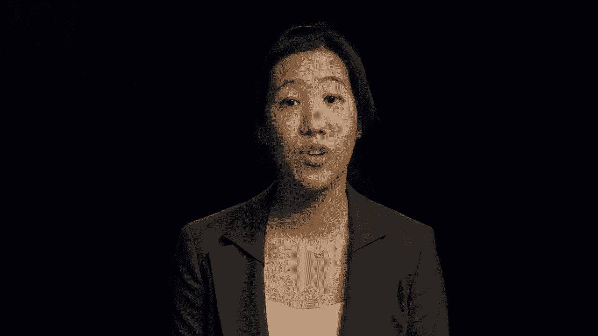
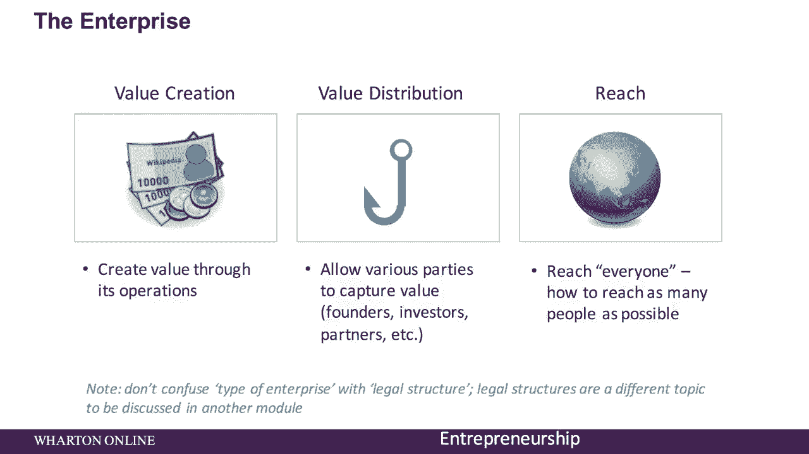
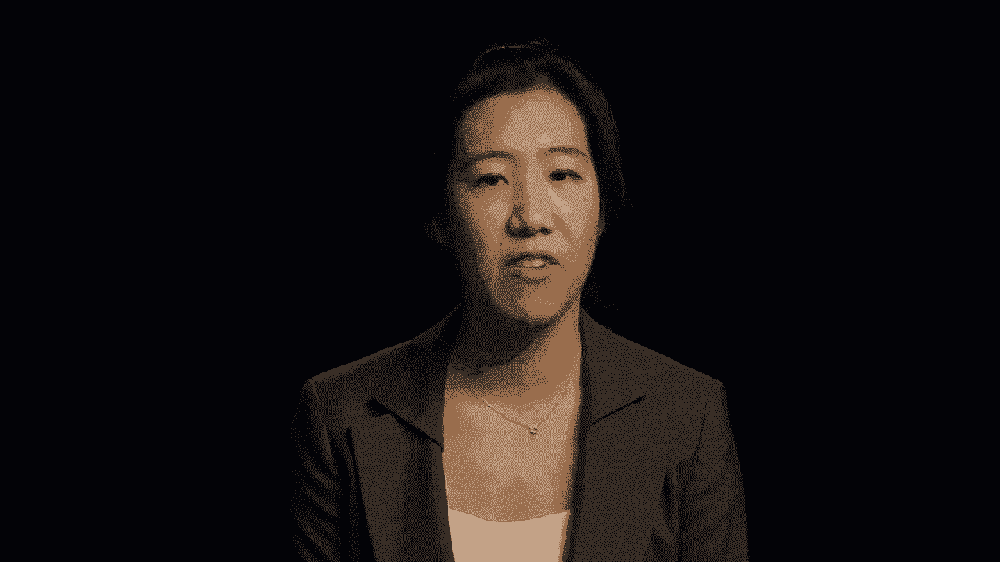
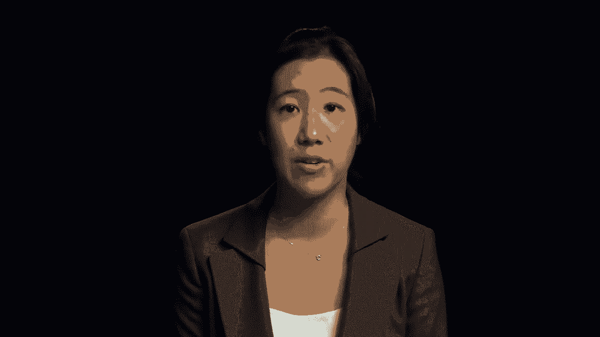
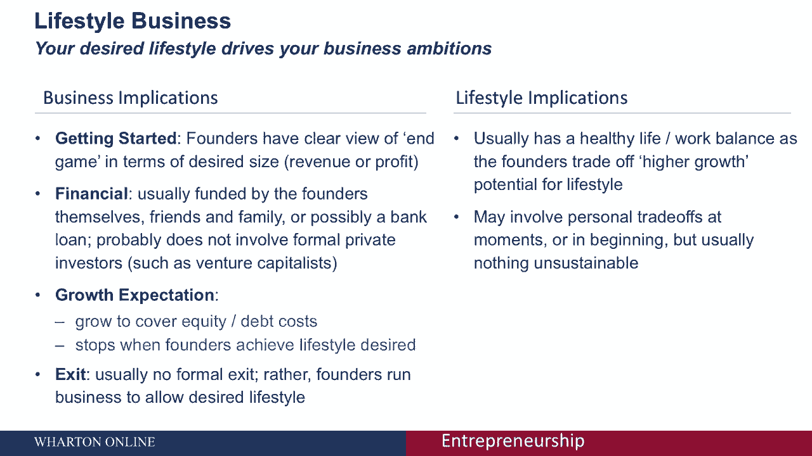
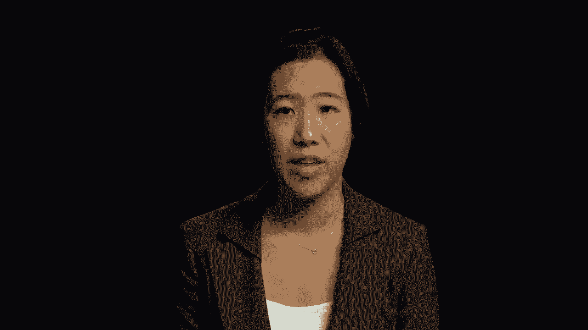
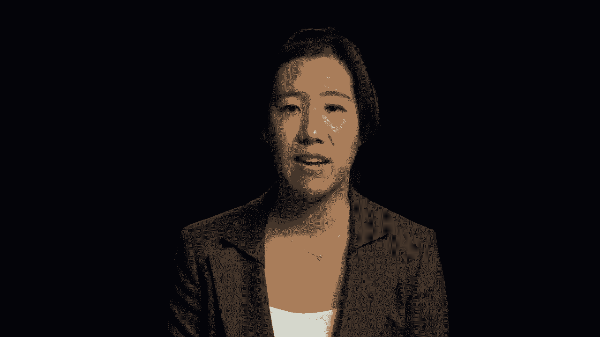
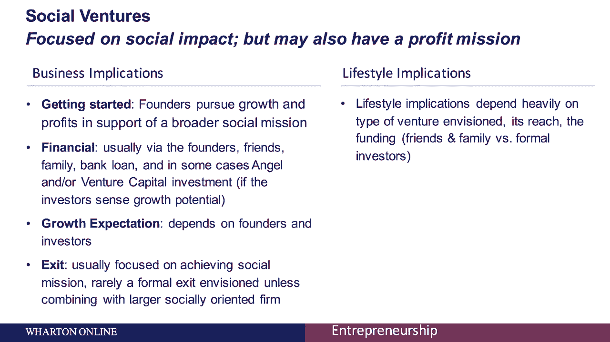
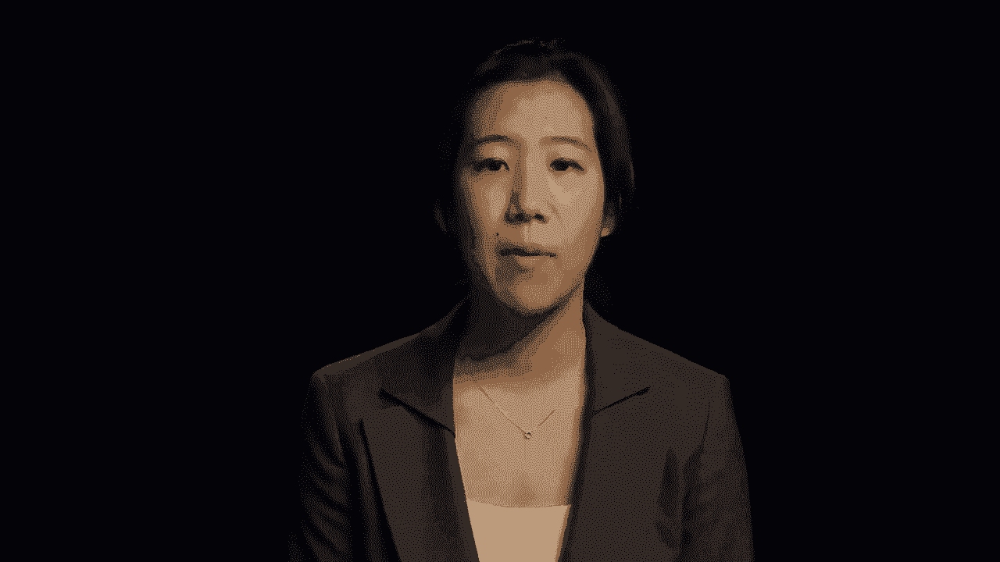

# 【沃顿商学院】创业 四部曲：发现机会、建立公司、增长战略、融资和盈利 - P7：[P07]05_1-5-types-of-enterprises - 知识旅行家 - BV19Y411q713

欢迎参加我们关于企业类型的讨论，在通常发现的企业方面。

以及企业对你的业务和生活方式的影响。

我们会看到的是，你选择的企业类型应该与你的目标有很大关系。

从商业和生活方式的角度来看，当你想到企业，有三件首要的事情要记住，价值创造，价值分布和范围，价值创造是关于你如何通过日常活动创造价值，价值分配是通过财富在所有被投资方之间的分配来看待的。

触角是关于你最大化触角的能力。

达到你想要服务的一切，我们去理发店，比如说，这里一家理发店的老板正在做一些东西，或者提供很多人想要的东西，它为很多人提供理发服务，问题，然而是到达，它真的能到达并服务于一大群人吗。

如果你拿应用程序，另一方面，可扩展性巨大，你能够接触到并迅速接触到数百万人，然而，你在开发一个人们真正想付费的应用程序吗，最终会发生什么，大多数应用程序实际上并不赚钱。

所以当你考虑你想为你的客户创造的价值时，以及你接触这些客户的能力，你想平衡这些商业期望和你的个人目标，有六种类型的企业是最常见的，每一个都会对你的商业期望和你的生活方式产生影响。

我们将详细介绍其中的每一个，其中包括高增长或风险支持的商业生活方式企业，以社会为中心的企业和以大型公司为基础的企业。

首先，让我们来看看风险投资支持的初创企业，这是一个高成长性的企业，为创始人和投资者带来巨大的回报。

如果你考虑商业影响，这些公司在诞生时往往很小。

但它们被设计成很快变得非常大，它们通常被称为可扩展的初创企业，就财务而言，他们是典型的硅谷创业模式，他们通常依靠几轮天使或风险投资，他们预计将在退出方面迅速增长，这些公司一开始就有退出策略。

因为投资者想要一个在生活方式方面拿回他们的钱的计划，你的个人生活往往排在第二位，有一种必须成长的心态，这种心态使其他担忧黯然失色，这会给你的个人处境带来压力，你的生活方式可能会受到影响。

或者你可能需要在经营这家公司时暂停一下，你需要能够为业务增长付出一切，风险投资支持的初创公司的一个例子是优步优步，有来自风险投资界的大量投资，从一开始就期待着他们的快速增长。

让我们在这里谈谈通常所说的生活方式业务，你想要的生活方式在商业影响方面推动着你的商业抱负，创始人对最终想要的规模有一个清晰的看法，在收入或利润方面，比如说，它通常由创始人自己或朋友和家人资助。

有时通过银行贷款，但它可能不涉及正式的私人投资者，它就会长大，然而，它的意图是增长以支付股权或债务成本，当创始人在退出方面达到他们想要的生活方式时，增长通常会停止，通常没有正式的退出。

而是创始人经营企业让他们想要的生活方式，他们通常有一个健康的生活和工作平衡，因为创始人们用更高的增长来换取他们的生活方式。

在开始的时候，可能会涉及到一些个人的权衡。

但通常没有什么是不可持续的，夏威夷的一家水肺店是生活方式生意的一个很好的例子，这使得一个业余海洋博物学家可以结合她的工作，例如她对大海的热爱，同时没有产生大量的利润，增长潜力很小。

这位企业家获得了每天淋湿的机会，花时间和和她一样热爱潜水的人在一起，另一个例子可能是一个小度假胜地，由科罗拉多州阿斯彭附近的十几个出租小屋组成，这使得山地爱好者可以在滑雪板上滑雪。

冬天一周好几天，明年夏天用飞鱼钓鳟鱼，我们有有机增长的业务，你在那里经营一个稳定和可管理的业务，一些商业影响包括创始人通常专注于创办一家商店，而不是专注于财务方面的高增长。

这通常也是由创始人或朋友和家人资助的，就增长而言，通常不涉及正式的私人投资，再一次在这里，我们将支付股权和债务成本，他们通常专注于提供而不是财富，可能没有正式的退出设想。

创始人经营企业是为了养家糊口和生活方式，在生活方式方面，通常有一个健康的生活和工作的平衡，尽管经营小企业也会有很大的压力，可能需要长时间的工作，如果公司员工很少。

大街上的商行是典型的小企业，我们在每个城市都能找到主要的街头公司，在每个国家，这是你的邻居，甜甜圈店或点心店，风景与一辆卡车或阿米什家具制造商为伴，个人，一个家庭或几个合伙人通常拥有主要的街道公司。

虽然它可能有银行贷款和信用卡，这家主要的公司很少有外部投资者，主流公司的目标通常是使经营者获得最大的回报，而不是为增长提供资金。

他们通常是一个位置公司，已经成为他们社区的固定设施。

下一个，我们通过收购获得企业家精神，你在这里购买现有的业务，资助者正在寻找可能表现不佳的有吸引力的企业，他们可以购买、资助和运营，融资通常由创始人完成，家人和朋友，更大的收购可能有更大的私人资金。

例如通过私募股权，在增长方面，成长与创始人的抱负和投资者的需求联系在一起，在生活方式方面，它高度依赖于出口，不管是为了现金还是为了出售，如果这是为了现金。

这可能意味着创始人跳过了最初的、可能有压力的创业阶段问题，但在这里，尽职调查是关键，就像买房买车一样，总有些东西你不知道什么时候该买，你需要看看引擎盖下面，想想壁橱里有什么骷髅。

通过收购创业的一个例子是收购一家制造公司，你在收购一家经营良好的企业，您可能在这里发现了操作效率低下的地方。

如果你有技能，你实际上可以把这些操作上的低效转化为效率，为自己创造更多价值。

下一个，我们有专注于社会影响的社会冒险，但也可能在这里有利润使命，创始人正在追求增长和利润，以支持更广泛的社会使命，财务通常是通过创始人，朋友和家人，在某些情况下。

天使或风险投资的增长预期取决于创始人和投资者，退出通常集中在实现特定的目标上，例如完成一项社会使命，而不是正式退出，生活方式的影响在很大程度上取决于设想的风险类型及其影响范围。

及其供资情况，社会冒险的一个例子是Cotopaxi，这是一个B公司，正在啮合在一起。

带着财务使命的社会使命，最后我们有了企业企业家精神。

从一个大企业内部开始新的增长。

就增长而言，它主要由公司本身或业务部门提供资金，它通常是以跳跃为目标的，开始增长，进入母公司不能轻易进入的新的或快节奏的市场，这里的目的是为母公司建立新的增长引擎或资产，在生活方式方面。

它将与内部公司目标和业务单位目标直接联系在一起，我们已经讨论过了，有许多不同类型的企业，第一个要问自己的问题是你的目标是什么，你是想建立下一个谷歌、Facebook还是Zynga，换句话说。

你的目标是快速增长吗？还是你有兴趣做自己的老板，让事情变得简单，你有兴趣积累大量的财富吗，但不要太多，也可能你不知道，但你想花钱进入游戏，或者你想帮助别人，最后，也许你想为现有的。

通常较大的组织，正如我们所看到的。

重要的是要意识到这三件事是如何结合在一起的，你追求的企业类型。

启动企业的需求，以及你的目标和想要的生活方式。

