# 【沃顿商学院】创业 四部曲：发现机会、建立公司、增长战略、融资和盈利 - P8：[P08]06_1-6-technology-entrepreneurship - 知识旅行家 - BV19Y411q713

David Chu在这里报道一个关于科技创业的会议。

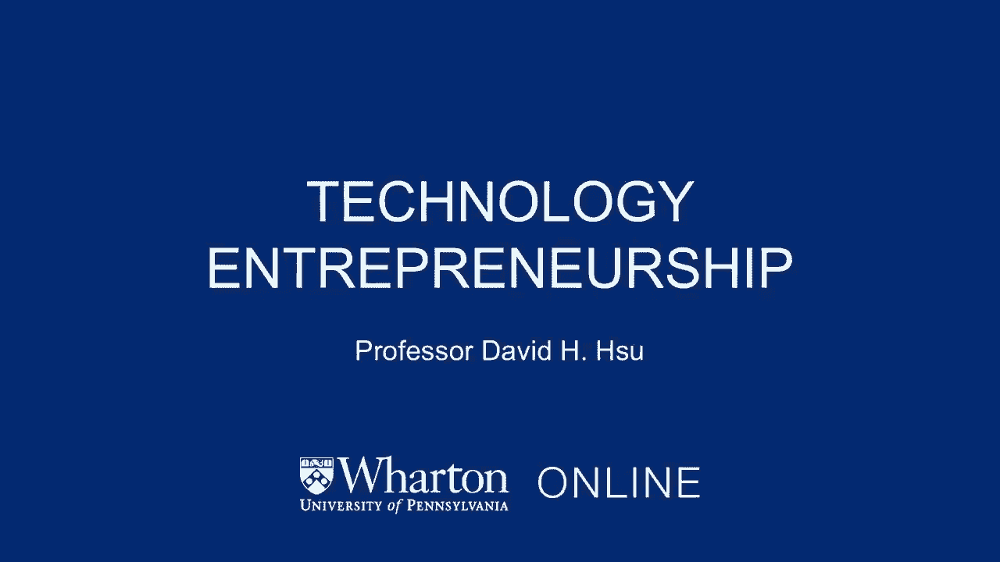

在技术领域创业的一个有趣的方面是有时技术变化。

或者技术可以带来创业机会。

只是为了说明我们都知道这些例子，嗯。

互联网的兴起使谷歌或脸书这样的公司出现在舞台上，或者像重组的出现这样的技术进步，DNA提供了一个机会。

否则像科技这样的公司就会进入市场。

然而，仅仅因为有一个技术先进，并承认这一技术进步。

并不能确保你能够建立一个商业上成功的公司。

在决定这样的成功方面，还有许多其他的决定是非常重要的，像商业模式设计这样的事情，你所带来的资源的选择来发挥你招聘关键人员的能力，行政人员，进入和扩张的步伐，所有这些其他类型的决定都是相当重要的。

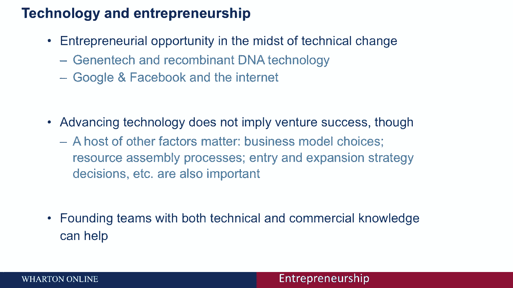

不仅仅是对创业机会的认可。

在预测商业成功方面，这是技术进步所提供的。

此外，还有一件事可以帮助我们，尤其是在技术领域。

当我们谈论技术时，企业家精神是为创始团队或早期高管配备人员。

与既有商业又有技术专长的人，因为处于这两个维度的前沿也会有所帮助，学术研究已经证明了这一点，现在有一件事很有趣。

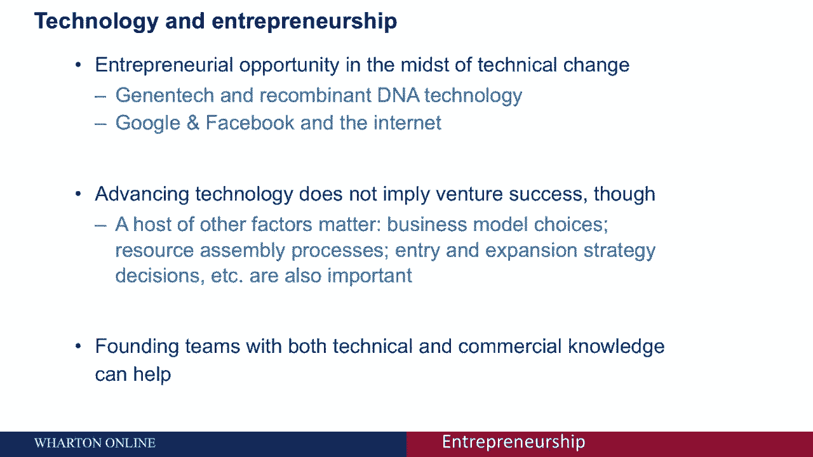

这在某种意义上是硅谷现象吗。

为什么会有。

我们的科技创业集群，这有几个原因，就像这一点的标志一样，u的三分之一，s，风险资本仅流向两个地区，硅谷和大波士顿地区，你可能会想为什么会这样，如果你从配器的角度来考虑，劳动者和资本知道关注哪里。

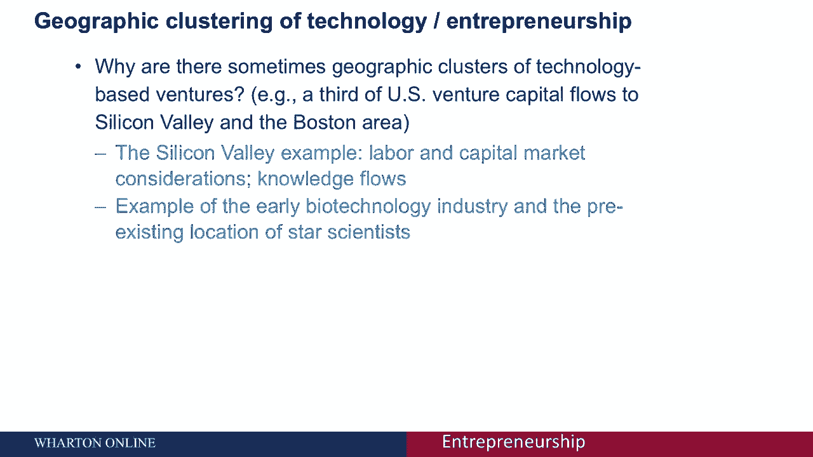

它在这些地区，那里有大量的知识，这在公司的诞生和发展中很重要。

希望利用某一特定的创新或将其商业化，仅举一个具体的例子，在美国生物技术产业诞生之际，所有早期的生物技术公司都位于，在同样的地方是前沿知识，当时都在著名学术机构的科学家，因为那是专门知识所在的地方。

随着行业的发展，地理位置缓解了一点，但在这个行业刚开始的时候，这不是偶然的，有这个共同的位置。

就技术创业的经济重要性而言，这是一种激励，以下是一些关于私人和公共价值的统计数据，结果发现，在20世纪80年代上市的所有公司中，十三时间段，大约有七千九百家公司，其中三六家公司是风险投资支持的。

现在风险投资支持和基于技术的创业是不一样的，但这是一个很好的代理，原来五个，8%的科技首次公开募股是由风险资本支持的，所以我们知道一些轶事，比尔盖茨，史蒂夫，工作，标记，扎克伯格，这些都是超大的个性。

成功科技企业家影响力方面的数据点，还有二阶效应，一次，你创造了一个非常成功的科技公司，有各种各样的下游影响，所以说，比如说，谷歌，之后，它进行了首次公开募股，它催生了许多非常富有的人。

他们后来成为天使投资者，那就是，在许多其他公司进行私人和个人投资的个人，以及众所周知的贝宝黑手党。

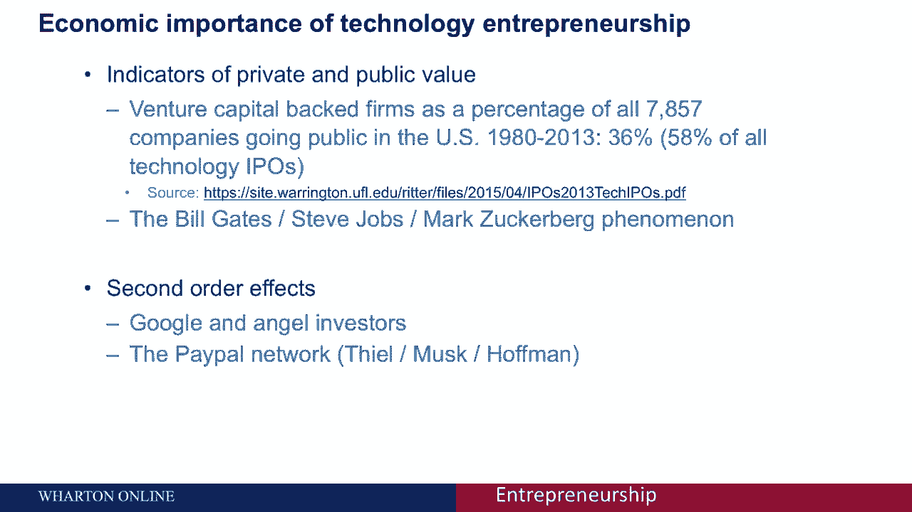

其中。

然后继续，和其他大公司的其他关键高管。

所以我不必提。

里德·霍夫曼，这些都是符合这种模式的著名企业家。

如果你考虑技术生命周期，你可以用这个典型的s形采用曲线来描述采用曲线，有三种不同的模式与这条曲线相关，一开始，有相当多的实验实验，别走右边，你付出了很大的努力却没有很大的进步，这解释了相当浅的时代发酵。

然后事情突然就到位了，你能想出一个设计，吸引市场主流的，你会得到吸引主流的网络效果，真正使产品或服务更有价值，因为安装底座的大小，想想Facebook，哪个更有价值，就因为你所有的其他朋友都在网络上。

导致了这段起飞时间，最后有一个饱和点，是不是因为你已经利用了社交网络，你的产品或服务可以面向的人，或其身体限制。

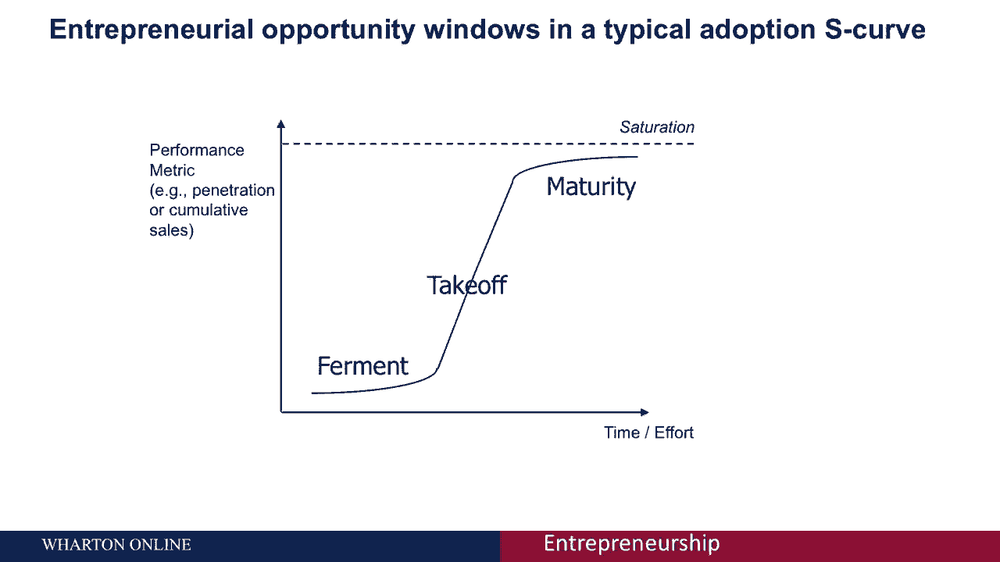

风不会吹得更快，所以你的，你的帆船从根本上受到。

销售的，所以这是商业空间技术发展的典型模式。

现在有一些与这些过渡点相关的挑战，从时代发酵到腾飞期，这个特定的转折点真的试图吸引主流。

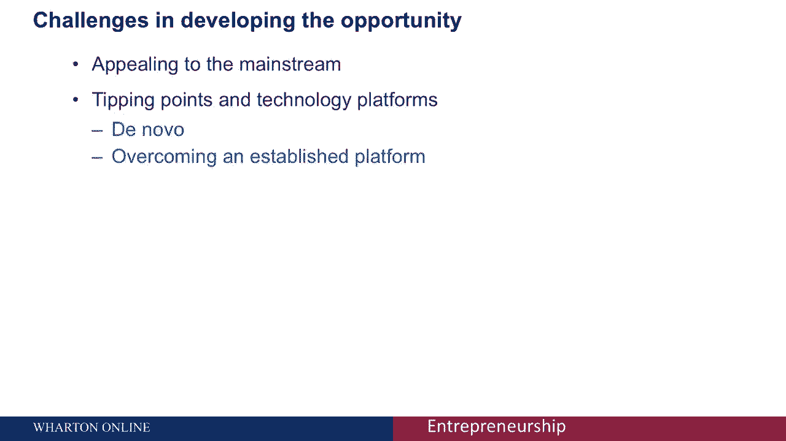

你可以开发一个非常利基的产品或服务，真正只吸引早期采用者或早期创新者。

但这不足以真正跨越鸿沟。

作为一口井，杰弗里·摩尔的名著《真正吸引主流》。

并进入真正的最大份额的市场。

你可能会想什么。

尤其是在更多的技术环境中，你如何成为一个平台玩家，你如何诱导我们之前谈到的那些网络效应。

这样你就更有可能成为下一个LinkedIn。

避免像世界上的朋友或MySpace一样被打乱，这需要什么，加入您的网络的进入费用或补充程序，或者真正为服务不足的市场空间服务，被行业现任者忽视的，这样你就可以成为下一个真正增加价值的iTunes平台。

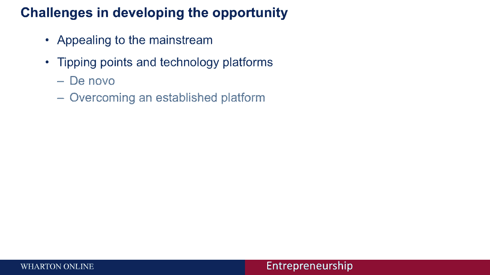

就试图达到你可以提取价值的地方而言。

因为毕竟，这里有一个供应链或价值链，与典型技术创新的价值创造方面相关联，作为这个链条中的创新者或发明家，你想担心什么，就是馅饼的切片有多大。

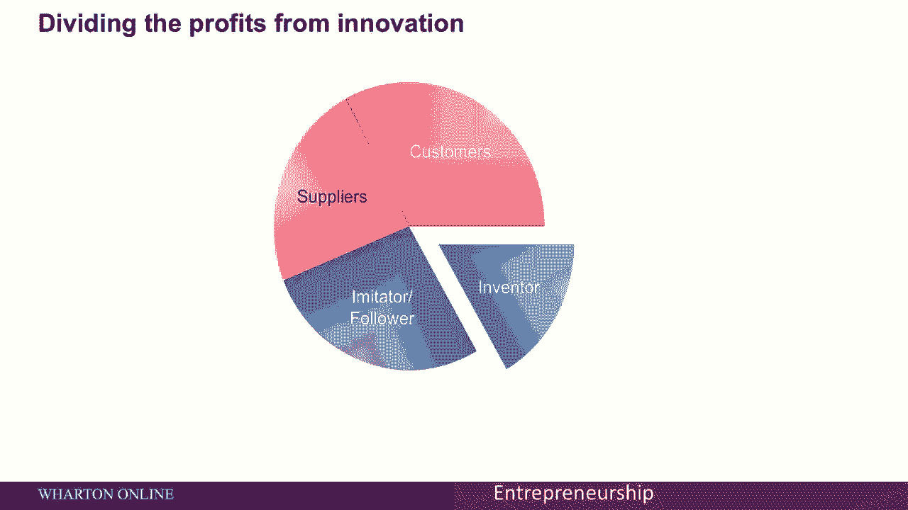

让我们来讨论是什么决定了圆周率的大小。

作为这一价值链的一部分，所以本质上有这两个结构，议价能力和市场力量，在某种程度上，你能够增加你作为发明者的影响力，或者作为这个价值链的一部分，你期望得到的馅饼的大小就越大，想想这个。

你在其他可以进入这个领域的人的竞争空间中有多独特。

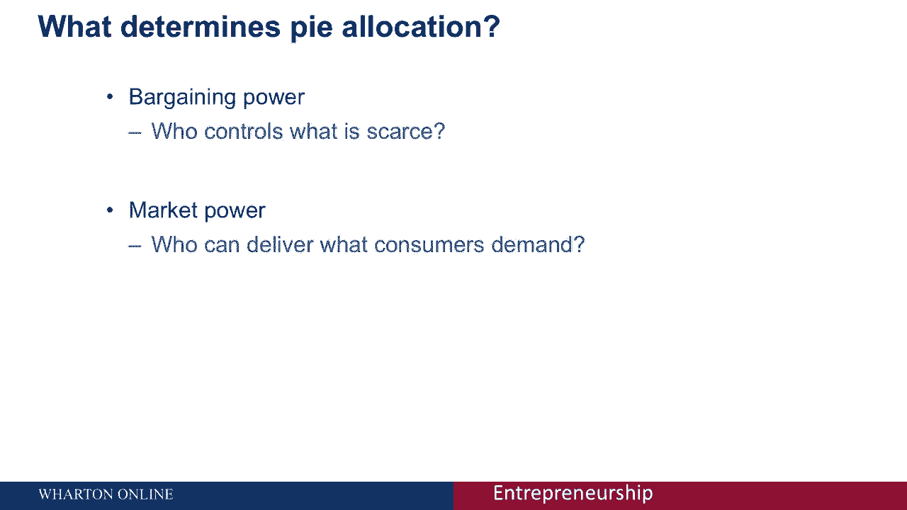

这反过来会塑造你有多独特，你现在有多大的讨价还价和市场力量。

市场的驱动力是什么，如果市场和议价能力真的决定了你得到的馅饼的大小，作为发明者或价值链中的任何其他参与者，是什么塑造了这种力量，真的三件事合适，你能控制你创造的知识吗，你有互补的资产。

在提取价值方面很重要，提高你与他人讨价还价的能力，它也可以提供与你相似的功能，然后第三个，行业演进的阶段，尤其是这种主导设计的概念。

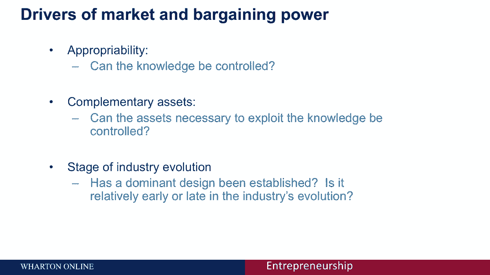

现代的主导设计将是iPhone，每一部智能手机，在iPhone问世后，必须看起来。

具有iPhone的特点和功能。

在iPhone之前，有很多配置，我们可以覆盖和以前相同的例子。

在汽车工业的早期，福特T型车前后。

福特T型车之后，成为一辆合法的汽车，它必须看起来像我们现在所知的汽车，在主导设计出现之前。

福特T型车，你有各种各样的实验和假设。

关于一辆车应该是什么样子，这三个因素将塑造一个参与者的市场和议价能力。

沿着价值链，现在让我把这三个分开，再详细一点，适当性，这是什么，如果你能适当地利用和控制你从一项发明中创造的知识，那么你就能够真正地掌舵并控制知识，你希望它用于的用途，它本质上是一种唯一性和控制。

你在其他形式的保护下通过知识产权创造的知识，这样你就可以不让别人进来，复制你所做的，为什么就补充资产而言，本组织其他部门，这怎么会重要呢，想想一个行业的混乱时刻，有一个新的平台就位了，到位的新产品。

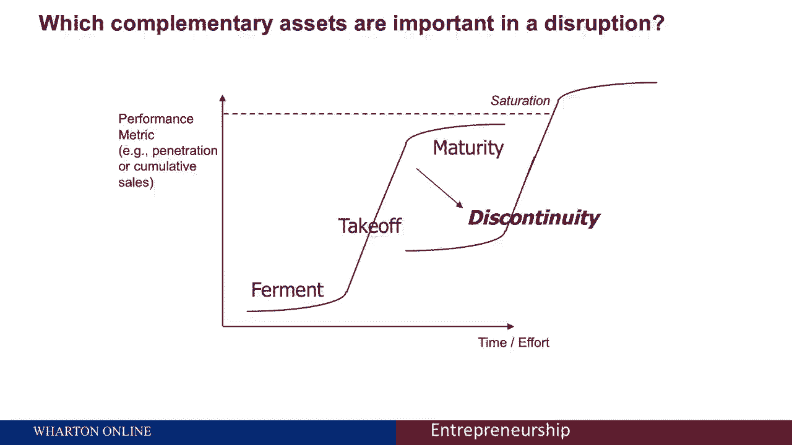

只是给大家举个例子，在生物技术引入之前以非常传统的方式进行的药物发现。

有一段时间的发酵实验，有一个起飞期，之后你会吸引主流。

然后是某个饱和点，在这个饱和点上，回报趋于平稳。

现在生物技术来了--一种引入药物发现的非常不同的方式，你发现药物的一种方式，随着生物技术的出现，行业的现任者实际上免受生物技术的竞争压力，尽管潜在的科学是相当具有破坏性的。

为什么是因为老制药公司控制了补充资产，那就是，是fda联邦药品管理局，以及市场营销，也就是医生，他们会告诉最终的消费者，病人会服用药物，因为在药物发现的层面上出现了混乱。

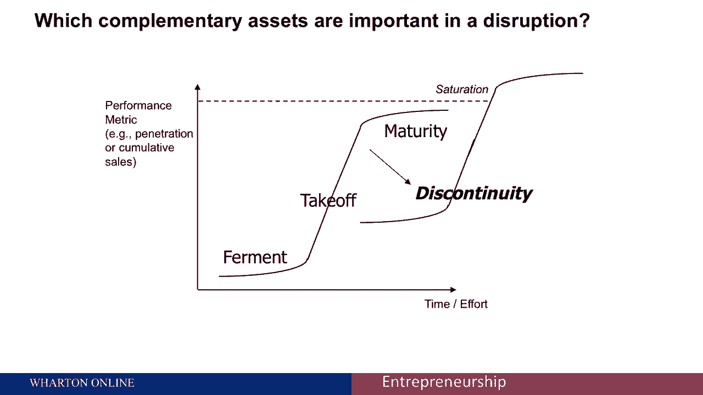

但在补充一级保存组织补充资产。

这对保护制药公司非常重要。

公司的议价能力，相对于新入口，生物技术公司面对一种新的药物发现方式。

但不是以最终消费者消费这些药物的方式。

最后让我们来谈谈行业的演变，我谈到了主导设计之前和之后的主导设计，重要的是，如果我们覆盖其他结构，我们通过适当性来谈论独特性，以及补充资产的作用，这里有趣的是，行业进化的开始阶段，那是发酵的时代。

控制思想是很重要的，而不那么重要的补充资产，就拿出价值而言，而是走向饱和的时代，这些力的相对重要性几乎是相反的，也就是，谁控制思想不再那么重要了，但谁是如何提供这些产品和服务的是非常重要的。

在生命周期结束时通过这些组织资产和补充资产。

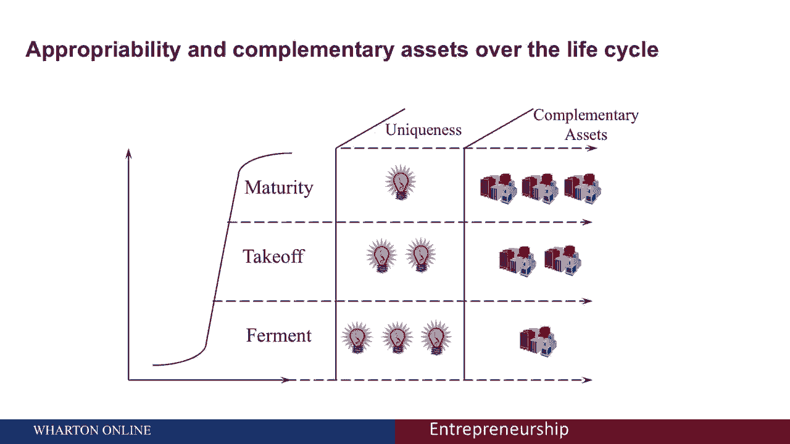

所以总之，我们已经讨论了技术创业如何成为一个可能的独特切入点，技术中断时刻，提供创业机会，有一个完整的宿主，拨款考虑，当你思考如何从创新中获得回报时。

