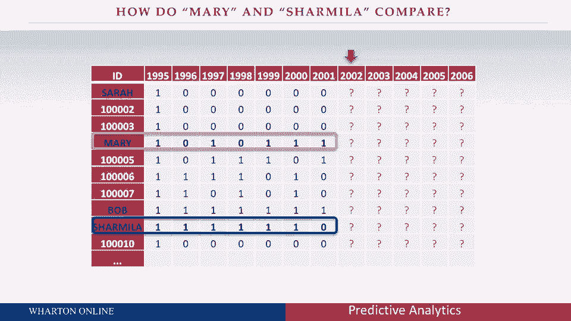

# 【沃顿商学院】商业分析 全套课程（客户、运营、人力资源、会计） - P15：[P015]06_making-predictions-using-a-data-set - 知识旅行家 - BV1o54y1N7pm

受够了这种抽象，谈论第一时期第二时期第三时期，我想变得真实，我想和真实的客户谈谈真实的数据集，实际向我们提供数据的组织的真实行为和真实决策，我将从一个非营利的背景开始，你可能会发现你可能不会有吸引力。

从某种意义上说，这并不重要，让我给你一些细节，然后当我们把数据集作为一个整体来看时，你会发现它适用于各种不同的设置，利润非营利，国内国际，b至b至c，我想每个人都会发现这种基本数据的吸引力。

我想谈谈一个特定的非营利组织，随着时间的推移，它正在观察它的捐赠者，就像这么多公司一样，他们会带走他们的顾客，他们的捐助者，我们会找到一大堆，同时被收购的，我认为这实际上是一个非常重要的教训，超越分析。

在预测模型之外，对公司来说，能够在队列的基础上看待他们的客户是非常重要的，让我们找出我们同时获得的所有客户，我们通过同样的运动获得它们，也可能是通过同一个渠道，或者他们都和我们做了同样的第一次购买。

在这种情况下，这将是一个基于时间的队列，我们要看看一群捐赠者，他们第一次向这个非营利组织捐款，在一千九百九十五，所以换句话说，我们对这些人一无所知，它们对我们来说根本不存在，直到1995年。

他们捐款说嘿，我们这里有一个新的捐赠者，所以，我们要跟踪这些人六年，1995年之后，然后我们要对它们做出预测，在那之后的五年里，所以我们又在谈论一个很长的数据集，公司可能根本没有的数据，在过去。

但今天因为数字化的一切，创造这些变得越来越容易，客户的这些悠久历史，比以往任何时候都重要，能够就谁将做什么发表声明，将来什么时候，所以你可以在这里想象数据结构，我们有一万一千一百零四位顾客。

电子表格中的一万一千一百零四行，然后我们有一堆列，每列代表一年，我们只是问，他们有没有，或者他们现在没有捐款，我们不在乎他们可能捐了多少钱，虽然很少有人一年赚超过一个，我们甚至不在乎调频的M部分。

我们所关心的是这些捐款的规模，他们有没有捐，如果他们真的捐款了，我们就给1分，给0分，如果他们不这样做，如果你先看看这里的数据结构，你看到这整列的，因为这告诉我们所有这些客户都是在19年获得的，九十五。

现在你看到一堆0和1在右边，基本上是说，他们有没有，或者在被收购后的六年里，他们没有每年捐款，所以让我们首先关注这些数据，真正更好地了解它，然后我们要做一些声明，将来谁可能做什么，在我们这么做之前。

不过，看看这个数据集，这是一群顾客随着时间的推移在做或不做事情，所以在这个特殊的情况下，是捐款，但是你可以想象这个相同的数据结构，哦，我不知道有连锁酒店，所以我们有一群人在我们的忠诚计划中。

他们住在我们的房子里吗，或者不是在给定的月份，可能是给信用卡公司的，这些人有循环利息费用吗，或者不是每月，它可能是一个手机游戏应用程序，人们玩这个游戏吗，或者不是在日常基础上。

所以我希望你能看到这个数据结构是非常通用的，非常实用，我不在乎1和0代表什么，他们的购买，不管他们是，你知道的，嗯，在社交媒体上发帖，住旅馆，利息费用，不管是什么，我甚至不在乎什么时间段，所以在这里。

我们把重点放在一年作为期间，但它绝对可以是一个月一周一天，哪怕是一秒钟，视情况而定，所以在我继续之前，我只想让你欣赏，这种数据结构的通用性，你们中的许多人对数据做出了贡献，作为消费者作为公司。

试着跟踪和预测你可能在做什么，在商业方面也是如此，您可能正在使用这样的数据结构，帮助你变得更舒服一点，让我在这里挑出几个例子，我想，我想让你帮我做个预测，根据你所掌握的有限信息，你在这张幻灯片上看到的。

我想让你对某些类型的顾客做一些预测，例如，让我们从这里的鲍勃开始，所以看看鲍勃，你可以看到鲍勃在1995年被收购后，同样，我们不会预测1995年的购买，因为我们对鲍勃或这个数据集中的任何人一无所知。

直到购买发生之后，看看鲍勃的六个机会，他六次都捐了，他打了六个中的六个，所以让我们在接下来的五年里对鲍勃发表声明，所以事实上我想，我希望你真的把它写下来，你对有多少捐款的最佳猜测是什么。

鲍勃将利用接下来的五次机会，如果你的答案是，我不知道我不知道，那你是绝对正确的，因为老实说，我不一定关心鲍勃，我不一定在乎这一个顾客，我真正关心的是，我做出好预测的能力本身并不是鲍勃，会是波。

告诉我所有有这些相同特征的客户，所以虽然我可能很难对其中任何一个做出陈述，一旦我开始把它们分组在一起，在这个数据集中，你会看到，我想成为大约1200个鲍勃，我希望能够对鲍勃的平均情况做出陈述。

所以如果我们想想鲍勃自从被收购后六分之六，平均有多少捐款，他们会在接下来的五次机会中，所以他们中的任何一个都将为零，一次、两次、三次、四次或五次捐款，当我们看他们所有人的时候，有的会变成零。

有的可以做五个，有人会做两三个，他们的平均数是多少，我要你把那个号码写下来，好的，那是鲍勃，现在让我们看看这边的Sara，自1995年被收购以来，莎拉什么都没做，她是鲍勃的对立面，她六杆零杆。

她什么也没做，所以我想让你对莎拉做一个预测，或者又是莎拉，所有这些客户从被收购到现在什么也没做，你可能想知道，我们为什么要对莎拉发表声明，她六年来什么也没做，让我们把那些顾客赶走，他们。

它们对我们来说不值钱，而事实是，任何一个莎拉的可能不值钱，但为什么我们对追踪莎拉这么感兴趣，因为他们太多了，即使你看这张幻灯片，看看自从被收购以来，你看到了多少带零的莎拉，原来萨拉，也就是说。

在一段可观察的时间内被收购后什么也不做的客户是非常非常常见的，在此数据集中，他们代表了大约33%的顾客，我在许多数据集中看到，通常超过50%，所以，而这些时间中的任何一个都可能不值多少钱，在某种程度上。

它们有任何价值，当我们把所有这些加起来，在未来，尤其是当我们从长远来看，所以我想让你写下你对莎拉的预测，平均有很多捐款，他们会在接下来的五次机会中，我还有一个小问题要问你，现在我想让你比较玛丽和查米拉。

好的，我甚至不打算说他们的事，你可以在这里自己看到数字，所以我想让你看看玛丽和查米拉，事实上，我想让你回答两个问题，问题一在接下来的五年里，他们中哪一个的平均价值会更高。

第二个问题是多少所以花点时间，看看玛丽一家，看看夏米拉斯，想想是什么让其中一个比另一个更有价值，我要你写下来，并预测哪一个更有价值，我们会休息多少，我们会回来再回来，谈谈你可能使用的一些逻辑。

