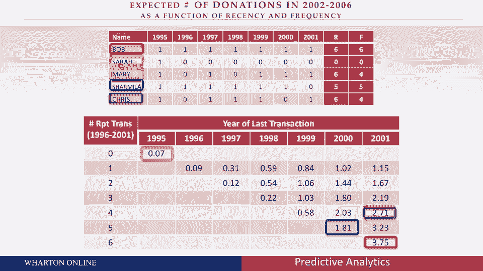
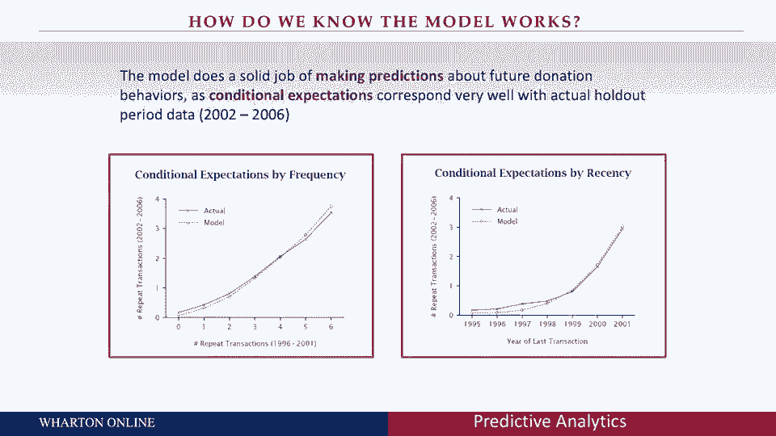
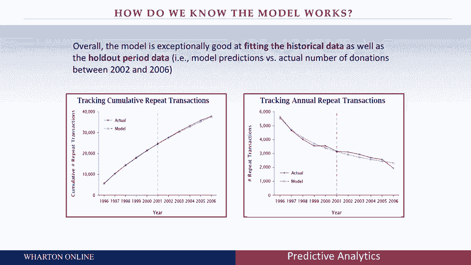
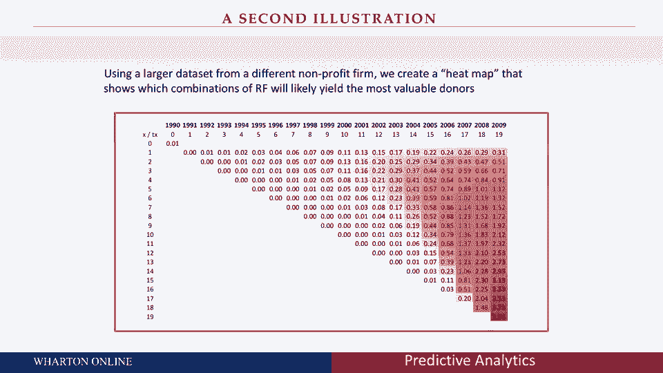
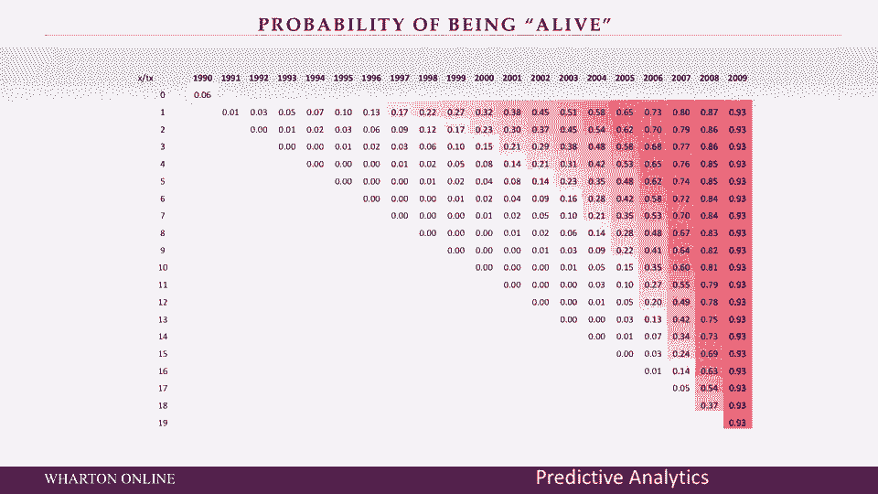

# 【沃顿商学院】商业分析 全套课程（客户、运营、人力资源、会计） - P18：[P018]09_implementation-of-the-model - 知识旅行家 - BV1o54y1N7pm

所以让我们从鲍勃开始，我们可以看到鲍勃在桌子的右下角，现在记住我让你为鲍勃做一个预测，或者为了鲍勃，我问你在接下来的五场比赛中你希望他们捐多少，大家可以看到，根据模型，这不一定是真实的数字。

但它离它很近，预测是三点七十五，我打赌你们中的一些人看着数字说哇哦，这是相当低的，我打赌你们中的一些人预测了五个，我打赌你们中的一些人说看，鲍勃六投六中，他要给，每次我们给他机会。

所以在接下来的五场比赛中，他给了五场，我们不仅有点过于乐观，但也许说起来有点天真，你知道他总是会给，他总是会在身边给予，当我们想到我们的巴托迪故事，当我们明确地认识到人们行为的随机性时。

我们意识到你知道吗，很有可能，在接下来的五年里，事情可能会发生，即使是会导致他们辍学的鲍勃，即使他们还活着，考虑捐款，不能百分之百肯定他们会给，所以你可能会对这个低数字3点感到震惊，七五。

你可能会说哇哦，那个数据集或那个模型有些奇怪，但让我告诉你，它总是这样工作的，我看了很多很多的数据集，我们跟踪那些真正高端的客户，那些真正忠诚的人，我们看看他们在未来的一段时间里会做什么。

而且往往比你想象的要少得多，这本身就有非常重要的意义，因为我看到很多公司说，哇喔，让我们建立总统的金牌，蓝丝带，鲍勃红地毯俱乐部，让我们向他们展示我们有多爱他们，试图提高所有的价值。

所以我们成立了一个特别的俱乐部什么的，然后我们观察鲍勃在接下来的五年里做什么，我们说哇哦，鲍勃怎么了，他们过去六分之六，现在他们只跑了三分，七，五分之五，你对鲍勃做了什么，你被解雇了，当我开玩笑的时候。

我也很认真，如果我们对客户没有正确的长期期望，我们经常投资过多或不足，我们判断的方式，这些投资的质量可能还有很长的路要走，所以有一个关于鲍勃的警示故事，但他不是我们唯一想看的人。

我们可以把目光移到左上角，我们可以说莎拉呢，现在我敢肯定你们所有人都看着莎拉，然后说，我打赌她将来不会值很多钱，在接下来的五个中，你知道她可能只捐一点点，你说得很对，根据这个模型。

我们预计在接下来的五个小时里捐款的数量将是零点。

零七，所以再一次，任何个人莎拉，但总的来说，酸味是一种响亮的咆哮，这就是为什么我们不一定要担心，他们中的任何一个，在这个数据集中有3464个萨拉欣，所以总的来说，它们实际上值很多钱，他们是集体的。

它们比大多数其他射频细胞都值钱，我们在这里的桌子上看到的，然后是玛丽和查米拉，这样你就可以看到Mary和Charmila在桌子上的位置，你可以看到玛丽的捐赠比查米拉少一次，但最近和我们在一起。

所以如果你把眼睛放大到桌子的那个地方，你会看到我们对玛丽一家的最佳猜测是2。711，换句话说，为了那些婚姻为了那些人，不管0和1的实际模式，但对于那些为捐款买了四次东西的人来说，最后一个是在最近的机会。

我们对他们的最佳猜测是27。1，在接下来的五场比赛中，这个很有趣，尽管查米洛六分之五，真的很好，你知道的，她捐出了我们给她的80%以上的机会，而是因为她错过了最近的一个，错过的捐赠很有可能是她的信号。

实际上完全消失了，而不仅仅是跳过一个，夏米拉只值1。81英镑，换句话说，在接下来的五个人中，我们只希望那些谢尔米勒能赚1点8分，或者大概，你知道的，三个，6%的捐赠机会。

玛丽一家现在比什米拉一家贵百分之五十，对于你们中的许多人来说，这是一件轻而易举的事情，玛丽当然值钱多了，你可能不会对此感到惊讶，但是对于那些投票给Sharmila的人来说，我看到你在外面。

你知道会很震惊的，不仅是夏米拉，尽管她的五笔捐款比玛丽一家的价值低，玛丽一家只赚了百分之四，但百分之五十，我是说那真的很大，我们再次看到这种模式，每一个这类数据集，我不是说这个数字总是百分之五十。

有时它更小，有时它更大，你会在另一个例子中看到，我很快就会给你看，但它是实质性的，不能忽视，最近特朗普的频率只是一个非常，要记住的非常重要的一课，当然最后也是最不重要的是玛丽和克里斯，在这种情况下。

因为模型只考虑最近和频率，我们要说他们是一样的，是啊，是啊，我们可以观察它们的具体模式，也许可以试着区分它们，但当我们看着玛丽和克里斯的时候，为什么要费心呢，在其他人的背景下，反正他们几乎是一样的。

所以我们不要把它切得比我们真正需要的更细。

所以我希望你能欣赏模型的预测，不仅仅是因为我们要评估这个特定的模型做得有多好，但是我们学到的一些教训，如何说鲍勃在与夏米利斯的婚姻中变得不那么值钱，这些都是一般的想法。

当我们观察一个客户群随着时间的推移，不管我们用什么型号，也许根本没有模特，当我们谈论预测分析时，不一定是关于嘿，这里有一个有效的统计模型，但它对未来会发生的事情有洞察力，我们还没有机会观察到。

所以这些模式是非常普遍的，但要真正让你相信这一点，我们需要看看模型工作得有多好，所以我想做的是把我们一直在看的这张桌子，总结一下，我们可以看的地方，不仅在模型预测上，但是等效的实际数字。

而不是给你看实际的数字，对于这些特定的新频率单元中的每一个，我想把它们折叠在一起，只是根据频率来观察它，然后根据最近的情况，所以我要做的是，我要坐我们的位子，我要看看排，我要平均横列。

我要在各栏之间取一个加权平均数，说，人们预期购买的数量是多少，根据他们购买了多少，在接下来的五次机会中，他们最终购买了多少，所以你可以看这两张图，你可以看到模型对实际情况的预测有多好。

无论是频率还是最近，如果你看左边的频率图，在图表的顶部是鲍勃，这些人是过去六次捐款的人，只能是波波，图表顶端的数字是3。75，如果你仔细看，你可以看到，这是根据模型的预测，如果你看下面。

您将看到与鲍勃相关联的实际数字，这个数字是3。53，换句话说，模型优于预测，鲍勃一家将来会买的东西的数量，现在很近了，其实很近，它在里面，比如说百分之五之类的，但是呃，事实上，这是一个更低的数字。

所以如果你认为3。75很低，就像哇哦，鲍勃实际上发生了什么，比那还要低，所以你让鲍勃在那里买了六个东西，你有锋利的磨坊主赚了五个，玛丽做了四个，一直到Bimac图，你会让酸变成零，在所有这些情况下。

这个模型在预测实际购买数量方面做得很好，按频率组分列，右边的图是最近的等价图，所以让我们根据你上次购买的时间来平均每个人，所以在这个里面，我们要带鲍勃和玛丽，把它们放在一起，因为他们在，在最近的销售中。

最近一个时期，我们会说我们希望人们买多少东西，根据他们上次购买的时间，他们买了多少东西，再一次，实际和预期的相互映射得很好，无可否认，这张图不像另一张图那么漂亮和完美，尤其是向它的左边。

那些有一段时间没有购物的人，模特似乎在杀死他们，低估了他们会买多少东西，但还不错，它仍然做得很好，考虑到这是一个非常简单的模型，我们在五年内运行和预测的。

我想我们可以忍受这些错误，是呀，我有其他各种各样的学术论文可以进一步缩小这一差距，这个变化，掷硬币的故事等等，如果你有兴趣，我可以给你指一些文件，但我想你已经明白了，这个模型在预测购买数量方面做得很好。

根据最近或频率，但让我们把这些都放在一起，做一个关于采购的总体说明，对于整个客户群来说，这就是你在这两张照片中看到的，左边的图表显示了购买的累计数量，所以我们有11000人，让我们只看他们买，购买。

随着时间的推移购买，我们可以看到我们在哪里打破了六年的模型校准期，从五年预测期，在该五年预测期内，很难看出这两条线之间有什么区别，模型近乎完美，它变得不那么完美了，当我们一年一年地看的时候。

这就是右边的图表所显示的，这实际上是一个非常诊断的图表，在任何一年，模型又会有点太高或太低，我们的目标不一定是在每一年都达到目标，或者也许超越，如果我们站在2001年底，在我们的模型校准期结束时。

记得2001年是可怕的一年，我们用那些做什么，这个模型中的那些因素，我们完全无视他们，无视他们，我们只是说人们只是抛硬币，一如既往，这向你展示了这个的力量，好像随机的故事。

我们可以忽略非常有影响力的因素，如果有人在2001年站在这里说，我们看着路，从2000年到2006年的轨迹，相当惊人，所以再一次，有时我们太低了，有时我们太高了，而是为了得到一个整体的感觉。

对于那组客户来说，购买会是什么样子，它给你腹部的好感觉，如果我们想从2006年到2079年，如果我们想对客户的总体终身价值做出陈述，我们可以做得很好，所以那是，呃，我将与你们分享的对这一数据集的分析。

我想你对此有很好的了解，在我们写的实际论文中，我们展示了各种其他图片和各种其他诊断，以及其他各种细节和故事，我想你得到了亮点，我只是想花时间给你看另一个数据集，所以我想给你看同样的东西。

我不会告诉你所有的参数，我不打算给你看估算电子表格，这将是另一个非营利组织，但我们在观察捐赠者，客户在更长的时间内，你可以在这里的图表中看到，相同的基本想法，我们在顶部有最近的，我们在行上有频率。

只是很多，更多的机会，但你可以用和我给你看的桌子一样的方法来阅读它，和鲍勃·玛丽、莎拉等等，事实上，我们仍然有相当于鲍勃一直到底部，对呀，所以这些人会捐出每一个机会，因为他们需要。

你仍然可以看到玛丽和查尔米拉之间的权衡，在这种情况下，Charmilla非常有趣，这些人从总共19个机会中，他们为最初的18个中的每一个捐款，他们以18比18获胜，然后他们跳过，所以如果你18投18中。

然后你就跳过了，这不仅仅是，哦，1。我忘了把支票寄过去，更基本的事情发生了，当然在我们的模型中，我们会说你死了，但你退出的可能性非常非常大，我们还不能确定，我们不可能确知，但有更高的可能性。

如果你想要18个中的18个，跳过，你退出的可能性要大得多，与我们原来的夏米拉相比，他五分之五，然后跳过一次又一次，我希望你有这种直觉，不是模特的问题，这是关于理解未来客户行为的这些模式。

因为你可以盯着这个东西，你可以看到我们把它框成热图的方式，真正了解谁是最好的客户，你真的可以再次看到最近和频率之间的权衡，最近特朗普的频率。

我想给你看的最后一件事，从这个BITO中出现的另一个很好的诊断，我模型是关于客户有多活跃的想法，让我们不仅看我们认为他们会买多少东西，但让我们看看像这样的客户，用这种特殊的射频模式确实是活的。

这就是你现在在这张图表中看到的，如果你从右边看，每个人都活着，如果你在最后一段时间捐款，这是有道理的，不管这是不是你被收购后的第一次捐赠，或者如果你是鲍勃，你每次都捐款，我们知道你必须活着。

上次你有百分之百的机会还活着，所以你退学的可能性很小，当我们进入下一个时期，所以你在这里看到一个稍微不同的模式，但又一次，如果我们往下看桌子的底部，你可以看看Charmilas，你知道吗。

如果你18分中的18分，但你最近一次没有捐款，你还活着的机会很低，然后你可以看看桌子的另一端，你可以看着撒拉汉说，你知道莎拉的，他们可能不在我们身边，如果你在过去的十九年里没有捐款，你可能已经走了。

但另一方面，你可能会惊讶地注意到，而莎拉，他们身上剩下的不多了，但那些酸实际上更有活力。

或者至少有更大的机会活着，比以前捐几次的人，但已经有一段时间没有出现了，如果你以前捐，但现在你退出了，就像迷人的磨坊主的故事一样，那你就是债务人，把它放在引号里，而不是一个根本没有捐款的人。

因为和莎拉在一起，我们不知道是不是她走了，或者她真的还活着，但她的捐赠倾向太轻了，很少见，我们要过一段时间才能看到她做任何事情，所以我们的猜测是酸实际上更有活力，比以前捐款的人，但已经不在了。

他们给了我们充分的理由相信他们退学了，再一次，这不仅仅是为了炫耀一个特定的模型，但这些都是前瞻性的，从客户级数据集再次出现的洞察力，很乐意分享更多关于它的信息，但我认为这只是一个非常好的。

预测分析的一个例子。