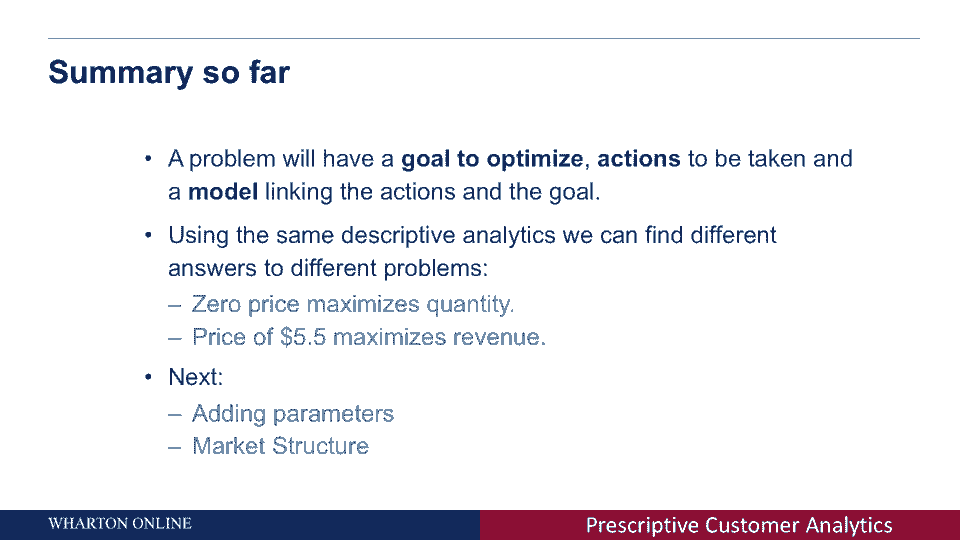

# 【沃顿商学院】商业分析 全套课程（客户、运营、人力资源、会计） - P22：[P022]03_using-the-data-to-maximize-revenue - 知识旅行家 - BV1o54y1N7pm

在第二个例子中，我想给你看看，我将向您展示如何使用描述性部分中的相同数据，得到一个完全不同的结论，并为公司提出不同的建议，这就是处方的力量，您可以使用不同或相同的数据。

而是为了实现不同的目标和采取不同的行动，所以现在我们想让公司的收入最大化，大多数公司实际上并不想最大化他们销售的产品的数量，但实际上他们想赚最多的钱，或者通过销售产品创造最多的收入。

我们可以利用杨格教授向你们展示的需求曲线，um估计，实际上公司的收入会是多少，不仅仅是能卖出多少产品，所以让我们看看我们怎么做，我们想做的第一件事是定义目标，就像我们以前定义的那样。

目标是最大限度地增加收入，与前面的示例不同，我们试图最大化数量，我们需要定义的另一件事是动作，动作又是设定价格或改变价格之前的相同动作，问题是改变价格如何影响销售产品的收入，在这种情况下。

我们需要一个模型，我们需要一个模型来描述，1。产品的定价与销售量之间有什么关系？公司创造收入，现在我们需要稍微思考一下，想想当我们提高或降低一个产品的价格时会发生什么，对于公司的收入，现在你在问一件事。

我们如何计算收入，也许好吧，你把产品数量和销售数量乘以价格，这是公司产生的总收入，所以在这种情况下我们有两股力量在运作，比如说，当我们降低价格的时候，当我们降低价格的时候，正如我们以前看到的那样。

销售量直线上升，所以我们销售更多的产品，但另一方面，我们每卖出一件商品所赚的钱就少一些，因为我们降低了价格，所以当我们相乘的时候，乘法的一边都向上，就是数量，在另一边，就是价格下降。

我们真的不知道收入是会上升还是下降，通过降低价格，1。我们提高价格时，也会发生同样的事情，如果你提高价格，销售量下降了。但每个项目的价格或项目产生的收入不断上升，我们还不能肯定是否应该提高价格。

或者降低价格，现在我想指出的是，这叫做权衡，在那里你改变，你做一个动作，你定价，但收入或公司的目标可能会上升或下降，取决于实际结果，问题是我们如何才能找到为我们带来最大收入的价格。

所以让我们看看我们怎么做，我们想做的一件事是，我们可以用Excel试着说每个价格，我们实际上创建了一个表，你可以在幻灯片的底部看到每个价格，售出的数量是多少？也就是称为需求的列。

如果我们以价格最大化需求，收入会是多少，例如，例如，你可以看到三美元的价格，需求将是七点四十三项，总收入将是两个，两点，两元九，如果我们提高价格，需求越来越大，收入一涨再涨，但在某个时候，收入会下降。

问题是，我们能在这表中找到现在产生最大收入的价格吗，其实很简单，4。我们可以按价目单来买，看看哪一个产生的最大数量，但在一般情况下，问题可能很难解决，很多变量要改变很多行动要采取，这不是一个离散的方法。

我们可以做到这一点，并解决它，试着用图形化的方法找到最大的收入在哪里，所以在这张幻灯片中，你会看到我在那里画了一个图表，从上一张幻灯片中获取上一张表，并生成一个图表，在那里你可以看到y轴上的实际收入。

作为价格在x轴上变化的函数，你可以看到，比如说，在这种情况下，最大的收入大约是以5。5美元的价格产生的，我们如何找到这个最大值，我们试着在图中找到点，这里是最大化的，它被这个箭头突出显示了。

然后我们把虚线，基本上到了底部，在x轴上找到产生这种收入的价格，这是我们所说的将使收入最大化的价格，在这种情况下是5。5美元，所以到目前为止我们所做的，我们讨论了我们想要解决的问题，并得到了处方。

因为一个问题有三个部分，它有一个优化的目标，可以最大限度地，最小化，用它有动作的数量做某事，公司或消费者可以采取，它可以改变产品的价格，也许给某人看广告，而是不同的动作，它有一个模型来连接动作。

以及它们如何影响不同的目标，或者我们试图优化的不同目标，使用与你在以前的讲座中看到的相同的描述性分析，我们得出了两个不同的结论，如果你想最大限度地提高销量，你应该设定一个零价格，你应该免费给你一个产品。

如果你想最大化销售产品所产生的收入，实际上你想定一个5。5美元的价格，下节课我想讲的是参数，以及模型的不同部分如何影响决策和建议，5。我们先介绍一下贵公司的情况，然后再讨论市场结构。

我们能用描述性数据找到最优价格吗。

而不知道顾客是如何与产品互动的。