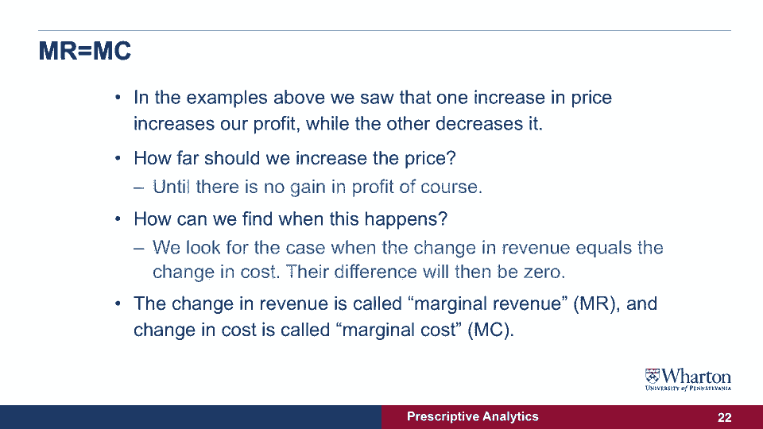

# 【沃顿商学院】商业分析 全套课程（客户、运营、人力资源、会计） - P23：[P023]04_parameters-of-the-model - 知识旅行家 - BV1o54y1N7pm

在这次讲座中，我们要做的是在模型中引入参数，我会试着看看一个公司如何考虑到其他变化，当它采取行动的时候，在我们的例子中，改变价格，所以让我们试着看看一个公司现在如何实现利润最大化，有一点要记住，收入。

即公司赚的钱不会自动转化为利润，因为公司也有成本，也许有时候生产一个产品实际上要花更多的钱，比你卖得太便宜赚的钱多，所以在这种情况下，公司希望利润最大化，他想确保，在为该项目的所有生产成本祈祷后，1。

银行里还有存款，它实际上可以赚钱并继续运营，所以现在我们必须考虑这个项目的成本，和目标，正如我所说的，是为了利润最大化，也就是收入减去成本，所以让我们把成本引入模型，假设同一型号中的每个产品。

我们之前讨论过生产成本两美元我们能做的是，我们可以用以前创造的收入图，对于x轴上的每个价格点，我们现在在总成本的点上，生产我们销售的那些数量的产品会花费我们的成本，所以在这种情况下，你可以看到红色虚线。

这是总费用，我们将制作一些有趣的东西，我们可以在这张图中看到首先是，如果我们把产品卖得太便宜，虽然数量可能很高，收入很低，实际上收入低于成本，我们实际上会在左手边赔钱，你可以看到红点比蓝点高。

所以实际上现在那里的利润是负的，如果你看图的右手边，当我们提高价格和收入时，蓝点一上一上，成本也会下降，因为我们设定的数量较低，在某个时候，这是绿色箭头所在的地方，我们正在使利润最大化。

这基本上是收入和成本之间的距离或差额，在这一点上，我们试图找出，我们想寄的价格是多少，我们想出售产品，我们怎样才能找到这个最大的利润，在某些情况下，使用收益和成本图不是很方便，我已经给你看了。

我们可以把它们的区别，我们可以同桌，我在上一节课已经给你们看过了，现在计算成本，计算收入，收入减去成本，你就会得到利润，在这种情况下，我们得到了一个利润图，我们可以看到大约6。5美元的价格。

我们要使利润最大化，然而，从这张图中很难判断，利润在哪里，而且很难做到这一点，对于一个非常大的价格组合，我想问一个问题，就是，我们能不能找到一个原则，我们能找到最大利润的方法吗。

而不必实际计算利润和计算那些，并为每一个价格组合绘制这些图表，现在答案是肯定的，让我们来看看什么样的力量或权衡，在这个利润图中运作，所以我们想看到的是我们可以，如果我们能应用一个原理而不是画复杂的图。

或者使用将应用的表，并帮助我们在任何类型的这些问题中找到最大的利润，所以让我们来看看在这类问题中作用的不同力量，我在上一张幻灯片中已经用图表向你们展示过了，我们注意到的一件事是，卖得太便宜会产生负利润。

好的，实际上有一个最低数量或最高数量你想出售，为了从你们公司获利，另一件事是我们发现的产生最大利润的最优价格，与我们发现的产生最大收入的价格不同，对呀，其实，2。我们需要稍微提高价格，从5。5美元到6。

5美元以获得更高的利润，问题是我们能不能用这个原理，5。为了获得更高的利润，我们必须提高价格，当我们在模型中包括成本时，因为在收入的例子中，我们假设没有成本，当我们引入利润和成本时。

现在我们看到我们需要提高价格来产生更多的利润，所以让我们试着理解优化是什么，做，这个利润最大化过程实际上是做什么的，我们的想法是，我们实际上试图改变价格，慢慢地提高它，直到收益的收益不高于实际成本。

我们通过生产更少或更多的产品来介绍，所以让我们来看看一个例子，当我们把价格从1。5美元提高到2。0美元时会发生什么，好的，我们首先要看的是，收入将从13。17美元增加到16。66美元，所以差距是3。

49，我们实际上实现了收入的增长，但成本也会下降，为什么我们把价格提高了一点，数量下降了，实际上我们生产这种产品的成本更低，在这种情况下，成本下降了零点九美元，利润总共增加了4。39美元。

所以实际上我们的利润还是有正增长的，如果我们把价格从1。5美元提高到现在的2。0美元，3。如果我们提高价格太高，会有什么后果，让我们来看看，如果我们把价格从6。5提高到0。7，会发生什么情况呢？

我们做和以前一样的计算，现在收入实际上减少了，从2782下降到2681，所以实际上我们损失了1。01美元的收入，这就是为什么我们在幻灯片中有一个负号，成本也会下降，因为当我们提高价格时，数量下降了。

在这种情况下，成本下降了零点九，当我们把它们汇总在一起的时候，或者我们取差额求收入减去成本，我们会看到实际上我们的利润有一个负变化，我们实际上损失了11美分，所以在这种情况下，我们看到。

如果我们把价格从较低的价格提高到稍高一点的话，我们有正的利润，如果我们把价格从很高的价格提高到更高的价格，这将我们引向一个原则，即我们看起来是正确的，我们看到的是我们在慢慢地提高价格，利润的增减不同。

问题是我们应该在多大程度上提高价格并找到最佳利润，我们应该把价格定在多高，停在这里，这是最优利润，这个想法是，你只是增加，直到利润的变化为零，直到它从正变成负，我们如何找到这种情况发生的时间。

我们可以像以前看到的那样看看收入的变化，我们可以看看利润的变化，当他们平等的时候，当收入的增加等于成本的增加时，或者收入的减少等于成本的减少，然后我们说我们需要停在这里，这是最优利润。

这个原则叫做边际收益等于边际成本原则，边际收入是指我们增加了多少收入，当我们把商品的价格改变一个单位时，边际成本是指成本增加了多少，当我们把商品的价格再改变一个单位时，这些数量的变化增加或减少，好的。

这个原则适用于很多很多类型的利润最大化，所以在上一张幻灯片中，我们已经看到把价格从低的价格提高到稍微高一点的价格，实际上产生了正利润，增加了我们的利润，同时又把价格从很高的价格提高到更高的价格。

实际产生负利润并减少利润，所以问题是我们如何知道什么时候该停下来，1。我们该不该提高价格呢？我们怎样才能找到最优的价格，答案很好，2。我们必须提高价格，直逼无利可图，直到我们从正收益转移到负收益。

如果不计算利润，我们怎么能轻松地找到这一点呢？答案是，我们可以观察收入的变化，看看当它等于成本的变化时，如果收入的增加等于成本的增加，那我们就不会有额外的利润了，如果收入的减少等于成本的减少。

我们也不会有额外的利润，这个原则叫做边际收益等于边际成本原则，边际收入是公司通过多销售一件商品而获得的额外收入，通过改变它从销售的数量，让我们说，一到二或者三到四或者四到五。

边际成本是公司需要支付的实际成本，为了多生产一个项目，我们能做的是，我们可以看看我们以前看过几张幻灯片的表格，实际上取每一行之间的差异，说我再卖一件要多少钱，或者再卖两件，所以再卖三件。

以及多设置一个或两个项目会增加多少成本，或者当这两个数字相等时再加三项。

这就是我们找到最优价格和最大利润的时候。