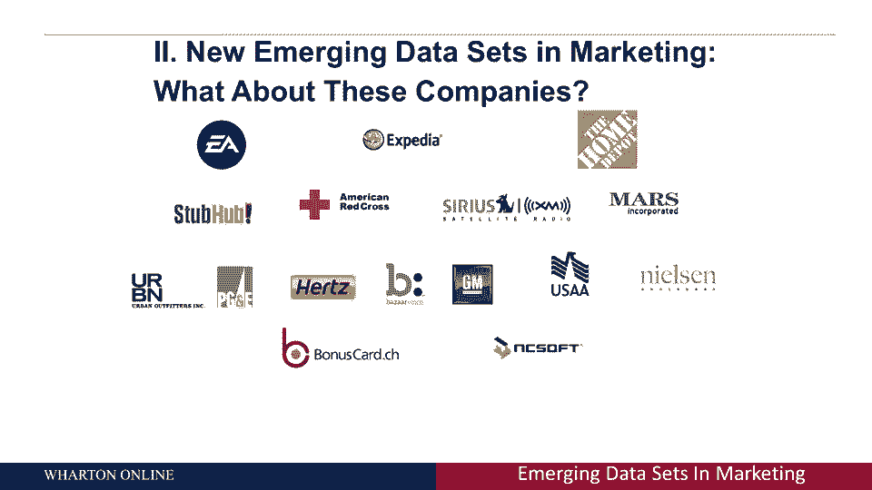

# 【沃顿商学院】商业分析 全套课程（客户、运营、人力资源、会计） - P29：[P029]03_the-golden-age-of-marketing - 知识旅行家 - BV1o54y1N7pm

我总是喜欢思考它的方式，这是嗯，这是我最喜欢的演讲之一，也许在过去有一两次我称之为营销的黄金时代，我又想起了二十年前，这是我杜邦前的日子，这是当我还是个大学生的时候，在一家营销公司工作，做电话营销。

所以我们打电话给人们，我们会记录下对话，我们会衡量他们是否会回应，甚至拿起电话，我们会收集我们对人的了解的数据库，我们以为男人，哦伙计，想象一下现在科技发展到什么程度，我们开始了解。

如果我们能记录下我们能记录的人，我们可以把他们说的话编码，我们认为我们有很好的数据，如果你今天去一家公司说嘿，我有好消息要告诉你，这就是你对客户的了解，如果你还记得舞台，我说过的其中一个。

第一阶段是数据，如果你把二十年前的数据，这就是你今天的数据，你应该被解雇，这不是今天最好的数据，在接下来的五分钟左右，我想说的是，总是有更好的数据，但不要被等待完美数据的想法所麻痹。

因为我总是喜欢说完美的数据永远不会到来，你必须分析你所拥有的数据，但不要扔掉数据，你可能会再次收集，技术是驱动，我们收集数据的能力越来越好，所以再一次，就像一个简短的轮廓。

我将首先给你们一些市场营销的历史数据，那么回到我的五步计划有什么想法，今天营销中有哪些类型的数据集，第二，当今市场营销中最新兴的数据集是什么，其中许多会让你震惊，因为我想如果我告诉你谷歌有惊人的数据。

你会说，当然啦，亚马逊，当然，有很多公司你没有想过这一点，今天有惊人的数据，然后我想和你谈谈一些真正未来的数据，比如移动数据，路径数据，就像你在哪里，所以想象一下，一家公司不仅知道你做了什么。

但你站在那里，当你做的时候，我最近花了很多时间研究的另一个问题是眼球追踪数据，所以想象一下，一家公司不仅可以知道你买了什么，或者你没有买什么产品，但你看了和没看的，我们将详细讨论这一点，预测分析。

这是我框架的第三、第四和第五部分，在那里我要和你们谈谈真正的公司，使用分析来做真正的项目和真正的预测问题，可能会让你震惊和惊讶的部分，就是每一个例子，我今天要向你展示的不仅仅是真实的，但今天正在做。

这些不像，你知道的，他们将推出这个，他们今天实际上在用这些，所以如果你想想我刚才给你的大纲，前两部分讲的是，如果你愿意的话，我在介绍中谈到的一个，这就是今天营销中的数据集类型。

所以希望你们中的许多人看到和听到这个，你可以想嘿，我可以收集那种数据，你知道我为什么不能从这些伟大的数据中获得好处吗，第三部分我们将讨论，如果你想要未来的数据集，以及如何使用这些。

第四部分将是今天大公司对这些的应用，嗯，如果我们坐着，我只是简单地给你上一堂历史课，嗯，你可能没想到你会报名参加课程，沃顿商学院的营销分析并上历史课，但我要给你们上一堂简短的营销历史课。

在二十世纪五十年代和二十世纪五十年代，如果你喜欢20世纪50年代数据的黄金时代，我会知道现在每家商店发生了什么，你们中的许多人今天可能坐在工作岗位上，其中存储级数据是您拥有的数据类型，换句话说。

这就是您现在的粒度级别，我来说个好消息，好消息是许多公司在商店层面做出决定，3。这家店应该卖多少钱，3。这家店的盖子怎么盖？这家店应该有什么品种，如果这就是你的决策水平，然后存储级别数据。

对你的决定来说可能很好，但它不允许你再做客户分析，在二十世纪五十年代，你可以回答的商业问题，是嗯，如何将存储级别的价格与销售额相关联，所以想象一下建立一个回归模型，这在前面的分析模块中谈到过。

如果你把销售额作为你的结果变量，把价格作为你的输入变量，想象一下建立一个回归，试图从现在的价格来预测销售额，如果您在商店级别有关于价格的数据，你可以开始考虑优化价格，优惠券的效果如何。

所以你可以想象在每家商店，在给定的产品类别中兑换了多少优惠券，并试图了解买了多少，你可以试着理解地区或地理差异，你也可以理解店内促销的效果，但要明白这些都是2015年及以后的相关问题。

但在二十世纪五十年代，因为数据在存储级别，你不能做客户级别的分析，你可以做商店级别的分析，对你们中的许多人来说，这仍然是相关的问题，我的兴趣和我对你的建议是推动贵公司收集更详细的数据。

从商店级分析转向客户分析，同样，这仍然留下了很多钱，原因同样是在客户层面做出决定而不是在商店层面做出决定，以这种方式将数据货币化的方式有很大的不同，在二十世纪六七十年代，我说直邮统治了地球。

我怀着极大的喜爱说这句话，因为大多数营销分析，今天的商业分析实际上来自直邮文献，所以当我还是个孩子的时候，在70年代长大，嗯，你会被送回家，我记得我的父母会收到这样的邮件和传单，当然。

公司知道他们给你发了哪些邮件和传单，事实上，他们可以改变它，逐户，取决于你过去买的东西，如果你想直接邮寄，在六七十年代是顾客的开始，或者如果你想要家庭级别的分析，他们知道你买了什么。

他们可以控制哪张传单，或者寄给你哪本小册子或目录，这样他们就可以做目标营销，如果你想让他们知道你的反应，他们可以运行一个在前面的模块中谈到的实验，他们可以随机分配不同的家庭接收不同的东西。

他们现在可以看到影响，当然它的缺点是，他们知道他们派你去做这种类型的广告，但不是其他广告，他们不知道你在他们公司外面买了什么，六七十年代新的可回答的商业问题，现在你可以把价格，个人水平。

价格到类别和购物行为，但他们所知道的只是他们目录中的价格，他们可以尝试测量目录的频率和时间对购买行为的影响，想想这是在六七十年代完成的，想想这在今天仍然有多重要一家公司发送电子邮件，他们应该多久送一次。

有什么时机，他们应该让他们分开一天吗，相隔三天，相隔五天，所有这些都来自直邮，文献产品分类，也许你派布拉德洛一家，瘦目录，你也许你派他的邻居，厚厚的目录，那么你给人们发送的分类如何影响他们购买的东西。

最后是广告的类型，客户或家庭级别分析的一个好处是，你可以测试不同的广告信息，你甚至可以测试，你应该是红色背景还是蓝色背景，你应该用16点字体还是10点字体，我听过的最伟大的名言之一。

所有的时间都是我市场部的一个同事写的，杰瑞风，他说，只做实验，如果你想知道答案，对我来说也是如此，六七十年代的直邮，制定了五点计划，我说过，他们知道那种商业问题，他们想回答。

他们知道他们可以在单个家庭层面上测量事物，至少他们寄给你的，他们知道他们可以改变事情，他们知道他们可以建立模型，他们知道他们可以瞄准人，他们现在可以在此基础上做出商业决策，当然。

它还留下了很多钱在桌子上，因为他们会知道你在他们的目录里买了什么，但他们不会知道你在杂货店买了什么，你在一个，你知道一家大百货公司，他们只知道他们的垂直，你在那儿买了什么？

所以他们甚至不知道你在竞争对手那里买了什么，所以像美元钱包分享这样的事情，在客户终身价值中非常重要，他们现在不会知道，让我们想想二十世纪八十年代，这是大多数人认为的现代营销科学。

原因是因为商店扫描仪来了，我们今天都习惯了，但我记得有一天商店扫描仪还不存在，所以你没有去收银台，在超市里，一家商店，所有的东西都被扫描了，以前不是这样的，所以除了所谓的日记面板数据。

你真的不知道个人家庭现在买了什么，当然你有最详细的数据，一次又一次，这是工业，垂直不可知论者，呃，服装店有这个，体育用品商店有这个，呃，超市有这个，每个人都可以跟踪个人级别的数据，现在，美也是很多的。

让我把这和另外两个非常重要的话题联系起来，这是排名第一的忠诚度计划，所以顾客总是认为忠诚度计划对他们有利，他们确实如此，但请记住，当你在超市出示忠诚卡的那一刻，他们知道是你，或者你用信用卡付款的那一刻。

他们知道是你，所以现在他们可以创建所谓的面板数据集，他们在哪里，他们能够随着时间的推移测量你，这意味着他们可以随着时间的推移为你做目标营销，所以我一直在谈论的一件事是忠诚度计划，信用卡数据，等。

而你认为这是客户的利益，绝对是，毫无疑问，对公司有利，因为现在他们可以对你做客户分析，因为如果你每次去超市都用现金支付，他们怎么知道是你，他们不知道是你，你用现金支付，他们没有，他们知道有人买了什么。

但他们不知道是你，客户分析的关键是将行为与时间联系起来，20世纪80年代的扫描仪允许了这一开始，所以再一次，二十世纪八十年代是现代市场营销时代的开始，因为第一，你可以在结账时打折。

你可以随着时间的推移跟踪客户，你可以给人们优惠券，事实上。今天仍然这样做，非常有名，卡特琳娜公司是发放优惠券的大师，你知道我买帮宝适，尿布，他们给我折扣价，等等，它再次让我对商店的体验有了更多的了解。

现在再来一次，这是很棒的数据，但现在还不是数据的黄金时代，所以想象一下，你今天有了这些数据，你就会错过一大块，这就是我想为90年代和2000年谈论的，这导致了最伟大的洞察力，那真的是互联网。

所以互联网真的改变了营销的面貌，但也许不是因为你认为的原因，你可能认为的原因是产品畅销，通过网络销售产品改变了营销的面貌，答案是你是对的，它是一种替代的分销渠道，但实际上这不是原因。

很多人可能不知道这一点，但让我们在这里暂停一下，我让你自己想两三秒钟，你认为美国有多少商品是通过互联网销售的，这是我坐在前面，停顿两三秒钟，假设我告诉你，它刚刚达到6%，大多数人认为这个数字要大得多。

所以从客户分析和营销的角度来看，与其说互联网是销售东西的第二个渠道，不如说它是销售东西的第二个渠道，这是一种测量你所看到的东西的方法，以一种非常有背景的方式为您提供广告，所以我知道你在福特网站上。

所以我可以给你发一个汽车广告，我知道你在一个特定的网站上，也许是度假网站，所以现在我不仅可以在那个网站上给你看广告，但我可以稍后用嘿重新定位你，我看到你在法国度假，你其实是，已经过了十分钟了。

或者甚至是两天后，我还在为你做去法国度假的广告，互联网使公司能够在客户分析方面做得淋漓尽致，我总是喜欢把互联网看作是一种，现在你有了互联网数据和购买数据，如果你把这些融合在一起。

我必须把这当成急诊室医生，你进了急诊室，你在流血，医生是做什么的，他想知道你为什么流血，嗯，我的观点是，如果你是一家公司，你在制造一种产品，你想知道为什么是什么推动了你的销售。

我想你不仅想知道人们在买什么，80年代的扫描仪数据可以告诉你，但你想知道人们在考虑什么产品，和他们没有选择购买的，所以互联网和购买数据融合在一起，如果你愿意，获取您的博客数据。

并将其与超市和商店的扫描仪数据融合在一起，现在你有一个很好的广告图片，当然如果你能加上第三块，也就是电视，现在开始来了，突然间你有了一个完整的视图，你真正想要的关于客户的数据来对他们进行分析。

所以再一次，来自互联网数据，你可以跟踪，呃，他们去了哪些页面，可能最重要的部分是他们考虑哪些产品，因为我总是喜欢思考的一种方式是想象两个场景，一种情况是你的销售额很低，因为人们认为你的产品不喜欢它。

另一个原因是你们的销售额很低，因为人们甚至不考虑你的产品，我宁愿要后者而不要前者，前者意味着每个人都知道你的产品，他们已经考虑过了，但他们不喜欢，后者意味着也许你只需要在广告上花更多的钱来提高知名度。

如果没有人们正在考虑什么产品的数据，你不知道，目标广告是很大的一部分，事实上，有一个，你知道的，它经历了它的双驼峰循环，早在90年代末，然后在2000年中期，他们死了，因为人们说好。

它们不会直接导致点击，但现在他们又回来了，当人们意识到他们产生意识，他们接下来产生品牌资产，互联网允许你链接到过去的经验，这样你就可以通过他们的IP地址跟踪他们，通过所谓的饼干。

随着他们的下降和最后一部分，这是我想向你们强调的部分，因为我一直在谈论的这个模块的一部分是获得正确的数据，找到一种将在线和离线数据联系在一起的方法是至关重要的，因为现在很多人都在做所谓的展示。

他们去商店，他们看实体店，然后在网上购买，很多人在网上看，然后线下买，你把这两者联系在一起真的很重要，忠诚度计划是做到这一点的一种方法，有办法通过给人们折扣和优惠券来做到这一点，通过认识自己。

他们去商店，你得把忠诚卡数据和在线数据联系起来，许多公司失去了进行现代营销的能力，客户分析，因为他们没有正确地将在线和离线数据连接在一起，如果你愿意，新数据的爆炸就在这里，所以如果你看看所有不同的名字。

谷歌脸书，推特，雅虎，一个Tumblr，Flickr，等，可能是，所有这些公司都有很好的数据，这可能并不奇怪，公司想知道的，但是这一系列的公司呢，例如，um Expedia，Expedia有哪些数据。

Expedia有每次有人进入他们的网站，当然，当你在Expedia上时，请注意，他们要么让你登录，或者他们说以新客户的身份登录，因为他们想随着时间的推移跟踪你。

这里给出的另一个例子是siriusxm无线电，卫星公司，卫星广播公司，他们当然知道你的倾听行为，他们想知道，我想知道听某种音乐的人，如果他们更有可能取消他们严肃的XM账户，想象一下，呃，赫兹。

汽车租赁公司，他们感兴趣的一个问题是你下一步打算租什么车，他们能给你升级吗，所有这些公司的共同点是什么，你可能不会想到所有这些公司，这里所有的公司都盈利，一次一个客户，他们都有个人层面的数据。

他们用来货币化，他们都在应用客户分析方法。

